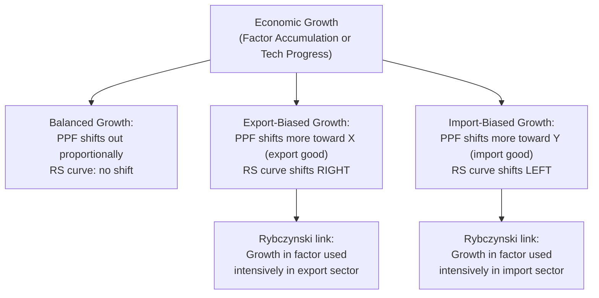

## Economic Growth and Its Effect on Trade

### Overview

Economic growth — an outward shift in a country's production possibility frontier — has effects that ripple through the standard trade model: it shifts relative supply, which in turn moves the terms of trade, which then feeds back into national welfare. Whether growth is unambiguously beneficial to the growing country (and to its trading partners) depends critically on **which sector grows** (biased vs. unbiased growth) and on the resulting terms-of-trade movement. This topic develops the classification of growth types and their trade-theoretic consequences, setting up the immiserizing growth result covered separately.

### Sources of Economic Growth in Trade Models

**Key Points**

1. **Factor accumulation**: growth in the endowment of labor, capital, or land (e.g., population growth, capital investment, land reclamation).
2. **Technological progress**: an increase in total factor productivity or factor-specific productivity in one or both sectors.
3. Both operate by shifting the PPF outward, but they can do so in different, sector-biased ways depending on which factor accumulates or which sector experiences the technology improvement.

### Classifying Growth by Bias

**Key Points**

Growth is classified by how it shifts the PPF and, correspondingly, the relative supply (RS) curve at a **constant relative price**:

1. **Balanced (neutral) growth**: the PPF shifts out proportionally in all directions; at unchanged relative prices, output of both goods rises by the same percentage. The RS curve does not shift (relative quantities unchanged at any given price).
2. **Export-biased growth**: the PPF shifts out disproportionately in the direction of the export good ($X$); at unchanged relative prices, $Q_X$ rises by more than $Q_Y$ (or $Q_Y$ may even fall). The RS curve shifts to the **right** (more $X$ relative to $Y$ supplied at any given price).
3. **Import-biased growth**: the PPF shifts out disproportionately in the direction of the import-competing good ($Y$); at unchanged relative prices, $Q_Y$ rises by more than $Q_X$. The RS curve shifts to the **left**.

### Linking Growth Type to the Underlying Model: Rybczynski Theorem

**Key Points**

- In the Heckscher-Ohlin model, factor-accumulation-driven growth is analyzed directly via the **Rybczynski theorem**: at constant goods prices, an increase in a factor's endowment increases (more than proportionally) the output of the good using that factor intensively, and *decreases* the output of the other good in absolute terms.
- This means: if $X$ is capital-intensive, an increase in the capital endowment ($K$) produces **export-biased growth** (assuming the country exports the capital-intensive good, consistent with its capital abundance); an increase in labor ($L$) produces **import-biased growth** in this same setup.
- In the specific factors model, growth in the sector-specific factor of the export sector produces export-biased growth directly (more capital in sector $X$ raises $Q_X$ at given prices, with an ambiguous but typically modest effect on $Q_Y$ via labor reallocation).

### Diagram: Growth Bias Classification

### Effect on the Terms of Trade

Given the classification above, the effect of growth on the terms of trade follows directly from shifting RS against a given RD (assuming Home is not "small," i.e., its RS shift meaningfully moves the *world* RS curve):

**Key Points**

- **Export-biased growth** → world RS shifts right (more of the exported good supplied at each price) → world relative price of $X$ **falls** → Home's terms of trade **deteriorate** (Home must give up more $X$ per unit of $Y$ imported).
- **Import-biased growth** → world RS shifts left (relatively less of the exported good, relatively more of the import-competing good, at each price) → world relative price of $X$ **rises** → Home's terms of trade **improve**.
- **Balanced growth** → no shift in RS at given prices → in this simplest case, no first-order terms-of-trade effect (though income effects on RD can still play a role if preferences are non-homothetic).

### Small Country Case: No Terms-of-Trade Feedback

**Key Points**

- If Home is a **small country**, its own growth (regardless of bias) does not measurably shift the *world* RS curve, so the world terms of trade remain effectively unchanged.
- In this case, growth unambiguously raises Home's welfare (more output at unchanged prices means an unambiguous outward shift of the consumption possibility frontier), with no terms-of-trade offset to worry about.
- The immiserizing-growth possibility (see related topic) is therefore fundamentally a **large-country** phenomenon — it requires the growing country's own supply shift to be large enough, relative to world markets, to move the terms of trade against itself by enough to outweigh the direct output gain.

### Two Components of the Welfare Effect of Growth

For a country whose growth *does* move the terms of trade (the large-country case), the total welfare effect decomposes into:

$$\Delta \text{Welfare} = \underbrace{\text{Direct output/wealth effect}}_{\text{always positive}} + \underbrace{\text{Terms-of-trade effect}}_{\text{sign depends on growth bias}}$$

- The **direct effect** (more resources/technology → more output at given prices) is always weakly positive — this is simply the PPF expanding outward.
- The **terms-of-trade effect** is positive for import-biased growth (favorable TOT movement reinforces the direct gain) but *negative* for export-biased growth (the TOT deterioration works against the direct gain).
- Only in the **export-biased growth** case can the terms-of-trade effect in principle be large enough in magnitude to *dominate* the direct effect, producing a net welfare *decline* despite the country literally producing more output — this is the immiserizing growth scenario.

### Effects on the Trading Partner

**Key Points**

- Growth in Home affects Foreign primarily through the terms-of-trade channel: Home's export-biased growth (which lowers the world price of $X$) is unambiguously **beneficial** to Foreign if Foreign is an importer of $X$ (Foreign now obtains its imports more cheaply).
- Conversely, Home's import-biased growth (raising the world price of $X$, i.e., worsening Foreign's terms of trade if Foreign exports $X$) is potentially harmful to Foreign, even though it stems purely from Home's own domestic growth.
- This asymmetric, partner-affecting nature of biased growth is part of the historical motivation for concerns (particularly in mid-20th-century development economics) about how growth in advanced, capital-abundant economies might affect developing, labor/resource-abundant trading partners via terms-of-trade channels — related to debates around the Prebisch-Singer hypothesis.

### Example (Illustrative)

Suppose Home is capital-abundant and exports the capital-intensive good $X$. A wave of capital investment (factor accumulation) raises $\bar{K}$ substantially.

- By Rybczynski, $Q_X$ rises (more than proportionally to the capital increase) and $Q_Y$ falls at initial prices — this is **export-biased growth**.
- World RS shifts right, world price of $X$ falls — Home's terms of trade **deteriorate**.
- Home's welfare change is ambiguous in principle (direct gain vs. TOT loss), though under standard, empirically-plausible parameter ranges the direct gain typically dominates, and immiserizing growth remains a theoretical *possibility* rather than a commonly observed empirical outcome. [Inference: the empirical frequency of genuinely immiserizing growth episodes is disputed and difficult to identify cleanly in real-world data, since isolating the counterfactual "growth without the TOT effect" is not directly observable; most textbook treatments present it as a theoretical caution rather than a commonly documented phenomenon.]

### Related Topics

- Determination of the terms of trade
- Immiserizing growth
- Rybczynski theorem
- Relative supply and relative demand for goods
- Prebisch-Singer hypothesis and commodity terms-of-trade trends
- Effects of technological progress on trade patterns
- Growth and the gains from trade decomposition