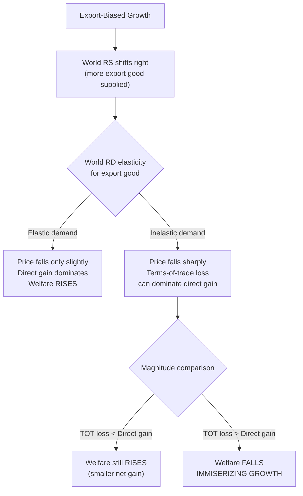

## Immiserizing Growth

### Overview

Immiserizing growth is one of the most striking theoretical results in trade theory: it shows that under specific, identifiable conditions, an increase in a country's productive capacity can make it **worse off** than before growth occurred, despite the country producing (and having available) strictly more output at unchanged prices. The result, formalized by Jagdish Bhagwati (1958), hinges entirely on a terms-of-trade deterioration large enough to outweigh the direct gains from growth — it is a large-country, general-equilibrium phenomenon with no analogue in a small open economy.

### The Core Mechanism

Recall the welfare decomposition of growth effects:

$$\Delta \text{Welfare} = \underbrace{\text{Direct Output Effect}}_{\text{always} \geq 0} + \underbrace{\text{Terms-of-Trade Effect}}_{\text{can be negative}}$$

**Key Points**

- Immiserizing growth requires **export-biased growth**: the country's growth disproportionately expands output of the good it exports.
- Export-biased growth shifts world relative supply of the export good to the right, which (for a country large enough to affect world prices) **lowers the world relative price of its export good** — the country's terms of trade deteriorate.
- If this terms-of-trade deterioration is severe enough, the loss in real income from having to give up more exports per unit of imports can exceed the direct gain from producing more output at the original prices — net welfare falls.

### Formal Conditions for Immiserizing Growth

Bhagwati's original analysis identifies the necessary conditions:

**Key Points**

1. **The country must be "large"** in the sense of being able to affect world prices — a small open economy facing fixed world prices cannot experience immiserizing growth, since its terms of trade are unaffected by its own growth by definition.
2. **Growth must be sufficiently export-biased**: strongly biased toward the export sector, so that the resulting supply expansion is concentrated in the good whose price will fall.
3. **The country's offer curve (or, equivalently, foreign demand for its exports) must be sufficiently inelastic**: if foreign demand for the country's export good is highly elastic, even a large supply increase produces only a small price decline, insufficient to offset the direct output gain. Immiserizing growth is more likely when trading partners' demand for the growing country's exports is relatively inelastic.
4. **The initial trade volume/dependence on trade must be substantial**: a country deriving little welfare from trade in the first place has little terms-of-trade exposure to begin with.

### Diagrammatic Intuition

### Geometric Representation via Trade Indifference Curves

**Key Points**

- In the classic Bhagwati diagrammatic treatment, immiserizing growth is shown using **trade indifference curves** (community indifference curves mapped into export-import space) together with the country's **offer curve** (or trade triangle) before and after growth.
- Before growth, the country trades along its offer curve, reaching a trade indifference curve at the intersection with the (unchanged) foreign offer curve.
- After export-biased growth, the country's offer curve shifts outward (willing to offer more exports at each terms of trade), but if the foreign offer curve is sufficiently inelastic, the *new* equilibrium terms of trade falls enough that the new equilibrium point lies on a **lower** trade indifference curve than before growth — this is the diagrammatic signature of immiserizing growth.

### Numerical Illustration (Stylized)

**Example**

Suppose Home exports good $X$ and initially trades at $p_X/p_Y = 1.0$, exporting 100 units of $X$ for 100 units of $Y$, achieving a certain welfare level $U_0$.

After strongly export-biased growth, Home's PPF expands such that at the *original* price ($p_X/p_Y = 1.0$), it could now produce and consume more of both goods — a direct gain. But because Home is large and foreign demand for $X$ is inelastic, the actual post-growth equilibrium terms of trade falls to $p_X/p_Y = 0.6$. If the volume of trade is large and the price decline steep enough, the value of Home's expanded export bundle at the *new*, lower price may purchase **fewer** total imports than before growth — despite Home producing physically more $X$ than before. [Inference: the specific numeric threshold at which this reversal occurs depends on the elasticities and the initial trade share in GDP, which are not pinned down by the qualitative theory alone; this example illustrates the mechanism rather than a general quantitative rule.]

### Distinguishing Immiserizing Growth from Simply "Modest Gains"

**Key Points**

- It is important to distinguish the extreme case (welfare **falls** below the pre-growth level) from the much more common and less dramatic case where growth still raises welfare but by **less** than it would have absent the terms-of-trade effect (a partially offset, but still net-positive, gain).
- Bhagwati's result is a demonstration of *theoretical possibility*, establishing that the "growth is always good" intuition is not a theorem but depends on specific conditions — it is not a claim that immiserizing growth is a common or typical empirical outcome.

### Historical and Policy Context

**Key Points**

- The immiserizing growth result was developed in significant part with **developing, primary-commodity-exporting economies** in mind — countries whose exports are concentrated in a narrow range of commodities facing relatively inelastic world demand were seen as theoretically vulnerable to this mechanism if they pursued export-capacity-expanding growth strategies (e.g., massive investment in a single export crop or mineral).
- This connects to the broader **Prebisch-Singer hypothesis** literature on secularly declining terms of trade for primary-commodity exporters, and to mid-20th-century development-economics skepticism about export-led growth strategies for commodity-dependent economies — though the immiserizing growth mechanism (price effects of a single country's own supply growth) is analytically distinct from the Prebisch-Singer mechanism (a broader secular trend argument about primary vs. manufactured goods prices).
- Policy implications sometimes drawn from this theoretical result include arguments for export diversification (reducing dependence on a narrow, inelastically-demanded export bundle) or for import-substitution industrialization strategies — though the immiserizing growth theorem itself is a narrow, conditional result and does not by itself constitute a general case against export-oriented growth. [Inference: how directly this theoretical result actually motivated mid-20th-century import-substitution policy, versus serving as post-hoc theoretical justification, is a matter of historical-economic-thought interpretation rather than settled fact.]

### Conditions Under Which Growth Is Never Immiserizing

**Key Points**

- **Small country**: by definition, cannot experience immiserizing growth, since it cannot move world prices.
- **Balanced (neutral) growth**: produces no first-order terms-of-trade shift, so welfare unambiguously rises (assuming standard preferences).
- **Import-biased growth**: works in the *opposite* direction of the mechanism required for immiserizing growth — it improves the terms of trade, reinforcing rather than offsetting the direct output gain, so it cannot be immiserizing.
- Therefore, immiserizing growth is a **strictly large-country, strictly export-biased-growth** phenomenon.

### Related Topics

- Economic growth and its effect on trade
- Determination of the terms of trade
- Rybczynski theorem
- Offer curves and reciprocal demand
- Prebisch-Singer hypothesis and commodity terms-of-trade trends
- Elasticity of foreign demand and its role in trade policy analysis
- Optimal tariff theory (a related large-country terms-of-trade mechanism, but via policy rather than growth)