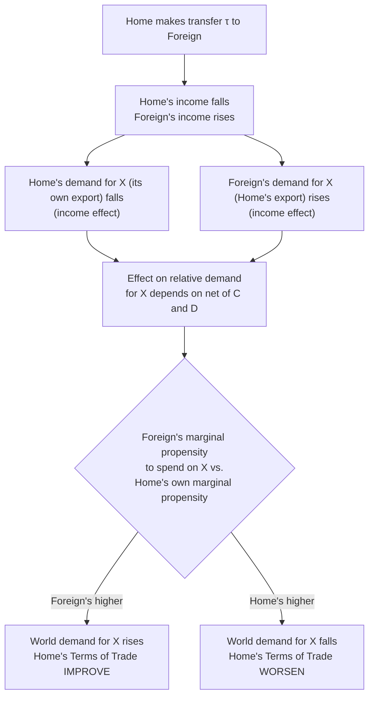

## Effects of International Transfers on the Terms of Trade

### Overview

The "transfer problem" asks a deceptively simple question: if one country makes an income transfer to another (foreign aid, reparations, remittances at the national level), what happens to the terms of trade between them? The classical debate over this question — most famously associated with the Keynes-Ohlin exchange over German WWI reparations — established that the answer depends critically on how the paying and receiving countries' marginal spending patterns differ, and that transfers can in principle improve, worsen, or leave unchanged the paying country's terms of trade. This topic develops the formal transfer-problem analysis within the standard trade model.

### Setting Up the Transfer Problem

**Key Points**

- Suppose Home makes a real income transfer of value $\tau$ to Foreign (e.g., reparations, foreign aid, or a analogous unilateral transfer), financed by a lump-sum reduction in Home's income and a corresponding lump-sum increase in Foreign's income.
- The transfer directly shifts world spending power from Home to Foreign — Home has less income to spend, Foreign has more.
- Because relative demand (RD) depends on income levels *and* how that income is spent across goods, the transfer shifts world relative demand — the effect on the terms of trade depends on the relative **marginal propensities to spend** on each good in the two countries.

### The Classical Keynes-Ohlin Debate

**Key Points**

- **Keynes (1929)** argued, in the context of German WWI reparations, that reparations would likely require Germany to worsen its own terms of trade substantially (lower its export prices, raise effective burden) in order to generate the trade surplus needed to transfer real resources — a pessimistic view of the "secondary burden" of transfers, on top of the direct financial burden.
- **Ohlin (1929)**, in response, argued that the terms-of-trade effect was theoretically ambiguous and depended on the specifics of spending patterns in both countries — there was no general presumption that the paying country's terms of trade must deteriorate.
- Modern trade theory has largely vindicated Ohlin's position: the effect is indeed ambiguous in general and hinges on specific conditions relating to each country's marginal propensity to spend on each good, discussed below.

### The "Transfer Problem Criterion"

**Key Points**

Define the marginal propensity to spend on the export good (Home's export good, $X$) for Home and Foreign, respectively, as $m_H$ and $m_F$. The classical transfer-problem result, in its simplest form, states:

- If the **recipient country (Foreign)** has a marginal propensity to spend on Home's export good ($m_F$, i.e., Foreign's marginal propensity to spend on imports from Home) that is **higher** than the **paying country's (Home)** marginal propensity to spend on that same good ($m_H$, Home's own domestic spending on $X$), then the transfer tends to **improve** Home's terms of trade (raise the relative price of $X$) — because Foreign, now richer, spends a disproportionate share of its new income on $X$, boosting demand for Home's export good even as Home's own demand for $X$ falls due to lower income.
- If instead Home's marginal propensity to spend on its own export good exceeds Foreign's marginal propensity to spend on it, the transfer tends to **worsen** Home's terms of trade.
- The "no terms-of-trade-change" (neutral) case is a special benchmark that arises under specific symmetric conditions.

Formally, using a simplified two-good, two-country framework, the transfer-problem criterion for whether the paying country's terms of trade improve is often expressed (in one canonical formulation) as comparing:

$$m_F > m_H$$

(Foreign's marginal propensity to spend on Home's export good exceeds Home's own marginal propensity to spend on that good) — sufficient for the transfer to improve Home's terms of trade, absent supply-side responses.

### Diagram: The Transfer Mechanism

### Relation to RS/RD Framework

**Key Points**

- The transfer problem is naturally analyzed as a **relative demand (RD) shift** in the standard trade model's RS/RD apparatus, holding relative supply fixed (a pure demand-side/spending-pattern shock, assuming no direct effect on production).
- If the transfer shifts world RD toward $X$ (Home's export good) — i.e., $m_F > m_H$ — world RD shifts right, raising the equilibrium relative price of $X$ (Home's terms of trade improve).
- If the transfer shifts world RD away from $X$, world RD shifts left, and Home's terms of trade worsen.

### The "Secondary Burden" Concept

**Key Points**

- If a transfer worsens the paying country's terms of trade (the pessimistic Keynes scenario), the country experiences a **secondary burden** on top of the primary (direct financial) burden of the transfer: not only does it lose the transferred income directly, but the goods it must export to effect the transfer become relatively cheaper on world markets, meaning it must export *even more* than the nominal transfer amount to achieve the same real resource transfer.
- Conversely, if the transfer improves the paying country's terms of trade, there is a **secondary relief** — part of the real burden of the transfer is offset by more favorable export prices, so the paying country need not export quite as much in volume terms as the nominal transfer might suggest.

### Modern Reformulation and Homothetic Preferences

**Key Points**

- Under the special case of **identical, homothetic preferences** across both countries (each country spends the same proportional share of *any* additional income on each good, and both countries share identical spending patterns), the transfer problem's terms-of-trade effect vanishes: since $m_H = m_F$ under this symmetric assumption, the demand-side shift exactly offsets, and world relative demand for $X$ is unchanged by the transfer — this is the theoretically "neutral" benchmark case.
- This shows that the classical Keynes-Ohlin ambiguity fundamentally rests on **asymmetric spending patterns** across countries — with identical homothetic preferences (a common simplifying assumption elsewhere in trade theory), the transfer problem's terms-of-trade puzzle disappears by construction, which is itself an important conceptual insight about *why* the debate had empirical bite in the first place (real economies do not have identical spending patterns).

### Modern Applications

**Key Points**

- **Foreign aid and terms of trade**: the transfer-problem framework has been applied to analyze whether large-scale foreign aid flows to developing countries could adversely affect the aid-giving country's terms of trade, or conversely benefit/harm the recipient's terms of trade depending on spending patterns (e.g., "Dutch disease"-adjacent concerns, though Dutch disease is more directly a resource-boom/exchange-rate phenomenon than a pure transfer-problem case).
- **Remittances**: worker remittances flowing from labor-exporting to labor-importing countries can be analyzed through a similar transfer-problem lens, examining how recipient-country spending patterns on tradable vs. non-tradable goods affect the receiving country's real exchange rate and terms of trade.
- **War reparations and debt repayment**: the original Keynes-Ohlin context (German WWI reparations) remains the canonical historical illustration, and the framework has since been applied to analyzing sovereign debt repayment burdens more generally, where a country must generate a trade surplus to service external debt, potentially incurring a terms-of-trade cost analogous to the secondary burden discussed above.

### Related Topics

- Relative supply and relative demand for goods
- Determination of the terms of trade
- Homothetic preferences and community indifference curves
- Dutch disease and resource-boom terms-of-trade effects
- Balance of payments and current account adjustment mechanisms
- Real exchange rate effects of capital flows and remittances