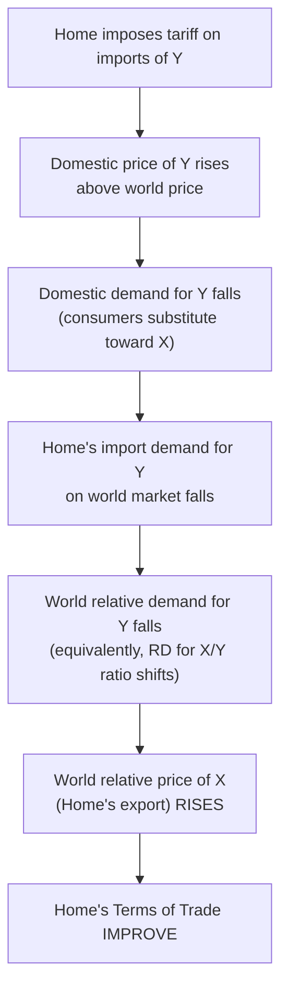
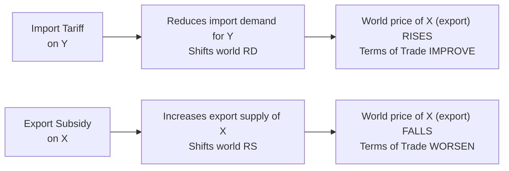

## Effects of Tariffs and Subsidies on the Terms of Trade

### Overview

Tariffs and export subsidies both drive a wedge between world prices and domestic prices, and — for a country large enough to influence world prices — both have direct, predictable effects on the terms of trade. This topic works through the standard trade model's RS/RD apparatus to show how an import tariff improves the imposing country's terms of trade (the basis of the optimal tariff argument), how an export subsidy has the opposite, terms-of-trade-worsening effect for the subsidizing country, and how these results vanish for a small open economy that cannot influence world prices.

### The Price Wedge Mechanism

**Key Points**

- A tariff on imports raises the **domestic** price of the imported good above the **world** price by the amount of the tariff; an export subsidy raises the domestic price received by exporters above the world price by the amount of the subsidy.
- Because domestic production and consumption decisions respond to the domestic (tariff/subsidy-inclusive) price, while the terms of trade is determined by the **world** relative price at which the country actually trades, the policy creates a divergence between the country's *internal* incentives and the *external* price it faces.
- For a **small country**, this wedge affects only domestic resource allocation and consumption (no terms-of-trade effect, since the small country cannot move world prices); for a **large country**, the wedge also has spillover effects on world relative supply/demand, moving the world price itself.

### Effect of an Import Tariff on the Terms of Trade (Large Country)

**Key Points**

- A tariff on imports of good $Y$ raises the domestic price of $Y$ relative to the world price, which (via reduced domestic demand for imports of $Y$ at the higher domestic price) **reduces the country's demand for imports** on world markets.
- Since the country is a large importer of $Y$, this reduction in import demand reduces world demand for $Y$ relative to $X$, which — at the margin — lowers the *world* relative price of $Y$ (equivalently, raises the world relative price of $X$, the country's export good).
- A **rise in the world price of the country's export good relative to its import good is, by definition, an improvement in that country's terms of trade** — this is the terms-of-trade-improving mechanism that underlies the classical **optimal tariff argument**: a large country can use a tariff to shift the terms of trade in its favor, capturing some of the gains from trade that would otherwise accrue to trading partners.

### Formal Mechanism via RS/RD

### The Optimal Tariff

**Key Points**

- Because a tariff improves the imposing large country's terms of trade (a pure transfer of surplus from the trading partner) while also imposing a domestic efficiency cost (production and consumption distortions relative to free trade), there exists an **optimal (positive) tariff rate** that maximizes national welfare by balancing these two effects.
- At a tariff rate of zero, the terms-of-trade gain from a marginal tariff increase exceeds the marginal efficiency loss (since the efficiency loss is second-order near zero, while the terms-of-trade gain is first-order) — so a small positive tariff is always welfare-improving for a large country, absent retaliation.
- As the tariff rate rises further, the efficiency cost grows (quadratically, roughly) while the terms-of-trade gain eventually diminishes and reverses (a **prohibitive tariff**, one high enough to eliminate all trade, yields zero terms-of-trade gain since there is no trade left to manipulate) — the optimal tariff balances these forces at an interior rate.
- This result is the standard trade-theoretic justification for tariffs *purely on national welfare grounds*, distinct from infant-industry, revenue, or other rationales — but it is explicitly a **beggar-thy-neighbor** policy: the tariff-imposing country's gain comes directly at its trading partner's expense (whose terms of trade worsen by the same mechanism in reverse), inviting retaliation that can leave both countries worse off than under free trade (a trade-war/prisoner's-dilemma dynamic).

### Effect of an Export Subsidy on the Terms of Trade (Large Country)

**Key Points**

- An export subsidy raises the price domestic producers receive for the exported good $X$ above the world price, inducing them to **produce and export more** $X$ than they would at the unsubsidized world price.
- This increases world supply of $X$ relative to $Y$ (a rightward shift in world relative supply of $X$), which — all else equal — **lowers the world relative price of $X$**.
- Since $X$ is the subsidizing country's export good, a fall in its world relative price is, by definition, a **deterioration** in the subsidizing country's terms of trade — the exact opposite effect of an import tariff.
- This means an export subsidy is a **doubly costly** policy for a large country: it incurs both the direct fiscal cost of the subsidy and a self-inflicted terms-of-trade deterioration, making it unambiguously welfare-reducing for the subsidizing large country (unlike a tariff, which has an offsetting terms-of-trade benefit).

### Diagram: Tariff vs. Subsidy Terms-of-Trade Effects

### Who Benefits from the Trading Partner's Policy

**Key Points**

- The **foreign country** experiences the mirror-image effect: a Home tariff improves Home's terms of trade at Foreign's expense (Foreign's terms of trade worsen), while a Home export subsidy worsens Home's terms of trade to **Foreign's benefit** (Foreign's terms of trade improve, since Foreign now imports Home's export good more cheaply).
- This asymmetry explains a recurring pattern in trade policy disputes: countries frequently object to trading partners' **export subsidies** far less on terms-of-trade self-interest grounds (since a partner's export subsidy actually benefits the importing country's terms of trade) and object more to **import tariffs** — though in practice, objections to both are often driven by sector-specific competitiveness concerns (specific-factors-style, industry-level effects) rather than pure aggregate terms-of-trade welfare reasoning, and export subsidies remain heavily disciplined under WTO rules primarily due to their trade-distorting and unfair-competition effects on specific industries in the recipient market.

### Small Country Case: No Terms-of-Trade Effect

**Key Points**

- For a small country facing fixed world prices, neither a tariff nor an export subsidy can move the world relative price — all such policies affect only the domestic price wedge, production, and consumption distortions, with **zero terms-of-trade effect**.
- In this case, both an import tariff and an export subsidy are **unambiguously welfare-reducing** for the small country (setting aside second-best or non-economic rationales such as infant-industry protection, national security, or externality correction) — there is no terms-of-trade benefit to offset the efficiency cost, unlike the large-country tariff case.
- This small-country/large-country distinction is one of the most consequential assumptions in normative trade-policy analysis: virtually all standard "free trade is optimal" policy conclusions in introductory treatments implicitly invoke the small-country assumption, while the large-country optimal-tariff result is the primary theoretical exception.

### Retaliation and the Prisoner's Dilemma Structure

**Key Points**

- Since an optimal tariff's national benefit comes at the trading partner's expense, a rational large trading partner facing a Home tariff has an analogous incentive to impose its own retaliatory tariff, improving *its* terms of trade at Home's expense.
- If both countries impose optimal tariffs against each other, the terms-of-trade gains substantially offset (or fully cancel, in symmetric cases), while both countries still bear the domestic efficiency costs of the tariffs — potentially leaving both countries worse off than under mutual free trade, a standard prisoner's-dilemma structure.
- This is a core theoretical rationale for international trade agreements and institutions (GATT/WTO): they function partly as a mechanism for countries to credibly commit to *not* pursuing individually-rational-but-mutually-destructive optimal-tariff strategies, achieving the cooperative (free trade) outcome that unilateral incentives alone would not sustain.

### Related Topics

- Determination of the terms of trade
- Relative supply and relative demand for goods
- Optimal tariff theory in depth
- Effects of international transfers on the terms of trade
- GATT/WTO and trade agreement enforcement mechanisms
- Small country vs. large country trade policy models
- Retaliation and trade war dynamics