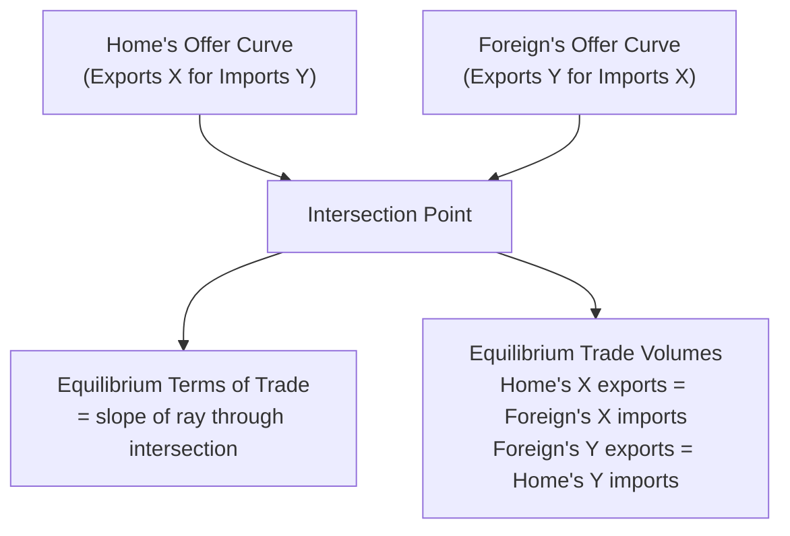

## Offer Curves and Trading Equilibrium

### Overview

The offer curve (also called the reciprocal demand curve, following its origins in Mill and Marshall's classical trade theory) is an alternative, geometrically powerful way to represent a country's trade preferences and derive the equilibrium terms of trade. Rather than plotting relative price against relative quantity (as in the RS/RD framework), an offer curve plots the quantity of imports a country demands against the quantity of exports it is willing to supply at each possible terms of trade, directly in export-import space. The intersection of two countries' offer curves determines the equilibrium terms of trade and trade volumes simultaneously — a construction particularly well suited to analyzing tariffs, large-country market power, and bilateral trade relationships.

### Constructing a Country's Offer Curve

**Key Points**

- Starting from the country's production possibility frontier (PPF) and community indifference curves, for each possible relative price $p_X/p_Y$, determine the country's production point (via MRT = price ratio) and consumption point (via MRS = price ratio).
- The **trade triangle** at each price ratio has legs equal to the quantity exported (production minus consumption of the export good) and the quantity imported (consumption minus production of the import good).
- The offer curve is the locus of these export-import combinations, traced out as the relative price varies continuously — it summarizes, in a single curve, "how much of good $Y$ will this country demand as imports, in exchange for supplying how much of good $X$ as exports, at every possible terms of trade."

### Shape of the Offer Curve

**Key Points**

- The offer curve typically originates at the origin (at the autarky price, zero trade) and curves away from the axis representing the export good, bending back toward the import-good axis as the relative price of exports rises.
- **Steepness/curvature** reflects the elasticity of both supply response (how much production shifts as price changes) and demand response (how much consumption substitutes as price changes) — a country with more elastic supply and demand has an offer curve that bends more sharply, extending further from the origin at any given price ratio.
- At very high relative export prices, the offer curve can **bend backward** (a normal feature in the classical construction): the country is willing to supply fewer exports at extremely favorable terms of trade because it can obtain the desired quantity of imports while trading away less of the export good — this backward bending reflects an income effect dominating the substitution effect at sufficiently favorable prices.

### Diagram: A Single Country's Offer Curve

<svg xmlns="http://www.w3.org/2000/svg" viewBox="0 0 700 450">
<text x="350" y="24" font-size="16" text-anchor="middle" fill="#1a1a1a" font-family="sans-serif" font-weight="bold">Home's Offer Curve (svg_diagram)</text>
<line x1="80" y1="400" x2="640" y2="400" stroke="#333" stroke-width="2" />
<line x1="80" y1="400" x2="80" y2="50" stroke="#333" stroke-width="2" />
<text x="360" y="425" font-size="13" text-anchor="middle" font-family="sans-serif">Exports of X</text>
<text x="45" y="225" font-size="13" text-anchor="middle" font-family="sans-serif" transform="rotate(-90 45 225)">Imports of Y</text>

<path d="M 80 400 Q 250 250 380 150 Q 450 100 420 60" stroke="#2563eb" stroke-width="3" fill="none" />
<text x="440" y="70" font-size="12" fill="#2563eb" font-family="sans-serif">Offer Curve</text>

<line x1="80" y1="400" x2="500" y2="130" stroke="#999" stroke-width="1" stroke-dasharray="3,3" />
<text x="510" y="130" font-size="11" fill="#666" font-family="sans-serif">Price ray p_X/p_Y</text>

<circle cx="330" cy="185" r="5" fill="#16a34a" />
<text x="345" y="180" font-size="11" fill="#16a34a" font-family="sans-serif">Trade equilibrium point</text>

<text x="200" y="380" font-size="11" fill="#666" font-family="sans-serif">Origin = autarky (no trade)</text>

</svg>

### Two-Country Equilibrium: Intersection of Offer Curves

**Key Points**

- Plot **Home's offer curve** (exports of $X$ for imports of $Y$) and **Foreign's offer curve** (expressed in the same axes, but representing Foreign's willingness to supply $Y$-exports in exchange for $X$-imports — i.e., Foreign's offer curve as the mirror image, since Foreign's exports are Home's imports and vice versa) on the same diagram.
- The **intersection point** of the two offer curves simultaneously determines: (1) the equilibrium terms of trade (the slope of the ray from the origin through the intersection point), and (2) the equilibrium volume of trade (the coordinates of the intersection point itself — Home's exports of $X$ exactly equal Foreign's imports of $X$, and Home's imports of $Y$ exactly equal Foreign's exports of $Y$).
- This is a full general equilibrium solution to the two-country, two-good trading system, geometrically equivalent to the RS = RD condition in the relative-supply/relative-demand framework, but expressed directly in trade-volume space rather than relative-price/relative-quantity space.

### Diagram: Two-Country Offer Curve Equilibrium

### Stability of Offer Curve Equilibrium

**Key Points**

- Not every intersection of two offer curves represents a **stable** equilibrium — stability requires that, if the terms of trade is perturbed slightly away from equilibrium, market forces (excess demand/supply) push it back toward the equilibrium rather than away from it.
- The standard (Marshallian) stability condition requires Foreign's offer curve to cross Home's offer curve **from below** (i.e., at the intersection, Foreign's offer curve is steeper, or Home's is flatter, in the relevant local sense) — multiple intersections are possible in principle if offer curves have complex shapes (e.g., from backward-bending segments), and some of these intersections can be unstable.
- This is generally covered as an advanced/optional refinement, since well-behaved offer curves for standard preference/technology assumptions typically yield a unique, stable equilibrium.

### Relation to Elasticity: The Marshall-Lerner Condition Connection

**Key Points**

- The curvature and elasticity properties of offer curves are directly related to the price elasticities of import demand in each country — this connects offer curve analysis to the broader elasticities-approach literature in international economics (relevant for analyzing exchange rate pass-through and the Marshall-Lerner condition in open-economy macroeconomics, though that application extends beyond the pure real-trade-theory context of this chapter).
- A country with a **highly elastic offer curve** (responsive to price changes) has relatively little market power over its terms of trade even if formally "large," while a country with an **inelastic offer curve** has more scope to influence the terms of trade via trade policy (tariffs) — directly relevant to the optimal tariff discussion.

### Using Offer Curves to Analyze a Tariff

**Key Points**

- A tariff can be represented as **rotating or shifting** the tariff-imposing country's effective offer curve (since the tariff drives a wedge between the domestic price ratio guiding production/consumption decisions and the world price ratio at which actual trade occurs).
- The new intersection with the (unchanged) trading partner's offer curve occurs at a **different terms of trade** — for an import tariff, the shifted offer curve intersects the partner's offer curve at a terms of trade more favorable to the tariff-imposing country, geometrically illustrating the terms-of-trade-improving effect of a tariff developed in the RS/RD framework.
- This offer-curve-based tariff analysis is the classical (Edgeworth, Lerner) geometric derivation of the **optimal tariff formula**, which can be shown to relate the optimal tariff rate to the inverse of the trading partner's elasticity of import demand:

$$t^* = \frac{1}{e_F - 1}$$

where $t^*$ is the optimal ad valorem tariff rate and $e_F$ is the elasticity of the foreign country's offer curve (foreign elasticity of import demand) — a **lower** (less elastic) foreign offer curve implies a **higher** optimal tariff, since the tariff-imposing country has more market power to exploit when its trading partner's demand for its exports (and supply of its imports) is relatively insensitive to price.

### Offer Curves vs. RS/RD: When to Use Each

| Framework | Best suited for |
| --- | --- |
| Relative Supply / Relative Demand (RS/RD) | Illustrating production and consumption microfoundations; analyzing growth, transfers, and shifts arising from domestic supply/demand changes |
| Offer Curves | Bilateral two-country trade volume determination; tariff and trade policy analysis; deriving explicit optimal tariff formulas; visualizing trade balance directly (as the coordinates of the equilibrium point) |

Both frameworks are formally equivalent ways of expressing the same underlying general equilibrium system and will yield identical equilibrium terms-of-trade predictions when applied consistently to the same underlying production and preference assumptions.

### Related Topics

- Determination of the terms of trade
- Effects of tariffs and subsidies on the terms of trade
- Optimal tariff formula and foreign elasticity of import demand
- Relative supply and relative demand for goods
- Marshall-Lerner condition (open-economy macroeconomics connection)
- Stability conditions in general equilibrium trade models
- Bilateral vs. multilateral trade equilibrium