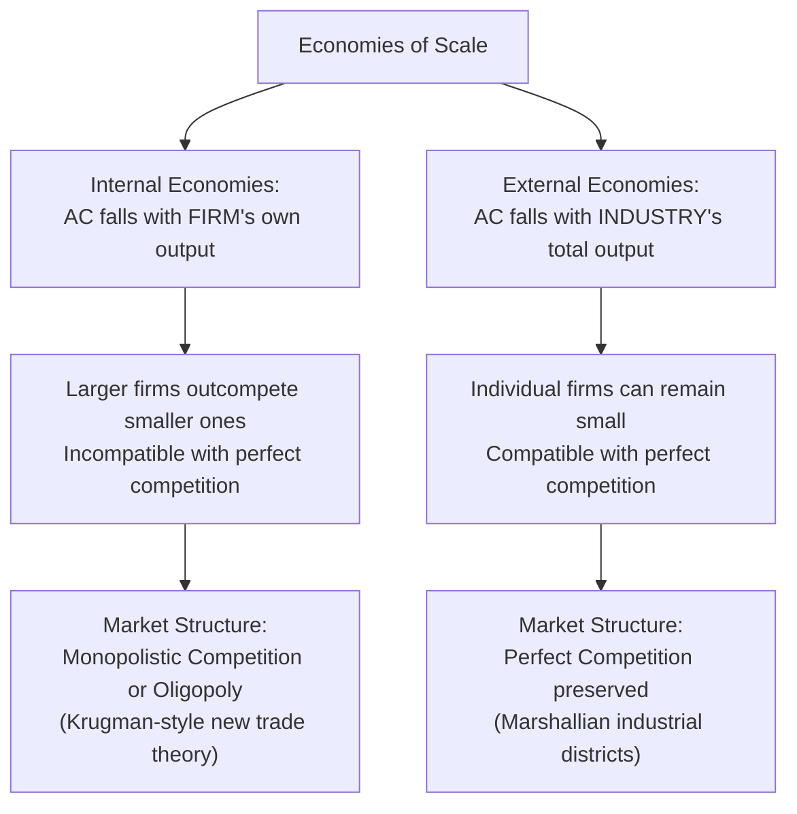

## Internal versus External Economies of Scale

### Overview

Economies of scale — falling average costs as output rises — provide a source of trade and gains from trade entirely distinct from comparative advantage: countries can gain from trade even with **identical** technologies and factor endowments, simply by specializing and exploiting scale efficiencies. The distinction between **internal** and **external** economies of scale is foundational to "new trade theory" (Krugman and others, from the late 1970s onward), because the two types of scale economies have starkly different implications for market structure, trade patterns, and welfare.

### Definitions

**Key Points**

- **Internal economies of scale**: a firm's average cost falls as *that firm's own output* increases, independent of the size of the industry as a whole. Internal economies of scale mean a **larger firm is more efficient than a smaller firm**, regardless of how many other firms exist in the industry.
- **External economies of scale**: a firm's average cost falls as the **size of the industry as a whole** (not the individual firm) increases, even if the individual firm's own output stays constant. External economies operate at the industry or regional/cluster level, benefiting all firms in the industry as the industry grows, regardless of any individual firm's own scale.

### Market Structure Implications

**Key Points**

- **Internal economies of scale are incompatible with perfect competition.** If average cost keeps falling as a firm's own output rises, the firm has an incentive to keep expanding, and larger firms will always be able to underprice smaller ones — this dynamic tends toward monopoly or, more commonly in trade models, **monopolistic competition or oligopoly** (differentiated-product monopolistic competition is the dominant modeling choice in the core Krugman new-trade-theory framework).
- **External economies of scale are compatible with perfect competition.** Because the cost advantage accrues to the *industry*, not to individual firms relative to each other, individual firms within the industry can remain small, numerous, and price-taking, even while the industry as a whole benefits from agglomeration effects — perfect competition can be preserved at the firm level.

### Diagram: Internal vs. External Economies — Structural Consequences

### Sources of Internal Economies of Scale

**Key Points**

- **Fixed costs spread over larger output**: R&D, product design, specialized machinery, and setup costs are incurred once regardless of output level, so average fixed cost per unit falls as total output rises.
- **Specialization and division of labor** within a larger firm.
- **Bulk purchasing and negotiating power** with suppliers.
- **Learning-by-doing at the firm level**, where cumulative firm-specific production experience lowers unit costs.

### Sources of External Economies of Scale

**Key Points**

Following the classical Marshallian analysis of industrial districts/clusters, external economies typically arise from three channels:

1. **Specialized supplier availability**: a large geographic concentration of an industry supports specialized input suppliers and service providers that would not be viable serving a single small firm, but become viable once serving many firms in a large local industry.
2. **Labor market pooling**: a large local industry attracts and supports a deep pool of specialized labor with industry-specific skills, reducing search and training costs for all firms in the cluster.
3. **Knowledge/technology spillovers**: proximity among firms in the same industry facilitates the informal diffusion of technical knowledge, best practices, and innovations across firms — the classic Marshallian "industrial atmosphere" effect.

### Trade Implications: Internal Economies

**Key Points**

- Internal economies of scale, combined with product differentiation and consumer love-of-variety, generate trade based on **specialization for scale efficiency reasons**, entirely independent of comparative advantage — this is the core insight of the Krugman monopolistic competition model of trade.
- Even two economically identical countries (same technology, same factor endowments, same preferences) will gain from trade under internal economies of scale, because trade allows each country's firms to serve a larger combined market, achieving greater scale (and hence lower average costs) than either could achieve serving only its own domestic market, while consumers in both countries gain access to a wider variety of differentiated products.
- This is often described as **intra-industry trade** (countries simultaneously exporting and importing varieties of similar products, e.g., both exporting and importing different brands of automobiles), in contrast to the **inter-industry trade** predicted by comparative-advantage-based models (Ricardian, H-O), where a country exports one type of good entirely and imports a different type.

### Trade Implications: External Economies

**Key Points**

- External economies of scale can generate a pattern where a country/region that happens to get an early lead in an industry (for reasons that may be historical accident, first-mover advantage, or initial comparative advantage) can retain and reinforce that lead purely through the self-reinforcing external-economies mechanism, even absent any underlying comparative advantage.
- This raises the possibility of **multiple equilibria**: which country ends up hosting a given industry can be historically contingent (a "lock-in" or path-dependence result) rather than uniquely determined by underlying fundamentals — a country that industrializes first in a sector with strong external economies may retain a durable, self-reinforcing advantage that a fundamentals-based (comparative advantage) model would not predict.
- Because external economies operate at the industry/cluster level, a country can, in principle, lose an industry-wide competitive position even while individual firms within it remain efficient — if the *industry* as a whole shrinks (e.g., due to a competing cluster's fixed-cost advantages elsewhere), all firms in the shrinking cluster lose the collective external-economy benefit simultaneously.

### Classic Real-World Examples of External Economies (Illustrative)

**Key Points**

- **Silicon Valley** (technology/semiconductor industry clustering) is a frequently cited modern example of Marshallian external economies: specialized labor pools, venture capital ecosystems, and knowledge spillovers reinforcing the region's position.
- **Historical textile districts** (e.g., 19th-century Lancashire) are classical Marshallian examples used in the original theoretical development of external economies.
- [Inference: attributing the precise causal weight of external economies (versus other factors like initial comparative advantage, government policy, or historical accident) in any specific real-world cluster is empirically difficult to disentangle and remains a subject of ongoing economic-geography research rather than a matter of settled consensus.]

### Welfare Implications Comparison

| Feature | Internal Economies (Monopolistic Competition) | External Economies (Perfect Competition) |
| --- | --- | --- |
| Market structure | Imperfect (differentiated products, markup pricing) | Perfect competition preserved |
| Trade pattern | Intra-industry trade, gains from variety | Inter-industry-style specialization, but potentially path-dependent |
| Policy relevance | Product variety gains; potential for pro-competitive effect of trade | Potential rationale for strategic trade policy (protecting/nurturing a nascent cluster) |
| Multiple equilibria possible? | Less central to the core mechanism | Yes — a key theoretical feature |

### Bridge to Strategic Trade Policy

**Key Points**

- External economies of scale are the primary theoretical basis for **strategic trade policy** arguments (e.g., temporary protection or subsidy for a nascent industry to help it reach the scale needed to capture external-economy benefits and establish a durable cluster) — distinct from, though sometimes conflated with, the classical infant-industry argument.
- Because of the path-dependence/multiple-equilibria feature, external economies models are also where trade theory intersects most directly with economic geography and the "new economic geography" literature (Krugman and others), examining how transport costs, market size, and agglomeration forces jointly determine the spatial distribution of industry.

### Related Topics

- Monopolistic competition and trade (Krugman model)
- Intra-industry trade and the gravity model
- Economies of scale and market structure
- Strategic trade policy and infant-industry protection
- New economic geography and industrial clustering
- Path dependence and multiple equilibria in trade patterns
- Love-of-variety preferences and gains from product diversity