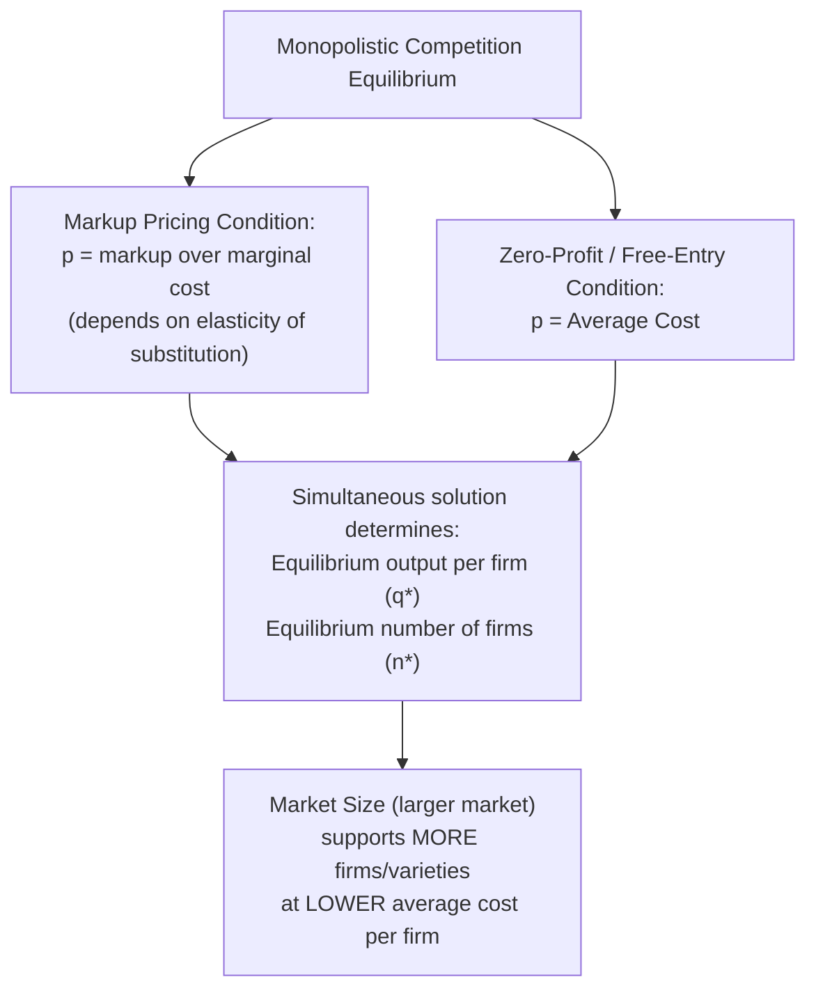
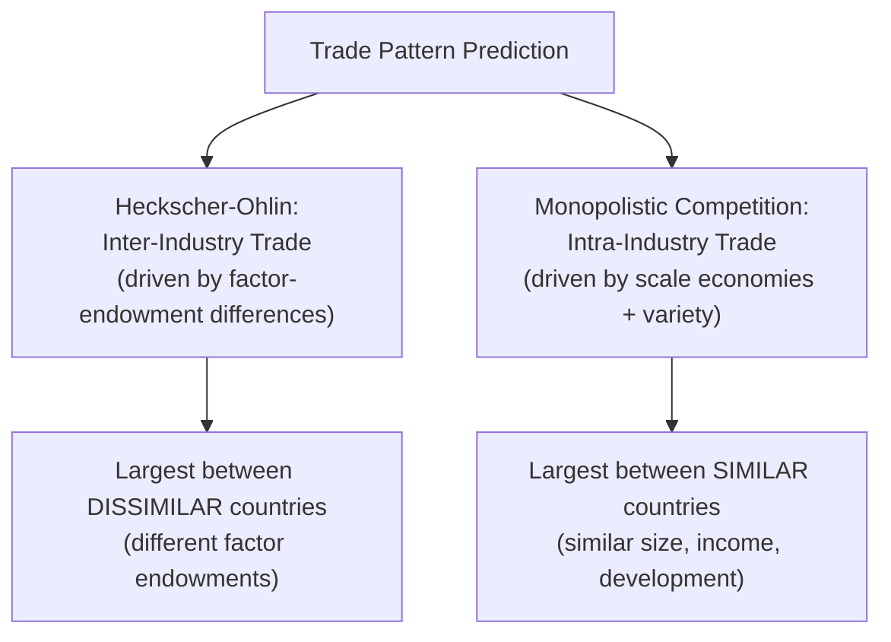

## Monopolistic Competition and Intra-Industry Trade

### Overview

The monopolistic competition model of trade, developed principally by Paul Krugman (1979, 1980) and building on Dixit and Stiglitz's (1977) monopolistic competition framework, formalizes how internal economies of scale combined with consumer preference for variety generate trade and gains from trade among countries with **identical** underlying characteristics. Its central empirical payoff is an explanation of **intra-industry trade**: the observed pattern of countries simultaneously exporting and importing products within the same industry classification — a pattern that comparative-advantage-based models (Ricardian, Heckscher-Ohlin) cannot generate.

### Core Assumptions of the Model

**Key Points**

1. **Differentiated products**: each firm produces a distinct variety of a broadly similar good (e.g., different brands/models of automobiles), and consumers value variety — utility increases with the *number* of distinct varieties consumed, holding total expenditure fixed (a "love of variety" preference, formalized via a CES — constant elasticity of substitution — utility function in the canonical Dixit-Stiglitz setup).
2. **Internal economies of scale**: each firm faces a fixed cost plus a constant marginal cost, so average cost declines as that firm's output rises — this is what limits the number of firms/varieties that can be sustained in equilibrium.
3. **Free entry and exit**: firms enter as long as economic profits are positive, driving profits to zero in long-run equilibrium — this pins down the equilibrium number of firms/varieties.
4. **Monopolistic competition market structure**: each firm has some market power over its own variety (downward-sloping firm-level demand curve, since its product is imperfectly substitutable with others) but faces free entry, so no firm earns sustained economic profit in equilibrium.

### The Zero-Profit and Markup Conditions

Each firm sets price as a markup over marginal cost (standard monopolistic-competition pricing, e.g., in the Dixit-Stiglitz CES setup):

$$p = \frac{c}{1 - \frac{1}{\epsilon}}$$

where $c$ is marginal cost and $\epsilon$ is the elasticity of demand for an individual variety (which, in the standard symmetric CES formulation, depends on the elasticity of substitution across varieties and the number of competing firms).

The zero-profit condition requires price to equal average cost:

$$p = \frac{F}{q} \cdot c_{unit-adjustment} + c$$

(schematically: fixed cost $F$ spread over output $q$, plus marginal cost $c$) — combining the markup-pricing condition with the zero-profit condition simultaneously determines the equilibrium output per firm $q^*$ and, given total market size, the equilibrium number of firms/varieties $n^*$.

### Diagram: Equilibrium Determination

### Effect of Market Size on Equilibrium

**Key Points**

- A **larger market** (more consumers, higher total expenditure) supports a **greater number of firms/varieties** in equilibrium, each still achieving zero economic profit, but now benefiting from the larger market's ability to sustain more firms at efficient scale.
- Larger markets can also support **lower prices** (a "pro-competitive effect"): with more firms/varieties competing, and depending on the specific functional form assumptions, average cost per firm can fall as the market grows (each firm can achieve a larger efficient scale relative to fixed costs, or face tougher competitive pressure that compresses markups).
- This "bigger market → more varieties and/or lower prices" mechanism is the central engine generating gains from trade in this model: **trade effectively enlarges the market** available to every firm in both trading countries.

### Trade as Market Enlargement

**Key Points**

- When two identical countries open to trade, the effect (from each firm's perspective) is equivalent to a large increase in market size — each country's producers now have access to the **combined** market (Home + Foreign consumers) rather than just their own domestic market.
- This combined, larger market supports **more total varieties** than either country could sustain alone, and consumers in *both* countries gain access to the full combined set of varieties (each country specializes in producing a *different subset* of varieties, and via trade, both countries' consumers get access to all of them).
- Crucially, this generates **gains from trade even between two economically identical countries** — no differences in technology, factor endowments, or comparative advantage are needed; the entire mechanism runs through economies of scale and variety-love preferences.

### Intra-Industry Trade

**Key Points**

- Because each country specializes in producing a different subset of varieties within the same broad industry (e.g., Germany exports BMWs, imports Toyotas; both are "automobiles"), the resulting trade pattern shows countries **simultaneously exporting and importing goods classified within the same industry** — this is intra-industry trade, in contrast to the inter-industry trade pattern (a country exports one entire type of good, imports a completely different type) predicted by Ricardian and Heckscher-Ohlin models.
- Empirically, intra-industry trade is measured using the **Grubel-Lloyd index**:

$$GL_i = 1 - \frac{|X_i - M_i|}{X_i + M_i}$$

where $X_i$ and $M_i$ are exports and imports in industry $i$. A value of $GL_i = 1$ indicates perfectly balanced two-way (intra-industry) trade in that industry; $GL_i = 0$ indicates purely one-directional (inter-industry) trade.

- Empirically, intra-industry trade is observed to be **especially prevalent between economically similar, developed countries** (e.g., trade among EU members, or U.S.-Canada-EU trade in manufactured goods) — a pattern strongly consistent with the monopolistic competition model's prediction that similarity in size/development (not divergence in factor endowments) drives this type of trade, in contrast to the H-O prediction that trade should be largest between economically *dissimilar* countries.

### Diagram: Intra-Industry vs. Inter-Industry Trade Pattern

### Gains from Trade in the Monopolistic Competition Model

**Key Points**

Two distinct sources of gains, both operating through the market-enlargement mechanism:

1. **Variety gains**: consumers in both countries gain access to a greater total number of varieties post-trade than either had in autarky — a direct utility gain from increased product diversity, holding real income constant.
2. **Scale/efficiency gains**: with a larger combined market, surviving firms can potentially operate at a larger, more efficient scale (lower average cost), and/or the increased competitive pressure from a larger number of rival firms compresses markups toward marginal cost — both effects can lower prices to consumers.

### The Krugman Model's Role in "New Trade Theory"

**Key Points**

- This framework, alongside oligopoly-based new-trade-theory models (e.g., Brander-Spencer strategic trade models), collectively constitute what came to be known as "new trade theory" from the late 1970s-1980s — a major expansion of trade theory's toolkit beyond the perfectly-competitive, comparative-advantage-based Ricardian/H-O tradition.
- Krugman was awarded the 2008 Nobel Memorial Prize in Economic Sciences substantially for this body of work (along with related contributions to economic geography), recognizing its role in explaining trade patterns and the location of economic activity that classical trade theory could not account for.
- Modern quantitative trade models (e.g., Melitz 2003's heterogeneous-firms extension, incorporating firm-level productivity differences and selection into exporting) build directly on this monopolistic competition foundation, remaining central to current international trade research and policy analysis (e.g., modern "new new trade theory" and its use in quantifying the welfare effects of trade agreements).

### Related Topics

- Internal versus external economies of scale
- Grubel-Lloyd index and measuring intra-industry trade
- Dixit-Stiglitz monopolistic competition framework
- Melitz model and firm heterogeneity in trade
- Strategic trade policy and oligopoly models (Brander-Spencer)
- Gravity model of trade and market-size predictions
- Gains from trade decomposition: variety vs. efficiency effects