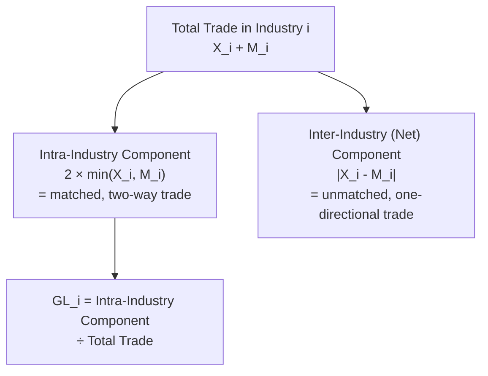

## The Grubel-Lloyd Index of Intra-Industry Trade

### Overview

The Grubel-Lloyd (GL) index, developed by Herbert Grubel and Peter Lloyd (1975), is the standard empirical measure used to quantify the extent of intra-industry trade — the simultaneous export and import of goods within the same industry classification. It converts the theoretical prediction of the monopolistic competition trade model (that similar countries trade differentiated varieties within the same industry) into a measurable statistic, enabling empirical testing of whether observed trade patterns are predominantly inter-industry (comparative-advantage-driven) or intra-industry (scale-and-variety-driven).

### The Formula

For a given industry (or product category) $i$, the Grubel-Lloyd index is defined as:

$$GL_i = 1 - \frac{|X_i - M_i|}{X_i + M_i}$$

where $X_i$ is the value of exports in industry $i$ and $M_i$ is the value of imports in industry $i$, both typically measured for the same country over the same time period.

### Interpreting the Index

**Key Points**

- $GL_i \in [0, 1]$ by construction.
- **$GL_i = 1$**: exports exactly equal imports in that industry ($X_i = M_i$) — this represents the theoretical maximum of pure, perfectly balanced two-way (intra-industry) trade.
- **$GL_i = 0$**: the country either exports *only* or imports *only* in that industry, with no two-way trade at all ($X_i = 0$ or $M_i = 0$) — this represents pure inter-industry (one-directional) trade.
- Intermediate values indicate a mix: some genuine two-way intra-industry trade alongside a net inter-industry imbalance (the country is a net exporter or net importer overall in that industry, but with substantial two-way flows underneath the net figure).

### Decomposing Trade into Intra- and Inter-Industry Components

**Key Points**

Total trade in industry $i$ can be decomposed as:

$$X_i + M_i = \underbrace{2 \min(X_i, M_i)}_{\text{Intra-industry component}} + \underbrace{|X_i - M_i|}_{\text{Inter-industry (net) component}}$$

- The **intra-industry component**, $2\min(X_i, M_i)$, represents the portion of trade that is "matched" — two-way flows that exactly offset — genuinely reflecting the exchange of differentiated varieties within the industry.
- The **inter-industry (net) component**, $|X_i - M_i|$, represents the portion of trade that reflects a genuine net trade imbalance in that industry — the "excess" exports or imports beyond what is matched by the reverse flow.
- The GL index is equivalent to the share of total trade ($X_i + M_i$) accounted for by the intra-industry component:

$$GL_i = \frac{2\min(X_i, M_i)}{X_i + M_i}$$

(This is algebraically identical to the $1 - |X_i - M_i|/(X_i + M_i)$ formulation above.)

### Diagram: Decomposition of Total Trade

### Worked Numerical Example

**Example**

Suppose a country's automobile industry ($i$) has:

- Exports $X_i = \$80$ million
- Imports $M_i = \$60$ million

Then:

$$GL_i = 1 - \frac{|80 - 60|}{80 + 60} = 1 - \frac{20}{140} = 1 - 0.143 = 0.857$$

This indicates a high degree of intra-industry trade (about 85.7% of total automobile trade is "matched" two-way trade), with only a modest net export surplus of $20 million reflecting the inter-industry (comparative-advantage-driven) component.

Contrast this with an industry where $X_i = \$100$ million and $M_i = \$0$ (the country exports exclusively, imports nothing in this category):

$$GL_i = 1 - \frac{|100 - 0|}{100 + 0} = 1 - 1 = 0$$

This is pure inter-industry trade — consistent with, for example, a classic Ricardian/H-O comparative-advantage pattern where a country entirely specializes in and exports one good category with no offsetting imports.

### Aggregation Across Industries

**Key Points**

- The economy-wide (aggregate) Grubel-Lloyd index is typically computed as a **trade-weighted average** of the industry-level indices, to avoid giving equal weight to industries with very different trade volumes:

$$GL = \frac{\sum_i (X_i + M_i) \cdot GL_i}{\sum_i (X_i + M_i)} = 1 - \frac{\sum_i |X_i - M_i|}{\sum_i (X_i + M_i)}$$

- This weighted aggregate is the figure typically reported in empirical studies and cross-country comparisons of overall intra-industry trade intensity.

### Sensitivity to Industry Classification (Aggregation Bias)

**Key Points**

- The GL index is highly sensitive to the **level of industry aggregation** used in the underlying trade data (e.g., 2-digit vs. 4-digit vs. 6-digit Harmonized System or SITC classification codes).
- **Coarser (more aggregated) classifications** tend to mechanically inflate measured intra-industry trade, because genuinely different products (which might reflect true inter-industry, comparative-advantage-driven trade at a finer classification level) get lumped into the same broad category, appearing as "two-way trade within an industry" when it may actually be trade in fundamentally different products (e.g., a country might export aircraft engines and import aircraft seats, both classified broadly as "aerospace equipment," inflating the apparent GL index for that broad category even though the underlying products are not close substitutes).
- **Finer (more disaggregated) classifications** tend to reveal more true inter-industry trade and lower measured GL indices, since products are more narrowly and accurately grouped.
- This aggregation sensitivity is one of the most significant methodological critiques of the GL index, and empirical researchers typically report results at multiple levels of disaggregation, or use finer classifications when comparing across studies, to mitigate this bias. [Inference: there is no single universally agreed "correct" level of disaggregation for GL index calculation; the appropriate level depends on the specific research question and available data granularity, which is a matter of applied judgment rather than a settled methodological standard.]

### Empirical Patterns

**Key Points**

- Intra-industry trade (high GL index values) is empirically most prevalent in trade between **developed, economically similar countries**, particularly in manufactured goods sectors (automobiles, machinery, chemicals, electronics) — strongly consistent with the monopolistic competition model's prediction.
- Intra-industry trade tends to be **lower** between countries with substantially different factor endowments or development levels (e.g., trade between a highly industrialized country and a primarily agricultural/resource-exporting developing country), where trade is more dominated by inter-industry, comparative-advantage-driven patterns (consistent with H-O).
- The rise of intra-industry trade as a share of total world trade over the postwar period, particularly among European and North American manufacturing economies, was one of the key empirical motivations for the development of monopolistic competition trade theory in the first place — the theory was developed substantially in response to (and to explain) this observed empirical pattern.

### Limitations of the Grubel-Lloyd Index

**Key Points**

1. **Aggregation bias** (discussed above) — the most significant and widely cited limitation.
2. **Does not distinguish horizontal from vertical intra-industry trade**: "horizontal" intra-industry trade (different varieties of similar-quality products, the classic Krugman monopolistic-competition story) is conceptually distinct from "vertical" intra-industry trade (trade in different quality tiers or different stages of a production process within a global value chain, e.g., exporting unfinished components and importing finished assembled products in the same broad category) — the GL index captures both without distinguishing between them, though the underlying economic mechanisms differ (vertical IIT is often better explained by factor-proportions differences across production stages, closer to an H-O logic, than by the pure product-differentiation logic of monopolistic competition).
3. **Static, single-period snapshot**: the basic index does not capture trends or dynamics without computing it repeatedly across time periods.
4. **Sensitive to trade imbalances driven by macroeconomic factors** (exchange rates, aggregate demand conditions) unrelated to the underlying industry-level product differentiation story that motivates its theoretical interpretation.

### Related Topics

- Monopolistic competition and intra-industry trade
- Internal versus external economies of scale
- Vertical vs. horizontal intra-industry trade and global value chains
- Gravity model of trade and similarity-driven trade patterns
- Product classification systems (Harmonized System, SITC) and aggregation issues
- Krugman's new trade theory and gains from trade among similar countries