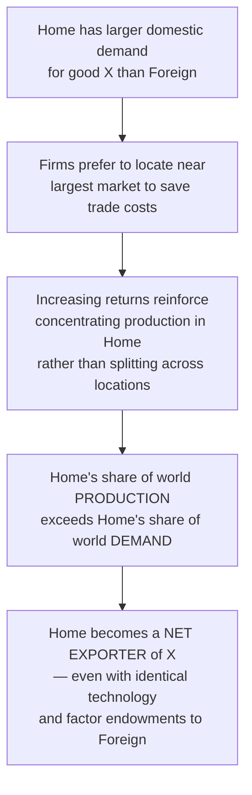
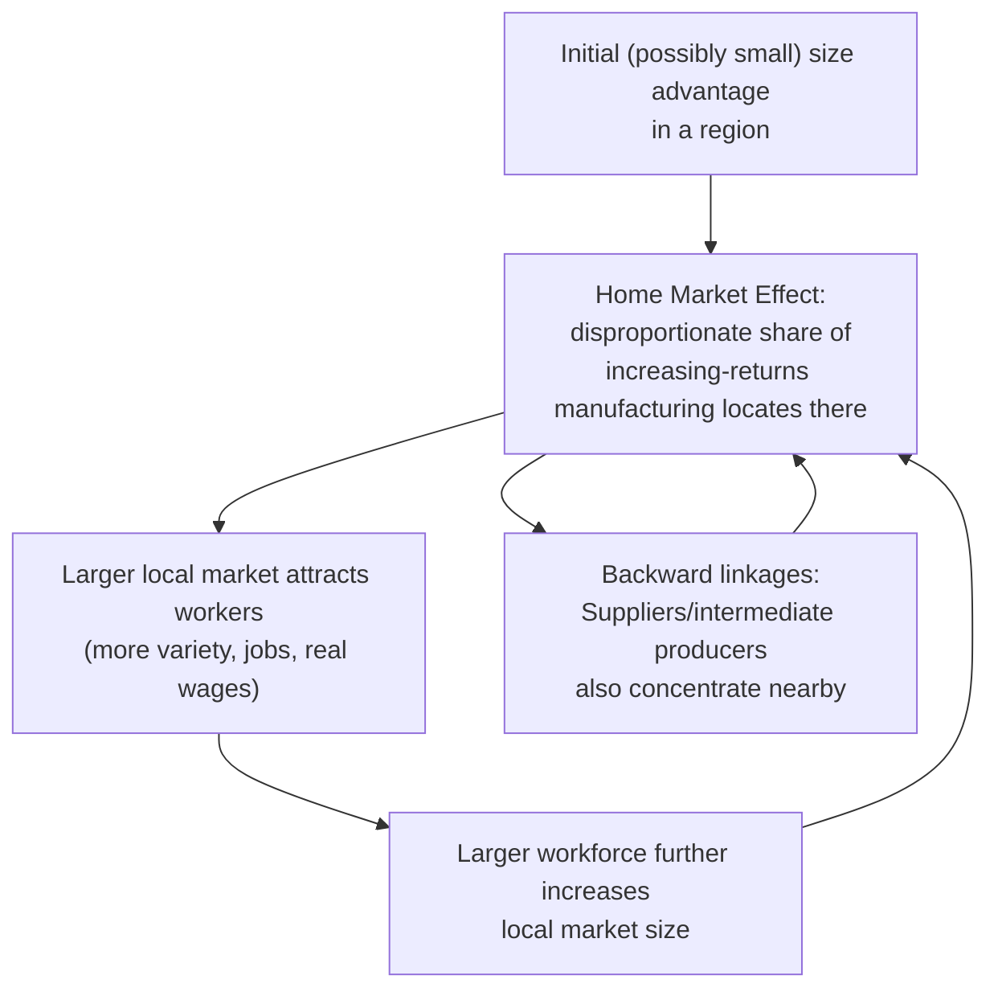

## Home Market Effects and Economic Geography

### Overview

The home market effect is one of the signature theoretical results of new trade theory: under increasing returns to scale and trade costs, industries tend to concentrate disproportionately in the country with the larger domestic demand for that industry's products, and that country becomes a **net exporter** of the good — even absent any comparative-advantage-based reason for doing so. This result, developed formally by Krugman (1980) building on earlier work by Linder and others, is a foundational building block of the "new economic geography" literature, which extends trade theory to explain the spatial concentration of economic activity.

### The Core Intuition

**Key Points**

- In a world with internal economies of scale (firm-level fixed costs) and costly trade (transport costs, trade frictions), firms prefer to locate production **near their largest market**, to minimize the trade costs incurred shipping output to the bulk of their customers, while accepting the smaller cost of shipping the residual output to the smaller foreign market.
- If a good has an increasing-returns production technology, this locational preference is reinforced: concentrating production in one location (rather than splitting it between countries) allows a firm to achieve greater scale economies, further favoring the larger-market location.
- The net result is that the **larger market attracts a more than proportionate share of the world's production capacity** in increasing-returns industries — production capacity does not simply scale one-for-one with market size, but disproportionately more than one-for-one.

### Formal Statement of the Home Market Effect

**Key Points**

- If Home's share of world demand for a good is $s_H > 0.5$ (Home has the larger market), then under increasing returns and positive trade costs, Home's share of world **production** of that good, $\sigma_H$, will satisfy $\sigma_H > s_H$ — Home produces a *more than proportionate* share relative to its market size.
- Correspondingly, Home becomes a **net exporter** of the good, even if Home and Foreign have identical technologies, factor endowments, and per-capita preferences — the entire mechanism is driven purely by relative market size combined with increasing returns and trade costs.
- This is a genuinely novel prediction: it does not require any comparative advantage, factor abundance, or technological difference between countries — market size alone, under the right structural conditions (increasing returns + trade costs), determines the direction and magnitude of specialization.

### Diagram: The Home Market Effect Mechanism

### Conditions Required for the Home Market Effect

**Key Points**

1. **Increasing returns to scale** at the firm level (internal economies of scale, as in the monopolistic competition framework) — without scale economies, there is no locational advantage to concentrating production, and each country would simply produce to meet its own demand (constant-returns benchmark).
2. **Positive trade costs** (transport costs, tariffs, or other frictions) — without trade costs, location would not matter at all for serving distant markets, eliminating the locational-proximity motive entirely.
3. **Differentiated products / monopolistic competition** market structure is the standard setting in which this result is derived, though closely related results also arise in some oligopoly-based new trade theory models.

### Relation to New Economic Geography

**Key Points**

- The home market effect is the foundational building block of **New Economic Geography (NEG)**, the research program (substantially developed by Krugman from the early 1990s, e.g., Krugman 1991's "Increasing Returns and Economic Geography") that extends these mechanisms to explain the spatial distribution of economic activity within and across regions, not just between countries.
- NEG models formalize a **core-periphery** dynamic: regions with an initial size advantage attract disproportionate shares of increasing-returns manufacturing (via the home market effect and associated backward/forward linkages), which further increases their attractiveness for workers and firms (since a larger local market supports more variety and lower prices, per the monopolistic competition logic), creating a self-reinforcing **agglomeration** process.
- **Forward linkages**: firms prefer to locate in regions with large consumer markets (the home market effect itself).
- **Backward linkages**: firms also prefer to locate near concentrations of suppliers and intermediate-input producers, which themselves tend to be located near large final-demand markets — reinforcing the same core-periphery dynamic through the input-output structure of production.

### Diagram: Core-Periphery Dynamics in New Economic Geography

### The Role of Trade Costs in Determining Agglomeration vs. Dispersion

**Key Points**

- NEG models typically show a **non-monotonic relationship** between trade/transport costs and the degree of geographic concentration:
  - At **very high trade costs**, each region is essentially forced to serve its own local market (autarky-like), so production disperses roughly in proportion to local demand — no strong agglomeration.
  - At **intermediate trade costs**, the home market effect and cumulative-causation agglomeration forces are strongest, producing pronounced core-periphery concentration.
  - At **very low trade costs**, firms become largely indifferent to location (since serving distant markets is nearly costless), reducing the locational advantage of the core and potentially allowing some dispersion back toward the periphery (especially if congestion costs, land prices, or other diseconomies of agglomeration in the core become significant).
- This non-monotonic "bell-shaped" relationship between falling trade costs and industrial concentration is one of the more nuanced and empirically debated predictions of the NEG literature. [Inference: the precise empirical shape and turning points of this relationship are difficult to pin down and vary substantially by industry and context, making this a more actively contested empirical area than the core home market effect result itself.]

### Empirical Evidence for the Home Market Effect

**Key Points**

- **Davis and Weinstein (1999, 2003)** conducted influential empirical tests of the home market effect using OECD manufacturing data, generally finding supportive evidence that industries with larger domestic demand also have disproportionately larger domestic production shares, consistent with the theoretical prediction — though they also found that the effect coexists with, and does not fully displace, comparative-advantage-based explanations of trade patterns.
- Subsequent empirical work has found the home market effect to be more robust in some industries (particularly differentiated manufactured goods with significant scale economies) than in others (homogeneous, constant-returns goods, where the effect is theoretically not expected to appear), broadly consistent with the model's structural predictions about which industries should exhibit the effect.

### Policy and Real-World Relevance

**Key Points**

- The home market effect provides a theoretical rationale for why **large domestic markets can be a genuine source of national competitive advantage** in increasing-returns industries — a market-size-based analogue to (and partial complement of) traditional comparative-advantage-based competitiveness arguments.
- It has been invoked in discussions of industrial policy (arguing that fostering large domestic demand, e.g., via public procurement or market-integration policies such as the EU single market, can help a country's firms achieve the scale advantages needed to become net exporters in scale-economy industries) — though such applications require care, since the theoretical result depends on specific structural assumptions (increasing returns, trade costs, product differentiation) that may not hold uniformly across all industries.
- The EU single market and other regional economic integration efforts are sometimes analyzed through this lens: integrating multiple national markets into one larger effective market can, per the home market effect logic, promote the emergence of larger, more efficient firms and clusters within the integrated area — connecting directly to the broader gains-from-market-enlargement logic of the monopolistic competition trade model.

### Related Topics

- Monopolistic competition and intra industry trade
- Internal versus external economies of scale
- New economic geography: core-periphery models
- Agglomeration economies and industrial clustering
- Davis-Weinstein empirical tests of the home market effect
- Trade costs, market integration, and regional economic policy
- Forward and backward linkages in production location theory