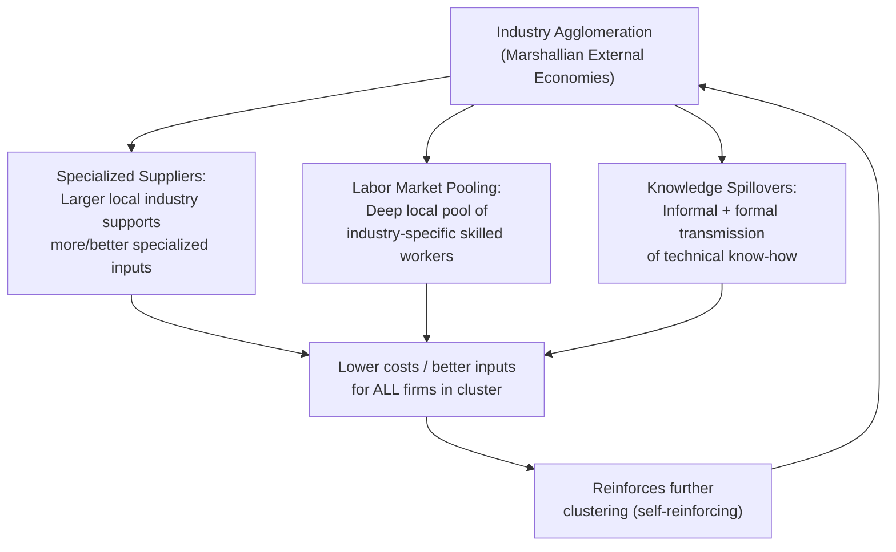
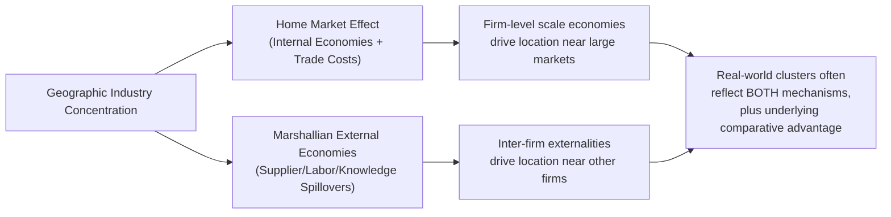

## External Economies and Industry Agglomeration

### Overview

This topic extends the treatment of external economies of scale into a full analysis of industry agglomeration: why economic activity in industries subject to external economies tends to cluster geographically, why such clusters can be remarkably durable and self-reinforcing, and what this implies for trade patterns, national competitiveness, and policy. Where the previous discussion of internal vs. external economies established the basic definitions and market-structure implications, this topic works through the dynamic and equilibrium properties of external-economy-driven clustering in depth.

### Recap: Why External Economies Generate Clustering

**Key Points**

- External economies of scale mean that a firm's average cost falls as the **local/industry-wide** scale of the industry rises, not merely as the individual firm's own output rises.
- This creates a direct incentive for firms to locate **near other firms in the same industry**, since doing so allows each firm to benefit from the collective external economies (specialized suppliers, labor pooling, knowledge spillovers) generated by industry-wide concentration.
- Unlike internal economies (which drive concentration *within* a firm, i.e., firm growth), external economies drive concentration *across* firms in the same location — this is the direct mechanism generating geographic clustering, or agglomeration.

### The Three Marshallian Sources, Revisited in Depth

**Key Points**

1. **Specialized supplier availability**: A large local industry supports a dense ecosystem of specialized upstream suppliers (machinery, components, business services) that would not be viable serving only a single small firm. As industry size grows, both the number and specialization of available suppliers increase, lowering input costs and improving input quality/customization for all firms in the cluster.
2. **Labor market pooling**: A large local industry attracts and retains a deep pool of workers with industry-specific skills. This benefits firms by reducing hiring search costs and training costs, and benefits workers by reducing the risk of unemployment from any single firm's idiosyncratic shocks (a worker laid off from one firm in the cluster can more easily find a comparable position at another firm in the same local industry) — a classic risk-sharing rationale for labor pooling.
3. **Knowledge spillovers**: Geographic proximity facilitates both formal (conferences, industry associations, supplier relationships) and informal (worker mobility between firms, social networks) transmission of technical knowledge and best practices — Marshall's famous description of an "industrial atmosphere" in which knowledge is, in effect, "in the air" within a cluster.

### Diagram: The Three Marshallian Externalities

### Self-Reinforcement and Path Dependence

**Key Points**

- Because external economies benefit *all* firms in a cluster as it grows, there is a **positive feedback loop**: an initially larger cluster attracts more firms (seeking the external-economy benefits), which makes the cluster larger still, further strengthening the external economies and attracting yet more firms — a cumulative causation dynamic.
- This self-reinforcing property means that **historical accident or initial small advantages can determine long-run outcomes**: a region that, for reasons unrelated to any lasting fundamental advantage (a chance early entrant, a historical policy decision, proximity to an original resource deposit that has since become irrelevant), gets a head start in an industry can retain and amplify that lead purely through the agglomeration mechanism, even after the original triggering advantage has disappeared.
- This generates the possibility of **multiple equilibria**: in principle, several different countries/regions could sustain a stable industry cluster (each is a self-consistent equilibrium, since once a cluster of a given size exists, no individual firm has an incentive to relocate away from it), and *which* equilibrium the world economy actually settles into may depend on essentially arbitrary historical starting conditions rather than being uniquely pinned down by underlying fundamentals (unlike the classical comparative-advantage models, which typically yield a unique, fundamentals-determined trade pattern).

### Path Dependence: A Formal Illustration (Conceptual)

**Example**

Consider two otherwise-identical regions, A and B, each capable of hosting a semiconductor industry. Suppose region A happens to get a small, essentially random early advantage (perhaps a single pioneering firm locates there for idiosyncratic reasons unrelated to any lasting cost advantage). Given sufficiently strong external economies:

- Region A's slightly larger initial industry size makes it marginally more attractive to the next firm considering where to locate.
- That firm's decision to locate in A further increases A's relative attractiveness for the *next* firm.
- Through this cumulative process, region A can end up hosting the overwhelming majority of the industry — not because of any inherent cost or productivity advantage over region B, but purely because of the self-reinforcing dynamics unleashed by an essentially arbitrary initial condition.

[Inference: this is a stylized theoretical illustration of the path-dependence mechanism, not a claim about any specific real-world semiconductor cluster's actual history, which would involve additional factors (government policy, specific firm strategies, initial comparative advantages) beyond this simplified pure-agglomeration mechanism.]

### Implications for Trade Patterns

**Key Points**

- Because external-economy-driven clustering is not necessarily tied to underlying comparative advantage, the resulting trade pattern (which country exports the clustered industry's output) may not reflect factor abundance or technological differences at all — it can be a matter of historical contingency.
- This has an important implication for trade policy: a country that "loses" an external-economy-driven industry to a rival cluster may not be able to easily recapture it later, even if its underlying fundamentals (factor costs, technology) would otherwise favor it, simply because the rival cluster's accumulated external economies constitute a durable, self-reinforcing advantage that is difficult to overcome without substantial coordinated effort.
- Conversely, this also implies a potential **first-mover advantage** rationale: being early to establish a cluster in an external-economies industry can yield lasting benefits that persist well beyond any initial, possibly small or temporary head start.

### Policy Implications: The Case for (and Against) Strategic Intervention

**Key Points**

- The path-dependence/multiple-equilibria feature of external-economy industries provides a theoretical rationale for **strategic industrial policy**: temporary government support (subsidies, protection, coordinated investment) to help a nascent domestic cluster reach the critical mass needed to become self-sustaining via external economies, after which support could in principle be withdrawn.
- This is conceptually related to, but analytically distinct from, the classical **infant-industry argument** (which is usually grounded in internal, firm-level learning-by-doing or internal economies) — the external-economies rationale for intervention rests specifically on the industry-wide, cluster-level externality, which individual firms cannot internalize on their own (a firm choosing where to locate does not fully account for the positive externality its presence confers on other firms in the cluster) and which is a genuine market failure in the standard economic sense.
- **Caveats and risks** of this policy prescription: identifying in advance which industries/locations are likely to achieve a self-sustaining cluster (versus wasting resources on an industry that never reaches critical mass) is empirically very difficult; strategic intervention risks becoming a vehicle for politically-motivated rather than economically-justified support; and coordinated intervention by multiple countries simultaneously targeting the same industry can lead to costly, mutually wasteful subsidy competition (a version of the beggar-thy-neighbor dynamics seen in tariff/subsidy terms-of-trade competition) without necessarily determining a globally efficient outcome. [Inference: assessing the actual empirical track record of such strategic industrial policies in successfully creating durable, competitive clusters — versus cases of costly failure — is a matter of significant ongoing debate among economists rather than settled consensus.]

### Distinguishing Agglomeration from Home Market Effects

**Key Points**

- The home market effect (from internal economies + trade costs) and Marshallian external-economy clustering are **related but analytically distinct** mechanisms for geographic concentration of industry.
- The home market effect operates through firm-level scale economies and market-size-driven locational choice, and does not require any externality between firms.
- External-economy agglomeration operates through genuine inter-firm externalities (specialized suppliers, labor pooling, knowledge spillovers) that exist independently of any individual firm's market-size-driven locational calculus.
- In practice, real-world industrial clusters likely reflect a combination of both mechanisms (along with underlying comparative advantage), making it empirically challenging to cleanly attribute observed concentration to one specific theoretical channel.

### Diagram: Agglomeration Mechanisms Compared

### Related Topics

- Internal versus external economies of scale
- Home market effects and economic geography
- New economic geography and core-periphery models
- Strategic trade policy and infant-industry protection
- Path dependence and multiple equilibria in trade patterns
- Cluster-based industrial policy and its empirical track record
- Knowledge spillovers and endogenous growth connections