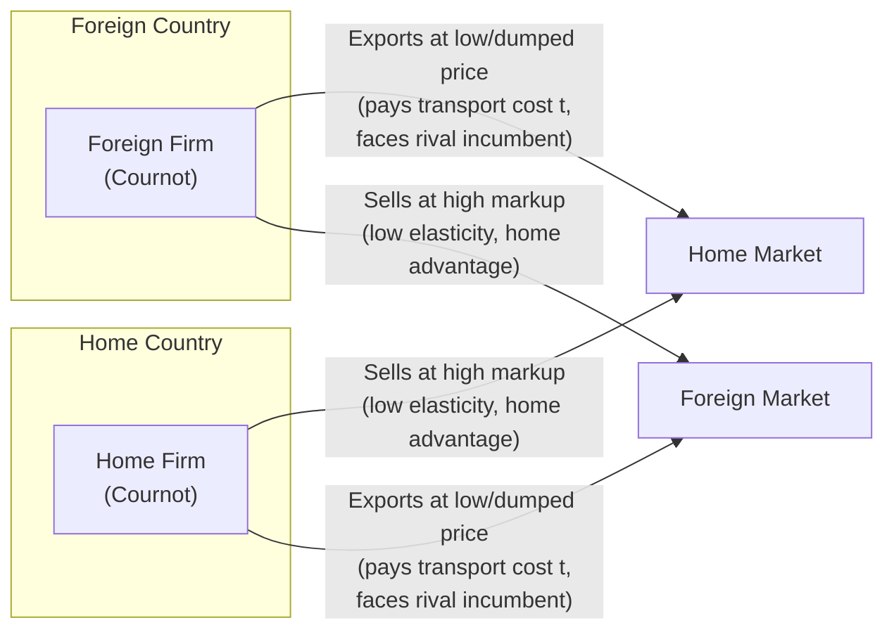

## Dumping and pricing to market under imperfect competition

### Overview

Dumping and pricing-to-market (PTM) describe how firms with market power set different prices for the same good across national markets. Both phenomena arise only under imperfect competition (monopoly, oligopoly, monopolistic competition), because perfectly competitive firms are price-takers with no ability to price-discriminate. These concepts form a core application of new trade theory, connecting firm-level pricing behavior to trade policy (antidumping law) and exchange-rate pass-through.

### Preconditions for international price discrimination

Three conditions must hold simultaneously for a firm to profitably charge different prices in different countries:

1. **Market power**: the firm faces a downward-sloping demand curve in each market (imperfect competition), so it can set price above marginal cost.
2. **Segmented markets**: the domestic and foreign markets must be separable — arbitrage (reselling from the low-price to the high-price market) must be costly or blocked. Segmentation is achieved through transport costs, tariffs, product differentiation, distribution networks, or legal barriers.
3. **Different demand elasticities**: the price-elasticity of demand for the firm's product must differ across markets, typically because competitive intensity differs (more competitors abroad → more elastic demand → lower markup).

If markets are integrated (arbitrage is costless), the law of one price forces a single price and price discrimination collapses.

### The markup rule and elasticity-based pricing

A profit-maximizing firm with market power sets price as a markup over marginal cost, derived from the standard monopoly first-order condition:

$$MR = MC \implies P\left(1 - \frac{1}{|\varepsilon|}\right) = MC$$

so that

$$P = \frac{MC}{1 - \frac{1}{|\varepsilon|}}$$

where $\varepsilon$ is the price elasticity of demand faced by the firm in a given market. This is the **Lerner index** relationship: the markup $(P - MC)/P = 1/|\varepsilon|$.

**Key implication**: because $\varepsilon$ typically differs by market (home market often has fewer competitors than a foreign market saturated with rivals, or vice versa), the same firm optimally charges different prices for the identical good, even absent any cost difference between markets.

### Dumping: definitions and taxonomy

"Dumping" is the sale of an exported good at a price lower than the price charged for the same good in the exporter's home market, or below cost. Three canonical categories (following Viner's classic taxonomy, still used in trade theory and WTO practice):

- **Persistent dumping**: an ongoing pattern of international price discrimination driven by systematically different demand elasticities at home versus abroad. This is the direct application of the markup rule above — home market elasticity is lower (due to market power/less competition), export market elasticity is higher (due to more competition from rival exporters), so $P_{home} > P_{export}$.
- **Predatory dumping**: temporary below-cost pricing intended to drive foreign competitors out of the market, followed by price increases once market power is established. This mirrors predatory pricing theory from industrial organization and is the primary economic rationale invoked in antidumping statutes, though whether it occurs empirically at meaningful scale is disputed.
- **Sporadic (cyclical) dumping**: occasional dumping to offload unanticipated surplus inventory (e.g., due to a demand shortfall or overproduction) at a low price abroad rather than depress the home market price, which the firm wants to keep stable (often connected to price rigidity or reputational concerns at home).

**[Inference]** Of the three, persistent dumping is the one best explained by mainstream international trade theory as a rational, non-predatory outcome of price discrimination under segmented markets — it does not require any anti-competitive intent.

### Reciprocal dumping model (Brander–Krugman)

A canonical new-trade-theory model showing that **two-way (cross-hauling) trade in an identical good can arise purely from oligopolistic rivalry**, without any comparative advantage.

**Setup**: Two symmetric countries (Home, Foreign), one identical good, one firm in each country, Cournot competition (quantity-setting), segmented markets, positive but not prohibitive transport costs $t$.

**Mechanism**:

- Each firm treats its home market and the foreign market as **separate, segmented Cournot markets**.
- In its own home market, a firm faces only its rival's exports as competition; in the foreign market, the same firm is itself the "foreign" competitor.
- Because each firm has some degree of home-market advantage (its rival must pay transport cost $t$ to reach it), each firm sets a higher price at home and a lower (dumped) price when exporting — this is a direct application of the elasticity/reaction-curve logic under segmented Cournot markets.
- The equilibrium outcome: **both countries simultaneously export the identical good to each other** ("cross-hauling" or "reciprocal dumping").

**Key results**:

- Trade occurs even though the two countries and firms are entirely symmetric — a result impossible under perfect competition or standard comparative-advantage models (Ricardian, Heckscher–Ohlin), where identical countries would have no basis for trade.
- Reciprocal dumping is generally **welfare-improving** despite each firm technically "dumping," because it:
  - increases total output and lowers price in each market (procompetitive effect of added foreign rival),
  - reduces the domestic monopoly distortion,
  - though it wastes real resources via unnecessary "transport in both directions" of an otherwise identical product (a standard critique/inefficiency of the model).
- **[Inference]** This is one of the most cited theoretical demonstrations that trade driven purely by imperfect competition and market segmentation can be welfare-enhancing even when it produces behavior (dumping) that trade law treats as unfair.

### Pricing-to-market (PTM) and exchange-rate pass-through

Pricing-to-market, a term introduced primarily by Krugman (1987) and empirically developed by Knetter, describes how exporting firms adjust their markups across destination markets in response to exchange-rate movements to stabilize the local-currency price faced by foreign consumers, rather than fully passing through the exchange-rate change.

**Exchange-rate pass-through (ERPT)** measures the percentage change in the destination-market price of an imported good resulting from a percentage change in the exchange rate:

$$\text{ERPT} = \frac{\%\Delta P_{local}}{\%\Delta e}$$

- **Complete pass-through** (ERPT = 1): the exporter holds its price fixed in its own currency, so the full exchange-rate change is transmitted to the foreign-currency price.
- **Incomplete pass-through** (0 < ERPT < 1): the exporter absorbs part of the exchange-rate movement into its markup, adjusting the foreign-currency price only partially. This is empirically the norm in differentiated-goods markets.
- **Zero pass-through / local-currency pricing (LCP)** (ERPT ≈ 0): the exporter fully stabilizes the destination-currency price, absorbing the entire exchange-rate move into its own margin.

**Why PTM occurs (theoretical mechanism)**: If a firm faces a demand curve whose elasticity itself varies with price (not the constant-elasticity case), the desired markup $1/(1-1/|\varepsilon(P)|)$ changes as price changes. A depreciation of the exporter's currency (which would otherwise lower the foreign-currency price and raise foreign quantity demanded) moves the firm along the foreign demand curve to a segment with different elasticity, so the profit-maximizing firm adjusts its own-currency price (markup) in the opposite direction to partially offset the exchange-rate move. This requires demand curves that are **not** constant-elasticity — e.g., linear demand, or demand with a kinked/convex shape reflecting local competitive conditions.

**Practical drivers of incomplete pass-through**:

- **Competitive environment in the destination market**: to protect market share against local rivals, exporters compress their markup rather than raise the local price.
- **Menu costs / price rigidity**: nominal price adjustment costs cause firms to smooth local prices against exchange-rate volatility.
- **Distribution costs and local non-tradable inputs**: a share of the retail price is denominated in local currency (retail markup, marketing, logistics) and is not exchange-rate sensitive, mechanically lowering measured pass-through into final retail prices even with full pass-through at the wholesale/export level.
- **Invoicing currency**: goods invoiced in the importer's currency (LCP) exhibit near-zero short-run pass-through by construction; goods invoiced in the exporter's currency (producer-currency pricing, PCP) exhibit near-complete short-run pass-through.

### Formal illustration: linear demand and markup adjustment

Consider a foreign market with linear inverse demand $P^* = a - bQ$ facing marginal cost $MC$ (in the exporter's currency) and exchange rate $e$ (units of exporter currency per unit of importer currency, so the exporter receives $e \cdot P^*$ per unit sold, in home currency).

The firm maximizes home-currency profit:

$$\pi = e \cdot P^* \cdot Q - MC \cdot Q = e(a - bQ)Q - MC \cdot Q$$

First-order condition:

$$e(a - 2bQ) = MC \implies Q^* = \frac{ea - MC}{2eb}$$

$$P^{*} = a - bQ^{*} = \frac{a}{2} + \frac{MC}{2e}$$

Differentiating $P^*$ with respect to $e$ shows $\partial P^*/\partial e < 0$: when the exporter's currency depreciates (in this convention, $e$ falls means... **[Unverified]** sign conventions for depreciation/appreciation depend on how $e$ is defined; the qualitative point that pass-through is less than 100% because $P^*$ is not proportional to $1/e$ is the robust result). This linear-demand markup adjustment is the standard textbook mechanism generating pricing-to-market and incomplete pass-through, and it stands in contrast to the constant-elasticity-of-demand case, where the markup ratio is invariant to $Q$ and $e$, and pass-through is complete.

### Dumping margins and antidumping (AD) policy mechanics

Under WTO rules (Article VI of GATT and the Antidumping Agreement), a good is legally "dumped" if its export price is below its **normal value**, typically the price in the exporter's home market, or (when home sales are absent/inadequate) a constructed value based on cost of production plus a reasonable margin for profit, or the price to a third country.

$$\text{Dumping margin} = \frac{P_{home} - P_{export}}{P_{export}} \times 100\%$$

**Standard AD investigation sequence**:

1. **Petition**: domestic industry alleges dumping and resulting "material injury."
2. **Dumping determination**: investigating authority calculates the dumping margin by comparing normal value to export price (adjusting for quality, transport, taxes).
3. **Injury determination**: a separate finding of material injury (or threat thereof) to the competing domestic industry, causally linked to the dumped imports.
4. **Remedy**: if both dumping and injury are found, an antidumping duty equal to (up to) the dumping margin is imposed on the specific exporter/product.

**Critiques from trade theory**:

- **[Inference]** Because persistent dumping is a standard, rational outcome of price discrimination under segmented markets (not necessarily predatory), many trade economists argue that AD law over-captures ordinary competitive pricing behavior and functions in practice as a protectionist tool rather than a remedy for anti-competitive predation.
- AD duties are criticized for raising costs to downstream domestic industries and consumers, for being susceptible to strategic filing by import-competing firms, and for methodological choices (e.g., "zeroing" — treating negative dumping margins as zero when averaging) that inflate calculated dumping margins; zeroing has been repeatedly ruled inconsistent with WTO obligations in dispute settlement.
- Genuine predatory dumping (temporary below-cost pricing to eliminate rivals and later exploit resulting market power) is analytically distinct and harder to demonstrate empirically, requiring evidence of both below-cost pricing and a plausible recoupment mechanism.

### Reciprocal dumping vs. antidumping law: a tension

The Brander–Krugman reciprocal dumping model produces a striking policy tension: the same cross-hauling trade pattern that antidumping law is designed to penalize can be shown, in the standard segmented-Cournot-duopoly framework, to raise welfare in both countries relative to autarky (via the procompetitive effect), even though each firm is "dumping" by the legal definition. This is a frequently cited example in trade theory courses of the gap between a legal/administrative definition of unfair pricing and a welfare-based economic definition.

### Diagram: segmented markets and differential markup pricing (svg_diagram)

<svg xmlns="http://www.w3.org/2000/svg" viewBox="0 0 760 460" font-family="Helvetica, Arial, sans-serif">
<text x="380" y="28" text-anchor="middle" font-size="18" font-weight="bold">Segmented Markets and Differential Pricing (svg_diagram)</text>

<rect x="30" y="60" width="330" height="360" fill="none" stroke="#333" stroke-width="1.5" />
<text x="195" y="85" text-anchor="middle" font-size="14" font-weight="bold">Home Market (less elastic demand)</text>

<line x1="80" y1="380" x2="80" y2="100" stroke="#000" stroke-width="1.5" />
<line x1="80" y1="380" x2="340" y2="380" stroke="#000" stroke-width="1.5" />
<text x="60" y="105" font-size="12">P</text>
<text x="345" y="395" font-size="12">Q</text>

<line x1="90" y1="120" x2="300" y2="360" stroke="#1a5fb4" stroke-width="2" />
<text x="240" y="200" font-size="12" fill="#1a5fb4">D (home)</text>

<line x1="80" y1="300" x2="340" y2="300" stroke="#666" stroke-width="1.5" stroke-dasharray="4,3" />
<text x="300" y="295" font-size="11" fill="#666">MC</text>

<line x1="80" y1="180" x2="220" y2="180" stroke="#c01c28" stroke-width="1.5" stroke-dasharray="3,2" />
<line x1="220" y1="180" x2="220" y2="380" stroke="#c01c28" stroke-width="1.5" stroke-dasharray="3,2" />
<circle cx="220" cy="180" r="4" fill="#c01c28" />
<text x="55" y="184" font-size="12" fill="#c01c28">P_home</text>

<rect x="400" y="60" width="330" height="360" fill="none" stroke="#333" stroke-width="1.5" />
<text x="565" y="85" text-anchor="middle" font-size="14" font-weight="bold">Export Market (more elastic demand)</text>
<line x1="450" y1="380" x2="450" y2="100" stroke="#000" stroke-width="1.5" />
<line x1="450" y1="380" x2="710" y2="380" stroke="#000" stroke-width="1.5" />
<text x="430" y="105" font-size="12">P*</text>
<text x="715" y="395" font-size="12">Q*</text>

<line x1="460" y1="150" x2="700" y2="330" stroke="#26a269" stroke-width="2" />
<text x="600" y="180" font-size="12" fill="#26a269">D (export, elastic)</text>

<line x1="450" y1="300" x2="710" y2="300" stroke="#666" stroke-width="1.5" stroke-dasharray="4,3" />
<text x="670" y="295" font-size="11" fill="#666">MC</text>

<line x1="450" y1="315" x2="560" y2="315" stroke="#c01c28" stroke-width="1.5" stroke-dasharray="3,2" />
<line x1="560" y1="315" x2="560" y2="380" stroke="#c01c28" stroke-width="1.5" stroke-dasharray="3,2" />
<circle cx="560" cy="315" r="4" fill="#c01c28" />
<text x="420" y="319" font-size="12" fill="#c01c28">P_export</text>

<text x="380" y="440" text-anchor="middle" font-size="12" fill="#333">Same MC, lower markup where demand is more elastic → P_home &gt; P_export (persistent dumping)</text>

</svg>

### Diagram: reciprocal dumping (Brander–Krugman) trade flow

### Worked example: markup pricing with differing elasticities

A firm exports a differentiated good with marginal cost $MC = \$40$.

- Home market elasticity: $|\varepsilon_{home}| = 2$ → $P_{home} = \dfrac{40}{1 - 1/2} = \dfrac{40}{0.5} = \$80$
- Export market elasticity: $|\varepsilon_{export}| = 4$ (more competitors abroad) → $P_{export} = \dfrac{40}{1 - 1/4} = \dfrac{40}{0.75} \approx \$53.33$

**Dumping margin**:

$$\frac{80 - 53.33}{53.33} \times 100\% \approx 50\%$$

The firm is dumping by the legal (price-gap) definition, yet it is simply applying the standard Lerner markup rule to two markets with different competitive intensity — no predatory intent or below-cost sale is implied ($53.33 > MC = 40$ in both markets).

### Empirical evidence

- **[Unverified — general characterization of a large literature]** Empirical studies using disaggregated trade and price data (notably Knetter's cross-country studies of exporter pricing behavior) generally find substantial and heterogeneous pricing-to-market behavior across exporting countries and industries, with U.S. exporters historically showing less PTM behavior than German and Japanese exporters, though findings vary by data vintage, industry, and time period, and should be verified against current research for specific figures.
- Pass-through has been found empirically to be systematically higher for homogeneous/commodity goods (closer to complete pass-through) and lower for differentiated, branded goods (where markup adjustment is more feasible).
- Pass-through into final consumer prices is generally lower than pass-through into border/import prices, consistent with local distribution margins absorbing part of the exchange-rate shock.

### Key Points

- Dumping and PTM require market power + segmented markets + differing demand elasticities; none occurs under perfect competition or fully integrated markets.
- The Lerner markup rule $P = MC/(1 - 1/|\varepsilon|)$ is the common analytical foundation for both phenomena.
- Persistent dumping is a rational, non-predatory outcome of ordinary price discrimination; predatory dumping is the (harder-to-prove) case that trade law was originally designed to target.
- The Brander–Krugman reciprocal dumping model shows two-way trade in an identical good can arise from oligopoly rivalry alone, and can raise welfare in both countries despite constituting "dumping."
- Pricing-to-market drives incomplete exchange-rate pass-through, requiring non-constant-elasticity demand for the standard markup-adjustment mechanism to operate.
- WTO antidumping procedure separately requires findings of (1) a dumping margin and (2) material injury before duties can be imposed; "zeroing" methodology has faced repeated WTO dispute-settlement challenges.

### Related Topics

- Krugman/Brander models of intra-industry trade and monopolistic competition
- Cournot vs. Bertrand oligopoly in open-economy trade models
- Local-currency pricing (LCP) vs. producer-currency pricing (PCP) in international macroeconomics
- WTO Antidumping Agreement, safeguard measures, and countervailing duties (subsidies)
- Strategic trade policy and export subsidies (Brander–Spencer model)
- Exchange-rate pass-through and inflation dynamics (open-economy Phillips curve)
- Predatory pricing theory in industrial organization (Areeda–Turner test)
- Home-market effect and gravity-model implications of segmented markets