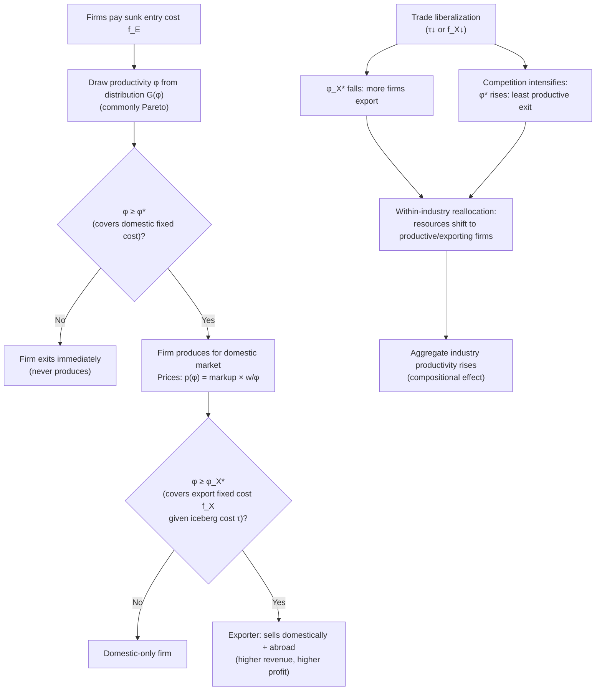

## Productivity differences across firms within an industry

### Overview

The observation that firms within the same narrowly defined industry exhibit large, persistent productivity differences is the empirical starting point of the "new new trade theory" (NNTT), pioneered by Melitz (2003) and the empirical work of Bernard, Jensen, Eaton, Kortum, and others. Classical and new trade theory (Ricardian, Heckscher–Ohlin, Krugman monopolistic competition) treat all firms within an industry/sector as identical, so trade effects operate only at the industry or country level. Firm heterogeneity models instead treat productivity as a firm-specific random draw, generating within-industry reallocation effects from trade that representative-firm models cannot produce.

### Empirical regularities motivating heterogeneity models

Plant- and firm-level datasets (U.S. Census Bureau LRD/LBD, and comparable registries in other countries) consistently document:

- **Large productivity dispersion within 4-digit (or finer) industries**: even narrowly defined industries show total factor productivity (TFP) differences across plants of a factor of two or more between the 90th and 10th percentile.
- **Persistence**: a plant's relative productivity rank is highly correlated over time — productivity differences are not transient noise but reflect durable firm-specific characteristics (management quality, technology, capital vintage, organizational capital, worker-firm matching).
- **Exporter productivity premium**: exporting firms are systematically more productive, larger, pay higher wages, and are more capital- and skill-intensive than non-exporting firms in the same industry, even before they begin exporting.
- **Self-selection, not learning-by-exporting (as the dominant channel)**: the productivity gap between exporters and non-exporters is present *before* firms enter export markets, implying causality runs mainly from productivity → export status rather than the reverse (though some learning-by-exporting effects are also found in parts of the literature).
- **Only a minority of firms export**: even in industries with substantial aggregate exports, most firms sell only domestically — export status is firm-specific, not industry-wide.
- **Firm size and productivity are correlated**, and both are correlated with survival: less productive firms have higher exit hazards, especially under increased import competition or tougher domestic conditions.

### Sources of firm-level productivity differences

Trade theory typically treats productivity ($\varphi$ or $1/a$, the inverse of unit input requirement) as an exogenous random draw, but the underlying economic sources studied in the literature include:

- **Management practices and organizational capital**: differences in managerial quality, incentive systems, and internal organization (documented extensively by Bloom & Van Reenen-style management surveys).
- **Technology adoption and capital vintage**: firms differ in the vintage and type of production technology and machinery employed.
- **Innovation and R&D intensity**: firms investing more in R&D/process innovation shift their productivity draw upward over time (linking to endogenous/dynamic heterogeneity models).
- **Learning and experience (organizational learning-by-doing)**: cumulative production experience improves efficiency.
- **Worker-firm sorting and human capital**: more productive firms may systematically attract and retain higher-skill workers (positive assortative matching).
- **Input quality and sourcing (including imported intermediates)**: access to better-quality or a wider variety of domestic and imported inputs raises measured productivity.
- **Financial constraints**: credit-constrained firms may under-invest in productivity-enhancing capital or technology, appearing less productive.
- **[Inference]** Most trade models abstract from *why* firms differ and instead take the distribution of productivity draws as a primitive (commonly Pareto-distributed), focusing analytical effort on how trade reallocates activity across an *exogenously given* productivity distribution rather than modeling the microfoundations of productivity itself.

### Modeling productivity heterogeneity: the Melitz framework core

**Setup**: A monopolistically competitive industry (Dixit–Stiglitz preferences, CES demand) where a continuum of firms produces horizontally differentiated varieties. Before entering, a firm pays a sunk entry cost $f_E$ to draw a productivity level $\varphi$ from a known distribution $G(\varphi)$ (commonly assumed Pareto for tractability). After observing its draw, the firm decides whether to produce, and (in the open-economy extension) whether to additionally export by paying an export fixed cost $f_X$ and facing iceberg transport costs $\tau > 1$.

**Firm-level pricing** under CES demand with elasticity of substitution $\sigma > 1$:

$$p(\varphi) = \frac{\sigma}{\sigma - 1} \cdot \frac{w}{\varphi}$$

i.e., a constant markup $\sigma/(\sigma-1)$ over marginal cost $w/\varphi$ — higher-$\varphi$ (more productive) firms charge lower prices, sell more, and earn higher profits, for a given wage $w$.

**Revenue and profit as functions of productivity**:

$$r(\varphi) \propto \varphi^{\sigma - 1}, \qquad \pi(\varphi) \propto \varphi^{\sigma - 1} - f$$

so firm revenue and profit are both strictly increasing, convex functions of the productivity draw — small differences in $\varphi$ translate into large differences in firm size.

### Productivity cutoffs: the survival and export margins

Because operating and exporting both carry fixed costs, the model generates two productivity thresholds:

- **Domestic survival cutoff** $\varphi^{*}$: the productivity level at which operating profit exactly covers the fixed cost of production, $\pi(\varphi^{*}) = 0$. Firms drawing $\varphi < \varphi^{*}$ immediately exit (never produce); firms with $\varphi \geq \varphi^{*}$ produce for the domestic market.
- **Export cutoff** $\varphi_X^{*} > \varphi^{*}$: the (higher) productivity level at which export profit covers the additional fixed export cost $f_X$, given iceberg trade costs $\tau$. Only the subset of surviving firms with $\varphi \geq \varphi_X^{*}$ finds it profitable to also export.

This ordered-cutoff structure — $\varphi^{*} < \varphi_X^{*}$ — directly reproduces the empirical exporter productivity premium: exporters are, by construction, drawn only from the upper tail of the productivity distribution among surviving domestic firms.

### Trade liberalization and within-industry reallocation

When trade costs fall (lower $\tau$ or lower $f_X$), the Melitz model generates a distinctive general-equilibrium reallocation mechanism absent from representative-firm models:

1. **Export cutoff falls**: reduced trade costs make exporting profitable for a wider range of firms, so $\varphi_X^{*}$ decreases — more firms (including moderately productive ones that previously stayed domestic) begin exporting.
2. **Increased competition raises the domestic survival cutoff**: greater market competition (from both new exporters and increased import competition) raises the zero-cutoff-profit condition, increasing $\varphi^{*}$ — the least productive firms are driven out of the market entirely.
3. **Within-industry resource reallocation**: labor and capital shift away from low-productivity, exiting/contracting firms toward high-productivity, expanding/exporting firms.
4. **Aggregate industry productivity rises purely from reallocation** — a compositional effect — even if no individual firm's own productivity ($\varphi$) changes. This is fundamentally distinct from Ricardian/HO models, where trade gains come from inter-industry specialization, and from Krugman's monopolistic-competition model, where all firms are identical and gains come purely from variety and scale.

**[Inference]** This reallocation channel is often cited as one of the most empirically robust and policy-relevant contributions of NNTT: aggregate productivity gains from trade liberalization operate substantially through the *exit of unproductive firms and expansion of productive ones*, not (only) through improvements inside any given firm.

### Firm-size distribution and the role of the Pareto assumption

The Melitz model is commonly closed with a Pareto productivity distribution:

$$G(\varphi) = 1 - \left(\frac{\varphi_{min}}{\varphi}\right)^{k}, \quad \varphi \geq \varphi_{min}$$

where $k > 0$ is the shape parameter governing dispersion (lower $k$ = more dispersion/heavier tail).

**Why Pareto**: it delivers closed-form aggregate solutions (average productivity, price index, welfare) and — importantly — is consistent with the well-documented empirical regularity that the firm-size distribution (by sales or employment) is approximately Pareto/power-law in the upper tail (related to Zipf's Law for firm sizes). This consistency between assumed productivity distribution and observed firm-size distribution is a key reason Pareto became the standard workhorse assumption in this literature (e.g., in Chaney 2008's extension using Pareto to derive gravity-equation trade elasticities in terms of $k$ and $\sigma$).

### Distinguishing extensive and intensive margins of trade

Firm heterogeneity models decompose the response of aggregate trade flows to trade cost changes or country characteristics into two margins:

- **Extensive margin**: the *number* of firms that choose to export (or the number of new exporting relationships/varieties) — governed by movements in $\varphi_X^{*}$.
- **Intensive margin**: the *volume* exported per existing exporting firm — governed by how much surviving exporters' quantities/revenues respond to lower trade costs, holding the set of exporters fixed.

**[Unverified — general characterization]** Empirical decompositions (e.g., using product-level or firm-level customs data) generally find both margins matter for explaining cross-country trade volume differences and the effects of trade agreements, with relative importance varying by dataset, level of aggregation, and time period; results should be checked against current studies for specific magnitudes.

### Diagram: productivity cutoffs and firm sorting (svg_diagram)

<svg xmlns="http://www.w3.org/2000/svg" viewBox="0 0 780 420" font-family="Helvetica, Arial, sans-serif">
<text x="390" y="26" text-anchor="middle" font-size="17" font-weight="bold">Productivity Distribution and Firm Sorting (svg_diagram)</text>

<line x1="60" y1="340" x2="740" y2="340" stroke="#000" stroke-width="1.5" />
<text x="745" y="345" font-size="13">φ (productivity)</text>
<text x="40" y="200" font-size="13">Density</text>

<path d="M 100 100 Q 200 200 300 280 T 500 320 T 700 335" fill="none" stroke="#1a5fb4" stroke-width="2.5" />
<text x="120" y="90" font-size="12" fill="#1a5fb4">g(φ) — productivity density</text>

<rect x="60" y="60" width="180" height="280" fill="#f8d7da" opacity="0.5" />
<text x="150" y="360" text-anchor="middle" font-size="12" fill="#a51d2d">Exit</text>
<text x="150" y="376" text-anchor="middle" font-size="11" fill="#a51d2d">φ &lt; φ* : never produce</text>

<rect x="240" y="60" width="220" height="280" fill="#fff3cd" opacity="0.5" />
<text x="350" y="360" text-anchor="middle" font-size="12" fill="#8a6d00">Domestic only</text>
<text x="350" y="376" text-anchor="middle" font-size="11" fill="#8a6d00">φ* ≤ φ &lt; φ_X*</text>

<rect x="460" y="60" width="280" height="280" fill="#d1e7dd" opacity="0.5" />
<text x="600" y="360" text-anchor="middle" font-size="12" fill="#0f5132">Exporters</text>
<text x="600" y="376" text-anchor="middle" font-size="11" fill="#0f5132">φ ≥ φ_X* (most productive)</text>

<line x1="240" y1="60" x2="240" y2="340" stroke="#c01c28" stroke-width="2" stroke-dasharray="5,3" />
<text x="215" y="55" font-size="13" fill="#c01c28">φ*</text>
<line x1="460" y1="60" x2="460" y2="340" stroke="#1a7a3c" stroke-width="2" stroke-dasharray="5,3" />
<text x="440" y="55" font-size="13" fill="#1a7a3c">φ_X*</text>

<line x1="460" y1="30" x2="410" y2="30" stroke="#333" stroke-width="1.5" marker-end="url(#arrow)" />
<text x="330" y="25" font-size="11" fill="#333">Trade liberalization shifts φ_X* left</text>
</svg>

### Diagram: firm heterogeneity model logical flow

### Worked numerical example

Assume $\sigma = 4$ (elasticity of substitution), wage $w = 1$, fixed domestic operating cost $f = 1$, fixed export cost $f_X = 2$, iceberg trade cost $\tau = 1.5$, and two firms with productivity draws $\varphi_A = 2$ and $\varphi_B = 5$.

Revenue is proportional to $\varphi^{\sigma-1} = \varphi^3$:

- Firm A: $\varphi_A^3 = 8$
- Firm B: $\varphi_B^3 = 125$

Firm B is $125/8 \approx 15.6$ times larger in revenue terms despite only a $2.5\times$ productivity advantage — illustrating the **convexity** of the revenue-productivity relationship, which is why small underlying productivity gaps generate large observed firm-size dispersion. If the domestic cutoff $\varphi^{*} = 1.8$ and the export cutoff $\varphi_X^{*} = 3.5$, Firm A ($\varphi_A = 2$) produces domestically only, while Firm B ($\varphi_B = 5$) both produces and exports — consistent with the empirical exporter productivity premium.

### Key Points

- Firms within the same narrow industry show large, persistent productivity dispersion — the core stylized fact motivating NNTT.
- Exporters are systematically more productive than non-exporters in the same industry; this gap largely predates export entry (self-selection).
- The Melitz (2003) model generates two ordered productivity cutoffs — a survival cutoff $\varphi^{*}$ and a (higher) export cutoff $\varphi_X^{*}$ — from fixed costs of production and exporting.
- Trade liberalization reallocates market share and resources from less to more productive firms within the industry, raising aggregate industry productivity through composition, not (only) through individual-firm improvement.
- The Pareto distribution is the standard tractable assumption for the productivity draw, chosen partly because it matches observed empirical firm-size distributions.
- Firm-level revenue and profit are convex in productivity under CES demand, meaning modest productivity differences generate large differences in firm size.

### Related Topics

- Melitz (2003) model: full general-equilibrium closure, free entry condition, and welfare analysis
- Chaney (2008): Pareto distributions and the trade elasticity in gravity models
- Bernard, Eaton, Jensen, and Kortum (2003): plant-level trade model with Bertrand competition
- Melitz–Ottaviano (2008): heterogeneous firms with linear demand and endogenous markups
- Learning-by-exporting vs. self-selection: identification strategies in firm-level trade data
- Multi-product firms and within-firm product reallocation (Bernard, Redding, Schott)
- Firm heterogeneity and gains from trade: welfare decomposition (Arkolakis, Costinot, Rodríguez-Clare)
- Zipf's Law and the firm-size distribution