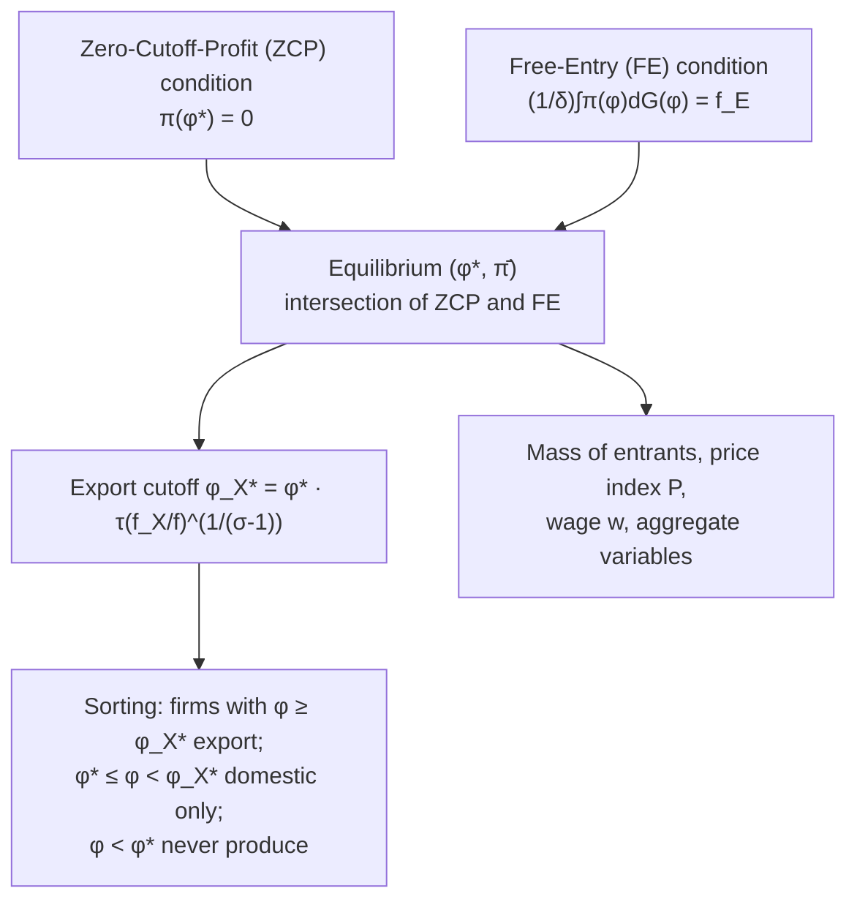

## The Melitz model of selection into export markets

### Overview

The Melitz (2003) model — formally "The Impact of Trade on Intra-Industry Reallocations and Aggregate Industry Productivity" — is the foundational general-equilibrium model of firm heterogeneity in international trade. It embeds heterogeneous, monopolistically competitive firms (à la Dixit–Stiglitz/Krugman) into a dynamic industry-equilibrium framework with entry, exit, and endogenous selection into export status. It is the core analytical engine of "new new trade theory" and provides the first rigorous derivation of the exporter productivity premium, intra-industry reallocation from trade, and aggregate productivity gains from trade liberalization operating through firm selection rather than technology change.

### Model primitives and market structure

- **Preferences**: representative consumer with CES utility over a continuum of differentiated varieties $\omega$, elasticity of substitution $\sigma > 1$:

$$U = \left[\int_{\omega \in \Omega} q(\omega)^{\frac{\sigma-1}{\sigma}} d\omega\right]^{\frac{\sigma}{\sigma-1}}$$

- **Market structure**: monopolistic competition — each firm produces a unique variety, is small relative to the market, ignores strategic interaction, but faces a downward-sloping residual demand curve from CES aggregation.
- **Technology**: each firm has linear labor-only production with firm-specific marginal cost $1/\varphi$ (equivalently, productivity $\varphi$), so labor requirement per unit of output is $l = q/\varphi$.
- **Labor market**: single factor, labor, supplied inelastically at economy-wide wage $w$ (numeraire, $w=1$).

### Timing and firm dynamics

1. **Entry decision**: a mass of prospective entrants pay a sunk entry cost $f_E$ (in labor units) to draw a productivity level $\varphi$ from a common, known cumulative distribution $G(\varphi)$.
2. **Productivity realization**: after paying $f_E$, the firm observes its draw $\varphi$ and — because the draw is now sunk information — decides immediately whether to produce or exit.
3. **Production/exit decision**: producing requires paying a fixed *operating* cost $f$ (in labor units) every period. A firm produces if and only if operating profit is non-negative.
4. **Export decision**: conditional on producing, the firm additionally decides whether to serve the foreign market, which requires paying a fixed *export* cost $f_X$ and incurring iceberg transport costs $\tau > 1$ (shipping $\tau$ units delivers 1 unit).
5. **Exogenous death shock**: in every period, an incumbent firm faces an exogenous probability $\delta$ of a "bad shock" forcing exit (capturing exogenous firm death, e.g. from external destructive shocks), independent of productivity. This generates a *stationary* firm-age/size distribution in equilibrium despite ongoing entry and exit.

### Static profit-maximization: pricing, revenue, and profit

Given CES demand, each active firm sets a constant markup over marginal cost:

$$p(\varphi) = \frac{\sigma}{\sigma - 1} \cdot \frac{w}{\varphi}$$

Firm revenue (domestic) as a function of productivity, aggregate price index $P$, and aggregate expenditure $R$:

$$r(\varphi) = R \cdot P^{\sigma - 1} \cdot p(\varphi)^{1-\sigma} \propto \varphi^{\sigma - 1}$$

Operating profit net of the fixed cost:

$$\pi(\varphi) = \frac{r(\varphi)}{\sigma} - f$$

(the $1/\sigma$ factor arises because with CES demand and constant markup, variable profit is a constant share $1/\sigma$ of revenue).

For export sales, the delivered price rises by the iceberg factor $\tau$, so **export revenue relative to domestic revenue** at the same firm is:

$$r_X(\varphi) = \tau^{1-\sigma} r(\varphi)$$

and export profit is $\pi_X(\varphi) = r_X(\varphi)/\sigma - f_X$.

### The two productivity cutoffs

**Domestic survival (zero-profit) cutoff** $\varphi^{*}$: defined by $\pi(\varphi^{*}) = 0$, i.e., the productivity level at which operating profit exactly covers the fixed operating cost $f$. Firms with $\varphi < \varphi^{*}$ never produce (they exit immediately upon observing their draw, even though they already sunk $f_E$ — a sunk-cost-irrelevance result).

**Export cutoff** $\varphi_X^{*}$: defined by $\pi_X(\varphi_X^{*}) = 0$, i.e., the productivity level at which export profit exactly covers $f_X$. Given standard parameter restrictions (export delivery incurs both the iceberg cost markup on required output *and* the extra fixed cost $f_X$), the model yields:

$$\varphi_X^{*} = \varphi^{*} \cdot \tau \left(\frac{f_X}{f}\right)^{\frac{1}{\sigma - 1}}$$

Under the standard parameter assumption that exporting is sufficiently costly ($\tau^{\sigma - 1} f_X > f$, ensuring $\varphi_X^{*} > \varphi^{*}$), this produces the model's central **ordered-sorting result**:

$$\varphi_X^{*} > \varphi^{*}$$

Only the most productive subset of surviving domestic producers self-selects into exporting — directly generating the empirical exporter productivity premium as an equilibrium outcome, not an assumption.

### Free entry and zero expected profit condition

Prospective entrants pay $f_E$ before knowing their productivity draw. In free-entry equilibrium, expected profit from entry equals the sunk entry cost:

$$\frac{1}{\delta} \int_{\varphi^{*}}^{\infty} \pi(\varphi)\, dG(\varphi) = f_E$$

- The integral is expected per-period profit conditional on successfully entering (i.e., drawing $\varphi \geq \varphi^{*}$), weighted by the probability of a productive-enough draw.
- Division by $\delta$ converts the flow into an expected discounted value of the entire (randomly terminated) stream of future profits, given the constant per-period exit hazard $\delta$.
- This is the standard "free entry" zero-expected-profit condition that pins down the equilibrium mass of entrants and, jointly with the zero-cutoff-profit condition, pins down $\varphi^{*}$.

### Zero-cutoff-profit (ZCP) and free-entry (FE) conditions jointly determine equilibrium

The model is closed by two simultaneous conditions in $(\varphi^{*}, \bar\pi)$ space (where $\bar\pi$ is average profit conditional on survival):

- **ZCP curve**: derived from $\pi(\varphi^{*}) = 0$, relates average profit $\bar\pi$ to the cutoff $\varphi^{*}$ — generally upward-sloping (a higher cutoff, reflecting tougher selection, is associated with higher average profit among survivors).
- **FE curve**: derived from the free-entry condition, relates $\bar\pi$ to $\varphi^{*}$ from the entrant's perspective — downward-sloping (a higher cutoff means a lower probability of successful entry, so average profit per survivor must be higher to compensate for a fixed $f_E$... the algebra yields a downward-sloping locus in $(\varphi^*, \bar\pi)$ space).

The intersection of ZCP and FE uniquely determines the equilibrium cutoff $\varphi^{*}$ and average profit $\bar\pi$, from which the export cutoff $\varphi_X^{*}$, the equilibrium mass of entrants/producers, wages, and the price index all follow.

### Effects of opening to trade (autarky → trade equilibrium)

Starting from autarky and opening the economy to costly trade ($\tau > 1$, $f_X > 0$, finite):

1. **The ZCP curve rotates/shifts**, reflecting that active firms now have an additional profit opportunity (exporting) available conditional on being productive enough — this raises the return to being highly productive.
2. **Tougher competition raises the survival cutoff**: entry of new competing varieties (both domestic firms newly starting to export from the other country, and the general increase in the price index's competitive pressure) raises $\varphi^{*}$ — the least productive domestic firms that survived under autarky are driven to exit under trade.
3. **A subset of firms with $\varphi \geq \varphi_X^{*}$ becomes exporters** and expands, gaining access to the larger combined domestic + foreign market.
4. **Firms in the middle range** ($\varphi^{*}_{trade} \leq \varphi < \varphi_X^{*}$) continue producing only for the domestic market but face a smaller domestic market share (more competitors, tougher selection) and may earn lower profit than they did in autarky, despite surviving.
5. **Least productive firms** ($\varphi < \varphi^{*}_{trade}$, including some that survived in autarky) exit entirely.

**Net effect on industry-average productivity**: the reallocation of market share and resources away from low-$\varphi$ exiting/contracting firms and toward high-$\varphi$ expanding/exporting firms raises the (sales-weighted) industry-average productivity — a purely compositional effect that occurs even though no individual firm's own $\varphi$ changes. This is the model's central novel channel of gains from trade, distinct from both Ricardian comparative advantage and Krugman-style variety/scale gains.

### Diagram: ZCP–FE equilibrium determination

### Diagram: profit schedules and cutoffs (svg_diagram)

<svg viewBox="0 0 760 440" xmlns="http://www.w3.org/2000/svg" font-family="Helvetica, Arial, sans-serif">
<text x="380" y="26" text-anchor="middle" font-size="17" font-weight="bold">Domestic and Export Profit Schedules (svg_diagram)</text>
<line x1="70" y1="380" x2="720" y2="380" stroke="#000" stroke-width="1.5"/>
<line x1="70" y1="380" x2="70" y2="60" stroke="#000" stroke-width="1.5"/>
<text x="725" y="385" font-size="13">φ</text>
<text x="45" y="55" font-size="13">π(φ)</text>
<!-- zero profit line -->
<line x1="70" y1="300" x2="720" y2="300" stroke="#999" stroke-width="1" stroke-dasharray="2,2"/>
<text x="700" y="295" font-size="11" fill="#666">π = 0</text>
<!-- domestic profit curve (convex, crosses zero at phi*) -->
<path d="M 70 340 Q 200 330 260 300 Q 400 220 550 120 Q 620 90 700 70" fill="none" stroke="#1a5fb4" stroke-width="2.5"/>
<text x="560" y="105" font-size="12" fill="#1a5fb4">π(φ) domestic profit</text>
<!-- export profit curve (starts lower, crosses zero further right) -->
<path d="M 70 380 L 300 375 Q 380 360 420 300 Q 500 220 620 130 Q 660 105 700 90" fill="none" stroke="#26a269" stroke-width="2.5" stroke-dasharray="0"/>
<text x="500" y="215" font-size="12" fill="#26a269">π_X(φ) export profit</text>
<!-- cutoff markers -->
<line x1="260" y1="60" x2="260" y2="380" stroke="#c01c28" stroke-width="1.5" stroke-dasharray="5,3"/>
<text x="245" y="55" font-size="13" fill="#c01c28">φ*</text>
<line x1="420" y1="60" x2="420" y2="380" stroke="#8a6d00" stroke-width="1.5" stroke-dasharray="5,3"/>
<text x="405" y="55" font-size="13" fill="#8a6d00">φ_X*</text>

<text x="150" y="410" font-size="11" fill="`#a51d2d`">Exit (φ<φ*)</text>

<text x="320" y="410" font-size="11" fill="`#8a6d00`">Domestic only</text>

<text x="560" y="410" font-size="11" fill="`#0f5132`">Exporters (φ≥φ_X*)</text>

</svg>

### Extensions and follow-on literature

- **Melitz–Ottaviano (2008)**: replaces CES/Dixit-Stiglitz with linear demand from quasi-linear quadratic utility, generating **endogenous, variable markups** that fall with market size/competition — addressing the CES model's counterfactual prediction of constant markups regardless of market toughness.
- **Chaney (2008)**: shows that with a Pareto productivity distribution, the Melitz model's trade elasticity with respect to trade costs depends only on the Pareto shape parameter $k$ (not $\sigma$), reconciling the model with gravity-equation empirics and clarifying how the extensive margin (number of exporters) versus intensive margin (exports per exporter) jointly respond to trade costs.
- **Bernard, Eaton, Jensen, Kortum (2003)**: an alternative, complementary heterogeneous-firms framework using Bertrand competition and a Ricardian-style productivity-draw structure, emphasizing extensive-margin firm-level selection into individual export destinations.
- **Arkolakis, Costinot, Rodríguez-Clare (2012, ACR)**: shows that for a broad class of trade models — including a version of Melitz with a particular free-entry structure — the welfare gains from trade can be summarized by just two statistics (the domestic trade share and the trade elasticity), demonstrating a form of macro-level equivalence between Melitz and simpler Armington/Ricardian/Krugman models under certain restrictions, a result that generated substantial subsequent debate.
- **Multi-country and multi-product extensions**: generalize the two-cutoff logic to selection into multiple destination markets and selection across a firm's own product range (Bernard, Redding, Schott).

### Worked numerical example

Parameters: $\sigma = 5$, $f = 1$, $f_X = 3$, $\tau = 1.7$.

$$\varphi_X^{*} = \varphi^{*} \cdot \tau \left(\frac{f_X}{f}\right)^{\frac{1}{\sigma - 1}} = \varphi^{*} \cdot 1.7 \cdot (3)^{1/4} = \varphi^{*} \cdot 1.7 \cdot 1.316 \approx 2.237 \, \varphi^{*}$$

If the equilibrium domestic cutoff is $\varphi^{*} = 1.5$, then the export cutoff is:

$$\varphi_X^{*} \approx 2.237 \times 1.5 \approx 3.36$$

A firm drawing $\varphi = 2.5$ would produce for the domestic market only ($1.5 \leq 2.5 < 3.36$), while a firm drawing $\varphi = 4.0$ would both produce and export ($4.0 \geq 3.36$) — illustrating how the model translates a single continuous productivity distribution into three discrete outcome groups (exit, domestic-only, exporter).

### Key Points

- The Melitz model embeds ex-ante identical firms that draw heterogeneous productivity $\varphi$ into a monopolistically competitive, CES-demand, free-entry general-equilibrium framework.
- Two fixed-cost-driven cutoffs emerge endogenously: a domestic survival cutoff $\varphi^{*}$ and a strictly higher export cutoff $\varphi_X^{*}$, formalizing self-selection into exporting.
- Equilibrium is pinned down by the intersection of the Zero-Cutoff-Profit (ZCP) and Free-Entry (FE) conditions.
- Opening to trade raises the domestic survival cutoff (tougher competition forces low-productivity exit) while allowing high-productivity firms to expand into export markets — generating within-industry reallocation.
- Aggregate industry productivity gains from trade liberalization arise from this compositional reallocation, not from any individual firm becoming more efficient.
- The model is the analytical foundation for a large subsequent literature (Melitz–Ottaviano variable markups, Chaney gravity elasticities, ACR welfare sufficient statistics, multi-product/multi-country extensions).

### Related Topics

- Melitz–Ottaviano (2008): variable markups under linear demand
- Chaney (2008): Pareto distributions, trade elasticity, and gravity equations
- Arkolakis–Costinot–Rodríguez-Clare (2012): sufficient statistics for welfare gains from trade
- Bernard–Eaton–Jensen–Kortum (2003): Bertrand-competition heterogeneous-firms trade model
- Exporter productivity premium: empirical measurement and self-selection vs. learning-by-exporting
- Firm-level responses to trade agreements and preferential tariff liberalization
- Multi-product firms and within-firm product-mix reallocation (Bernard, Redding, Schott)
- Gains from trade decomposition: extensive vs. intensive margins of exporting