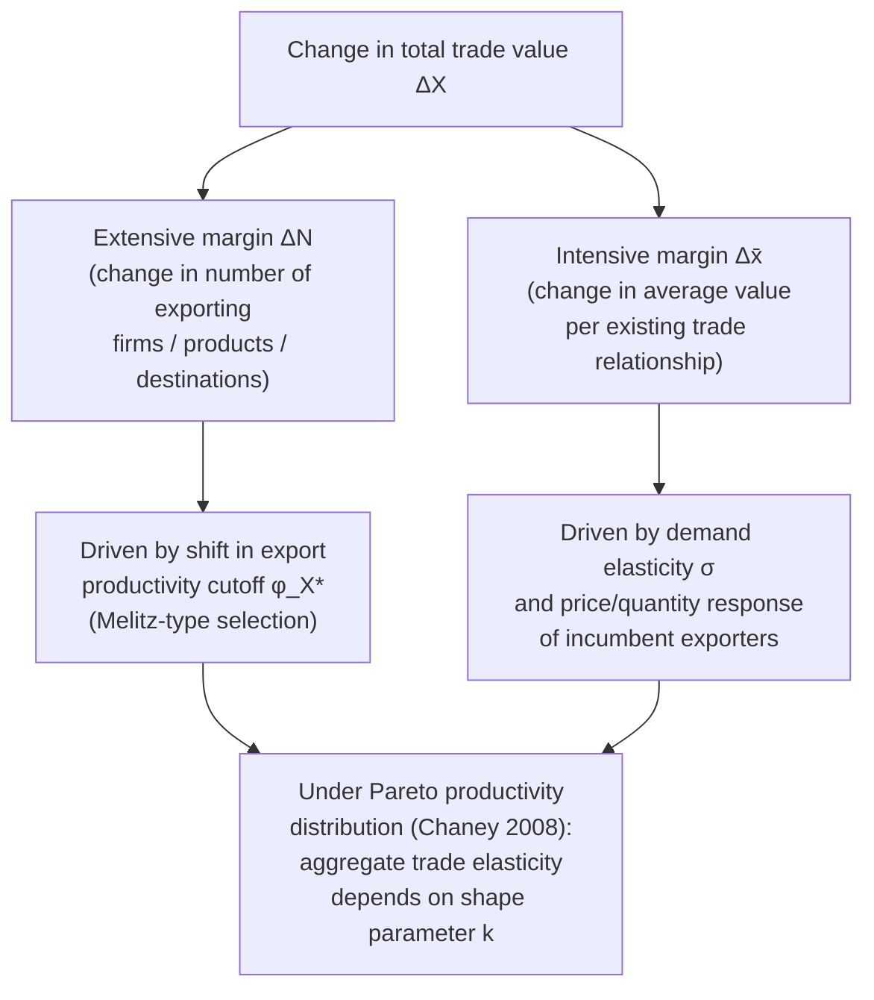

## Extensive versus intensive margins of trade

### Overview

The extensive/intensive margin decomposition partitions any change in trade flows — across firms, products, or destinations — into a component driven by the *number* of trading relationships (extensive margin) and a component driven by the *average volume* per existing relationship (intensive margin). This distinction is central to new new trade theory (NNTT) because firm-heterogeneity models (Melitz 2003 and successors) predict that trade costs, market size, and trade liberalization operate substantially through the extensive margin — changing *which* firms/products/destinations are traded — a channel invisible to representative-firm models where every active firm necessarily exports (or none do).

### Formal definitions

Total trade value $X$ between an origin and destination can always be decomposed multiplicatively as:

$$X = N \times \bar{x}$$

where $N$ is the number of trading "units" (e.g., exporting firms, traded products/varieties, or firm-product-destination triads) and $\bar{x} = X/N$ is average trade value per unit.

- **Extensive margin**: changes in $N$ — the number of firms that export, the number of distinct products shipped, or the number of destination markets served.
- **Intensive margin**: changes in $\bar{x}$ — the average value shipped per firm, per product, or per firm-destination pair, holding the set of active traders fixed.

The decomposition can be applied at multiple levels of aggregation, and the appropriate definition of "unit" depends on the research question:

- **Firm extensive margin**: number of exporting firms in a country/industry.
- **Product extensive margin**: number of distinct HS/SITC product codes exported (per firm or in aggregate).
- **Destination-country extensive margin**: number of destination countries a firm (or country) exports to.
- **Firm-product-destination extensive margin**: the finest partition, counting each unique combination as a separate "trade relationship" (used heavily in customs-microdata studies).

### Extensive margin in the Melitz framework

In the Melitz (2003) model, the extensive margin is governed entirely by the **export productivity cutoff** $\varphi_X^{*}$:

$$\varphi_X^{*} = \varphi^{*} \cdot \tau \left(\frac{f_X}{f}\right)^{\frac{1}{\sigma-1}}$$

A fall in trade costs (lower iceberg cost $\tau$ or lower fixed export cost $f_X$) **lowers** $\varphi_X^{*}$, pulling previously non-exporting (but domestically viable) firms above the export threshold. This is a pure extensive-margin response: the **number** of exporting firms rises. Simultaneously, each *already-exporting* firm's export revenue also changes (an intensive-margin response), because lower $\tau$ directly raises the delivered-price competitiveness and hence sales of every exporter, not just marginal entrants.

The Melitz model therefore predicts *both* margins respond to trade liberalization, but it is the extensive margin — the endogenous entry and exit of firms into exporting — that is the model's genuinely novel contribution relative to earlier representative-firm trade theory, where the extensive margin is fixed by assumption (every firm in the tradable sector always exports).

### Chaney (2008): decomposing the trade elasticity by margin

Chaney's key theoretical result, obtained by imposing a Pareto productivity distribution $G(\varphi) = 1 - (\varphi_{min}/\varphi)^k$ on the Melitz framework, is that the elasticity of aggregate bilateral trade flows with respect to variable trade costs $\tau$ depends **only on the Pareto shape parameter $k$**, not on the demand elasticity of substitution $\sigma$ — a striking result because in representative-firm (Armington/Krugman) trade models, the trade elasticity is governed by $\sigma$.

**Intuition for the mechanism**:

- A change in $\tau$ affects intensive-margin sales per exporter with an elasticity governed by $\sigma$ (the demand-side substitution elasticity), exactly as in representative-firm models.
- But it *simultaneously* changes the export cutoff $\varphi_X^{*}$, moving firms in and out of exporter status — an extensive-margin effect governed by the *shape* of the productivity distribution, $k$.
- Under the Pareto assumption, these two effects combine in closed form such that the $\sigma$-terms exactly cancel, leaving the aggregate trade elasticity as a function of $k$ alone: $-k$ in the simplest specification (elasticity of trade value with respect to variable trade cost equals $-k$).
- **[Inference]** This result reconciles firm-heterogeneity theory with the empirical gravity-equation literature, which had long estimated trade elasticities without reference to firm-level extensive-margin adjustment, by showing the two are consistent once the productivity distribution's tail shape is accounted for.

### Empirical measurement approaches

**Country/aggregate-level studies** (e.g., early work by Hummels and Klenow) decompose bilateral or cross-country trade differences using a formula comparing the actual trade of a "big" country/exporter to a hypothetical "small" reference country that trades the same set of goods at proportionally scaled-down quantities:

$$\text{Extensive margin} = \frac{\sum_{k \in I} p_k^w x_k}{\sum_{k \in I^w} p_k^w x_k^w}, \qquad \text{Intensive margin} = \frac{\sum_{k \in I} p_k x_k}{\sum_{k \in I} p_k^w x_k}$$

(using world reference prices $p^w$ and quantities $x^w$ to net out price/quality effects), where $I$ is the set of goods actually exported by the country in question and $I^w$ is the full set of goods traded in the world.

**Firm/product/destination-level studies** using customs microdata directly count:

- the number of exporting firms, products, or destinations in a base period versus a comparison period (extensive margin), and
- average value per firm/product/destination in each period (intensive margin),

then attribute the total change in trade value to each margin via a multiplicative or log-additive decomposition.

**[Unverified — general characterization of a broad and heterogeneous literature]** Empirical findings on the relative importance of each margin vary substantially by context: studies of the cross-sectional gravity relationship (why do larger/richer/closer country pairs trade more) have found the extensive margin (number of goods/products traded) explains a sizable share of variation, while studies of trade *growth over time* for a given country pair, or of the effects of a specific trade agreement, sometimes find the intensive margin dominates, or find results sensitive to the level of product/firm aggregation used. Given the sensitivity of these results to data vintage, aggregation level, and methodology, specific quantitative findings should be verified against current, context-specific studies rather than treated as a stable stylized fact.

### Why the margin distinction matters for policy

- **Different trade-cost elasticities imply different policy effects**: if a reduction in fixed trade costs (e.g., streamlined customs procedures, trade-facilitation agreements) works mainly through the extensive margin, then policies targeting fixed costs of market entry (rather than variable/ad-valorem costs like tariffs) may be disproportionately effective at expanding trade by drawing in new, smaller exporters.
- **Welfare implications differ by margin**: gains from a wider *variety* of imported goods (extensive margin, connected to Krugman-style love-of-variety gains and to Melitz-style access to new source-country varieties) are conceptually distinct from gains via lower prices/higher quantities of already-traded goods (intensive margin, closer to standard terms-of-trade or Armington-style gains).
- **Gravity-equation estimation**: standard log-linear gravity regressions estimated on aggregate trade flows implicitly average over both margins; failing to account for the extensive margin (e.g., zero trade flows between many country pairs, which is itself an extensive-margin outcome) can bias estimated trade-cost elasticities, motivating estimators like Poisson Pseudo-Maximum-Likelihood (PPML, Santos Silva and Tenreyro) that handle zeros and heteroskedasticity more robustly than log-linear OLS.
- **Firm heterogeneity and trade-agreement design**: because only the most productive firms respond at the extensive margin (crossing $\varphi_X^{*}$), policies that lower fixed export costs disproportionately benefit medium-productivity firms near the threshold, while intensive-margin-focused policies (e.g., tariff cuts) benefit already-exporting (generally larger, more productive) firms proportionally more.

### Diagram: extensive vs. intensive margin decomposition

### Diagram: illustrating the two margins (svg_diagram)

<svg xmlns="http://www.w3.org/2000/svg" viewBox="0 0 760 380" font-family="Helvetica, Arial, sans-serif">
<text x="380" y="26" text-anchor="middle" font-size="17" font-weight="bold">Extensive vs. Intensive Margin (svg_diagram)</text>

<text x="180" y="60" text-anchor="middle" font-size="14" font-weight="bold">Period 1: N = 3 exporters</text>

<rect x="60" y="80" width="60" height="80" fill="`#1a5fb4`" opacity="0.7" />

<rect x="140" y="100" width="60" height="60" fill="`#1a5fb4`" opacity="0.7" />

<rect x="220" y="110" width="60" height="50" fill="`#1a5fb4`" opacity="0.7" />

<text x="180" y="185" text-anchor="middle" font-size="12">Total X₁ = sum of 3 bars</text>

<line x1="330" y1="120" x2="420" y2="120" stroke="#333" stroke-width="2" marker-end="url(#arrow2)" />
<text x="330" y="105" font-size="11">Trade liberalization</text>

<text x="590" y="60" text-anchor="middle" font-size="14" font-weight="bold">Period 2: N = 4 exporters</text>

<rect x="450" y="70" width="55" height="90" fill="`#26a269`" opacity="0.8" />

<rect x="515" y="85" width="55" height="75" fill="`#26a269`" opacity="0.8" />

<rect x="580" y="95" width="55" height="65" fill="`#26a269`" opacity="0.8" />

<rect x="645" y="130" width="55" height="30" fill="`#c01c28`" opacity="0.8" />

<text x="672" y="175" text-anchor="middle" font-size="11" fill="`#c01c28`">new</text>

<text x="590" y="200" text-anchor="middle" font-size="12">Intensive: bars 1-3 grow taller</text>

<text x="590" y="216" text-anchor="middle" font-size="12">Extensive: bar 4 is a new exporter</text>

<line x1="60" y1="240" x2="700" y2="240" stroke="#ccc" stroke-width="1" />
<text x="380" y="270" text-anchor="middle" font-size="12" fill="#333">X = N × x̄ → ΔX decomposes into ΔN (extensive) and Δx̄ (intensive)</text>
</svg>

### Worked numerical example

Suppose a country's exports of a product category rise from $\$120$ million to $\$200$ million after a trade agreement, and customs microdata show:

- Period 1: 10 exporting firms, average export value $\$12$ million per firm ($10 \times 12 = 120$).
- Period 2: 14 exporting firms, average export value $\$14.29$ million per firm ($14 \times 14.29 \approx 200$).

**Extensive margin contribution** (using a simple counterfactual holding average value fixed at Period 1 level): $\Delta N \times \bar{x}_1 = (14-10) \times 12 = \$48$ million.

**Intensive margin contribution**: $N_2 \times \Delta \bar{x} = 14 \times (14.29 - 12) = 14 \times 2.29 \approx \$32$ million.

Sum: $48 + 32 = \$80$ million $= \Delta X$ ($200m − $120m), consistent by construction. In this stylized example, the extensive margin (new exporting firms) accounts for the majority ($48/80 = 60\%$) of the trade increase, while the intensive margin (existing exporters shipping more) accounts for the remaining 40% — illustrating how the same aggregate trade-value change can be attributed to fundamentally different underlying firm-level behavior.

### Key Points

- Total trade value decomposes multiplicatively as $X = N \times \bar{x}$: extensive margin = number of trading units; intensive margin = average value per unit.
- The unit of analysis (firm, product, destination, or firm-product-destination triad) must be specified, as margin decompositions differ by level of aggregation.
- In the Melitz model, the extensive margin is governed by the export productivity cutoff $\varphi_X^{*}$; it is the model's genuinely novel channel relative to representative-firm trade theory.
- Chaney (2008) shows that under a Pareto productivity distribution, the aggregate trade elasticity depends on the distribution's shape parameter $k$ rather than the demand elasticity $\sigma$, reconciling firm-level selection with gravity-equation trade elasticities.
- Empirical importance of each margin varies by context (cross-sectional vs. time-series, level of aggregation) and should not be treated as a fixed stylized fact without checking current, context-specific evidence.
- The margin distinction has direct policy relevance: fixed-cost-reducing policies (trade facilitation) primarily affect the extensive margin; variable-cost-reducing policies (tariff cuts) primarily affect the intensive margin.

### Related Topics

- Melitz (2003) model of selection into export markets
- Chaney (2008): Pareto distributions and the gravity-equation trade elasticity
- Hummels and Klenow (2005): extensive and intensive margins of countries' exports
- Gravity equation estimation and the PPML estimator (Santos Silva and Tenreyro)
- Zero-trade-flow problem in bilateral trade data
- Trade facilitation and fixed vs. variable trade costs
- Multi-product firms and the product-level extensive margin (Bernard, Redding, Schott)
- Love-of-variety gains from trade under CES preferences