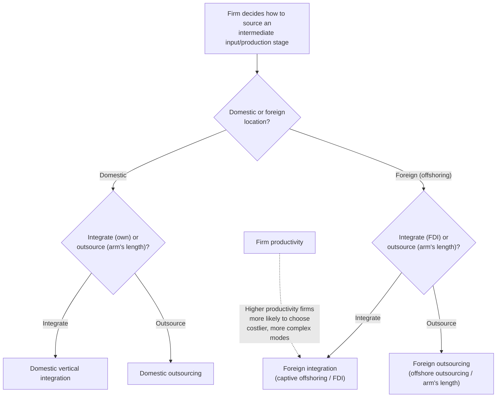

## Offshoring and the fragmentation of production

### Overview

Offshoring and production fragmentation refer to the vertical disintegration of a good's production process across national borders, where different stages, tasks, or components of a single value chain are performed in different countries and reassembled into a final product. This phenomenon — also studied under the labels "vertical specialization," "global value chains" (GVCs), "trade in tasks," and "slicing up the value chain" — represents a distinct margin of globalization from traditional inter-industry or intra-industry trade in finished goods, and has become a major research focus within firm heterogeneity and new new trade theory because the decision to fragment production, and where to locate each stage, is fundamentally a firm-level (often multinational-firm-level) choice shaped by relative costs, contracting frictions, and firm capability.

### Distinguishing offshoring, outsourcing, and fragmentation

Precise terminology matters because these concepts are frequently conflated:

- **Offshoring**: relocating a production stage or task to a foreign country, regardless of whether it remains within the firm (intra-firm/FDI) or is contracted to an unaffiliated foreign supplier.
- **Outsourcing**: contracting a production stage to an external (third-party) supplier, regardless of whether that supplier is domestic or foreign.
- **Offshore outsourcing**: the combination — contracting a stage to an unaffiliated foreign supplier (arm's-length international sourcing).
- **Captive offshoring (intra-firm offshoring)**: relocating a stage to a foreign affiliate of the same multinational firm (i.e., via foreign direct investment, FDI) rather than to an independent supplier.
- **Production fragmentation / vertical specialization**: the broader phenomenon of splitting a good's production into geographically separated stages, encompassing both offshoring and outsourcing as specific organizational choices within it.
- **Global value chain (GVC)**: the full international network of stages — from raw materials through intermediate processing to final assembly and distribution — through which a good passes before reaching the final consumer, which may span many countries and many firms.

### Why production fragments: theoretical drivers

**Factor-cost differences across stages (Heckscher–Ohlin-style logic applied to tasks)**: different production stages have different factor intensities (e.g., labor-intensive assembly versus capital/skill-intensive design and R&D). Once stages become separable, each stage can be located in the country with comparative advantage in that stage's specific factor intensity, rather than the entire good being produced in a single location determined by the good's *average* factor intensity. This is the core insight of "trade in tasks" models (notably Grossman and Rossi-Hansberg 2008), which reconceive comparative advantage as operating at the task level rather than the industry/good level.

**Falling coordination and communication costs**: fragmentation requires coordinating dispersed production stages — falling costs of communication, information transmission, and logistics (shipping, containerization) have made previously infeasible fragmentation economically viable. This is frequently linked to the "second unbundling" narrative (Baldwin), distinguishing the fragmentation-driven wave of globalization from the earlier "first unbundling" (separation of production location from consumption location via falling trade costs in finished goods).

**Task tradability and the "trade-in-tasks" framework**: not all tasks within a production process are equally offshorable — routine, codifiable, and easily monitored tasks (assembly-line manufacturing, data entry, call-center services) are more readily offshored than tasks requiring intensive face-to-face interaction, tacit local knowledge, or complex, hard-to-contract coordination (management, complex customization, just-in-time coordination with unpredictable local demand).

**Firm-level heterogeneity in the offshoring/outsourcing choice**: extending Melitz-style heterogeneity, more productive firms are more likely to engage in more complex forms of international sourcing (offshoring and FDI) because the fixed costs of establishing and managing a foreign supply relationship or foreign affiliate are more easily covered by higher-productivity, larger firms — mirroring the exporter productivity premium but for the *sourcing* margin rather than the *selling* margin.

### Property-rights and incomplete-contracts theory: the offshoring vs. outsourcing (make-or-buy) decision

A major branch of the literature (building on Grossman–Hart–Moore property-rights theory, applied to international trade by Antràs and others) explains **why** a firm chooses intra-firm offshoring (FDI, "make") versus arm's-length outsourcing to an independent foreign supplier ("buy") for a given offshored stage:

- **Incomplete contracts**: because complex, relationship-specific investments cannot be perfectly specified in advance in a legally enforceable contract, the *allocation of ownership/control rights* (rather than contract terms) determines each party's bargaining power and incentive to invest, following Grossman-Hart-Moore logic.
- **Relationship-specificity and headquarter-intensity**: when the upstream stage requires large relationship-specific investments by the input supplier, and headquarters (final-good producer) inputs are relatively more important to the joint surplus, the firm is more likely to integrate (own the foreign affiliate — FDI/vertical integration) to protect its incentive to invest. When supplier-specific investments dominate, arm's-length outsourcing with the supplier retaining residual control rights better preserves the supplier's investment incentives.
- **Antràs (2003) "Property Rights and the International Organization of Production"** formalized how the capital intensity of final-good production interacts with this integration decision to explain patterns of intra-firm versus arm's-length trade across industries.
- **Antràs and Helpman (2004) "Global Sourcing"** integrates this property-rights logic with Melitz-style firm heterogeneity: firms sort into four discrete organizational modes — domestic integration, domestic outsourcing, foreign integration (FDI-based offshoring), and foreign outsourcing (offshore outsourcing) — based on productivity, with the most productive firms typically choosing the most complex and costly mode (foreign integration), analogous to the ordered-cutoff sorting in the export-decision literature.

### Measuring fragmentation: value-added trade and GVC participation

Because a single final good may cross borders multiple times as intermediate inputs, gross bilateral trade statistics substantially **double-count** value already embedded in prior cross-border shipments, overstating the true bilateral economic relationship. This motivated development of value-added trade accounting:

- **Vertical specialization index (Hummels, Ishii, Yi 2001)**: measures the *imported* content embodied in a country's exports — the share of a country's exports that consists of previously imported intermediate inputs, capturing how deeply a country is embedded "downstream" in global production networks.
- **Trade in value-added (TiVA)**: OECD-WTO joint databases decompose gross trade flows into domestic and foreign value-added content, allowing measurement of each country's *genuine* contribution to a good's final value rather than its gross shipment value.
- **GVC participation indices**: distinguish "backward" participation (foreign value-added embodied in a country's own exports — indicating reliance on imported inputs) from "forward" participation (a country's domestic value-added that is embodied in *other* countries' exports — indicating the country supplies inputs used further downstream elsewhere).
- **"Smile curve" of value capture**: a widely cited stylized characterization in which value-added tends to be concentrated in the upstream (R&D, design) and downstream (marketing, branding, after-sales service) stages of a value chain, with the middle (routine physical assembly/manufacturing) capturing comparatively less value-added per unit of activity — though the empirical robustness and precise shape of this pattern varies by industry and is debated.

### Effects on labor markets and wage/skill premia

- **Task-based reallocation within countries**: the trade-in-tasks framework (Grossman–Rossi-Hansberg) predicts that offshoring of low-skill-intensive tasks from a high-wage country can, counterintuitively, *raise* the relative wage of low-skill workers who remain employed domestically in that industry, via a **productivity effect**: offshoring the least-productive-to-perform-domestically tasks raises the effective productivity of the remaining domestic workforce, potentially outweighing the standard relative-labor-supply/substitution effect that would otherwise depress low-skill wages.
- **Task-content approach to labor market polarization**: broader research (Autor, Levy, Murnane and successors) links offshorability and routineness of tasks to labor-market outcomes, finding that occupations involving routine, codifiable tasks (both offshorable and automatable) have experienced greater wage and employment pressure than occupations requiring non-routine analytical or manual/interpersonal tasks.
- **Reshoring and nearshoring**: partial reversal or reconfiguration of fragmented production, driven by rising wages in traditional offshoring destinations, supply-chain resilience concerns (amplified post-COVID and by geopolitical tensions), automation reducing the labor-cost advantage of offshoring, and policy incentives — an active and evolving area of the literature and policy discussion. **[Unverified — general characterization of an evolving, actively debated area]** the magnitude and durability of reshoring trends versus continued or reconfigured offshoring (e.g., "friend-shoring" toward geopolitically aligned countries) should be checked against current data given how rapidly this landscape has been reported to shift.

### Diagram: organizational modes of global sourcing (Antràs–Helpman)

### Diagram: fragmented value chain and value-added flows (svg_diagram)

<svg viewBox="0 0 780 380" xmlns="http://www.w3.org/2000/svg" font-family="Helvetica, Arial, sans-serif">
<text x="390" y="26" text-anchor="middle" font-size="17" font-weight="bold">Fragmented Production Across Borders (svg_diagram)</text>
<!-- Country boxes -->
<rect x="30" y="70" width="160" height="140" fill="#e7f0fd" stroke="#1a5fb4" stroke-width="1.5"/>
<text x="110" y="60" text-anchor="middle" font-size="13" font-weight="bold">Country A</text>
<text x="110" y="100" text-anchor="middle" font-size="12">R&amp;D / Design</text>
<text x="110" y="130" text-anchor="middle" font-size="11" fill="#555">(high skill-intensity)</text>
<rect x="230" y="70" width="160" height="140" fill="#fdf3e7" stroke="#c88a1a" stroke-width="1.5"/>
<text x="310" y="60" text-anchor="middle" font-size="13" font-weight="bold">Country B</text>
<text x="310" y="100" text-anchor="middle" font-size="12">Component</text>
<text x="310" y="118" text-anchor="middle" font-size="12">Manufacturing</text>
<text x="310" y="140" text-anchor="middle" font-size="11" fill="#555">(capital-intensive)</text>
<rect x="430" y="70" width="160" height="140" fill="#e8f5e9" stroke="#26a269" stroke-width="1.5"/>
<text x="510" y="60" text-anchor="middle" font-size="13" font-weight="bold">Country C</text>
<text x="510" y="100" text-anchor="middle" font-size="12">Final Assembly</text>
<text x="510" y="130" text-anchor="middle" font-size="11" fill="#555">(labor-intensive)</text>
<rect x="630" y="70" width="130" height="140" fill="#fde7ee" stroke="#c01c5f" stroke-width="1.5"/>
<text x="695" y="60" text-anchor="middle" font-size="13" font-weight="bold">Country A/D</text>
<text x="695" y="100" text-anchor="middle" font-size="12">Marketing /</text>
<text x="695" y="118" text-anchor="middle" font-size="12">Branding</text>
<text x="695" y="140" text-anchor="middle" font-size="11" fill="#555">(high value-added)</text>
<!-- arrows -->
<line x1="190" y1="140" x2="228" y2="140" stroke="#333" stroke-width="2" marker-end="url(#arrow3)"/>
<line x1="390" y1="140" x2="428" y2="140" stroke="#333" stroke-width="2" marker-end="url(#arrow3)"/>
<line x1="590" y1="140" x2="628" y2="140" stroke="#333" stroke-width="2" marker-end="url(#arrow3)"/>
<defs>
<marker id="arrow3" markerWidth="8" markerHeight="8" refX="4" refY="4" orient="auto">
<path d="M0,0 L8,4 L0,8 Z" fill="#333"/>
</marker>
</defs>
<!-- smile curve schematic underneath -->

<text x="390" y="250" text-anchor="middle" font-size="13" font-weight="bold">Stylized "Smile Curve" of Value Capture</text>

<path d="M 60 340 Q 250 290 390 335 T 720 285" fill="none" stroke="`#8a1ac0`" stroke-width="2.5"/>

<text x="110" y="365" font-size="11">Upstream (R&D/design):</text>

<text x="110" y="378" font-size="11">high value-added</text>

<text x="380" y="365" text-anchor="middle" font-size="11">Midstream (assembly): lower value-added</text>

<text x="640" y="365" text-anchor="middle" font-size="11">Downstream (brand/service):</text>

<text x="640" y="378" text-anchor="middle" font-size="11">high value-added</text>

</svg>

### Worked illustration: vertical specialization index

Suppose Country X exports a finished electronics product worth $500 million total. Of the components used, $180 million worth of intermediate inputs (semiconductors, displays) were previously imported from abroad, while $320 million reflects Country X's own domestic value-added (assembly labor, local components, overhead, profit margin).

$$\text{Vertical specialization share} = \frac{\text{Imported input content of exports}}{\text{Gross export value}} = \frac{180}{500} = 36\%$$

This means only 64% of the gross export value reported in trade statistics reflects Country X's own domestic value-added — the remaining 36% is foreign value-added simply passing through Country X on its way to final consumption elsewhere, illustrating why gross trade statistics can substantially overstate a country's genuine contribution to (and gain from) a given export flow, and why value-added trade measures are increasingly used alongside gross trade data in policy analysis.

### Key Points

- Production fragmentation separates a good's production into geographically dispersed stages/tasks, motivated by cross-country factor-cost differences at the task level, not just at the finished-good level.
- Offshoring (foreign location) is conceptually distinct from outsourcing (external ownership); the four combinations (domestic/foreign × integrate/outsource) define a firm's organizational sourcing choice.
- Property-rights/incomplete-contracts theory (Antràs, Antràs–Helpman) explains the make-or-buy and onshore/offshore decision via relationship-specific investment and bargaining-power considerations, with more productive firms selecting into more complex, integrated foreign sourcing modes.
- Gross bilateral trade statistics overstate genuine value-added trade due to multiple border crossings of intermediate inputs; value-added trade accounting (vertical specialization index, TiVA, GVC participation indices) corrects for this.
- The trade-in-tasks framework shows offshoring can, via a productivity effect on remaining domestic workers, have ambiguous or even positive effects on domestic wages for the factor whose tasks are offshored — a departure from simple factor-substitution intuition.
- Reshoring/nearshoring/friend-shoring trends are an active, rapidly evolving area; current data should be checked rather than assuming a stable direction of change.

### Related Topics

- Grossman and Rossi-Hansberg (2008): "Trading Tasks: A Simple Theory of Offshoring"
- Antràs (2003) and Antràs–Helpman (2004): property-rights theory of the multinational firm and global sourcing
- Vertical specialization index (Hummels, Ishii, Yi 2001) and OECD-WTO Trade in Value-Added (TiVA) database
- Global value chain (GVC) governance typologies (Gereffi, Humphrey, Sturgeon)
- Task-based approach to labor-market polarization (Autor, Levy, Murnane; Autor and Dorn)
- Multinational enterprises and foreign direct investment (horizontal vs. vertical FDI)
- Reshoring, nearshoring, and friend-shoring in post-pandemic and geopolitically fragmented trade policy
- Gravity models applied to intermediate-goods and value-added trade flows