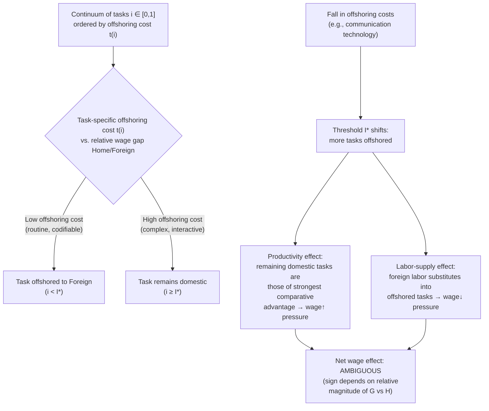

## Task based models of trade and offshoring

### Overview

Task-based models reconceive the fundamental unit of international specialization: rather than countries or firms specializing in *goods* or *industries*, they specialize in *tasks* — discrete activities within a production process that can, in principle, be performed in different locations and reassembled. The canonical formalization is Grossman and Rossi-Hansberg (2008), "Trading Tasks: A Simple Theory of Offshoring," which embeds task-level offshoring into a general-equilibrium two-factor, two-country framework and derives comparative-statics results that differ sharply from standard factor-proportions trade theory. This framework provides the theoretical foundation for understanding how offshoring affects wages, employment, and the pattern of production fragmentation discussed in production-fragmentation topics.

### Motivation: why tasks, not goods

Standard trade theory (Ricardian, Heckscher–Ohlin) treats the *good* as the indivisible unit of production and trade — a country either produces an entire good domestically or imports the entire good. This is empirically inadequate for describing modern globalization, where:

- A single final good (e.g., a smartphone) embodies dozens or hundreds of discrete tasks (chip design, chip fabrication, screen manufacturing, assembly, software development, quality testing, packaging, marketing) performed across many countries.
- Firms and countries make *task-level* location decisions, not just *industry-level* specialization decisions.
- Falling communication and coordination costs have made previously "non-tradable" tasks (because they had to be performed at the same location as other tasks in the production process) newly offshorable, even though the final good's classification (e.g., "electronics") hasn't changed.

Task-based models are therefore designed to capture a margin of adjustment — task-level offshoring — that is invisible in models where the good is the smallest unit of analysis.

### The Grossman–Rossi-Hansberg (2008) core framework

**Setup**: Two countries (Home, Foreign — "North" and "South"), two factors (high-skill and low-skill labor, or in the simplest version, a single homogeneous labor type performing a continuum of tasks). Production of a good requires performing a continuum of tasks indexed $i \in [0,1]$ (or, in the two-factor version, separate continua of low-skill and high-skill tasks).

- Each task can be performed either domestically or offshored to the foreign country, at a **task-specific offshoring (trade) cost** $t(i)$, reflecting how easily that particular task can be relocated and coordinated across borders (routine, codifiable tasks have low $t(i)$; complex, interactive tasks have high or prohibitive $t(i)$).
- Tasks are typically ordered along the continuum by increasing offshoring cost, so there is a threshold task $I^{*}$ such that all tasks $i < I^{*}$ (low offshoring cost) are offshored, and tasks $i \geq I^{*}$ (high offshoring cost) remain performed domestically — directly analogous to the productivity-cutoff sorting logic in Melitz-type models, but applied to *tasks* rather than *firms*.
- Firms choose, for each task, the cost-minimizing location given relative factor prices (wages) at home and abroad and the task-specific offshoring cost.

### The three effects of a fall in offshoring costs

A central contribution of the model is decomposing the wage effect of falling offshoring costs (e.g., due to improved communication technology) on domestic low-skill (offshoring-affected) workers into three distinct forces:

1. **Productivity effect**: offshoring the least-productive-to-perform-domestically tasks (the tasks near the margin, which foreign labor can do relatively more cheaply) to the foreign country raises the *average productivity* of domestic labor still performing the remaining tasks, because the tasks left behind are, by construction, ones in which domestic labor has the strongest comparative advantage. This effect operates like a **factor-augmenting technological improvement** for the domestic factor whose tasks are being offshored, and tends to **raise** that factor's wage.
2. **Relative-price / terms-of-trade effect**: offshoring changes the relative price of the final good (or the industry's competitiveness), with second-order effects on factor demand depending on the industry's factor intensity and the economy's overall structure — this parallels a Stolper–Samuelson-type channel.
3. **Labor-supply effect**: offshoring the previously domestic tasks to foreign labor effectively increases the *global* supply of labor available to perform those tasks (foreign labor substitutes into the task), which — holding other things constant — would be expected to reduce demand for the domestic factor whose tasks are offshored, analogous to a standard factor-substitution/labor-supply-shock effect that would ordinarily **depress** the domestic factor's wage.

**Central (and initially counterintuitive) result**: the *productivity effect* can dominate the *labor-supply effect*, so that a fall in the cost of offshoring low-skill tasks can **raise**, not lower, the wage of low-skill domestic workers who keep their jobs — a result that stands in sharp contrast to the standard prediction (from a naive factor-substitution or simple Stolper–Samuelson intuition) that offshoring of low-skill tasks should unambiguously harm low-skill domestic wages.

**[Inference]** This result is frequently cited as the paper's central policy-relevant insight: it shows that the sign of the wage effect of offshoring is theoretically ambiguous and depends on the relative strength of the productivity effect versus the labor-supply effect — an empirical question, not a foregone theoretical conclusion — which reframes public and policy debate about offshoring's distributional effects beyond a simple "offshoring hurts low-skill workers" prior.

### Two-factor extension: skilled and unskilled task offshoring

The full Grossman–Rossi-Hansberg model extends to two factors (skilled and unskilled labor), each performing its own continuum of tasks, with each factor's tasks separately subject to offshoring at task-specific costs. This generates richer comparative statics:

- A fall in the cost of offshoring **low-skill** tasks tends to raise the relative wage of domestic low-skill labor (via the productivity effect operating on the low-skill factor) but can also affect the skilled-labor wage through general-equilibrium linkages (relative price and labor-market-clearing effects).
- A fall in the cost of offshoring **high-skill** tasks (e.g., enabled by advances that make skilled-service offshoring — such as certain forms of software development, financial analysis, or engineering design — newly feasible) has analogous but distinct effects, potentially compressing skill premia in the country that is the traditional source of high-skill tasks (North) if it induces significant high-skill task offshoring.
- The model thus provides a framework for understanding "new" offshoring debates concerning skilled-service and white-collar task offshoring, distinct from the traditional low-skill-manufacturing offshoring narrative.

### Relationship to the task-content approach to labor markets (Autor, Levy, Murnane framework)

A complementary and highly influential empirical/theoretical literature (Autor, Levy, and Murnane 2003; extended by Autor and Dorn, Acemoglu and Autor, and others) characterizes occupations by their **task content** along two dimensions relevant to both offshoring and automation susceptibility:

- **Routine vs. non-routine**: routine tasks follow explicit, codifiable rules (repetitive assembly, data entry, routine bookkeeping); non-routine tasks require flexibility, judgment, or adaptability.
- **Manual vs. cognitive/interactive**: manual tasks involve physical dexterity or mobility in a specific location; cognitive/analytical or interpersonal tasks involve abstract reasoning, problem-solving, or in-person interaction.

**Offshorability correlates with, but is not identical to, routineness**: routine tasks (whether manual or cognitive) are generally more codifiable and hence more easily specified in a contract or standard operating procedure for a remote/foreign worker to perform, making them relatively more offshorable. Non-routine interactive tasks (management, complex customer service, in-person skilled trades) are harder to offshore regardless of skill level, because they require physical or real-time co-location.

**[Unverified — general characterization of a large empirical literature]** Empirical work in this tradition has documented labor-market polarization in several advanced economies — relative employment and wage growth concentrated at the top (high-skill, non-routine cognitive) and bottom (low-skill, non-routine manual, generally non-offshorable/non-automatable, e.g. personal services) of the skill/wage distribution, with relative decline in middle-skill, routine-task-intensive occupations — though the relative contribution of offshoring versus automation/technological change to this pattern is actively debated and estimates vary by country, time period, and methodology; current literature should be consulted for specific findings.

### Task-trade models versus standard factor-proportions (Heckscher–Ohlin) models: key contrasts

| Dimension | Standard Heckscher–Ohlin | Task-based (Grossman–Rossi-Hansberg) |
| --- | --- | --- |
| Unit of specialization | Entire good/industry | Individual task within a production process |
| Wage effect of trade cost decline | Stolper–Samuelson: unambiguous sign based on factor intensity of expanding/contracting industries | Ambiguous sign: depends on relative strength of productivity effect vs. labor-supply effect |
| Margin of adjustment | Inter-industry reallocation of factors | Task-level offshoring at the margin, with intra-industry/intra-occupation effects |
| Treatment of "trade cost" | Uniform per-unit iceberg cost per good | Heterogeneous, task-specific offshoring cost reflecting task codifiability/interactivity |

### Diagram: task allocation and the offshoring margin

### Diagram: productivity effect vs. labor-supply effect (svg_diagram)

<svg xmlns="http://www.w3.org/2000/svg" viewBox="0 0 760 420" font-family="Helvetica, Arial, sans-serif">
<text x="380" y="26" text-anchor="middle" font-size="17" font-weight="bold">Wage Effects of Falling Offshoring Costs (svg_diagram)</text>

<rect x="80" y="80" width="600" height="50" fill="#e7f0fd" stroke="#1a5fb4" stroke-width="1.5" />
<text x="380" y="70" text-anchor="middle" font-size="13">Task continuum i ∈ [0,1], ordered by offshoring cost</text>
<rect x="80" y="80" width="280" height="50" fill="#f9d5d5" stroke="#c01c28" stroke-width="1" />
<text x="220" y="110" text-anchor="middle" font-size="12" fill="#a51d2d">Offshored tasks (i &lt; I*)</text>
<rect x="360" y="80" width="320" height="50" fill="#d1e7dd" stroke="#26a269" stroke-width="1" />
<text x="520" y="110" text-anchor="middle" font-size="12" fill="#0f5132">Domestic tasks (i ≥ I*)</text>
<line x1="360" y1="70" x2="360" y2="140" stroke="#333" stroke-width="2" stroke-dasharray="4,2" />
<text x="360" y="155" text-anchor="middle" font-size="12">I* (offshoring threshold)</text>

<line x1="420" y1="145" x2="360" y2="145" stroke="#8a1ac0" stroke-width="2" marker-end="url(#arrow4)" />
<text x="470" y="185" text-anchor="middle" font-size="11" fill="#8a1ac0">Threshold shifts right as offshoring costs fall</text>
<text x="200" y="240" text-anchor="middle" font-size="13" font-weight="bold" fill="`#0f5132`">Productivity Effect</text>

<line x1="150" y1="260" x2="150" y2="220" stroke="`#0f5132`" stroke-width="3" marker-end="url(#arrowUp)" />

<text x="200" y="275" text-anchor="middle" font-size="11">Remaining domestic tasks are highest-</text>

<text x="200" y="290" text-anchor="middle" font-size="11">comparative-advantage tasks → wage↑</text>

<text x="560" y="240" text-anchor="middle" font-size="13" font-weight="bold" fill="`#a51d2d`">Labor-Supply Effect</text>

<line x1="610" y1="220" x2="610" y2="260" stroke="`#a51d2d`" stroke-width="3" marker-end="url(#arrowDown)" />

<text x="560" y="275" text-anchor="middle" font-size="11">Foreign labor substitutes into</text>

<text x="560" y="290" text-anchor="middle" font-size="11">offshored tasks → wage↓</text>

<rect x="280" y="330" width="200" height="60" fill="#fff3cd" stroke="#8a6d00" stroke-width="1.5" />
<text x="380" y="355" text-anchor="middle" font-size="12" fill="#8a6d00">Net effect on domestic</text>
<text x="380" y="372" text-anchor="middle" font-size="12" fill="#8a6d00">wage: AMBIGUOUS (sign)</text>
</svg>

### Worked illustration: productivity effect dominating

Consider a simplified two-task economy where domestic (Home) labor initially performs both Task 1 (low offshoring cost, routine) and Task 2 (high offshoring cost, complex), producing output valued (in efficiency units) at $q_1 = 3$ and $q_2 = 5$ per worker-hour respectively, so average productivity across both tasks is $\bar{q} = 4$.

If falling offshoring costs move Task 1 entirely to Foreign labor, remaining domestic workers now perform **only Task 2**, at productivity $q_2 = 5$ — a **25% rise in average domestic labor productivity** ($5$ vs. $4$), even though no individual worker's skill or effort changed. If the labor-supply effect (foreign labor competing for what were domestic Task-1 jobs) reduces domestic wages by less than this 25% productivity gain via standard competitive wage-setting (wage tracks the value of marginal product), the **net effect on remaining domestic workers' wages is positive** — illustrating, in miniature, the mechanism behind the model's ambiguous-sign result.

### Key Points

- Task-based models treat the task, not the good or industry, as the unit of international specialization — a conceptual shift enabling analysis of intra-industry, intra-occupation offshoring effects invisible to standard trade models.
- Grossman–Rossi-Hansberg (2008) decomposes the wage effect of falling offshoring costs into a productivity effect (raises domestic wage of the affected factor), a labor-supply effect (lowers it), and a relative-price effect — the net sign is theoretically ambiguous.
- The productivity effect operates because offshoring removes the domestic factor's weakest-comparative-advantage tasks first, raising average productivity of remaining domestic task performers — functioning like factor-augmenting technical change.
- Offshorability correlates with task routineness/codifiability more than with the skill level of the surrounding occupation, connecting this framework to the Autor-Levy-Murnane routine-task/labor-market-polarization literature.
- The model reframes offshoring's distributional consequences as an empirical question about relative-effect magnitudes rather than a theoretically foregone conclusion.
- Applies symmetrically to both low-skill (traditional manufacturing) and high-skill (professional/analytical service) task offshoring, providing a unified framework for "new" and "old" offshoring debates.

### Related Topics

- Grossman and Rossi-Hansberg (2008): "Trading Tasks: A Simple Theory of Offshoring"
- Offshoring and fragmentation of production (organizational modes, value-added trade measurement)
- Autor, Levy, and Murnane (2003): task-content approach and labor-market polarization
- Autor and Dorn: routine-task offshoring/automation and local labor markets
- Stolper–Samuelson theorem and comparative statics of trade-cost changes
- Antràs–Helpman global sourcing model and firm-level organizational choice
- Automation, robotics, and AI as substitutes for offshoring in task allocation
- Skill-biased technical change versus trade as explanations for wage inequality trends