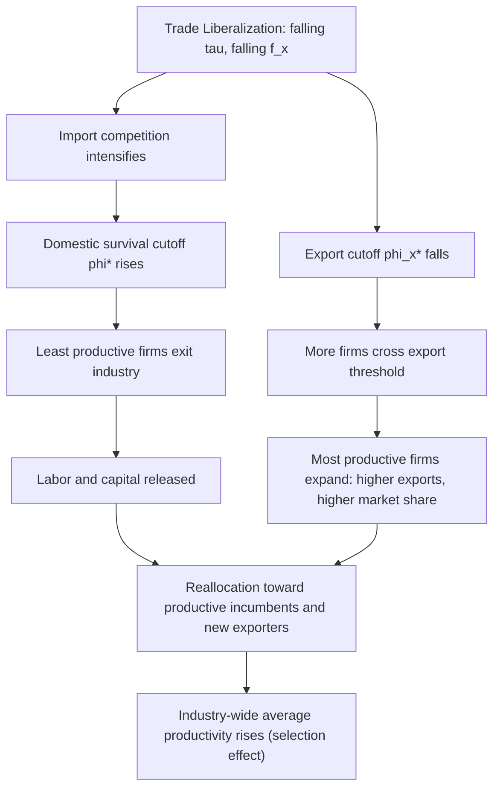

## Trade Liberalization and Within-Industry Reallocation

### Overview

Within-industry reallocation refers to the redistribution of market share, factors of production, and output across heterogeneous firms inside a single industry, driven by exposure to trade liberalization. This mechanism sits at the core of the Melitz (2003) framework and the broader New New Trade Theory (NNTT) literature, which departs from Heckscher-Ohlin and even Krugman (1980) monopolistic competition models by allowing firms within the same industry to differ in productivity.

### Theoretical Foundations

**Key Points**

- Firms within a narrowly defined industry are heterogeneous in productivity $\varphi$, drawn from a known distribution $g(\varphi)$
- Trade liberalization (tariff cuts, falling iceberg trade costs $\tau$, reduced fixed export costs $f_x$) does not affect all firms uniformly
- Reallocation occurs through entry, exit, and market-share shifts *within* the industry, not just *across* industries as in traditional Heckscher-Ohlin/Stolper-Samuelson reallocation

The reallocation channel is distinct from inter-industry reallocation (the classical trade theory prediction, where liberalization shifts resources from comparative-disadvantage to comparative-advantage sectors). Within-industry reallocation instead redistributes resources among firms producing similar goods but differing in efficiency.

### The Melitz (2003) Mechanism

#### Firm Heterogeneity Setup

Firms face a fixed entry cost $f_e$ to draw a productivity level $\varphi$ from distribution $g(\varphi)$. After observing $\varphi$, a firm decides whether to:

1. Exit immediately (productivity too low to cover fixed production cost $f$)
2. Produce only for the domestic market
3. Produce domestically and export (if $\varphi$ exceeds the export productivity cutoff $\varphi_x^*$)

Profits scale monotonically with productivity, so cutoffs exist:

$$\varphi^* \leq \varphi_x^*$$

where $\varphi^*$ is the domestic survival cutoff and $\varphi_x^*$ is the (higher) export cutoff, since exporting entails an additional fixed cost $f_x$ and variable trade cost $\tau > 1$.

#### Effect of Trade Liberalization on Cutoffs

When trade costs fall (lower $\tau$ or lower $f_x$):

- The **export cutoff** $\varphi_x^*$ falls: more firms find exporting profitable
- Increased competition from foreign entrants raises the **zero-cutoff profit (ZCP) condition** intensity, pushing up the **domestic survival cutoff** $\varphi^*$
- Least productive firms are driven to exit
- Resources (labor, intermediate inputs) released by exiting firms are reallocated toward more productive incumbents and new exporters

This is the central within-industry reallocation result: **liberalization simultaneously kills off the least productive firms and expands the most productive ones**, raising the industry's average productivity — a pure selection effect, distinct from any within-firm productivity gain.

### Formal Structure (CES Demand, Pareto Productivity)

Under standard Melitz assumptions — CES preferences with elasticity of substitution $\sigma > 1$, and Pareto-distributed productivity with shape parameter $k$:

$$g(\varphi) = k\varphi_{min}^{k}\varphi^{-k-1}, \quad \varphi \geq \varphi_{min}$$

Revenue and profit for a firm with productivity $\varphi$ in market $j$:

$$r(\varphi) = R\left(\frac{p(\varphi)}{P}\right)^{1-\sigma}, \quad p(\varphi) = \frac{\sigma}{\sigma-1}\frac{w}{\varphi}$$

The **Zero Cutoff Profit (ZCP)** condition ties the survival cutoff to industry-wide aggregates (average productivity $\tilde{\varphi}$, price index $P$, entry cost $f_e$):

$$\pi(\varphi^*) = 0$$

The **Free Entry (FE)** condition equates expected profits from entry to the sunk entry cost:

$$p_{in}\cdot\bar{\pi} = f_e \cdot \delta$$

where $p_{in}$ is the ex-ante probability of successful entry (survival probability) and $\delta$ is the exogenous death shock probability. Solving ZCP and FE jointly pins down the equilibrium cutoff $\varphi^*$, and trade liberalization parameters ($\tau$, $f_x$, $n$ number of trading partners) shift this equilibrium.

### Mechanism Diagram

### Decomposition: Selection vs. Within-Firm Effects

**Key Points**

- **Selection effect**: aggregate productivity gains from reallocating market share toward more efficient firms and exiting inefficient ones — this is the Melitz-specific channel
- **Within-firm effect**: productivity gains achieved *inside* a given firm (e.g., through learning-by-exporting, economies of scale). Melitz's baseline model assumes no within-firm productivity change; extensions (e.g., Lileeva and Trefler, 2010) incorporate this
- Empirical decompositions often use an Olley-Pakes (1996)-style productivity decomposition:

$$\bar{\Phi}_t = \bar{\varphi}_t + \sum_i (s_{it} - \bar{s}_t)(\varphi_{it} - \bar{\varphi}_t)$$

where $\bar{\Phi}_t$ is aggregate (weighted) productivity, $\bar{\varphi}_t$ is the unweighted mean, $s_{it}$ is firm $i$'s market share, and the covariance term captures reallocation (the extent to which high-productivity firms hold above-average market share).

### Empirical Evidence

**Example**

The canonical empirical study is **Pavcnik (2002)**, examining Chile's trade liberalization in the late 1970s–1980s. Using plant-level data, she found that a substantial share of aggregate manufacturing productivity growth was attributable to within-industry reallocation of resources from less efficient to more efficient plants, rather than average technological upgrading.

Other key empirical contributions:

- **Bernard, Jensen, Redding, and Schott** (various years) — document that exporters are systematically larger, more capital-intensive, and more productive than non-exporters even before entering export markets (self-selection), and that trade liberalization accelerates the market share reallocation toward these firms
- **Trefler (2004)** — study of the Canada-U.S. Free Trade Agreement, showing significant plant exit in import-competing industries alongside labor productivity gains concentrated in surviving plants
- **Melitz and Polanec (2015)** — refine the Olley-Pakes decomposition to separately identify entry, exit, and survivor reallocation effects (the "Dynamic Olley-Pakes" or DOP decomposition)

### Distributional and Welfare Implications

**Key Points**

- Aggregate industry productivity rises even absent any firm-level technology improvement — a pure composition effect
- Consumers benefit from a **new welfare channel** not present in Krugman (1980): reduced average price index due to compositional shift toward lower-cost (higher-$\varphi$) firms, in addition to variety gains
- Displaced workers and reallocated capital from exiting firms may face adjustment costs, frictions, and short-run unemployment — a caveat that pure heterogeneous-firm trade models with frictionless factor markets do not fully capture
- [Inference] The magnitude of within-industry reallocation gains relative to inter-industry (Heckscher-Ohlin type) reallocation gains is likely to depend heavily on industry concentration, entry barriers, and the initial dispersion of firm productivity, and this magnitude varies substantially across empirical contexts

### Extensions

- **Melitz and Ottaviano (2008)**: replace CES with linear demand, generating variable markups so that liberalization compresses markup dispersion across firms within an industry as an additional reallocation channel
- **Multi-product firms** (Bernard, Redding, Mayer): reallocation occurs not only across firms but *within* firms across product lines — liberalization induces firms to drop marginal products and concentrate on "core competency" products (this is a subtopic under the chapter's broader NNTT umbrella, distinct from single-product Melitz reallocation)
- **Heterogeneous firms and offshoring** (Antràs and Helpman, 2004): reallocation extends to the choice of organizational form (integration vs. outsourcing) as trade costs fall

### Illustrative Diagram: Productivity Distribution Shift

<svg xmlns="http://www.w3.org/2000/svg" viewBox="0 0 640 320">
<text x="320" y="24" text-anchor="middle" font-size="15" font-weight="bold" fill="#1a1a1a">Productivity Cutoff Shift under Trade Liberalization (svg_diagram)</text>
<line x1="60" y1="270" x2="600" y2="270" stroke="#333" stroke-width="2" />
<line x1="60" y1="270" x2="60" y2="50" stroke="#333" stroke-width="2" />
<text x="330" y="300" text-anchor="middle" font-size="13" fill="#333">Productivity φ</text>
<text x="30" y="160" text-anchor="middle" font-size="13" fill="#333" transform="rotate(-90 30 160)">Density g(φ)</text>
<path d="M 60 260 Q 150 60 300 90 Q 450 130 590 260" fill="none" stroke="#4477aa" stroke-width="2.5" />
<line x1="230" y1="270" x2="230" y2="120" stroke="#cc3333" stroke-width="2" stroke-dasharray="5,4" />
<text x="230" y="285" text-anchor="middle" font-size="12" fill="#cc3333">φ* (old)</text>
<line x1="290" y1="270" x2="290" y2="100" stroke="#cc3333" stroke-width="2" />
<text x="290" y="285" text-anchor="middle" font-size="12" fill="#cc3333" font-weight="bold">φ* (new, higher)</text>
<line x1="420" y1="270" x2="420" y2="128" stroke="#228833" stroke-width="2" stroke-dasharray="5,4" />
<text x="420" y="285" text-anchor="middle" font-size="12" fill="#228833">φx* (old)</text>
<line x1="370" y1="270" x2="370" y2="118" stroke="#228833" stroke-width="2" />
<text x="370" y="240" text-anchor="middle" font-size="12" fill="#228833" font-weight="bold">φx* (new, lower)</text>
<rect x="60" y="60" width="170" height="18" fill="#f4cccc" opacity="0.6" />
<text x="145" y="73" text-anchor="middle" font-size="11" fill="#993333">Exit zone (expands)</text>
<rect x="290" y="60" width="80" height="18" fill="#d9ead3" opacity="0.6" />
<text x="330" y="73" text-anchor="middle" font-size="11" fill="#38761d">New exporters</text>
</svg>

### Related Topics

- Melitz (2003) model: full general equilibrium derivation with free entry and CES demand
- Zero-profit cutoff (ZCP) and free-entry (FE) equations: comparative statics
- Melitz-Ottaviano (2008) linear demand model and markup heterogeneity
- Multi-product firms and product-mix reallocation (Bernard, Redding, Schott, 2011)
- Olley-Pakes (1996) and Melitz-Polanec (2015) productivity decomposition methods
- Self-selection vs. learning-by-exporting debate
- Antràs-Helpman (2004) property-rights model of firm heterogeneity and offshoring
- Labor market adjustment costs and trade-induced worker displacement (Autor, Dorn, Hanson "China Shock" literature)