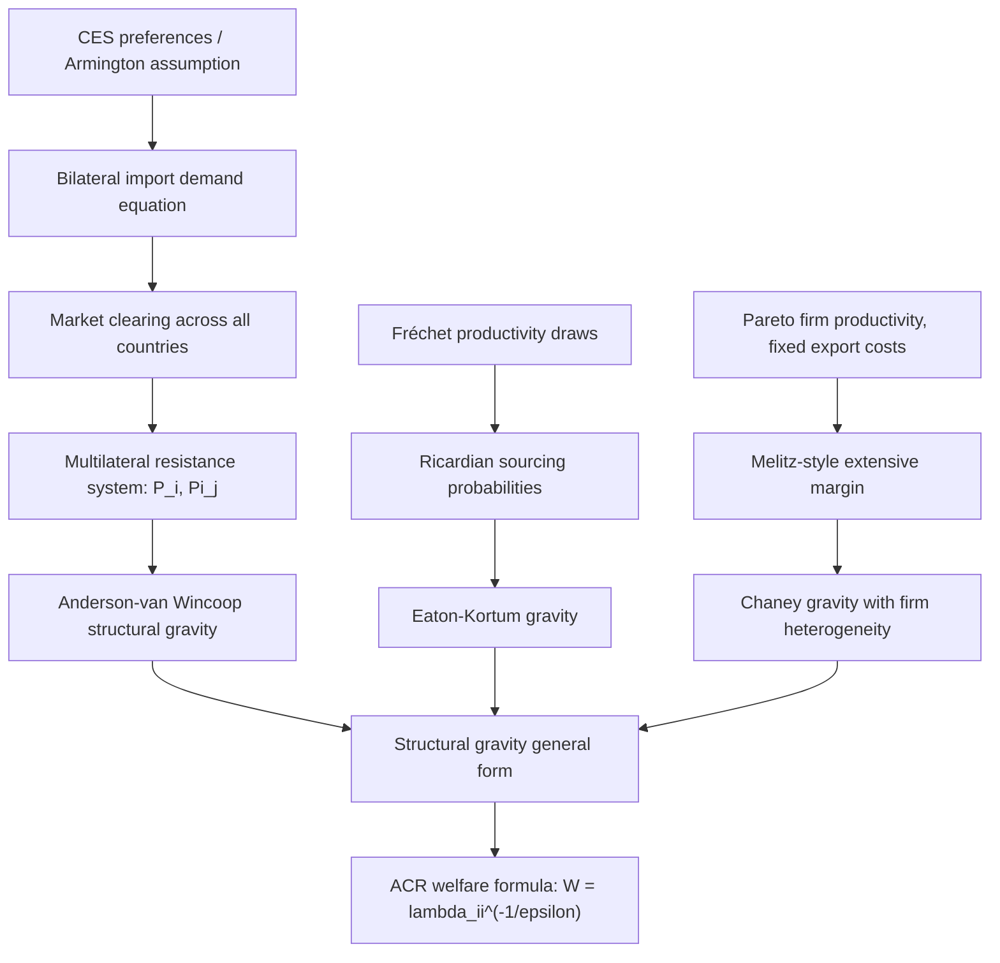

## Theoretical Foundations of the Gravity Equation

### Overview

The gravity equation predicts bilateral trade flows as a function of the economic "mass" of two trading partners and the trade resistance (distance, borders, policy barriers) between them. Originally borrowed from Newtonian physics as an empirical regularity, it was later shown to be derivable from nearly every major trade theory — Heckscher-Ohlin, Ricardian, monopolistic competition (Krugman), and heterogeneous firms (Melitz) — giving it deep theoretical microfoundations rather than being a purely ad hoc empirical fit.

### The Original Empirical Gravity Equation

**Key Points**

- First applied to trade by Tinbergen (1962) and Pöyhönen (1963), by analogy to Newton's law of gravitation
- Basic form:

$$X_{ij} = G\frac{Y_i^{\beta_1} Y_j^{\beta_2}}{D_{ij}^{\beta_3}}$$

where $X_{ij}$ is exports from country $i$ to country $j$, $Y_i, Y_j$ are GDPs (economic mass), $D_{ij}$ is bilateral distance, and $G$ is a constant.

- Empirically, $\beta_1, \beta_2 \approx 1$ and $\beta_3 \approx 1$ (distance elasticity close to -1) across a wide range of specifications and time periods
- For decades this lacked formal theoretical grounding, which limited its use for counterfactual policy analysis (the "gravity equation without theoretical foundations" critique)

### Anderson (1979): The First Theoretical Foundation

Anderson (1979) derived gravity from a **CES expenditure system** under the Armington assumption — goods are differentiated by country of origin (the "Armington assumption," from Armington 1969).

Each country produces a unique variety. Consumers everywhere have CES preferences over these varieties:

$$U_j = \left(\sum_i \beta_i^{1/\sigma} X_{ij}^{(\sigma-1)/\sigma}\right)^{\sigma/(\sigma-1)}$$

Utility maximization subject to a budget constraint yields import demand for country $i$'s good by country $j$:

$$X_{ij} = \left(\frac{p_i \tau_{ij}}{P_j}\right)^{1-\sigma} Y_j$$

where $\tau_{ij} \geq 1$ is the iceberg trade cost between $i$ and $j$, and $P_j$ is $j$'s CES price index. This established that gravity is consistent with CES demand and origin-differentiated goods — but the model still lacked full general equilibrium closure (market clearing in every country).

### Anderson and van Wincoop (2003): The "Multilateral Resistance" Breakthrough

This is the canonical modern theoretical foundation, addressing the **"gold medal mistake"**: prior empirical gravity specifications omitted country-specific price indices, causing omitted-variable bias in distance/border effect estimates.

#### Structural Derivation

Starting from CES preferences and market clearing, Anderson and van Wincoop (2003) derive:

$$X_{ij} = \frac{Y_i Y_j}{Y_W}\left(\frac{\tau_{ij}}{P_i \Pi_j}\right)^{1-\sigma}$$

where $Y_W$ is world income, and $P_i$, $\Pi_j$ are **inward and outward multilateral resistance (MR) terms** — theoretical price indices summarizing each country's average trade resistance with *all* trading partners, not just the bilateral pair.

The multilateral resistance terms satisfy a system of nonlinear equations solved jointly:

$$P_i^{1-\sigma} = \sum_j \left(\frac{\tau_{ij}}{\Pi_j}\right)^{1-\sigma}\frac{Y_j}{Y_W}$$

$$\Pi_j^{1-\sigma} = \sum_i \left(\frac{\tau_{ij}}{P_i}\right)^{1-\sigma}\frac{Y_i}{Y_W}$$

**Key Points**

- Bilateral trade depends not just on bilateral trade costs $\tau_{ij}$ but on how those costs compare to *all other* trade costs each country faces (its "remoteness")
- This resolves the "McCallum border puzzle": naive gravity estimates of the U.S.-Canada border effect were implausibly large because they omitted multilateral resistance
- MR terms act like general equilibrium price indices — they capture that a small, remote country trades more with any given partner (relative to a large country) because it has fewer alternative trading options

#### Structural Estimation Implication

$$X_{ij} = \frac{Y_i Y_j}{Y_W}\left(\frac{\tau_{ij}}{P_i \Pi_j}\right)^{1-\sigma}$$

This structural form cannot be estimated with simple OLS because $P_i$ and $\Pi_j$ are unobserved theoretical constructs. Two standard solutions:

1. **Custom nonlinear least squares** iterating over the system of MR equations (Anderson and van Wincoop's original approach)
2. **Fixed effects estimation** (the now-standard applied approach): including exporter and importer fixed effects absorbs $P_i$ and $\Pi_j$ exactly, since:

$$\ln X_{ij} = \alpha_i + \alpha_j + (1-\sigma)\ln\tau_{ij} + \varepsilon_{ij}$$

where $\alpha_i$ and $\alpha_j$ are exporter and importer fixed effects capturing $Y_i/P_i^{1-\sigma}$ and $Y_j/\Pi_j^{1-\sigma}$ respectively.

### Gravity from Alternative Trade Theories

**Key Points** — a defining feature of gravity is that it is *theory-agnostic*: multiple, very different underlying models generate the same reduced-form equation, which is why gravity's empirical success does not by itself discriminate between them.

| Underlying Model | Key Mechanism | Reference |
| --- | --- | --- |
| Armington/CES | Goods differentiated by origin, love of variety | Anderson (1979) |
| Krugman monopolistic competition | Firms differentiated by product variety, increasing returns | Bergstrand (1985); Helpman-Krugman (1985) |
| Ricardian (technology-based) | Comparative advantage from productivity differences, probabilistic sourcing | Eaton and Kortum (2002) |
| Heterogeneous firms (Melitz-type) | Extensive margin (number of exporting firms) plus intensive margin | Chaney (2008); Helpman, Melitz, Rubinstein (2008) |
| Heckscher-Ohlin | Factor proportions with frictions | Deardorff (1998) — shows H-O is also gravity-consistent under certain conditions |

#### Eaton and Kortum (2002): Ricardian Gravity

Productivity for each good in each country is drawn from a **Fréchet distribution**:

$$F_i(z) = \Pr(Z_i \leq z) = e^{-T_i z^{-\theta}}$$

where $T_i$ is country $i$'s state of technology and $\theta$ governs the dispersion of comparative advantage (lower $\theta$ = more heterogeneity). Countries buy from whichever source offers the lowest price after trade costs, generating a gravity equation:

$$X_{ij} = \frac{T_i (c_i \tau_{ij})^{-\theta}}{\Phi_j} Y_j$$

where $c_i$ is country $i$'s input cost and $\Phi_j = \sum_i T_i(c_i\tau_{ij})^{-\theta}$ is a multilateral-resistance-like term. This became foundational for quantitative Ricardian trade models (e.g., Costinot and Rodríguez-Clare's "trade elasticity" toolkit).

#### Chaney (2008): Heterogeneous Firms and the Extensive Margin

Chaney embeds Melitz-style firm heterogeneity (Pareto productivity distribution, shape parameter $k$) into a gravity framework, showing that with Pareto-distributed productivity, the trade elasticity with respect to variable trade costs is:

$$\epsilon = -(\sigma - 1) - k$$

**Key Points**

- Trade costs affect trade flows through both an **intensive margin** (existing exporters selling more/less) and an **extensive margin** (firms entering/exiting export markets) — a channel absent from Armington and standard Krugman gravity
- The elasticity of trade with respect to distance is governed by $k$ (dispersion of firm productivity), not just $\sigma$ (elasticity of substitution) — providing a firm-heterogeneity explanation for why gravity's estimated distance elasticity is often more stable across specifications than pure CES models predict

### Structural Gravity: General Form

Modern trade theory (Head and Mayer, 2014 survey; Arkolakis, Costinot, Rodríguez-Clare, 2012 "ACR" framework) shows that **most quantifiable trade models collapse to the same "structural gravity" reduced form**:

$$X_{ij} = \frac{Y_i}{\Omega_i}\frac{X_j}{\Phi_j}\phi_{ij}$$

with $\Omega_i$ and $\Phi_j$ representing outward and inward multilateral resistance in general form, and $\phi_{ij}$ a bilateral trade-cost/accessibility term. This unifying result underlies the **ACR sufficient-statistics approach**: welfare gains from trade can be computed from just two objects — the trade elasticity and the change in the domestic expenditure share — regardless of which specific micro-founded model generated the gravity equation.

$$\hat{W}_i = \hat{\lambda}_{ii}^{-1/\epsilon}$$

where $\lambda_{ii}$ is the share of domestic expenditure on domestic goods and $\epsilon$ is the trade elasticity — a remarkably parsimonious welfare formula applicable across Armington, Krugman, Eaton-Kortum, and Melitz-type models alike.

### Derivation Flow Diagram

### Estimation Considerations

**Key Points**

- **Zero trade flows**: log-linearized gravity drops observations where $X_{ij}=0$; Poisson Pseudo-Maximum Likelihood (PPML, Santos Silva and Tenreyro, 2006) is the standard solution, estimating the equation in levels and naturally accommodating zeros
- **Endogeneity of trade costs/policy**: bilateral trade agreements may be endogenous to expected trade volumes, motivating instrumental variable and matching approaches
- **Fixed effects proliferation**: modern applied gravity typically includes exporter-time, importer-time, and (for panel data) exporter-importer pair fixed effects to absorb multilateral resistance and time-invariant bilateral heterogeneity simultaneously

$$X_{ijt} = \exp\left[\alpha_{it} + \alpha_{jt} + \alpha_{ij} + \beta \ln\tau_{ijt}\right] \times \varepsilon_{ijt}$$

[Inference] The specific magnitude of the estimated trade-cost elasticity varies considerably depending on sector, time period, and estimator choice (OLS vs. PPML), so any single point estimate from the empirical literature should be interpreted as context-dependent rather than a universal constant.

### Related Topics

- Anderson-van Wincoop (2003) multilateral resistance: computational solution methods
- PPML estimation and the treatment of zero trade flows (Santos Silva-Tenreyro, 2006)
- Eaton-Kortum (2002) Ricardian quantitative trade model
- Chaney (2008) and the extensive vs. intensive margin decomposition
- Arkolakis-Costinot-Rodríguez-Clare (2012) "trade and welfare" sufficient-statistics framework
- The McCallum (1995) border puzzle and its resolution
- Head and Mayer (2014) "Gravity Equations: Workhorse, Toolkit, and Cookbook" survey
- Structural gravity applications to trade agreement evaluation (ex-ante and ex-post)