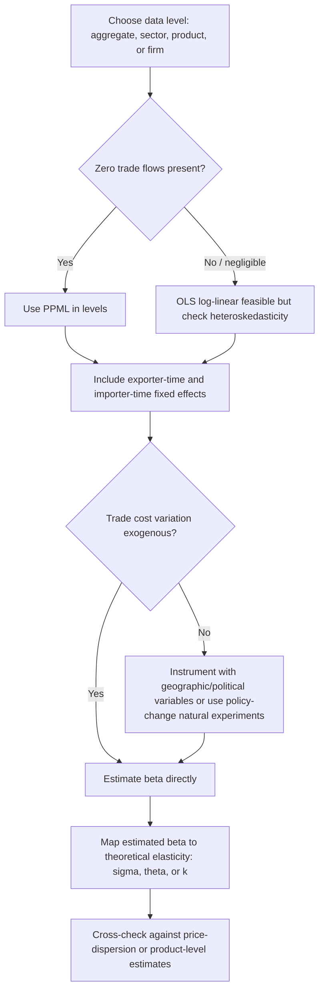

## Estimating Trade Elasticities

### Overview

The trade elasticity — the percentage change in trade flows resulting from a percentage change in trade costs — is the single most important sufficient statistic in modern quantitative trade theory. It governs welfare gains from trade, the response of trade flows to tariff changes, and comparative statics across nearly all structural gravity models (Armington, Ricardian, Melitz-type). Estimating it correctly, and understanding *which* elasticity is being estimated, is central to applied gravity work.

### What "The" Trade Elasticity Means

**Key Points**

- There is no single universal trade elasticity; the parameter takes different theoretical labels depending on the underlying model, even though it often plays the same mathematical role in the gravity equation
- **$\sigma$** — elasticity of substitution between varieties (Armington/CES, Krugman monopolistic competition)
- **$\theta$** — Fréchet dispersion parameter governing comparative advantage heterogeneity (Eaton-Kortum, 2002)
- **$k$** — Pareto shape parameter governing firm productivity dispersion (Chaney, 2008; Melitz-Pareto models)
- **$\epsilon$** — generic "trade elasticity" in the Arkolakis-Costinot-Rodríguez-Clare (ACR, 2012) sufficient-statistics sense, which nests $-(\sigma-1)$, $-\theta$, or $-k$ (or a composite) depending on the model

The elasticity of trade with respect to a bilateral trade cost is:

$$\frac{\partial \ln X_{ij}}{\partial \ln \tau_{ij}} = \epsilon$$

with $\epsilon$ typically estimated to be negative and in the range of roughly $-3$ to $-10$ across the literature, depending on aggregation level, sector, and method — [Inference] the wide range reflects genuine methodological and data heterogeneity across studies rather than a single "true" value the profession has converged on.

### Estimation Approach 1: Structural Gravity Regression with Trade Costs Proxies

The workhorse approach regresses log bilateral trade on log trade costs (typically proxied by tariffs and distance/borders), controlling for multilateral resistance via fixed effects:

$$\ln X_{ijt} = \alpha_{it} + \alpha_{jt} + \beta \ln(1+\tau^{tariff}_{ijt}) + \gamma \ln D_{ij} + \delta \text{Borders}_{ij} + \varepsilon_{ijt}$$

Here $\beta$ (or $-\beta(\sigma-1)$, depending on parameterization) recovers the trade elasticity with respect to tariffs specifically.

**Key Points**

- Exporter-time ($\alpha_{it}$) and importer-time ($\alpha_{jt}$) fixed effects absorb multilateral resistance terms exactly, per Anderson-van Wincoop (2003)
- Estimating $\beta$ requires **variation in trade costs that is plausibly exogenous** to unobserved trade flow determinants — this is the central identification challenge

### Estimation Approach 2: Poisson Pseudo-Maximum Likelihood (PPML)

**Example**

Santos Silva and Tenreyro (2006) demonstrate that log-linearizing the gravity equation and estimating by OLS produces **two serious biases**:

1. **Jensen's inequality bias**: $E[\ln X] \neq \ln E[X]$ when the error term is heteroskedastic, so OLS on logged trade flows yields inconsistent estimates of $\epsilon$ under heteroskedasticity — which is empirically pervasive in trade data
2. **Zero-trade-flow bias**: OLS drops observations where $X_{ij}=0$ (common for small/distant country pairs), causing sample selection bias

PPML addresses both by estimating the equation in **levels**, not logs:

$$X_{ij} = \exp(\alpha_i + \alpha_j + \beta \ln\tau_{ij})\times \varepsilon_{ij}, \quad E[\varepsilon_{ij}|\cdot]=1$$

estimated via Poisson quasi-maximum-likelihood, which:

- Naturally accommodates $X_{ij}=0$ observations (Poisson likelihood is well-defined at zero)
- Is consistent under heteroskedasticity because it only requires correct specification of the conditional mean, not the full distribution
- Has become the **de facto standard** in the applied gravity literature since roughly 2010

**Practical implementation** (conceptual, e.g., in Stata `ppml_panel_sg` / `ppmlhdfe`, or R's `fixest::fepois`):



```
# Conceptual PPML specification with high-dimensional fixed effects
fepois(trade ~ log(tariff) + log(distance) + border |
       exporter^year + importer^year + exporter^importer,
       data = trade_data)
```

The three-way fixed effect structure (exporter-year, importer-year, exporter-importer pair) is now considered best practice (following Baier and Bergstrand, 2007, and Weidner and Zylkin, 2021, for computational feasibility with PPML).

### Estimation Approach 3: Tariff-Based "Exact Hat Algebra" and Trade Policy Variation

A widely used identification strategy exploits **plausibly exogenous tariff changes** — e.g., from WTO accession, FTA implementation, or MFN tariff schedules — as the source of variation in $\tau_{ij}$:

$$\frac{\partial \ln X_{ij}}{\partial \ln(1+t_{ijk})} = \epsilon_k$$

estimated at the product level $k$ using detailed customs/tariff-line data. This is the approach underlying much of the Broda-Weinstein (2006) elasticity of substitution estimates and subsequent product-level trade elasticity databases.

#### Broda-Weinstein (2006) Method

Uses the **Feenstra (1994) identification strategy**: under CES demand and a competitive (or monopolistically competitive) supply side, the elasticity of substitution can be identified from the *relative variance* of price and quantity variation across exporting countries and time, without needing an external cost-shock instrument, by exploiting the assumption that demand and supply shocks are orthogonal and rely on generalized method of moments (GMM) using higher-order moments (skewness) for identification.

### Estimation Approach 4: Structural/Model-Based Estimation

In quantitative trade models (Eaton-Kortum, Melitz-Chaney calibrations), $\theta$ or $k$ can be estimated via:

1. **Gravity-regression-implied elasticity**: back out $\theta$ from the coefficient on trade costs in a gravity regression, given the model's mapping from $\epsilon$ to $\theta$
2. **Price-based identification** (Eaton and Kortum, 2002; Simonovska and Waugh, 2014): use the variance of import price data across source countries, since under Fréchet productivity draws, price dispersion is a tight function of $\theta$

$$\text{Var}(\ln p_{ij}) \approx \frac{1}{\theta^2}\times \text{constant}$$

**Simonovska and Waugh (2014)** show that gravity-regression-based estimates of $\theta$ tend to be biased upward (too small in absolute value, i.e., understating trade elasticity) relative to price-based micro estimates, due to a small-sample/aggregation bias in the regression approach — a methodologically important caveat when comparing elasticity estimates across studies. [Unverified] The precise magnitude of this bias is sensitive to the specific price dataset and country sample used, so it should not be treated as a fixed correction factor.

### Identification Challenges

**Key Points**

- **Endogenous trade costs**: tariffs and trade agreements are often negotiated in response to (anticipated) trade volumes, creating simultaneity bias
- **Common instruments**:
  - Geographic/gravity-based instruments (distance, colonial ties, common language) for trade agreement formation
  - "Judicial" or "political" instruments unrelated to trade volume expectations (e.g., Baier-Bergstrand's use of pre-determined geographic/political variables)
- **Aggregation bias**: elasticities estimated at aggregate (country-level) data differ systematically from product-level or firm-level estimates, because aggregate elasticities are a weighted combination of product-specific elasticities plus a compositional (extensive margin) term
- **Time horizon**: short-run elasticities (immediate price response) are typically smaller in absolute value than long-run elasticities (after full firm entry/exit and consumer adjustment) — a distinction central to the "elasticity puzzle" literature (Ruhl, 2008), which notes that macro trade elasticities estimated from aggregate time series are often much smaller than micro/trade-policy-based estimates

### Comparison Table of Methods

| Method | Data Requirement | Key Assumption | Typical Output |
| --- | --- | --- | --- |
| OLS log-gravity | Bilateral trade, distance/tariffs | Homoskedastic log errors | Biased under heteroskedasticity, drops zeros |
| PPML | Bilateral trade (levels), fixed effects | Correct conditional mean | Consistent $\epsilon$, handles zeros |
| Feenstra/Broda-Weinstein | Product-level trade, prices | CES demand, orthogonal supply/demand shocks | Product-level $\sigma$ |
| Price-dispersion (Eaton-Kortum) | Cross-country price data | Fréchet productivity | $\theta$ from price variance |
| Tariff-variation IV | Detailed tariff schedules | Exogenous tariff changes | Causal $\epsilon_k$ by product |

### Elasticity Estimation Workflow



### Applications

**Key Points**

- **Welfare analysis**: the ACR (2012) formula $\hat{W} = \hat{\lambda}_{ii}^{-1/\epsilon}$ requires a precise $\epsilon$ estimate — smaller (more negative) elasticities imply larger welfare losses from a given increase in trade costs
- **Counterfactual tariff simulations**: quantitative trade models (e.g., "exact hat algebra," Dekle-Eaton-Kortum, 2008) use estimated elasticities to simulate the impact of tariff changes, FTAs, or trade wars on bilateral trade and welfare
- **Trade policy evaluation**: applied studies of specific FTAs or tariff episodes (e.g., NAFTA, US-China Section 301 tariffs) rely on estimated product-level elasticities to predict pass-through and trade diversion effects

### Related Topics

- Anderson-van Wincoop (2003) multilateral resistance and structural gravity estimation
- Feenstra (1994) identification method for elasticities of substitution
- PPML and high-dimensional fixed effects (Correia, Guimarães, Zylkin, 2020 — `ppmlhdfe`)
- Eaton-Kortum (2002) Ricardian model and Fréchet-based elasticity estimation
- Ruhl (2008) "elasticity puzzle": short-run vs. long-run trade elasticities
- Exact hat algebra and counterfactual trade policy simulation (Dekle, Eaton, Kortum, 2008; Costinot-Rodríguez-Clare, 2014 handbook chapter)
- Arkolakis-Costinot-Rodríguez-Clare (2012) welfare sufficient statistics
- Tariff pass-through and trade diversion estimation methods