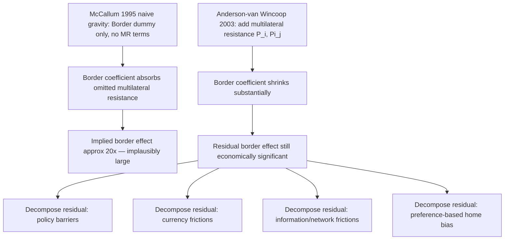

## Border Effects and the McCallum Puzzle

### Overview

The McCallum puzzle refers to the empirical finding that international borders reduce trade far more than distance alone would predict — even between economically integrated, geographically proximate regions like Canada and the United States. This result, first documented by McCallum (1995), triggered a substantial theoretical and empirical literature aimed at reconciling implausibly large estimated "border effects" with economic intuition, and became a central motivating puzzle for the development of structural gravity theory.

### McCallum (1995): The Original Finding

**Key Points**

- McCallum compared trade flows between Canadian provinces, and between Canadian provinces and U.S. states, using a standard log-linear gravity specification
- Using 1988 data, he estimated a gravity equation of the form:

$$\ln X_{ij} = \beta_0 + \beta_1 \ln Y_i + \beta_2 \ln Y_j + \beta_3 \ln D_{ij} + \beta_4 \text{Border}_{ij} + \varepsilon_{ij}$$

where $\text{Border}_{ij}$ is a dummy equal to 1 if $i$ and $j$ are both Canadian provinces (intra-national) and 0 if one is a U.S. state (international)

- The estimated border coefficient implied that **interprovincial trade among Canadian provinces was roughly 20 times larger** than trade between similarly distant Canadian provinces and U.S. states, after controlling for size and distance
- This was a striking result: Canada and the U.S. share a long open border, similar languages (in English Canada), deep economic integration, and (by 1988) the recently signed Canada-U.S. Free Trade Agreement — yet the implied border "tax equivalent" was enormous

### Why the Result Was Puzzling

**Key Points**

- A border effect of magnitude ~20 implies trade costs equivalent to very high tariffs, which is difficult to reconcile with observed low formal trade barriers between the U.S. and Canada
- Subsequent studies using different countries, time periods, and sectors consistently found large border effects (typically in the range of 5-20), suggesting this was not a Canada/U.S.-specific artifact — the finding proved highly **robust**, deepening the puzzle
- The puzzle raised a fundamental question for international economics: are national borders capturing genuine trade costs (regulatory differences, currency, information frictions, language, legal systems), or is the empirical specification itself flawed?

### Anderson and van Wincoop (2003): Resolving the Puzzle via Multilateral Resistance

The definitive resolution came from recognizing that McCallum's original specification suffered from **omitted variable bias** — it excluded multilateral resistance terms, the theoretical price indices required by structural gravity (see prior item: "Theoretical foundations of the gravity equation").

#### The "Gold Medal Mistake"

Anderson and van Wincoop explicitly labeled the omission of multilateral resistance as gravity's most consequential and widespread specification error historically — the **"gold medal mistake"** in trade economics.

The theoretically correct specification is:

$$X_{ij} = \frac{Y_i Y_j}{Y_W}\left(\frac{\tau_{ij}}{P_i \Pi_j}\right)^{1-\sigma}$$

Border effects, when correctly estimated controlling for $P_i$ and $\Pi_j$, are substantially **attenuated but do not disappear** — Anderson and van Wincoop's own structural re-estimation of the U.S.-Canada case still found a meaningful, economically significant border effect, but notably smaller than McCallum's naive OLS estimate.

**Key Points on the mechanism:**

- Small countries (like Canada relative to the U.S.) have **higher multilateral resistance** because they have fewer, more distant alternative trading partners relative to the large U.S. market
- Omitting $P_i, \Pi_j$ causes the border dummy to absorb part of this general-equilibrium remoteness effect, inflating the apparent border coefficient
- Correctly controlling for multilateral resistance (via structural estimation or exporter/importer fixed effects) removes this confound

#### Estimating with Fixed Effects

In practice, the multilateral resistance terms are absorbed by including exporter and importer fixed effects:

$$\ln X_{ij} = \alpha_i + \alpha_j + \beta_3 \ln D_{ij} + \beta_4 \text{Border}_{ij} + \varepsilon_{ij}$$

**However**, this raises a subtlety: if all observations of a given country pair share the same border status (e.g., a country's border dummy relative to itself is always 1, relative to any foreign country is always 0), standard exporter/importer fixed effects can be collinear with a simple national border dummy in certain specifications — requiring careful handling, often via intranational trade flow data (Wolf, 2000, on U.S. interstate trade) or symmetric bilateral specifications.

### Home Bias and Related Literature

**Key Points**

- The border effect is closely related to, but conceptually distinct from, the **"home bias in trade" puzzle** — the empirical finding that countries trade disproportionately more with themselves than with foreign partners of similar size and distance, even after gravity controls
- **Wolf (2000)** extended McCallum-style analysis using U.S. interstate trade data, finding home-state bias even *within* the U.S., suggesting border effects partly reflect genuine informational/logistical frictions rather than purely policy-driven barriers
- **Obstfeld and Rogoff (2000)** cited the border puzzle (alongside the equity home bias and other puzzles) as one of the "six major puzzles in international macroeconomics," underscoring its broader relevance beyond microeconomic trade theory
- **Head and Mayer (2013)** and subsequent surveys decompose the border effect into distinct sources: tariff and non-tariff policy barriers, exchange rate/currency risk, informational and network frictions (familiarity, trust, business networks), and preference-based home bias (consumer preference for domestic varieties)

### Decomposing the Border Effect

$$\text{Border Effect} = \underbrace{\text{Policy barriers}}_{\text{tariffs, NTBs, regulation}} + \underbrace{\text{Currency/exchange rate frictions}}_{\text{transaction costs, hedging}} + \underbrace{\text{Information frictions}}_{\text{search, trust, networks}} + \underbrace{\text{Preference-based home bias}}_{\text{taste for domestic varieties}}$$

Empirical work attempting this decomposition (e.g., studies isolating currency union effects, language effects, and colonial-tie effects within the border dummy) generally finds that **no single component fully explains the residual border effect**, leaving a portion attributable to hard-to-measure informational and network-based frictions. [Inference] This residual likely reflects a mix of genuinely unobserved trade costs and remaining econometric misspecification, and the literature has not fully agreed on its precise decomposition.

### Diagram: Sources of Bias in Naive Border Effect Estimates

### Methodological Lessons for Applied Gravity

**Key Points**

- The McCallum puzzle is widely cited as the key motivating example for why **theory-consistent gravity estimation** (i.e., properly controlling for multilateral resistance) matters for policy-relevant magnitudes, not just statistical significance
- Best-practice modern estimation (following Baier and Bergstrand, 2007; Head and Mayer, 2014) uses:
  - Exporter-time and importer-time fixed effects (absorbing multilateral resistance)
  - Country-pair fixed effects (absorbing time-invariant bilateral heterogeneity, including much of the border effect itself if panel data is available)
  - PPML estimation to handle zero trade flows and heteroskedasticity (Santos Silva and Tenreyro, 2006)
- **Example**: In a panel gravity regression with both country-pair and time-varying country fixed effects, the border effect for a single fixed country pair *cannot* be separately identified from the pair fixed effect — border effects are typically estimated by pooling *many* country pairs and comparing intra-national vs. international observations, or using specific natural experiments (currency union formation, EU enlargement, German reunification) as identifying variation

### Related Topics

- Anderson-van Wincoop (2003) structural gravity and multilateral resistance (prior item cross-reference)
- Wolf (2000) home-state bias in U.S. interstate trade
- Currency unions and the Rose (2000) "currency union effect on trade" literature
- Head and Mayer (2014) gravity equations survey — border effect decomposition
- Obstfeld-Rogoff (2000) six major puzzles in international macroeconomics
- Regional trade agreements and ex-post gravity-based evaluation
- Language, colonial ties, and legal-origin effects on bilateral trade costs