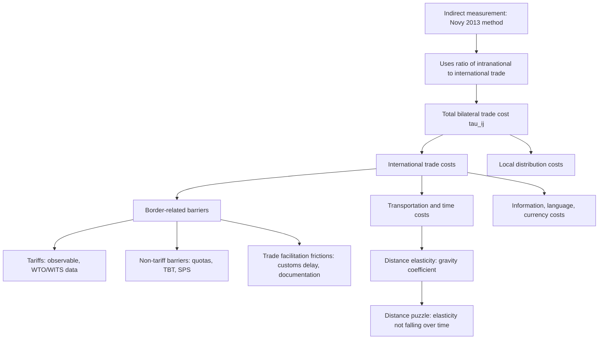

## Trade Costs: Distance, Tariffs, and Trade Facilitation

### Overview

Trade costs encompass everything that drives a wedge between the price a producer receives and the price a consumer pays for an internationally traded good. They are the empirical counterpart of the $\tau_{ij}$ "iceberg cost" term in gravity and structural trade models, and understanding their composition, measurement, and policy relevance is central to interpreting gravity-equation coefficients and designing trade facilitation policy.

### The Iceberg Trade Cost Formalization

**Key Points**

- Samuelson's (1954) "iceberg" assumption: shipping one unit of a good from country $i$ to country $j$ requires producing $\tau_{ij} \geq 1$ units, with $\tau_{ij}-1$ "melting away" in transit
- This modeling device avoids introducing a separate transport sector, simplifying general equilibrium analysis, at the cost of some realism (real trade costs are not simply proportional resource losses)
- $\tau_{ij}$ is a **composite** term in applied work, proxied empirically by a combination of observable and unobservable frictions

$$p_j = \tau_{ij}\, p_i$$

where $p_i$ is the producer (mill) price and $p_j$ is the destination price inclusive of all trade costs.

### Taxonomy of Trade Costs

Anderson and van Wincoop (2004), in their comprehensive survey "Trade Costs," decompose total trade costs into major categories:

| Category | Components | Typical Magnitude (ad valorem equivalent) |
| --- | --- | --- |
| Transportation costs | Freight, insurance, time costs | ~10-15% for advanced economies (higher for landlocked/remote) |
| Border-related trade barriers | Tariffs, non-tariff barriers, customs procedures | Variable, often 5-10%+ |
| Information/language/currency costs | Search costs, contract enforcement, exchange rate risk | Difficult to measure directly |
| Local distribution costs | Wholesale/retail margins | Often the *largest* component, frequently underappreciated |

**Key Points**

- Anderson and van Wincoop's headline estimate: total trade costs for representative rich-country trade average roughly a **170% ad valorem tax equivalent** (i.e., the price at the border is roughly 2.7 times the factory-gate price), decomposed further into international trade costs (~74% tax-equivalent, comprising 21% transport, 44% border-related) and local distribution costs (~55% tax-equivalent) — [Unverified] the precise decomposition figures vary across follow-up studies and depend heavily on data sources and country coverage, so should be treated as illustrative orders of magnitude rather than fixed universal constants

### Distance and Transport Costs

#### Distance as a Proxy

In gravity regressions, bilateral distance $D_{ij}$ (typically great-circle distance between economic centers, or population-weighted distance following Head and Mayer's CEPII database methodology) proxies for:

- Physical transportation costs (freight rates increase with distance)
- Time costs (longer transit delays inventory turnover, particularly costly for time-sensitive/perishable goods — Hummels, 2001; Hummels and Schaur, 2013 estimate the ad valorem cost of a day's delay)
- Correlated information/communication frictions (historically correlated with distance, though less so in the internet era)

#### The Distance Puzzle

**Key Points**

- A long-standing empirical puzzle: the estimated distance elasticity in gravity regressions has **not declined** over the 20th and early 21st centuries despite dramatic falls in transport and communication costs (containerization, air freight, internet) — commonly termed the "distance puzzle" (Disdier and Head, 2008, meta-analysis)
- Disdier and Head (2008) find, if anything, a **slight increase** in the estimated distance coefficient in the postwar period compared to earlier decades, based on a meta-analysis of over 1,400 distance elasticity estimates from the gravity literature
- Proposed explanations: compositional shift toward goods more sensitive to distance (time-sensitive, differentiated products), rising importance of just-in-time production/supply chains sensitive to delay, better econometric practice (fixed effects, PPML) revealing a "true" elasticity previously masked by specification error, and increased weight of price-sensitive/low-value goods in trade over time

### Tariffs and Non-Tariff Barriers

#### Tariffs

**Key Points**

- Ad valorem tariffs enter trade cost measures directly and transparently, as they are observable in official tariff schedules (WTO, UNCTAD TRAINS database, WITS)
- Effectively applied tariffs vs. bound tariffs: WTO members often apply tariffs below their legally bound maximum ("water in the tariff"), so bound rates overstate actual protection
- Preferential tariffs under FTAs create tariff variation exploitable for elasticity estimation (see prior item: "Estimating trade elasticities")

#### Non-Tariff Barriers (NTBs)

**Key Points**

- NTBs include quotas, technical barriers to trade (TBT), sanitary and phytosanitary (SPS) measures, licensing requirements, and domestic regulatory standards
- Measurement is inherently harder than tariffs since NTBs are not simply ad valorem rates; common approaches include:
  - **Frequency indices**: share of tariff lines covered by an NTB
  - **Price-gap methods**: comparing domestic and world prices for affected goods
  - **Tariff-equivalent estimation via gravity residuals**: inferring an implicit ad valorem equivalent from the residual, unexplained portion of a gravity regression after controlling for tariffs and distance
- The World Bank's **Overall Trade Restrictiveness Index (OTRI)** and similar composite indices attempt to aggregate tariff and NTB protection into a single comparable metric

### Trade Facilitation

**Key Points**

- Trade facilitation refers to policies and infrastructure investments that reduce the "behind-the-border" transaction costs of trade: customs efficiency, port infrastructure, logistics performance, documentation requirements, and regulatory transparency
- The **World Bank Logistics Performance Index (LPI)** benchmarks countries on customs efficiency, infrastructure quality, ease of arranging shipments, logistics service quality, tracking/tracing capability, and timeliness
- The **WTO Trade Facilitation Agreement (TFA)**, which entered into force in 2017, is the major multilateral instrument in this space, committing members to streamline customs procedures, publish trade regulations, and establish "single window" systems for documentation

#### Empirical Estimates of Trade Facilitation Gains

Studies using gravity-based counterfactuals (e.g., OECD Trade Facilitation Indicators research, World Bank studies) generally find that reducing trade facilitation-related costs (customs delays, documentation burden) yields **larger proportional trade gains for developing countries and landlocked economies**, since these frictions constitute a proportionally larger share of total trade costs for such economies relative to tariffs.

$$\Delta \ln X_{ij} = \epsilon \times \Delta \ln \tau_{ij}^{facilitation}$$

where the same trade elasticity $\epsilon$ framework from the previous "Estimating trade elasticities" item applies directly to facilitation-cost counterfactuals.

### Measuring Trade Costs Indirectly: The Novy (2013) Approach

A widely used method for inferring *aggregate* bilateral trade costs (not decomposed into individual components) uses the structural gravity relationship itself, inverting the Anderson-van Wincoop framework:

$$\tau_{ij} = \left(\frac{X_{ii}X_{jj}}{X_{ij}X_{ji}}\right)^{\frac{1}{2(\sigma-1)}}$$

**Key Points**

- This "micro-founded" trade cost measure (Novy, 2013) combines the ratio of each country's intranational trade ($X_{ii}, X_{jj}$) to its bilateral international trade ($X_{ij}, X_{ji}$)
- The intuition: if a country trades relatively little internationally compared to how much it trades with itself, this reveals *high* implicit bilateral trade costs, even without directly observing tariffs, freight rates, or NTBs
- Underlying data requirement: intranational trade flows (often proxied using GDP minus total exports, combined with internal distance measures) — a nontrivial data construction step, since intranational trade is not directly recorded like customs data

### Diagram: Composition and Measurement of Trade Costs

### Policy Implications

**Key Points**

- Trade facilitation reforms are often argued to offer **higher returns per dollar of policy effort** than further tariff liberalization in economies where average applied tariffs are already low, since remaining protection is increasingly concentrated in border-crossing frictions and regulatory/logistics costs
- Landlocked developing countries face structurally higher transport costs, motivating targeted infrastructure and transit-facilitation policy (e.g., regional transit corridor agreements) as distinct from tariff negotiation
- [Inference] Given the large estimated share of local distribution costs in total trade costs (per Anderson-van Wincoop), domestic "behind-the-border" reforms—competition policy in wholesale/retail sectors, domestic transport infrastructure—likely have underappreciated importance for the effective price gap facing consumers, relative to the attention such reforms typically receive compared to border policy

### Related Topics

- Anderson-van Wincoop (2004) "Trade Costs" survey — full component-level decomposition
- Novy (2013) inferring trade costs from gravity residuals
- Hummels (2001); Hummels and Schaur (2013) time costs of trade and air vs. ocean shipping trade-offs
- Disdier-Head (2008) meta-analysis and the distance puzzle
- WTO Trade Facilitation Agreement (2017) and implementation studies
- World Bank Logistics Performance Index methodology
- Non-tariff barrier measurement: frequency indices, price-gap methods, ad valorem equivalents
- Tariff pass-through to consumer prices in the context of recent trade-war episodes