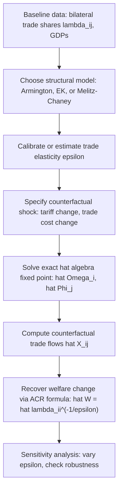

## Structural Gravity and General Equilibrium Trade Models

### Overview

Structural gravity refers to the class of general equilibrium trade models that generate a gravity equation as an equilibrium outcome from explicit microfoundations — market clearing, consumer optimization, and (in some variants) firm entry — rather than treating gravity as a purely empirical regularity. This framework unifies Armington, Ricardian (Eaton-Kortum), and heterogeneous-firm (Melitz-Chaney) models under a common reduced form, and provides the backbone for modern quantitative trade policy analysis.

### From Reduced-Form to Structural Gravity

**Key Points**

- A gravity equation is "structural" when its parameters and functional form are derived from, and consistent with, a fully specified general equilibrium model with market clearing in every country
- This matters because structural gravity supports **valid counterfactual analysis** (e.g., simulating a new trade agreement or tariff war) — reduced-form gravity fit to historical data cannot reliably predict outcomes outside the observed data range without imposing GE consistency
- Head and Mayer (2014) and Arkolakis, Costinot, and Rodríguez-Clare (2012, "ACR") formalize the observation that essentially **all** major trade models reduce to the same general structural gravity form

### The General Structural Gravity Form

Across Armington, Krugman, Eaton-Kortum, and Melitz-Chaney models, bilateral trade can be written as:

$$X_{ij} = \frac{Y_i}{\Omega_i}\frac{E_j}{\Phi_j}\phi_{ij}$$

where:

- $Y_i$ = value of production in exporting country $i$
- $E_j$ = total expenditure in importing country $j$
- $\phi_{ij}$ = bilateral "accessibility" term (a function of trade costs $\tau_{ij}$ and model-specific parameters)
- $\Omega_i, \Phi_j$ = **outward and inward multilateral resistance** terms, defined implicitly by market-clearing conditions:

$$\Omega_i = \sum_j \phi_{ij}\frac{E_j}{\Phi_j}, \qquad \Phi_j = \sum_i \phi_{ij}\frac{Y_i}{\Omega_i}$$

This is a **fixed-point system**: $\Omega_i$ depends on all $\Phi_j$, and vice versa, requiring joint (typically iterative) solution.

### Model-Specific Mappings

| Model | $\phi_{ij}$ (accessibility term) | Key Parameter | Reference |
| --- | --- | --- | --- |
| Armington/CES | $\tau_{ij}^{1-\sigma}$ | $\sigma$ (elasticity of substitution) | Anderson (1979); Anderson-van Wincoop (2003) |
| Krugman monopolistic competition | $\tau_{ij}^{1-\sigma}$ (same functional form, different micro-mechanism) | $\sigma$ | Bergstrand (1985) |
| Eaton-Kortum Ricardian | $T_i(c_i\tau_{ij})^{-\theta}$ | $\theta$ (Fréchet dispersion) | Eaton and Kortum (2002) |
| Melitz-Chaney heterogeneous firms | Function of $\tau_{ij}^{-k}$, incorporating extensive margin | $k$ (Pareto shape) combined with $\sigma$ | Chaney (2008) |

**Key Points**

- The remarkable result: despite radically different economic mechanisms (love-of-variety CES demand vs. Ricardian technology-based sourcing vs. firm entry/exit), the **reduced-form trade elasticity with respect to bilateral trade costs is observationally similar in structure** across these models — though the underlying welfare and adjustment implications differ substantially
- This is why gravity's strong empirical fit does not, by itself, discriminate between competing trade theories — a point emphasized throughout the "New New Trade Theory" literature's engagement with gravity

### General Equilibrium Closure

A full structural gravity model requires additional equilibrium conditions beyond the trade equation itself:

1. **Market clearing**: production value equals total sales across all destinations

   $$Y_i = \sum_j X_{ij}$$
2. **Income determination**: national income equals value of production (plus tariff revenue, trade imbalances, or transfers as modeled)
3. **Multilateral resistance system**: as defined above, solved simultaneously with market clearing
4. **Price normalization**: since gravity is typically homogeneous of degree zero in prices, a normalization (e.g., world GDP as numeraire, or one country's price index normalized to 1) is required for a determinate solution

### Solving Structural Gravity Models: Exact Hat Algebra

**Key Points**

- Directly solving the full nonlinear system for counterfactual changes (e.g., "what happens if the US imposes a 20% tariff on China?") in levels can be numerically demanding, particularly with many countries/sectors
- **Dekle, Eaton, and Kortum (2008)** developed the **"exact hat algebra"** technique: rather than solving for levels, the model is solved for **relative changes** (denoted with a hat, $\hat{x} = x'/x$) between an initial equilibrium and a counterfactual equilibrium

The core exact-hat-algebra system re-expresses the trade equation and market clearing in terms of observed *baseline trade shares* $\lambda_{ij} = X_{ij}/E_j$ and *changes* in trade costs, avoiding the need to independently estimate unobservable structural parameters/level (e.g., technology levels $T_i$) that cancel out in relative-change form:

$$\hat{X}_{ij} = \hat{Y}_i \hat{\phi}_{ij} \frac{\hat{E}_j}{\hat{\Phi}_j \hat{\Omega}_i}$$

This is the standard workhorse computational approach in modern quantitative trade policy analysis, since it requires only baseline trade data (observed trade shares) and an assumed trade elasticity — not full estimation of unobserved level parameters.

### Computational Workflow for Counterfactual Analysis

### The ACR (2012) Sufficient-Statistics Result

**Key Points**

- Arkolakis, Costinot, and Rodríguez-Clare (2012) show that across a broad class of structural gravity models (Armington, Krugman, Melitz with specific restrictions), the **welfare change from any trade shock** can be computed using only two observable/estimable objects:
  1. The change in the domestic expenditure share $\hat{\lambda}_{ii}$ (share of spending on domestically produced goods)
  2. The trade elasticity $\epsilon$

$$\hat{W}_i = \hat{\lambda}_{ii}^{-1/\epsilon}$$

- This is remarkably parsimonious: it does **not** require knowing the detailed structure of trade costs, the full distribution of trade flows across all partners, or which specific micro-model generated the data — only the change in how much of domestic spending "leaks" abroad
- **Important qualification**: the ACR result relies on restrictive conditions (one factor of production, perfect competition or specific monopolistic competition/heterogeneous-firms structure with no profit income effects, balanced trade). Subsequent literature (Melitz and Redding, 2015) shows these restrictions can matter quantitatively — **models that are gravity-equivalent are not necessarily welfare-equivalent**, since additional margins (e.g., firm entry/variety effects in Melitz beyond what's captured by $\lambda_{ii}$ and $\epsilon$ alone) can generate extra welfare gains not visible in the sufficient-statistic formula

### Multi-Sector and Multi-Factor Extensions

**Key Points**

- Real-world quantitative applications (e.g., Caliendo and Parro, 2015, on NAFTA) extend structural gravity to **multiple sectors with input-output linkages**, where sectoral trade elasticities differ and intermediate goods trade creates cross-sector amplification of shocks
- Multi-factor extensions (e.g., Costinot and Rodríguez-Clare's *Handbook of International Economics* chapter) incorporate multiple factors of production, generating both traditional Heckscher-Ohlin-style factor-price effects alongside gravity-consistent trade flow predictions — bridging structural gravity with classical trade theory
- These richer models are used for large-scale **ex-ante policy evaluation** — e.g., predicting the effects of prospective trade agreements or estimating the welfare cost of tariff wars before they occur

### Empirical Applications

**Example**

- **Caliendo and Parro (2015)**: quantify the welfare effects of NAFTA using a multi-sector Eaton-Kortum structural gravity model with input-output linkages, finding welfare gains for all three member countries but with substantial cross-sector heterogeneity
- **Costinot and Rodríguez-Clare (2018)** and subsequent work: use structural gravity frameworks to estimate the welfare costs of the 2018-2019 US-China tariff escalation
- Structural gravity is also the standard framework underlying **ex-ante evaluations of prospective agreements** (e.g., studies of Brexit's trade impact, CPTPP accession analyses) commissioned by governments and international organizations

### Related Topics

- Theoretical foundations of the gravity equation (Anderson-van Wincoop multilateral resistance — prior item cross-reference)
- Estimating trade elasticities (parameter inputs for structural gravity — prior item cross-reference)
- Dekle-Eaton-Kortum (2008) exact hat algebra methodology
- Arkolakis-Costinot-Rodríguez-Clare (2012) welfare sufficient statistics and its limitations
- Caliendo-Parro (2015) multi-sector quantitative trade model with input-output linkages
- Melitz-Redding (2015) critique: gravity-equivalence vs. welfare-equivalence across models
- Costinot-Rodríguez-Clare Handbook chapter: "Trade Theory with Numbers"
- Quantitative trade policy evaluation tools and software implementations (e.g., structural gravity toolkits in Stata/R)