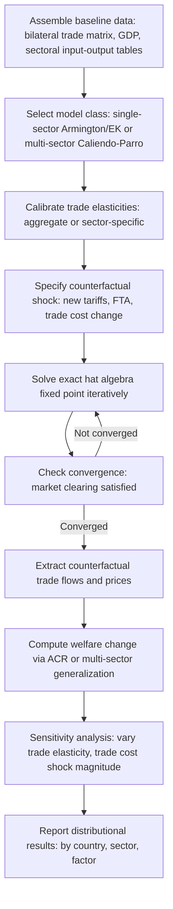

## Counterfactual Policy Analysis Using Gravity Models

### Overview

Counterfactual policy analysis uses estimated or calibrated structural gravity models to simulate "what if" scenarios — new trade agreements, tariff changes, trade wars, Brexit-style withdrawals — and quantify their predicted effects on trade flows, prices, and welfare *before or without* directly observing the policy in effect. This is the primary applied use case that justifies the theoretical investment in structural (rather than purely reduced-form) gravity, since valid counterfactuals require a model consistent with general equilibrium.

### Why Structural Consistency Is Required for Counterfactuals

**Key Points**

- A reduced-form gravity regression fit to historical data can predict trade flows *within* the range of observed variation, but extrapolating to a genuinely new policy scenario (e.g., a tariff level never historically observed, or a newly formed trade bloc) requires the model to satisfy general equilibrium restrictions — otherwise predicted trade flows may violate market clearing or adding-up constraints
- Structural gravity's multilateral resistance terms ($P_i, \Pi_j$ or $\Omega_i, \Phi_j$) are **endogenous to the policy change itself** — when a tariff changes, every country's multilateral resistance shifts because relative trade costs to all partners shift, not just the directly affected bilateral pair
- This means counterfactual analysis cannot simply "plug in" a new tariff into the estimated equation; it requires **re-solving the full general equilibrium system**

### The Exact Hat Algebra Framework

As introduced in the structural gravity item, Dekle, Eaton, and Kortum (2008) provide the standard computational technique, solving for **relative changes** rather than levels.

#### Core System

Given baseline trade shares $\lambda_{ij} = X_{ij}/E_j$ and a proposed change in trade costs $\hat{\tau}_{ij}$ (hat notation denotes counterfactual-to-baseline ratio), the system solves for:

$$\hat{X}_{ij} = \hat{Y}_i \left(\frac{\hat{\tau}_{ij}}{\hat{P}_i}\right)^{1-\sigma}\hat{\Pi}_j^{\sigma-1}\hat{E}_j$$

jointly with market clearing:

$$\hat{Y}_i Y_i = \sum_j \lambda_{ij}\hat{X}_{ij} E_j$$

**Key Points**

- This is solved via **iteration**: guess $\hat{P}_i, \hat{\Pi}_j$, compute implied trade flows, check market clearing, update guesses, repeat until convergence
- The major practical advantage: this approach requires **no estimation of unobservable structural parameters** (technology levels, fixed costs) — only the baseline trade share matrix, GDP data, the assumed trade elasticity, and the size of the trade cost shock
- The trade elasticity $\epsilon$ (from the "Estimating trade elasticities" item) is the single most consequential external input; results are typically reported with **sensitivity analysis across a plausible range** of $\epsilon$

### Typical Counterfactual Policy Questions

| Policy Question | Shock Modeled | Typical Data Requirement |
| --- | --- | --- |
| New FTA formation | $\hat\tau_{ij}$ falls between member pairs | Baseline trade matrix, tariff schedules |
| Tariff war | $\hat\tau_{ij}$ rises for specific product/partner pairs | Product-level trade and tariff data |
| Brexit-style exit | $\hat\tau_{ij}$ rises between exiting country and bloc | Pre-exit trade shares, estimated post-exit tariff/NTB equivalents |
| Trade facilitation investment | $\hat\tau_{ij}$ falls via reduced customs/logistics costs | LPI-based or gravity-residual cost estimates |
| Regional integration (currency union, single market) | Composite reduction in $\hat\tau_{ij}$ | Historical natural-experiment estimates (e.g., euro adoption effects) |

### Welfare Evaluation: The ACR Formula in Counterfactual Practice

Following the ACR (2012) sufficient-statistics result from the structural gravity item:

$$\hat{W}_i = \hat{\lambda}_{ii}^{-1/\epsilon}$$

**Example**

To evaluate a hypothetical tariff reduction between two countries:

1. Solve the exact hat algebra system for the change in each country's domestic expenditure share $\hat{\lambda}_{ii}$
2. Apply the ACR formula using the assumed or estimated trade elasticity $\epsilon$
3. A fall in $\hat\lambda_{ii}$ (domestic spending share shrinks as imports become relatively cheaper) translates directly into a welfare gain $\hat{W}_i > 1$

**Key Points**

- This approach is attractive precisely because it sidesteps the need to fully characterize the distribution of trade cost changes across all bilateral pairs — only the aggregate domestic-share response matters for the ACR welfare formula
- As previously noted (structural gravity item), this formula's validity depends on model-specific restrictions (single factor, balanced trade, specific competition structure) — richer multi-sector, multi-factor models require correspondingly richer welfare formulas (Costinot-Rodríguez-Clare, 2014, generalize ACR to multi-sector settings)

### Multi-Sector Extensions for Realistic Counterfactuals

**Key Points**

- Single-sector structural gravity abstracts from the fact that real trade agreements and tariff changes are **highly sector-specific** (e.g., agricultural tariffs vs. manufacturing tariffs differ enormously)
- **Caliendo and Parro (2015)** develop the standard multi-sector Eaton-Kortum framework incorporating:
  - Sector-specific trade elasticities $\theta_k$
  - Input-output linkages across sectors (a tariff on sector $k$ inputs raises costs in downstream sectors using $k$ as an intermediate)
  - Sector-specific labor allocation, allowing factor reallocation across sectors in response to the shock
- This framework was used to quantify NAFTA's welfare effects, decomposing gains/losses by country and sector, and remains a widely used template for subsequent trade agreement counterfactual studies

### Computational Workflow

### Data Requirements and Practical Implementation

**Key Points**

- **Baseline trade matrix**: bilateral trade flows by sector (commonly sourced from UN Comtrade, BACI/CEPII, or WIOD/GTAP databases for input-output-linked analysis)
- **Trade cost shock calibration**: for tariff changes, directly observable from tariff schedules; for NTBs or trade facilitation, typically requires gravity-residual-based tariff-equivalent estimation (as discussed in "Trade costs" item) or external studies (e.g., ex-ante estimates of Brexit-related NTB increases)
- **Elasticity parameters**: sourced from the empirical elasticity literature (Broda-Weinstein product-level estimates, Caliendo-Parro sector-level estimates, or Simonovska-Waugh price-based estimates)
- Common software implementations include custom MATLAB/Python/R/Stata routines solving the fixed-point iteration; some standardized toolkits exist in the applied trade policy research community (e.g., GTAP-based CGE models for multi-sector analysis, though these are a related but distinct methodological tradition from pure structural-gravity Eaton-Kortum-style quantification)

### Limitations and Critiques

**Key Points**

- **Static framework**: standard exact-hat-algebra counterfactuals are typically static (comparing two equilibria), abstracting from transition dynamics, adjustment costs, and short-run unemployment during reallocation — a limitation particularly relevant given the "within-industry reallocation" mechanisms discussed elsewhere in this chapter's broader NNTT context
- **Parameter uncertainty**: results are highly sensitive to the assumed trade elasticity; studies using implausibly low (in absolute value) elasticities can generate large, possibly overstated, welfare effects from small trade cost changes
- **Model selection risk**: as the Melitz-Redding (2015) critique highlights, models that fit historical gravity equally well can generate materially different counterfactual welfare predictions if they differ in features not identified by the gravity equation alone (e.g., firm entry margins, profit shifting)
- [Inference] Given these sensitivities, counterfactual gravity-based welfare estimates are probably best interpreted as informative *ranges* bounded by sensitivity analysis, rather than precise point predictions, particularly for large or unprecedented policy shocks that push the model outside historically observed parameter regions

### Related Topics

- Structural gravity and general equilibrium trade models (prior item cross-reference — exact hat algebra origins)
- Estimating trade elasticities (prior item cross-reference — key input parameter)
- Caliendo-Parro (2015) multi-sector NAFTA counterfactual study
- Costinot-Rodríguez-Clare (2014) Handbook chapter generalizing ACR to multi-sector welfare formulas
- Ex-ante Brexit trade impact studies using structural gravity
- GTAP and computable general equilibrium (CGE) models as a related but distinct quantification tradition
- Melitz-Redding (2015) critique of gravity-equivalence vs. welfare-equivalence