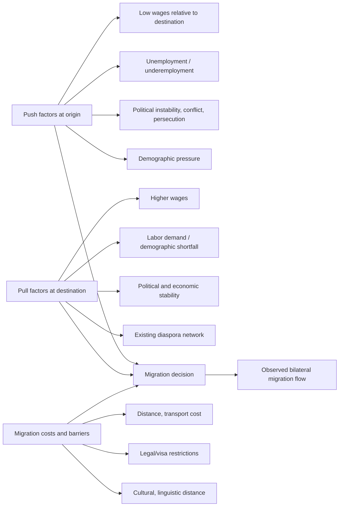

## Causes and Patterns of International Labor Migration

### Overview

International labor migration — the movement of workers across national borders — is a core factor-mobility topic in international economics, complementing trade in goods (Heckscher-Ohlin, gravity) as an alternative channel for equalizing factor returns across countries. This item covers the theoretical drivers of migration decisions, empirical patterns of migration flows, and the relationship between migration and trade as substitute or complementary adjustment mechanisms.

### Theoretical Foundations: Why Migration Occurs

#### The Basic Wage-Gap Model

**Key Points**

- The simplest neoclassical framework predicts migration flows respond to cross-country wage differentials, adjusted for migration costs
- In a two-country, one-factor model with free labor mobility, workers migrate from the low-wage country to the high-wage country until wages equalize (absent migration costs) — this is the labor-market analog of factor price equalization in trade theory
- With migration costs $c$, equilibrium requires:

$$w_H - w_F = c$$

where $w_H$ is the destination (host) wage, $w_F$ is the origin (foreign/source) wage, and $c$ captures monetary and psychic costs of migrating (travel, relocation, family separation, legal/visa costs)

#### The Roy (1951) Model and Self-Selection

**Key Points**

- Borjas (1987) applies the **Roy (1951) model** of occupational self-selection to migration, showing that *who* migrates (not just how many) depends on the relative returns to skill in origin vs. destination countries
- If the origin country has **higher returns to skill inequality** (i.e., skill is more highly rewarded there) than the destination, migration is predicted to be **negatively selected** — disproportionately drawn from the lower part of the origin country's skill distribution, since low-skill workers gain relatively more from moving to a more egalitarian wage structure
- If the destination has higher returns to skill, migration is **positively selected** — higher-skill workers benefit more from moving
- This framework explains observed heterogeneity in migrant skill composition across different origin-destination pairs, and underpins the classic empirical debate over whether U.S. immigration cohorts have been positively or negatively selected relative to source-country populations (Borjas, 1987, 1995; Chiquiar and Hanson, 2005, on Mexico-U.S. migration)

#### Human Capital Investment Framework (Sjaastad, 1962)

Migration can be modeled as an investment decision, where an individual migrates if the discounted present value of expected earnings gains exceeds migration costs:

$$\sum_{t=0}^{T}\frac{w_H(t) - w_F(t)}{(1+r)^t} > c_0 + \sum_{t=0}^{T}\frac{c_t}{(1+r)^t}$$

This framework naturally predicts that **younger workers** are more likely to migrate (longer horizon to recoup costs) and generates testable implications about the timing and reversibility of migration decisions.

### The Gravity Model Applied to Migration

**Key Points**

- Analogous to trade flows, bilateral migration flows are strongly predicted by a gravity-type specification: migration between countries $i$ and $j$ increases with origin and destination population/economic size and decreases with distance and migration "costs" (formal barriers, cultural/linguistic distance)
- Migration gravity models typically include additional covariates beyond trade gravity: existing **diaspora networks** (migrant stock from the same origin already in the destination — a strong predictor via network effects and chain migration), colonial ties, shared language, and visa/immigration policy regimes
- **Network effects** are particularly important in migration (more so than in goods trade): the presence of an established diaspora reduces the effective cost of migration by providing information, informal credit, job referrals, and social support — generating strong path dependence in migration corridors over time (Munshi, 2003, on Mexican migrant networks)

### Empirical Determinants: A Synthesis

| Determinant | Direction of Effect | Mechanism |
| --- | --- | --- |
| Wage gap | Positive | Core neoclassical driver |
| Distance | Negative | Direct and psychic migration costs |
| Existing diaspora/network | Positive (large effect) | Information, job referrals, reduced cost |
| Destination immigration policy restrictiveness | Negative | Legal/quota barriers |
| Political instability/conflict at origin | Positive (forced migration channel) | Push factor distinct from wage-driven migration |
| Demographic pressure (youth bulge) at origin | Positive | Labor market slack pushes emigration |
| Education/skill level | Ambiguous (selection-dependent) | Per Roy model, sign depends on relative skill premia |
| Destination-specific human capital (language, credential recognition) | Negative on migration, positive on migrant earnings post-arrival | Imperfect transferability of skills |

### Push and Pull Factor Taxonomy

### Distinguishing Economic Migration from Forced Displacement

**Key Points**

- The wage-gap and Roy-selection frameworks are most directly applicable to **voluntary economic migration**; refugee and forced-displacement flows (driven by conflict, persecution, or disaster) follow substantially different empirical patterns, less responsive to wage differentials and far more concentrated in immediate neighboring countries due to acute cost/urgency constraints on movement
- UNHCR and IOM data distinguish these categories administratively, and empirical migration studies typically separate labor migration analysis from refugee flow analysis given their differing behavioral drivers
- [Inference] Given the differing drivers, gravity-style wage-gap models likely have substantially lower predictive power for forced displacement flows relative to voluntary labor migration, though the degree of this gap varies by context and is not a fixed, universally quantified difference in the literature

### Migration and Trade: Substitutes or Complements?

**Key Points**

- Classical Heckscher-Ohlin/Mundell (1957) framework treats factor mobility (migration) and goods trade as **substitutes**: under specific conditions, either free trade in goods or free factor mobility alone is sufficient to equalize factor prices, so restricting one channel increases pressure/incentive on the other
- Empirical evidence is mixed: some studies find migration and trade are complements in practice (driven by common underlying network/informational linkages — migrant networks facilitate trade via information and trust channels, e.g., Rauch and Trindade, 2002, on ethnic Chinese networks and bilateral trade), while the pure Mundell substitutability logic applies more cleanly in stylized theoretical settings than in richer real-world settings with multiple goods, differentiated products, and incomplete factor mobility
- This ambiguity reflects that real-world migration and trade both respond to, and reinforce, common underlying frictions (information costs, contract enforcement, network effects) rather than being cleanly separable channels as in the simplest textbook models

### Global Migration Patterns (Stylized Facts)

**Key Points**

- International migrants constitute a relatively small share of world population (historically estimated in the range of 3-4% in recent decades, per UN DESA migration stock data), though this share and the underlying totals have shown a rising trend over recent decades
- Migration corridors are highly concentrated: a small number of origin-destination pairs (e.g., Mexico-US, India-Gulf states, various South-South and intra-EU corridors) account for a disproportionate share of global migrant stocks
- **South-South migration** (e.g., intra-regional migration within Sub-Saharan Africa, or labor migration to Gulf Cooperation Council states from South/Southeast Asia) constitutes a substantial share of total global migration, comparable in magnitude to South-North migration flows in many global estimates — a pattern sometimes underweighted in public discourse that focuses disproportionately on migration to high-income OECD destinations
- High-skill migration ("brain drain"/"brain gain" literature) shows particular concentration from smaller, lower-income countries with limited domestic absorptive capacity for highly educated workers, raising distinct welfare questions for origin-country human capital formation (Docquier and Rapoport, 2012, survey)

### Related Topics

- Roy (1951) self-selection model and Borjas (1987) application to migrant skill composition
- Migration gravity models and diaspora network effects (Munshi, 2003)
- Mundell (1957) factor mobility as substitute for trade
- Brain drain, brain gain, and the welfare economics of high-skill emigration (Docquier-Rapoport, 2012)
- Remittances: determinants and macroeconomic effects (subsequent chapter item)
- Labor market effects of immigration in destination countries (subsequent chapter item)
- Refugee and forced displacement economics as a distinct empirical literature
- Rauch-Trindade (2002) migrant networks and bilateral trade facilitation