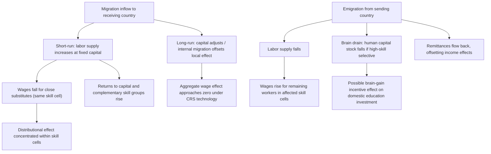

## Effects of Migration on Wages in Sending and Receiving Countries

### Overview

The labor-market impact of migration on wages is among the most empirically contested and methodologically rich areas of international economics. Standard competitive-labor-market theory predicts clear directional effects, but decades of empirical research reveal substantially more nuance, driven by capital adjustment, skill complementarity, and the specific empirical strategy used to identify causal effects.

### The Baseline Competitive Model

#### Simple Labor Supply Shift Framework

In a standard one-sector, one-factor competitive labor market with a downward-sloping labor demand curve, an inflow of migrant workers shifts labor supply rightward, and (holding capital and technology fixed in the short run) the model predicts:

$$\frac{\partial w}{\partial L} < 0$$

**Key Points**

- **Receiving country**: native wages fall (or at minimum, wages of workers who are close substitutes for migrants fall), while returns to capital and complementary factors rise
- **Sending country**: emigration reduces labor supply, predicting a rise in wages for remaining workers, all else equal
- This is the textbook prediction, but real-world outcomes deviate substantially due to capital adjustment, skill heterogeneity, and general equilibrium effects across sectors

### Capital Adjustment and the Long-Run Neutrality Result

**Key Points**

- In a model with a fixed aggregate capital-labor ratio (short run), migration inflows depress wages via diminishing marginal product of labor
- However, if capital is **internationally mobile** or domestically flexible (long run), capital flows in to restore the capital-labor ratio, and the wage effect on average native wages can approach **zero in the long run** under constant-returns-to-scale technology — the classic result that migration primarily affects the *capital owners vs. labor* income split in the short run, with long-run wage effects concentrated in distributional (across skill groups) rather than aggregate terms
- This "long-run neutrality" result underlies why many workhorse trade-and-migration models emphasize **skill-cell-specific** effects rather than aggregate wage effects as the primary margin of interest

### The Skill-Cell Approach: Borjas (2003)

**Key Points**

- Borjas (2003) argues that immigration's wage effects are best identified by grouping workers into **skill cells** defined by education level and years of labor market experience, then examining how immigrant supply shocks within each cell affect wages within that same cell
- This approach treats workers within a skill cell as close substitutes for each other but imperfect substitutes across cells (a nested CES production function structure), addressing the concern that national-level wage regressions dilute the impact by averaging across very different labor market segments
- Borjas's skill-cell estimates find a **negative and economically significant** wage effect of immigration on comparably skilled native workers, with an estimated elasticity in the range that implies a 10% immigrant-induced increase in a skill cell's labor supply reduces wages in that cell by several percentage points — [Unverified] this specific range should be understood as one influential estimate rather than a settled consensus figure, given the substantial subsequent debate over methodology

#### The CES Nested Production Function

$$Q = \left[\sum_{s} \theta_s \left(\sum_{x} \alpha_{sx} L_{sx}^{\rho}\right)^{\sigma/\rho}\right]^{1/\sigma}$$

where $s$ indexes education/skill groups and $x$ indexes experience levels, with $\rho$ and $\sigma$ governing substitution elasticities within and across cells respectively — this nested structure allows the model to distinguish substitution among workers of similar skill/experience from substitution across broader skill categories.

### The Card (2001, 2009) Spatial/City-Level Approach and Its Critique

**Key Points**

- An alternative empirical strategy (Card, 2001, 2009) exploits **geographic variation** — comparing wage/employment outcomes across U.S. cities that received differing shares of immigrant inflows (often using historical settlement patterns as an instrument for the geographic distribution of new immigrants, following the "shift-share" or "Bartik" instrument logic)
- These spatial studies generally find **small or negligible negative wage effects** on native workers at the local labor market level, in contrast to Borjas's national skill-cell estimates
- **Reconciling the divergence**: a key critique (raised by Borjas and others) is that if labor and capital are mobile *across* cities within a country, native workers and capital can relocate away from high-immigration cities, diffusing any local wage effect and making it invisible in cross-city comparisons even if a genuine national-level effect exists — this "internal migration offsetting" mechanism remains a central point of methodological contention

### The Mariel Boatlift Natural Experiment

**Example**

The 1980 Mariel Boatlift — in which roughly 125,000 Cuban migrants arrived in Miami over a few months, increasing the Miami labor force by a documented substantial percentage in a very short period — has served as a key natural experiment for identifying migration's causal wage effect, given its sudden, largely unanticipated nature.

- **Card (1990)**: found minimal effect on Miami wages and unemployment for less-skilled workers, comparing Miami to a set of comparison cities
- **Borjas (2017)**: re-examined the same episode focusing specifically on high-school dropouts (a narrower, arguably more directly affected skill cell) and reported a substantially larger negative wage effect than Card's original study
- **Subsequent re-analyses** (Peri and Yasenov, 2019; Clemens and Hunt, 2019) raised methodological concerns about small sample sizes and comparison-group sensitivity in the dropout-specific subsample, contributing to a continuing, unresolved methodological debate over the "correct" reading of this episode
- This case is widely used pedagogically precisely because it illustrates how the **same natural experiment can yield sharply different conclusions depending on sample definition, comparison group choice, and skill-cell aggregation** — a caution relevant to interpreting the broader migration wage-effect literature

### Effects on Sending Countries

**Key Points**

- Emigration reduces the sending-country labor force, predicted to raise wages for remaining workers — evidence generally more consistently supports this direction, especially in contexts with large, sudden emigration shocks
- **Mishra (2007)**: studies Mexican emigration to the U.S., finding evidence consistent with rising wages in Mexico for skill groups experiencing larger emigration outflows, broadly consistent with the standard labor-supply-shift prediction
- **Brain drain effects**: when emigration is concentrated among highly skilled workers, sending countries may experience reduced human capital stock, potential fiscal losses (if publicly subsidized education emigrates before recouping its social return), though offsetting "brain gain" channels exist — remittances, return migration with enhanced skills, and induced increases in domestic educational investment in response to the *prospect* of migration (the "brain drain incentive effect," per Beine, Docquier, and Rapoport, 2001)
- **Remittances** (covered in a related item) constitute a major offsetting channel — households in sending countries often experience income gains via remittance receipts that substantially exceed the direct wage effects of reduced labor supply, particularly in significant-emigration developing economies

### Synthesis Diagram: Channels of Migration's Wage Effects

### Methodological Lessons

**Key Points**

- The persistent divergence between skill-cell (Borjas-style) and spatial (Card-style) estimates is widely regarded as reflecting **different implicit assumptions about labor and capital mobility across regions**, rather than one approach being simply "correct" and the other "wrong"
- Modern syntheses (e.g., Dustmann, Schönberg, and Stuhler, 2016) emphasize that a **fuller structural model incorporating both national skill-cell substitution and internal geographic mobility/capital adjustment** is needed to reconcile the two literatures, and that "the" migration wage elasticity is not a single universal parameter but depends on the time horizon, geographic scope, and skill-substitutability assumptions of the specific empirical exercise
- [Inference] Given this persistent methodological divergence across two major, carefully executed empirical traditions studying the same underlying phenomenon, point estimates of migration's wage effects from any single study likely warrant treatment as conditional on that study's specific identification strategy rather than as a generalizable universal elasticity

### Related Topics

- Causes and patterns of international labor migration (prior item cross-reference)
- Borjas (2003) skill-cell approach and nested CES labor demand
- Card (1990, 2001, 2009) spatial/city-level approach and shift-share instruments
- Mariel Boatlift natural experiment: Card (1990) vs. Borjas (2017) vs. subsequent re-analyses
- Remittances: determinants and macroeconomic effects (related chapter item)
- Brain drain, brain gain, and the Beine-Docquier-Rapoport (2001) incentive effect
- Dustmann-Schönberg-Stuhler (2016) reconciliation of skill-cell and spatial approaches
- Employment (as opposed to wage) effects of immigration — a related but distinct empirical margin