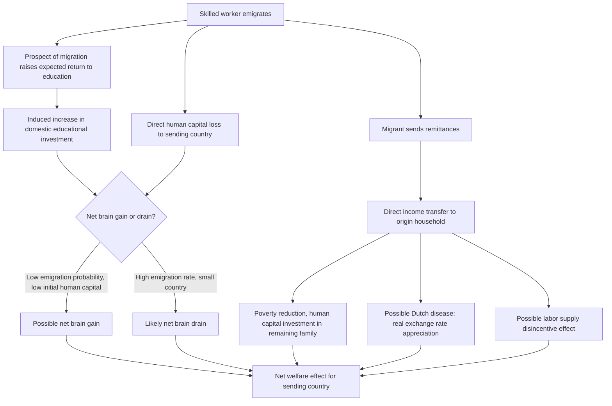

## Brain Drain and Remittances

### Overview

Brain drain and remittances represent two interconnected consequences of high-skill and general labor emigration for sending countries. Brain drain concerns the loss of human capital when educated workers emigrate, while remittances constitute the primary financial return flow from migrants to their origin countries. Together, they determine much of the net welfare calculus of emigration for sending economies, and the theoretical literature has evolved considerably from a purely pessimistic "drain" framing toward a more nuanced view incorporating offsetting channels.

### Brain Drain: Theoretical Foundations

#### The Classical Pessimistic View

**Key Points**

- Early brain drain literature (Bhagwati and Hamada, 1974; Grubel and Scott, 1966) treated skilled emigration as an unambiguous loss for sending countries: publicly subsidized education (primary, secondary, tertiary) generates a fiscal and social return that is lost when the educated worker departs before that return is realized domestically
- This framework motivated policy proposals like the **Bhagwati tax** — a proposed tax on emigrants' foreign earnings, remitted to the origin country, intended to compensate for the lost fiscal investment in the emigrant's education (never widely implemented, but influential in the theoretical literature)
- Under this view, brain drain is analogous to a negative externality: individual migration decisions do not internalize the social cost imposed on those left behind (reduced public goods provision, reduced knowledge spillovers, reduced tax base)

#### The Brain Gain / Incentive Effect: Beine, Docquier, and Rapoport (2001, 2008)

**Key Points**

- A significant theoretical and empirical revision argues that the **prospect** of migration — not just actual departure — can raise the expected return to education, inducing more people to invest in schooling than would have without any migration option
- If only a fraction of those who acquire additional education actually emigrate (due to migration costs, quotas, or selection), the remainder stay behind with elevated human capital, potentially generating a net **"brain gain"** for the sending country even after accounting for actual emigration
- Formally, let $p$ = probability of successful emigration for an educated worker, and suppose education is more valuable abroad ($w_H^{skilled} > w_F^{skilled}$ by a wide margin). The ex-ante expected return to education rises:

$$E[\text{return to education}] = p \cdot w_H^{skilled} + (1-p)\cdot w_F^{skilled}$$

- This can raise domestic educational investment above the no-migration baseline; whether **net** brain gain occurs (i.e., whether the stock of human capital *remaining* in the country, inclusive of this induced investment effect, exceeds what it would have been absent any migration prospect) depends critically on the migration probability $p$ and the elasticity of educational investment with respect to expected returns
- **Empirical findings** (Beine, Docquier, and Rapoport, 2008, cross-country panel analysis) suggest this brain-gain channel is **most likely to dominate for countries with low emigration rates and low initial human capital levels**, while countries experiencing very high skilled-emigration rates (small countries, certain Caribbean and African nations with exceptionally high tertiary-educated emigration rates) are less likely to see net gains, and more likely to experience net brain drain

### Empirical Measurement of Brain Drain

**Key Points**

- Standard measurement: the **skilled emigration rate**, defined as the share of a country's tertiary-educated population residing abroad, typically computed from destination-country census/register data cross-referenced against origin-country education levels (Docquier and Marfouk, 2006, database; updated in Docquier and Rapoport, 2012 survey)
- Emigration rates for the highly skilled are **systematically higher** than for the general population across most developing countries, and are particularly pronounced for very small countries and island nations (structurally limited domestic absorptive capacity for specialized skills) and certain African and Caribbean nations
- Sectoral brain drain is a specific policy concern in health care: physician and nurse emigration rates from certain lower-income countries (particularly in Sub-Saharan Africa and the Caribbean) have been documented at levels raising direct concerns about domestic health system capacity — a widely studied specific case within the broader brain drain literature

### Remittances: Definition and Scale

**Key Points**

- Remittances are cross-border, typically person-to-person financial transfers sent by migrants to family or others in their origin country, recorded in the balance of payments (current account, secondary income) as distinct from FDI, portfolio investment, or aid flows
- Remittances constitute one of the **largest sources of external finance for many developing economies**, in numerous cases exceeding both foreign direct investment and official development assistance received by the same country — a pattern documented consistently in World Bank Migration and Development Brief data over the past two decades
- Remittance flows have historically shown **greater stability** than private capital flows (FDI, portfolio investment) across business cycles and crisis episodes, since migrants often increase remittances specifically in response to adverse shocks (natural disasters, economic downturns) at home — a partially **countercyclical** or income-smoothing pattern documented in several country studies, distinguishing remittances from the typically procyclical pattern of private capital flows

### Determinants of Remittance Flows

Two competing theoretical motives are typically distinguished in the literature:

| Motive | Prediction | Key Reference |
| --- | --- | --- |
| **Altruism** | Remittances rise when origin-household income falls (insurance/smoothing motive) | Lucas and Stark (1985) |
| **Self-interest / exchange** | Remittances tied to investment motives (inheritance, asset purchase, eventual return) — may rise with migrant income and destination-country conditions rather than origin-household need | Lucas and Stark (1985); subsequent literature |
| **Co-insurance / implicit family contract** | Remittances function as part of an implicit intra-family risk-sharing arrangement, response to shocks at both ends | Lucas and Stark (1985); Rapoport and Docquier (2006) survey |

**Key Points**

- Empirically, most studies find remittance behavior consistent with a **mixed motive** — some altruistic income-smoothing response combined with self-interested investment motives, with the relative weight varying by migrant characteristics (e.g., intent to return, family structure)
- Remittances respond positively to migrant destination-country income/employment conditions and negatively (in the altruistic-response direction) to adverse origin-country shocks

### Macroeconomic Effects of Remittances

**Key Points**

- **Poverty reduction**: remittances directly raise recipient household income, with substantial documented poverty-reduction effects in major remittance-receiving countries (extensively studied in Latin America, South Asia, and parts of Africa)
- **Human capital investment**: remittance-receiving households in several studies show increased investment in children's education and health, consistent with remittances relaxing binding liquidity/credit constraints on human capital investment
- **Dutch disease concerns**: large sustained remittance inflows can appreciate the real exchange rate (analogous to a resource-boom "Dutch disease" mechanism), potentially reducing the competitiveness of the tradable sector — this is a debated empirical concern, with mixed evidence on magnitude across country contexts
- **Moral hazard / labor supply effects**: some studies find remittance-receiving households reduce labor force participation (an income effect on leisure-consumption choice), raising questions about remittances' net effect on aggregate domestic output — though findings vary by context and are not universally observed
- **Financial development interaction**: remittances have differential macroeconomic effects depending on the destination financial system's depth — in economies with limited domestic financial development, remittances can substitute for formal credit access; in others, they may be primarily channeled into consumption rather than investment

### Synthesis: Net Welfare Effects Diagram

### Policy Responses and Debates

**Key Points**

- **Diaspora engagement policies**: many sending countries have developed diaspora bonds, dual citizenship provisions, voting rights for citizens abroad, and diaspora investment funds, aiming to capture some of the brain-gain and remittance benefits while maintaining ties with the diaspora
- **Return migration incentives**: some origin countries actively court return migration of skilled emigrants (offering tax incentives, research funding, career pathways), aiming to convert temporary brain drain into eventual "brain circulation"
- **Bilateral labor migration agreements**: some destination countries (particularly in health-worker recruitment) have moved toward "ethical recruitment" frameworks (e.g., WHO Global Code of Practice on the International Recruitment of Health Personnel) attempting to limit recruitment from countries facing acute domestic health worker shortages
- [Inference] Given the mixed and context-dependent empirical findings on both brain drain's net effect and remittances' developmental impact, blanket policy prescriptions (e.g., uniformly restricting skilled emigration, or uniformly encouraging remittance inflows without complementary financial-sector development) likely oversimplify what the literature suggests is a genuinely heterogeneous set of outcomes across countries

### Related Topics

- Causes and patterns of international labor migration (prior item cross-reference — Roy self-selection model)
- Effects of migration on wages in sending and receiving countries (prior item cross-reference)
- Beine-Docquier-Rapoport (2001, 2008) brain gain / incentive effect models
- Docquier-Rapoport (2012) comprehensive brain drain survey ("Globalization, Brain Drain, and Development")
- Lucas-Stark (1985) altruism vs. self-interest remittance motives
- Dutch disease and real exchange rate effects of large capital/remittance inflows
- WHO Global Code of Practice on international health worker recruitment
- Diaspora bonds and diaspora-oriented development finance instruments