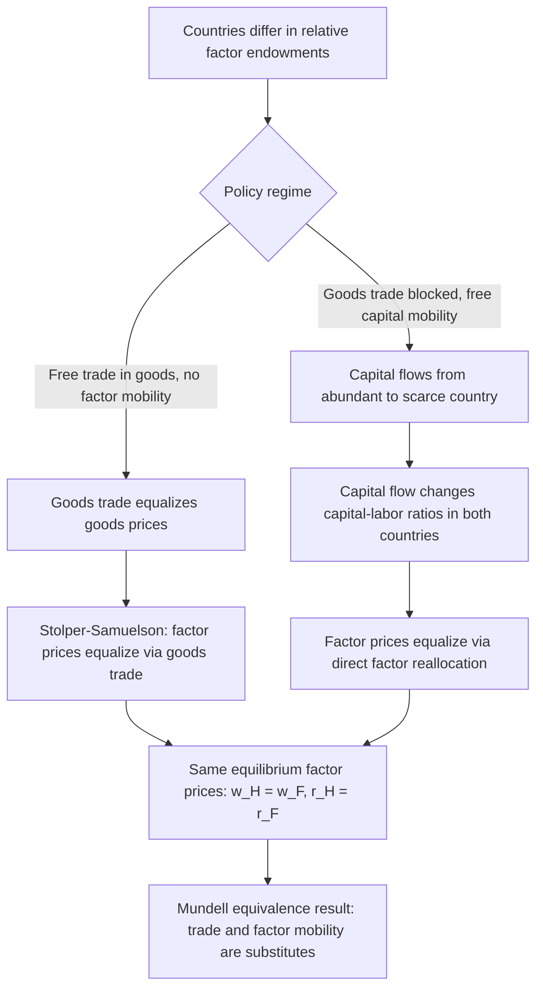

## International Capital Mobility and the Mundell Equivalence Result

### Overview

The Mundell (1957) equivalence result is a foundational theorem in international economics establishing that, under specific idealized conditions, free international factor mobility (capital or labor) can substitute perfectly for free trade in goods — both mechanisms achieve the same equalization of factor prices and the same efficient allocation of world resources. This result reframes the relationship between trade policy and factor-movement policy as, in principle, interchangeable tools for achieving international economic integration.

### Setting: The Standard Heckscher-Ohlin Framework

**Key Points**

- Mundell's analysis is set within a two-country, two-good, two-factor Heckscher-Ohlin model, where countries differ in relative factor endowments (e.g., Home is capital-abundant, Foreign is labor-abundant)
- The Heckscher-Ohlin theorem predicts that under free trade in goods (with no factor mobility), trade alone drives **factor price equalization (FPE)**: relative and, under specific conditions (identical technology, incomplete specialization, no factor-intensity reversals), absolute factor prices equalize across countries even without any physical movement of capital or labor
- Mundell's question: what happens if, *instead* of allowing goods to move freely, we prevent goods trade (autarky in goods, e.g., via prohibitive tariffs) but allow capital (or labor) to move freely instead?

### The Core Equivalence Result

**Key Points**

- Mundell (1957) shows that under sufficiently idealized conditions — identical technologies across countries, constant returns to scale, no factor-intensity reversals, perfect competition, and (critically) that goods trade under the counterfactual free-trade scenario would have led to **incomplete specialization** (both countries producing both goods) — a tariff-induced prohibition on goods trade **combined with free factor mobility** replicates the **same** equilibrium (same factor prices, same welfare, same effective resource allocation) as free trade in goods with no factor mobility
- The formal logic: if goods trade would equalize factor prices via the Stolper-Samuelson/factor-price-equalization mechanism, then directly allowing the factor whose price differs most (or any freely mobile factor, under the theorem's conditions) to move achieves the identical equalization directly, without requiring goods to cross borders at all
- This is often summarized as: **"trade in goods and trade in factors are perfect substitutes"** under the theorem's specific assumptions

### Formal Intuition via the Factor Price Equalization Mechanism

Consider Home (capital-abundant, wage-rental ratio $\omega_H$ low relative to Foreign) and Foreign (labor-abundant, $\omega_F$ high).

**Free trade in goods (no factor mobility):**

$$\omega_H = \omega_F \quad \text{(via Stolper-Samuelson through goods price equalization)}$$

**Goods trade prohibited, capital fully mobile:**

Capital flows from Home (low return, since capital-abundant) to Foreign (high return, since capital-scarce) until:

$$r_H = r_F$$

Under Mundell's assumptions, this capital flow **simultaneously** re-equalizes wages: as capital flows to Foreign, Foreign's capital-labor ratio rises, raising Foreign's wage and lowering Foreign's rental rate toward Home's levels, achieving the same $(w_H, r_H) = (w_F, r_F)$ outcome as free goods trade would have produced.

### Diagram: The Equivalence Mechanism

### Necessary Conditions for Exact Equivalence

**Key Points**

The equivalence result is a knife-edge theoretical benchmark, not a general empirical prediction — it relies on a demanding set of conditions:

1. **Identical production technologies** across countries (no technological differences that would independently drive comparative advantage, as in Ricardian models)
2. **Constant returns to scale** in production
3. **No factor-intensity reversals** (the capital-intensive good must remain capital-intensive at all relevant relative factor prices)
4. **Incomplete specialization** under the counterfactual free-trade equilibrium (both countries produce both goods) — if free trade would have led to complete specialization, the equivalence breaks down because goods trade alone would not have achieved full factor price equalization in the first place
5. **Perfect competition** and no trade costs, transport costs, or other frictions in either the goods or factor markets being compared
6. **Two goods, two factors** (the classic 2x2 Heckscher-Ohlin structure); the result's cleanliness is less robust in higher-dimensional factor/goods spaces

### Relationship to the Broader Trade-Migration Substitutability Debate

**Key Points**

- This theoretical result underlies the intuition (referenced in the "Causes and patterns of international labor migration" item) that trade liberalization and migration liberalization can, in principle, function as **alternative routes** to the same economic integration outcome
- **Policy implication (stylized)**: a country resistant to allowing immigration might, under Mundell-consistent conditions, achieve similar wage-equalizing effects through deeper trade liberalization instead — a logic sometimes invoked (with appropriate caveats about the theorem's restrictive assumptions) in debates over whether expanding trade with labor-abundant countries can serve as a partial substitute for accepting migrant labor directly
- **Important caveat**: this substitutability logic is frequently **oversimplified** in policy discourse; the exact conditions required for true equivalence (identical technology, no factor-intensity reversals, incomplete specialization, zero frictions) rarely hold in practice, and richer models with multiple goods, differentiated products (as in New Trade Theory/NNTT), or Ricardian technology differences generally do not preserve exact equivalence

### Departures from Exact Equivalence in Richer Models

**Key Points**

- **Ricardian technology differences**: if countries differ in technology (not just factor endowments), trade and factor mobility are generally **not** perfect substitutes — factor movements respond to productivity differences in ways that goods trade alone cannot replicate, since goods trade under Ricardian comparative advantage is driven by relative productivity, not factor endowment differences per se
- **Increasing returns and product differentiation** (Krugman/Melitz-style models): with monopolistic competition and love-of-variety effects, trade in differentiated goods generates welfare gains (variety gains) that pure factor mobility does not replicate, and vice versa — factor mobility can generate agglomeration effects (New Economic Geography, Krugman 1991) that have no clean goods-trade analog
- **Trade costs and migration costs differ structurally**: in practice, the costs of moving goods (transport, tariffs) versus moving people (visa restrictions, relocation costs, family separation, imperfect skill transferability) are governed by very different economic and political-economy forces, undermining the clean substitutability intuition even where the underlying theoretical mechanism is valid
- [Inference] Given how restrictive the exact equivalence conditions are, the Mundell result is probably best understood in modern trade theory primarily as a clarifying theoretical benchmark illustrating the *conceptual* relationship between goods trade and factor mobility, rather than as a directly applicable empirical prediction about real-world trade-versus-migration policy trade-offs

### Complementarity Case: When Trade and Factor Mobility Reinforce Each Other

**Key Points**

- The Mundell framework describes **substitutability** under HO-consistent conditions, but subsequent literature identifies conditions under which trade and factor mobility instead **complement** each other:
- **Markusen (1983)** shows that in the presence of certain market distortions, economies of scale, or differences in technology/factor-intensity reversals, factor mobility and trade can be complements rather than substitutes — increased factor mobility can *increase* rather than decrease the volume of goods trade
- This complementarity view is more consistent with the empirical finding (discussed in the migration item) that migrant networks often **facilitate** rather than substitute for bilateral trade (Rauch and Trindade, 2002), since diaspora networks reduce information and contract-enforcement frictions in goods trade even as labor also moves
- This suggests real-world evidence more often supports the **Markusen complementarity** case than the strict **Mundell substitutability** case, reflecting the fact that real economies routinely violate one or more of Mundell's restrictive equivalence conditions (multiple goods, product differentiation, technology differences, network-based frictions)

### Related Topics

- Heckscher-Ohlin model and factor price equalization theorem (foundational prerequisite)
- Stolper-Samuelson theorem and its role in the equivalence mechanism
- Markusen (1983) complementarity result and departures from Mundell substitutability
- Causes and patterns of international labor migration (related chapter item — trade/migration substitutability discussion)
- Krugman (1991) New Economic Geography and agglomeration effects from factor mobility
- Foreign direct investment as a form of capital mobility distinct from portfolio capital flows
- Rauch-Trindade (2002) migrant networks and trade facilitation (complementarity evidence)