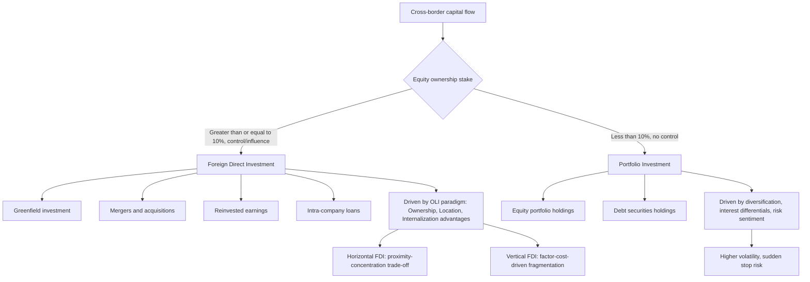

## Foreign Direct Investment versus Portfolio Capital Flows

### Overview

International capital flows are conventionally divided into foreign direct investment (FDI) and portfolio investment, distinguished primarily by the degree of control and management involvement the investor retains. This distinction is central to international economics because the two flow types differ substantially in their theoretical drivers, volatility, and macroeconomic consequences for recipient economies.

### Defining Distinction: Control versus Passive Holding

**Key Points**

- **Foreign Direct Investment (FDI)**: an investment involving a **lasting interest and significant degree of influence or control** by a resident entity in one economy over an enterprise resident in another economy. The IMF Balance of Payments Manual (BPM6) and OECD Benchmark Definition use a **10% equity ownership threshold** as the conventional statistical criterion for classifying an investment as FDI rather than portfolio investment
- **Portfolio Investment**: cross-border holdings of equity or debt securities that do **not** confer significant management control — typically below the 10% ownership threshold, encompassing purchases of foreign stocks, bonds, and money market instruments primarily for financial return rather than operational control
- This threshold is a statistical convention, not a bright-line economic distinction; a 9% stake with board representation can carry more effective control than an 11% purely passive stake, but the balance-of-payments classification follows the threshold rule

### Subcategories of FDI

| FDI Type | Description |
| --- | --- |
| **Greenfield investment** | Building new productive facilities/operations from scratch in the host country |
| **Mergers and acquisitions (M&A)** | Acquiring existing controlling stakes in host-country firms |
| **Reinvested earnings** | Profits generated by an existing foreign affiliate that are reinvested locally rather than repatriated |
| **Intra-company loans** | Debt financing between parent and affiliate, counted as FDI under BPM6 |

### Theoretical Drivers of FDI

#### The OLI (Eclectic) Paradigm — Dunning (1977, 1993)

**Key Points**

The dominant theoretical framework for explaining *why* firms undertake FDI (rather than exporting or licensing) rests on three conditions that must jointly hold:

1. **Ownership advantages (O)**: the firm possesses firm-specific intangible assets (proprietary technology, brand, managerial expertise) that can be transferred across borders within the firm at low cost
2. **Location advantages (L)**: the host country offers location-specific benefits (lower production costs, market access, natural resources, favorable regulatory environment) that make producing there more attractive than producing at home and exporting
3. **Internalization advantages (I)**: it is more efficient for the firm to exploit its ownership advantage internally (via FDI, keeping the transaction within the firm) than to license or contract with an independent local firm (avoiding contracting/hold-up problems, protecting proprietary knowledge from expropriation or imitation)

Only when all three (O, L, I) conditions hold does FDI dominate the alternative modes of serving a foreign market (exporting, licensing) — this is why the framework is called the "eclectic paradigm," synthesizing multiple prior theoretical strands (industrial organization, location theory, internalization theory).

#### Horizontal versus Vertical FDI

**Key Points**

- **Horizontal FDI**: replicates similar production activities in multiple countries, primarily to serve local markets directly (avoiding trade costs) — theoretically modeled via the "proximity-concentration trade-off" (Brainard, 1997; Markusen, 2002), where firms weigh the fixed cost of establishing a second plant against the variable trade costs saved by producing locally rather than exporting
- **Vertical FDI**: fragments the production process across countries to exploit factor-price/cost differences at different stages of production (e.g., locating labor-intensive assembly stages in labor-abundant countries) — closely related to the broader literature on global value chains and offshoring (Antràs and Helpman, 2004, discussed in the firm-heterogeneity chapter)
- Empirically, most large multinational firms exhibit **complex/mixed strategies** combining horizontal and vertical motives across their affiliate networks, and much applied research (e.g., Yeaple, 2003) models "knowledge-capital" hybrid frameworks nesting both motives

### Theoretical Drivers of Portfolio Investment

**Key Points**

- Portfolio flows are primarily driven by **standard international asset-pricing and portfolio-diversification motives**: investors hold foreign securities to diversify risk (given imperfectly correlated returns across countries) and to capture expected excess returns
- Key theoretical frameworks: international CAPM extensions, the "home bias in equity" puzzle (French and Poterba, 1991) — the empirical finding that investors hold far less foreign equity than standard diversification models predict, analogous in spirit to the trade "border puzzle" discussed earlier in this document
- Portfolio flows respond strongly to interest rate differentials, exchange rate expectations, relative growth prospects, and global risk sentiment ("risk-on/risk-off" cycles), making them considerably more sensitive to short-term macroeconomic and financial conditions than FDI

### Volatility and Stability Comparison

**Key Points**

- FDI is widely characterized in the literature as the most **stable** category of capital flow, reflecting its long-horizon, control-oriented nature — multinational firms do not typically liquidate productive facilities in response to short-term market fluctuations
- Portfolio flows (particularly portfolio debt and short-term flows more broadly) are considerably more volatile and prone to **sudden stops and reversals** during crisis episodes, a pattern extensively documented in the emerging-market financial crisis literature (Calvo, 1998; Forbes and Warnock, 2012, on capital flow "waves, surges, stops, and flight")
- This differential stability has significant implications for financial stability policy: many emerging-market policymakers and international institutions (IMF) have historically expressed a **preference for FDI over portfolio inflows** in the composition of a country's capital account, given FDI's lower propensity for destabilizing reversal

### Comparative Summary Table

| Dimension | FDI | Portfolio Investment |
| --- | --- | --- |
| Control | Significant management influence (≥10% threshold) | Passive holding, no control |
| Time horizon | Long-term, illiquid | Often short-to-medium term, liquid |
| Primary driver | OLI paradigm: ownership, location, internalization advantages | Risk-return diversification, interest rate differentials |
| Volatility | Relatively stable | More volatile, prone to sudden stops |
| Technology/knowledge transfer | Often significant (managerial, technological spillovers) | Minimal direct transfer |
| Statistical threshold | ≥10% equity ownership (BPM6/OECD) | <10% equity, or debt securities |
| Typical crisis behavior | Resilient, gradual adjustment | Sharp reversals, "flight to safety" |

### Diagram: Classification and Flow Framework

### Spillover Effects and Host-Country Impacts

**Key Points**

- FDI is frequently associated with **positive productivity spillovers** to host-country domestic firms through several channels: demonstration effects (local firms learning from observing multinational practices), labor mobility (workers trained at multinationals moving to domestic firms), vertical linkages (multinational demand for local suppliers raising supplier productivity standards), and competition effects (forcing domestic firm efficiency improvements)
- Empirical evidence on the magnitude of these spillovers is **mixed** across the literature — some studies find robust positive spillovers, particularly through backward (supplier) linkages, while others find limited or even negative effects on directly competing domestic firms in the same industry (competition/crowding-out effects) — [Inference] this mixed pattern likely reflects genuine heterogeneity across host-country absorptive capacity, sector, and the specific channel studied, rather than indicating a single settled magnitude
- Portfolio investment's host-country effects operate through different channels: enhancing domestic stock market liquidity and depth, lowering the cost of capital for domestic firms with access to international investors, but also potentially amplifying domestic asset price volatility and contributing to boom-bust credit cycles when portfolio inflows are large relative to domestic financial market size

### Statistical and Policy Classification Notes

**Key Points**

- The balance of payments records both flow types in the **financial account**; FDI and portfolio investment are reported alongside other investment (bank loans, trade credit) and reserve assets as the standard BPM6 financial account subcategories
- Some countries impose differential capital control regimes based on this classification — e.g., liberalizing FDI inflows relatively early in a financial liberalization sequence while maintaining tighter controls on portfolio and short-term debt flows, a sequencing strategy broadly consistent with the stability-ordering discussed above (McKinnon, 1973, and subsequent capital account liberalization sequencing literature)
- The **10% threshold's** somewhat arbitrary nature creates known measurement issues: large sovereign wealth funds or institutional investors sometimes cross the FDI threshold for what are, in substance, portfolio-style diversification purposes, complicating clean interpretation of aggregate FDI statistics in some contexts

### Related Topics

- Dunning's OLI (eclectic) paradigm and multinational enterprise theory
- Horizontal vs. vertical FDI: proximity-concentration trade-off (Brainard, 1997; Markusen, 2002)
- Antràs-Helpman (2004) property-rights model of offshoring and vertical FDI (cross-reference to firm heterogeneity chapter)
- Sudden stops and capital flow reversals (Calvo, 1998; Forbes-Warnock, 2012)
- Home bias in equity holdings (French-Poterba, 1991)
- Capital account liberalization sequencing (McKinnon, 1973, and successors)
- FDI spillover effects on host-country domestic firm productivity
- International capital mobility and the Mundell equivalence result (related chapter item — factor mobility theory)