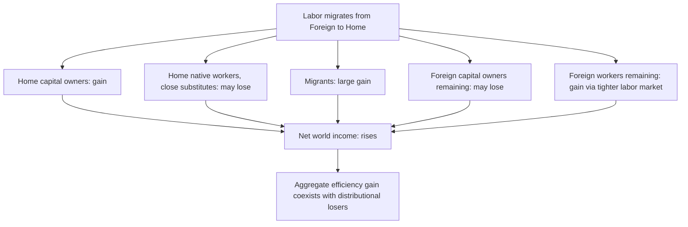

## Welfare Effects of International Factor Mobility

### Overview

This item synthesizes the welfare consequences of international factor mobility — both labor migration and capital movement — building on the individual mechanisms covered in preceding chapter items (migration wage effects, brain drain/remittances, the Mundell equivalence result, and FDI versus portfolio flows). The central analytical tool is the standard gains-from-factor-mobility framework, which decomposes welfare changes into effects on factor owners, non-mobile factor owners, and aggregate world/national income, while highlighting the distributional tensions that pure efficiency analysis can obscure.

### The Baseline Efficiency Gains Framework

#### World Output Gains from Factor Reallocation

**Key Points**

- In the standard two-country model with diminishing marginal returns to a mobile factor (labor or capital), the mobile factor migrates from where its marginal product is low to where it is high, until marginal products (and thus factor returns) equalize
- This reallocation **necessarily raises world output/income**, since factor units move to their higher-productivity use — a direct application of the general principle that removing a market segmentation (here, geographic barriers to factor movement) weakly increases aggregate efficiency
- The classic MRP (marginal revenue product) diagram illustrates this: plotting the marginal product of labor (or capital) in Home and Foreign against each other on a shared horizontal axis representing the total world factor stock, free mobility equalizes the marginal products, and the area between the two MRP curves over the range of factor movement represents the **world efficiency gain**

$$\Delta \text{World Income} = \int_{L_0}^{L_1}[MPL_F(L) - MPL_H(L)]\,dL > 0$$

where $L_0$ is the pre-mobility allocation and $L_1$ is the post-mobility equilibrium allocation of the mobile factor.

### Distributional Decomposition: Who Gains, Who Loses

**Key Points**

This is the analytically crucial point often obscured by aggregate efficiency-gain framing: **the aggregate gain is not evenly distributed**, and specific groups can be made worse off even as world/national income rises.

For labor migration (mobile factor = labor, moving from Foreign to Home):

- **Home immobile factor owners (capital owners)**: gain, as increased labor supply raises the marginal product of capital
- **Home labor (native workers, close substitutes for migrants)**: may lose, as increased labor supply depresses wages for comparable skill groups (per the "Effects of migration on wages" item)
- **Migrants themselves**: gain substantially — this is often the **largest component** of the aggregate welfare gain in migration-focused analyses, since migrants typically move toward much higher marginal products of their labor
- **Foreign immobile factor owners (capital owners remaining in sending country)**: may lose, as reduced labor supply lowers the marginal product of Foreign capital
- **Foreign labor (remaining, non-migrating workers)**: gain, as reduced labor supply raises wages for remaining workers (per Mishra, 2007, evidence cited in the wage effects item)

### Diagram: Distributional Decomposition of Migration Welfare Gains

### The Overwhelming Magnitude of Migrant Gains: "Trillion Dollar Bills"

**Key Points**

- A distinctive feature of the migration welfare literature (distinguishing it from most goods-trade welfare analysis) is the finding that **the gains accruing to migrants themselves dwarf** essentially all other components of the welfare calculation
- **Clemens (2011)**, in an influential survey titled "Economics and Emigration: Trillion-Dollar Bills on the Sidewalk?", synthesizes estimates suggesting that removing all remaining barriers to labor mobility could generate gains on the order of a **large multiple of global GDP** — vastly exceeding estimated gains from completing remaining global goods-trade or capital-account liberalization
- This arises because wage gaps for *otherwise-identical workers* across the migration-restricted border (i.e., holding worker skill/observable characteristics constant) are enormous — often several-fold — reflecting that migration restrictions are, in efficiency terms, a much larger and more binding distortion than most remaining goods-trade barriers
- [Inference] Because these estimates depend heavily on assumptions about the counterfactual (fully open borders, an extreme scenario far outside historical experience) and on how much of the observed wage gap reflects pure location/mobility barriers versus unobserved worker productivity differences correlated with the decision to have not yet migrated, the specific magnitude of these estimates should be treated as illustrative of an order-of-magnitude argument rather than precise point predictions

### Welfare Effects of Capital Mobility: FDI and Portfolio Flows

**Key Points**

- The same basic efficiency-gains logic applies to capital: capital flows from capital-abundant, low-return locations to capital-scarce, high-return locations, raising world output and generating analogous distributional splits (Home labor gains from more capital to work with; Home capital owners face lower domestic returns due to outflow competition, though this depends on portfolio diversification benefits also accruing to them)
- **FDI-specific welfare channels** (building on the "FDI versus portfolio" item): beyond pure capital-return equalization, FDI can generate additional welfare effects through technology and knowledge spillovers to host-country firms, though (as previously noted) the empirical magnitude of these spillovers is genuinely mixed across studies
- **Portfolio flow welfare effects**: primarily operate through risk-diversification gains (consumption-smoothing benefits from holding internationally diversified asset portfolios) rather than through the productive-efficiency channel central to FDI and labor migration welfare analysis — though excessive portfolio flow volatility (sudden stops) can generate real welfare *costs* through financial crisis channels not present in the simple efficiency-gains framework

### Second-Best Considerations and Complications

**Key Points**

- The clean efficiency-gains-from-mobility result relies on the standard first-best assumptions (perfect competition, no externalities, no pre-existing distortions) — in the presence of **pre-existing distortions**, factor mobility's welfare effects become theoretically ambiguous (a standard "theory of the second best" caveat applicable broadly across trade and factor-mobility analysis)
- **Fiscal externalities**: migration can generate fiscal spillovers not captured in the pure marginal-product framework — migrants' net fiscal contribution (taxes paid minus public services/benefits consumed) can be positive or negative depending on migrant skill composition, host-country welfare state generosity, and age/dependency structure, a distinct welfare channel studied extensively in the public finance literature on immigration (e.g., National Academies of Sciences, 2017, comprehensive U.S. fiscal impact study)
- **Congestion and public goods**: migration can generate congestion costs in housing, infrastructure, and public services not reflected in a pure labor-market marginal-product framework, particularly in the short-to-medium run before capital/infrastructure adjustment
- **Brain drain externalities**: as covered in the brain drain item, sending-country welfare effects extend beyond the direct labor-market channel to include human-capital externalities and fiscal externalities (lost return on publicly financed education)

### Comparing Migration and Trade Welfare Gains: A Synthesis

| Channel | Typical Estimated Magnitude (relative to GDP) | Key Driver |
| --- | --- | --- |
| Remaining goods trade liberalization | Relatively modest (existing barriers already low in many sectors) | Small remaining tariff/NTB wedges |
| Capital account liberalization | Moderate | Remaining capital-return gaps, partially arbitraged already |
| Full labor mobility liberalization | Very large (per Clemens, 2011, "trillion-dollar bills" framing) | Enormous remaining cross-border wage gaps for observably similar workers |

**Key Points**

- This stark magnitude comparison is one of the most cited findings in the modern factor-mobility welfare literature, and helps explain why development economists have increasingly emphasized labor mobility policy as a potentially high-return (if politically difficult) development and poverty-reduction lever, comparable to or exceeding many traditional trade and aid-based development interventions
- **Political economy caveat**: the same distributional analysis explaining large aggregate gains also explains persistent political resistance — the losers from migration (native workers who are close substitutes, in the standard model) are typically a **concentrated, domestically enfranchised** group, while the largest gainers (migrants themselves) are, prior to migrating, **not part of the domestic political process** in the destination country — a structural asymmetry in political voice that likely helps explain why migration barriers remain far more binding than most goods-trade barriers despite the comparatively larger estimated efficiency costs

### Related Topics

- Effects of migration on wages in sending and receiving countries (prior item cross-reference)
- Brain drain and remittances (prior item cross-reference — sending-country welfare channels)
- International capital mobility and the Mundell equivalence result (prior item cross-reference — theoretical link between trade and factor mobility welfare)
- Foreign direct investment versus portfolio capital flows (prior item cross-reference)
- Clemens (2011) "Trillion Dollar Bills on the Sidewalk" survey
- National Academies of Sciences (2017) fiscal impact of immigration study
- Political economy of migration policy and the concentrated-losers/diffuse-or-disenfranchised-gainers asymmetry
- Theory of the second best as applied to factor mobility welfare analysis