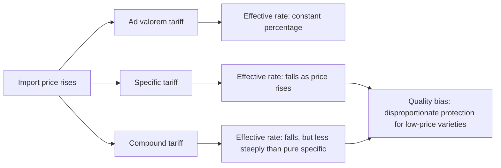

## Specific, Ad Valorem, and Compound Tariffs

### Overview

Tariff structure — the manner in which a tariff is levied — is a foundational classification in the study of trade policy instruments. The choice between specific, ad valorem, and compound tariff structures has significant implications for revenue predictability, protective effectiveness under price fluctuations, administrative complexity, and distributional incidence across quality tiers of goods.

### Ad Valorem Tariffs

**Key Points**

- An ad valorem tariff is levied as a **fixed percentage of the value** of the imported good
- Tariff revenue per unit: $T = t \times p_w$, where $t$ is the ad valorem rate and $p_w$ is the world (pre-tariff) price
- The domestic price becomes:

$$p_d = p_w(1+t)$$

- **Advantages**: automatically scales with the value of the good, so protection remains proportionally constant regardless of price level or inflation; widely used in modern tariff schedules and is the dominant form in WTO tariff bindings, since it is easily comparable across product categories and negotiable in percentage terms
- **Disadvantages**: requires accurate valuation of imported goods (the customs value), creating scope for **transfer pricing manipulation** and under-invoicing fraud, since the tariff liability depends directly on the declared value — a persistent customs administration challenge, particularly in economies with weaker enforcement capacity

### Specific Tariffs

**Key Points**

- A specific tariff is levied as a **fixed monetary amount per physical unit** of the imported good (e.g., $500 per imported vehicle, $2 per kilogram of imported cheese), independent of the good's value
- Domestic price: $p_d = p_w + s$, where $s$ is the specific tariff amount per unit
- **Advantages**: simple to administer (no valuation dispute required, just counting/weighing/measuring physical units), harder to evade via under-invoicing, and provides more predictable per-unit revenue for the government regardless of price fluctuations
- **Disadvantages**: the **effective ad valorem equivalent falls as the price of the good rises** (a specific tariff of $2/kg is a much higher effective percentage tax on a $5/kg good than on a $50/kg good) — this creates a systematically **regressive protective effect across quality tiers**, disproportionately protecting/taxing lower-priced varieties relative to higher-priced varieties of the same product category
- Also disadvantageous under inflation: a specific tariff's real protective value erodes over time unless periodically adjusted, unlike an ad valorem tariff which automatically maintains constant proportional protection

### Formal Comparison of Effective Protection Across Price Levels

For a specific tariff $s$, the **effective ad valorem equivalent** at world price $p_w$ is:

$$t_{eff} = \frac{s}{p_w}$$

**Example**

Consider a specific tariff of $3 per unit applied to two variants of the same product category:

- Low-price variant, $p_w = \$10$: effective ad valorem equivalent $= 3/10 = 30\%$
- High-price variant, $p_w = \$100$: effective ad valorem equivalent $= 3/100 = 3\%$

This tenfold difference in effective protection illustrates the **quality bias** inherent in specific tariffs — they disproportionately restrict trade in and protect against lower-quality/lower-priced varieties, a pattern extensively documented in the trade policy literature on tariff structure and product quality (e.g., studies of specific tariffs' effect on import quality upgrading, sometimes termed the "Alchian-Allen effect" in a related but distinct context of relative price effects on quality composition of trade).

### Compound Tariffs

**Key Points**

- A compound tariff combines **both** a specific and an ad valorem component, applied simultaneously to the same import
- Domestic price: $p_d = p_w(1+t) + s$
- Rationale: compound tariffs are sometimes used to combine the administrative/anti-fraud advantages of a specific component with the value-proportional scaling of an ad valorem component, or to achieve a particular combined protective profile (e.g., ensuring a minimum floor of protection via the specific component while still scaling partially with value via the ad valorem component)
- Common in tariff schedules for select product categories (historically prevalent in agricultural and textile tariff lines in various countries' schedules, including certain U.S. and EU tariff lines), though ad valorem-only structures dominate the majority of modern tariff schedules by tariff-line count

### Comparison Table

| Tariff Type | Formula | Revenue Predictability | Quality/Price Bias | Administrative Requirement | Inflation Sensitivity |
| --- | --- | --- | --- | --- | --- |
| Ad valorem | $t \times p_w$ | Scales with import value (revenue volatile with price) | Neutral across quality tiers | Requires customs valuation | Automatically adjusts |
| Specific | Fixed $s$ per unit | Stable per-unit revenue | Regressive: higher effective rate on low-price goods | Requires unit measurement only | Erodes in real terms |
| Compound | $t \times p_w + s$ | Mixed | Partial bias, dampened relative to pure specific | Requires both valuation and unit measurement | Partially erodes |

### Diagram: Effective Protection Rate Across Price Levels

### Illustrative Visualization: Effective Ad Valorem Equivalent vs. Price

<svg xmlns="http://www.w3.org/2000/svg" viewBox="0 0 640 340">
<text x="320" y="24" text-anchor="middle" font-size="15" font-weight="bold" fill="#1a1a1a">Effective Ad Valorem Equivalent by Tariff Type (svg_diagram)</text>
<line x1="70" y1="290" x2="600" y2="290" stroke="#333" stroke-width="2" />
<line x1="70" y1="290" x2="70" y2="50" stroke="#333" stroke-width="2" />
<text x="335" y="318" text-anchor="middle" font-size="13" fill="#333">World Price of Good (p_w)</text>
<text x="35" y="170" text-anchor="middle" font-size="13" fill="#333" transform="rotate(-90 35 170)">Effective Ad Valorem Rate</text>
<line x1="70" y1="120" x2="600" y2="120" stroke="#4477aa" stroke-width="2.5" />
<text x="540" y="112" font-size="12" fill="#4477aa" font-weight="bold">Ad valorem (constant %)</text>
<path d="M 90 60 Q 150 140 250 200 Q 350 240 450 262 Q 520 272 590 278" fill="none" stroke="#cc3333" stroke-width="2.5" />
<text x="430" y="245" font-size="12" fill="#cc3333" font-weight="bold">Specific (s/p_w, falls with price)</text>
<path d="M 90 90 Q 150 150 250 195 Q 350 220 450 235 Q 520 240 590 244" fill="none" stroke="#228833" stroke-width="2.5" stroke-dasharray="6,3" />
<text x="420" y="205" font-size="12" fill="#228833" font-weight="bold">Compound (blended)</text>
<circle cx="150" cy="102" r="4" fill="#cc3333" />
<text x="120" y="95" font-size="11" fill="#333">Low-price good: high effective rate</text>
<circle cx="500" cy="270" r="4" fill="#cc3333" />
<text x="410" y="288" font-size="11" fill="#333">High-price good: low effective rate</text>
</svg>

### Policy and Empirical Relevance

**Key Points**

- **Tariff schedule design choice**: countries negotiating WTO tariff bindings predominantly bind rates in **ad valorem terms** for transparency and cross-country comparability, though specific and compound rates persist in certain sensitive sectors (agriculture, textiles, footwear) partly for the administrative and quality-bias reasons discussed
- **Ad valorem equivalent (AVE) conversion**: for trade policy analysis and gravity-model tariff data construction (relevant to the earlier "Trade costs" and "Estimating trade elasticities" items), specific and compound tariffs must be converted into ad valorem equivalents using reference/unit-value price data, a standard step in constructing datasets like WTO's Consolidated Tariff Schedules or UNCTAD TRAINS — this conversion introduces its own measurement uncertainty since it depends on the reference price/unit value used
- **Trade policy incidence on developing-country exporters**: because developing-country exports are often concentrated in lower-price-per-unit product varieties within a given tariff line, specific tariffs in destination markets can impose disproportionately higher effective protection against precisely the price segment developing-country exporters are most likely to supply — a distributional concern noted in development-oriented trade policy analysis
- [Inference] Given the quality-bias mechanism, specific tariffs likely have a systematic (if often modest in aggregate trade-weighted terms) effect of shifting the composition of admitted imports toward higher-quality/higher-priced varieties within an affected product category, though the empirically estimated magnitude of this quality-upgrading effect varies by product and study

### Related Topics

- Effective rate of protection and the distinction from nominal tariff rates (related chapter item)
- Ad valorem equivalent (AVE) conversion methodology for non-ad-valorem tariffs
- Tariff schedule structure in WTO bindings and applied rates (bound vs. applied gap, "water in the tariff")
- Quality-bias effects of specific tariffs on trade composition ("Alchian-Allen"-adjacent literature)
- Trade costs: distance, tariffs, and trade facilitation (prior chapter item cross-reference)
- Customs valuation methods and under-invoicing/transfer-pricing fraud risk
- Non-tariff barriers as complementary or alternative protection instruments