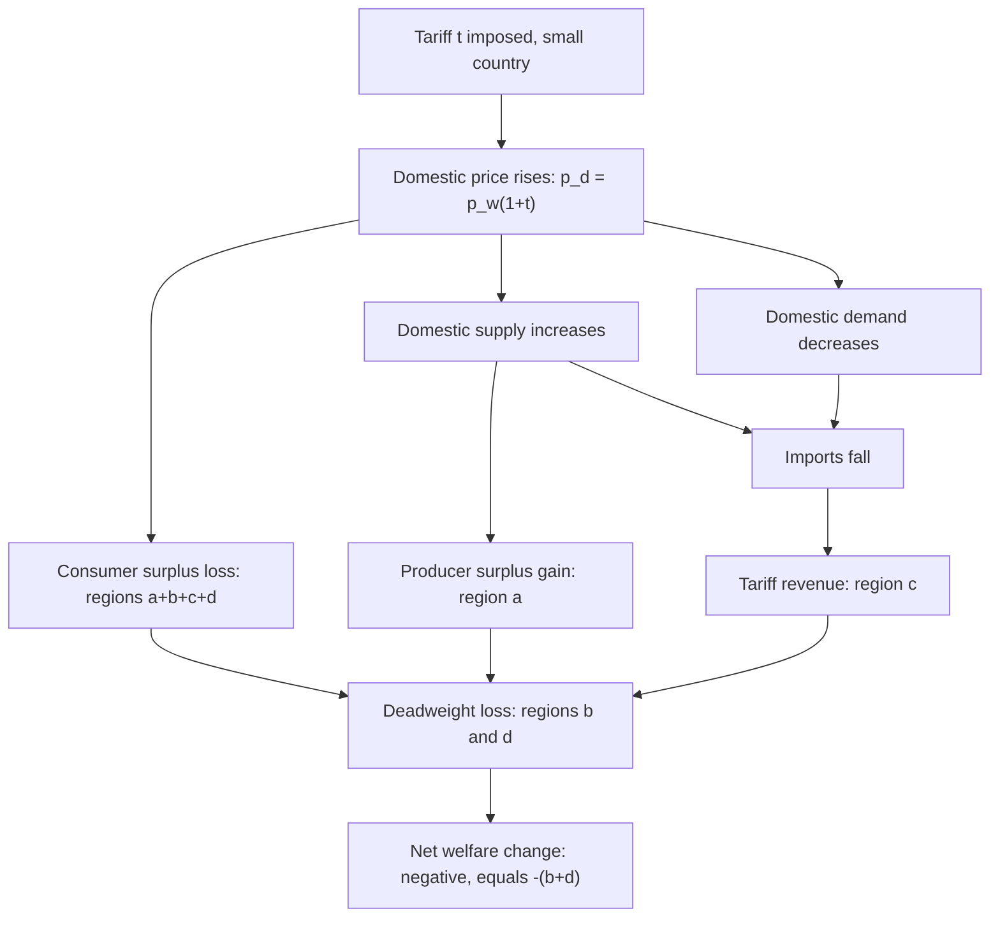
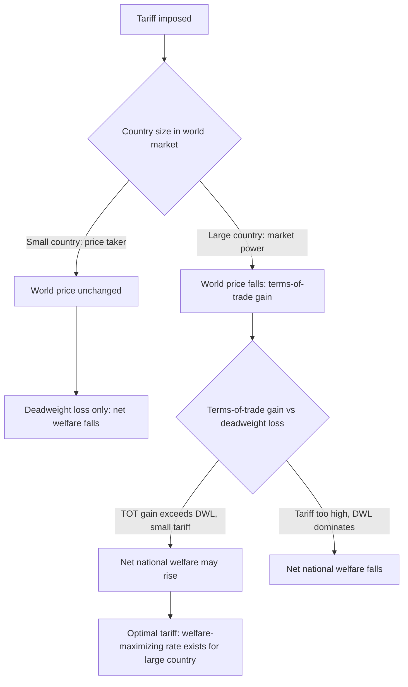

## Partial Equilibrium Effects of a Tariff

### Overview

The partial equilibrium tariff model is the foundational analytical tool for evaluating a tariff's effects on price, quantity, and welfare within a single market, holding conditions in all other markets constant. It decomposes the welfare consequences of protection into consumer surplus losses, producer surplus gains, government revenue, and deadweight losses, and distinguishes the small-country and large-country cases based on whether the importing country has market power over the world price.

### Setup: Supply, Demand, and the World Price

**Key Points**

- Domestic supply curve $S$ and domestic demand curve $D$ for a homogeneous good, both functions of the domestic price $p_d$
- The country is assumed to be an importer of the good in free trade: at the world price $p_w$, domestic demand exceeds domestic supply, with the gap filled by imports
- **Small-country assumption** (baseline case): the importing country is a **price taker** in the world market — it is too small to affect $p_w$ through its own trade volume, so $p_w$ is fixed regardless of the country's tariff policy

### The Small-Country Case

#### Price and Quantity Effects

An ad valorem tariff $t$ (or equivalent specific tariff) raises the domestic price above the world price:

$$p_d = p_w(1+t)$$

**Key Points**

- Domestic **supply increases** (movement along $S$ curve, from $S_0$ to $S_1$) as domestic producers respond to the higher domestic price
- Domestic **demand decreases** (movement along $D$ curve, from $D_0$ to $D_1$) as consumers respond to the higher domestic price
- **Imports fall** by the combined amount of the supply increase and demand decrease: $M_1 = D_1 - S_1 < M_0 = D_0 - S_0$
- The **world price remains unchanged** at $p_w$ in the small-country case — the entire tariff burden is passed through to the domestic price, with no terms-of-trade effect

### Welfare Decomposition: The Small-Country Case

**Key Points**

Using the standard supply-demand diagram with price on the vertical axis and quantity on the horizontal axis:

- **Consumer surplus loss**: consumers lose the area between $p_w$ and $p_d$, bounded by the demand curve — labeled region $(a+b+c+d)$ in the canonical textbook diagram
- **Producer surplus gain**: domestic producers gain the area between $p_w$ and $p_d$, bounded by the supply curve — labeled region $(a)$
- **Government tariff revenue**: $t \times p_w \times M_1$, the tariff rate times the post-tariff import volume — labeled region $(c)$
- **Deadweight loss**: the remaining, unrecovered portions — labeled regions $(b)$ and $(d)$:
  - **Region $(b)$ — production distortion loss**: reflects resources drawn into domestic production of units that could have been produced more cheaply abroad (production inefficiency)
  - **Region $(d)$ — consumption distortion loss**: reflects the welfare loss from consumers forgoing units they valued above the world price but below the new domestic price (consumption inefficiency)

$$\text{Net National Welfare Change} = -(a+b+c+d) + a + c = -(b+d)$$

In the small-country case, the tariff **unambiguously reduces national welfare**, since the deadweight loss triangles $(b+d)$ are pure efficiency losses with no offsetting terms-of-trade gain.

### Diagram: Small-Country Tariff Welfare Decomposition

### Illustrative SVG: Small-Country Tariff Diagram

<svg xmlns="http://www.w3.org/2000/svg" viewBox="0 0 640 400">
<text x="320" y="22" text-anchor="middle" font-size="15" font-weight="bold" fill="#1a1a1a">Small-Country Tariff: Welfare Areas (svg_diagram)</text>
<line x1="80" y1="350" x2="580" y2="350" stroke="#333" stroke-width="2" />
<line x1="80" y1="350" x2="80" y2="40" stroke="#333" stroke-width="2" />
<text x="330" y="378" text-anchor="middle" font-size="12" fill="#333">Quantity</text>
<text x="45" y="200" text-anchor="middle" font-size="12" fill="#333" transform="rotate(-90 45 200)">Price</text>
<line x1="120" y1="330" x2="480" y2="90" stroke="#4477aa" stroke-width="2.5" />
<text x="490" y="88" font-size="12" fill="#4477aa" font-weight="bold">S</text>
<line x1="130" y1="80" x2="500" y2="330" stroke="#cc6633" stroke-width="2.5" />
<text x="505" y="335" font-size="12" fill="#cc6633" font-weight="bold">D</text>
<line x1="80" y1="260" x2="580" y2="260" stroke="#888" stroke-width="1.5" stroke-dasharray="4,3" />
<text x="60" y="264" font-size="11" fill="#666">p_w</text>
<line x1="80" y1="210" x2="580" y2="210" stroke="#888" stroke-width="1.5" stroke-dasharray="4,3" />
<text x="60" y="214" font-size="11" fill="#666">p_d</text>
<polygon points="196,260 196,210 246,210 226,260" fill="#88bb88" opacity="0.6" />
<text x="205" y="245" font-size="11" fill="#1a1a1a">a</text>
<polygon points="226,260 246,210 296,210 296,260" fill="#eecc66" opacity="0.6" />
<text x="255" y="245" font-size="11" fill="#1a1a1a">b</text>
<rect x="296" y="210" width="120" height="50" fill="#6699cc" opacity="0.5" />
<text x="345" y="240" font-size="11" fill="#1a1a1a">c</text>
<polygon points="416,210 466,210 446,260 416,260" fill="#eecc66" opacity="0.6" />
<text x="430" y="245" font-size="11" fill="#1a1a1a">d</text>

<text x="330" y="30" text-anchor="middle" font-size="10" fill="#666">a=producer surplus gain, b+d=deadweight loss, c=tariff revenue</text>

</svg>

### The Large-Country Case: Terms-of-Trade Effect

**Key Points**

- If the importing country is **large** enough to affect the world price through its own demand for imports (i.e., it has monopsony power in the world import market), imposing a tariff **reduces world demand for the good**, which can lower the world price $p_w$
- The tariff drives a wedge between the world price and the domestic price: $p_d = p_w'(1+t)$, where $p_w' < p_w$ (the post-tariff world price is lower than the free-trade world price)
- This generates a **terms-of-trade gain**: the importing country now pays a lower price per unit to foreign suppliers, an additional welfare gain not present in the small-country case
- **Net welfare effect becomes ambiguous**: the tariff still generates the standard deadweight loss triangles $(b+d)$, but now also generates a terms-of-trade gain (an additional revenue-like rectangle capturing the price reduction on the volume still imported)

$$\text{Net National Welfare Change} = -(b+d) + \text{TOT gain}$$

**Key Points**

- For **sufficiently small tariffs**, the terms-of-trade gain (which is first-order in the tariff rate for a large country) can exceed the deadweight loss (which is second-order, i.e., proportional to $t^2$ for small $t$) — meaning a **small tariff can raise national welfare** for a country with sufficient market power, at the expense of the foreign trading partner's welfare
- This is the theoretical foundation for the **optimal tariff** concept: a large country can, in principle, choose a positive tariff rate that maximizes its own national welfare by exploiting its monopsony power — though this necessarily comes at the expense of foreign producer/exporter surplus and, from a **global** welfare perspective, remains a negative-sum policy (the country's gain is smaller than the rest-of-world's loss, given the added deadweight loss)
- The optimal tariff argument is frequently cited as one of the few theoretically legitimate "unilaterally welfare-improving" rationales for tariffs within an otherwise free-trade-favoring economic framework, though it invites foreign retaliation in a repeated/strategic setting (a topic connecting to trade war and tariff retaliation game-theoretic analysis)

### Diagram: Small vs. Large Country Welfare Comparison

### Producer and Consumer Surplus: Formal Derivation

For linear supply $S(p) = a + bp$ and linear demand $D(p) = c - dp$:

**Change in producer surplus** (small-country case, tariff raises price from $p_w$ to $p_d$):

$$\Delta PS = \int_{p_w}^{p_d} S(p)\,dp$$

**Change in consumer surplus**:

$$\Delta CS = -\int_{p_w}^{p_d} D(p)\,dp$$

**Tariff revenue**:

$$TR = t \cdot p_w \cdot [D(p_d) - S(p_d)]$$

**Example**

Suppose domestic demand is $D(p) = 100 - 2p$, domestic supply is $S(p) = 20 + 3p$, world price $p_w = 10$, and a 20% ad valorem tariff is imposed, raising $p_d = 12$.

- Free trade: $D(10) = 80$, $S(10) = 50$, imports $= 30$
- Post-tariff: $D(12) = 76$, $S(12) = 56$, imports $= 20$
- Tariff revenue $= 0.20 \times 10 \times 20 = 40$
- Producer surplus gain: area under $[10,12]$ along $S(p)$, approximately the trapezoid $\frac{(50+56)}{2}\times 2 = 106$
- Consumer surplus loss: area under $[10,12]$ along $D(p)$, approximately $\frac{(80+76)}{2}\times 2 = 156$
- Net welfare change: $106 + 40 - 156 = -10$ (a deadweight loss of 10, consistent with the small-country prediction)

### Key Determinants of Deadweight Loss Magnitude

**Key Points**

- Deadweight loss magnitude increases with the **elasticities** of domestic supply and demand — more elastic curves generate larger quantity responses to the same price change, producing larger triangles $(b)$ and $(d)$
- Deadweight loss increases (roughly) with the **square of the tariff rate** for small tariffs, meaning marginal deadweight loss rises with the tariff level — this convexity is the standard textbook rationale for why moderate, broad-based tariff reduction tends to generate first significant efficiency gains, with diminishing marginal distortion cost near very low tariff levels but rapidly rising marginal distortion cost at high tariff levels

### Related Topics

- Specific, ad valorem, and compound tariffs (prior item cross-reference — tariff structure)
- Optimal tariff theory and large-country terms-of-trade manipulation
- Effective rate of protection (subsequent related chapter item)
- Import quotas and their partial equilibrium comparison to tariffs (tariff-quota equivalence and non-equivalence)
- General equilibrium effects of tariffs (Stolper-Samuelson income distribution channel, contrasted with this partial equilibrium approach)
- Trade war and retaliation dynamics following optimal-tariff-motivated protection
- Elasticity determinants of deadweight loss magnitude