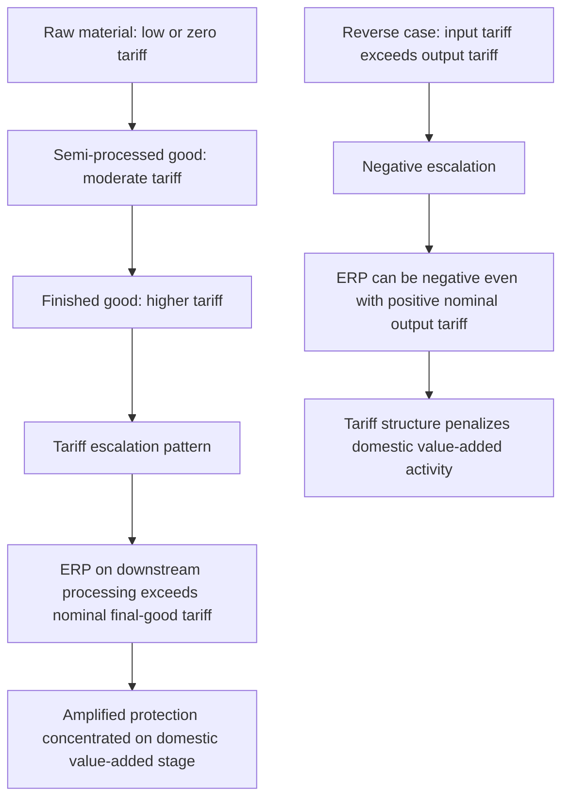

## The Effective Rate of Protection

### Overview

The effective rate of protection (ERP) measures the protection a tariff structure provides to **value added** in a domestic industry, rather than to the price of the final output alone. It corrects a key limitation of the nominal tariff rate: because most production processes use imported intermediate inputs, the protective effect on domestic processing/assembly activity depends on the *combined* structure of tariffs on both the final good and its inputs, not on the final-good tariff in isolation.

### Motivation: Why Nominal Tariffs Are Insufficient

**Key Points**

- A nominal tariff rate describes the percentage increase in the price of the *final good* facing domestic producers, but says nothing about how much of that price increase actually protects **domestic value added** (the payments to domestic labor, capital, and other domestic factors used in production) versus simply passing through to cover the cost of tariff-inflated imported inputs
- If a final good's tariff is high but its imported inputs also face high tariffs, the net protective benefit to the domestic value-added-generating stage of production can be much smaller than the nominal final-good tariff suggests — or even **negative**
- This distinction is central to understanding **tariff escalation** — the common practice (especially historically in advanced-economy tariff schedules) of applying low or zero tariffs on raw materials, moderate tariffs on semi-processed goods, and higher tariffs on finished manufactured goods, which the ERP concept reveals to provide substantially amplified protection to downstream processing industries

### The Formal ERP Formula

For a good with nominal tariff rate $t_j$ on the final good, employing an imported intermediate input with nominal tariff rate $t_i$, where the input constitutes a share $a_{ij}$ of the final good's value in free-trade (world) prices:

$$ERP_j = \frac{t_j - a_{ij}\,t_i}{1 - a_{ij}}$$

**Key Points**

- $a_{ij}$ = the **input-output coefficient**: the value of the imported input required per unit of output, measured at world (free-trade) prices
- $(1 - a_{ij})$ = domestic value added as a share of output value, at world prices
- The numerator $(t_j - a_{ij}t_i)$ captures the net protective wedge on value added: the final-good tariff's contribution minus the cost-raising effect of the input tariff

### Deriving the Formula: Value-Added Intuition

Domestic value added under free trade (world prices):

$$V_w = p_j - a_{ij}\,p_i$$

Domestic value added under the tariff structure:

$$V_t = p_j(1+t_j) - a_{ij}\,p_i(1+t_i)$$

The effective rate of protection is the percentage change in value added:

$$ERP_j = \frac{V_t - V_w}{V_w} = \frac{t_j - a_{ij}t_i}{1-a_{ij}}$$

This directly shows that ERP responds to the **entire tariff structure** facing an industry, not merely its own final-good tariff.

### Key Properties and Special Cases

**Key Points**

- If $t_i = t_j$ (uniform tariff rate applied to both input and output), then $ERP_j = t_j$ — a uniform tariff structure across all processing stages leaves the effective protection rate equal to the nominal rate, since there is no differential escalation effect
- If $t_j > t_i$ (tariff escalation: higher protection on the final good than on the input), then $ERP_j > t_j$ — effective protection **exceeds** the nominal rate, often substantially, especially when $a_{ij}$ (input intensity) is large
- If $t_j < t_i$ (**negative escalation**: the input faces a higher tariff than the final good — sometimes arising from tariff schedule inconsistencies or from a country protecting an upstream raw-material industry more than downstream processing), $ERP_j$ can be **substantially negative**, even when $t_j > 0$ — meaning the tariff structure actually *penalizes* (rather than protects) domestic value-added activity in that industry
- ERP can exceed 100% or be far larger in magnitude than any observed nominal tariff rate, particularly for industries with high imported-input intensity ($a_{ij}$ close to 1) combined with even modest tariff escalation

### Worked Numerical Example

**Example**

Consider an automobile assembly industry with:

- Nominal tariff on finished automobiles: $t_j = 20\%$
- Nominal tariff on imported automobile components: $t_i = 5\%$
- Imported component share of the car's value (world prices): $a_{ij} = 0.5$ (i.e., components constitute 50% of the car's value; domestic assembly value added is the remaining 50%)

$$ERP_j = \frac{0.20 - (0.5)(0.05)}{1 - 0.5} = \frac{0.20 - 0.025}{0.5} = \frac{0.175}{0.5} = 0.35 = 35\%$$

Here, a **20% nominal tariff on the final good translates into a 35% effective rate of protection on domestic assembly value added** — substantially amplified, because the tariff structure allows components to enter at a low 5% tariff while protecting the finished product at 20%, concentrating the protective benefit onto the relatively thin domestic value-added margin.

**Contrasting case — negative escalation**: if instead $t_j = 5\%$ and $t_i = 20\%$ (raw component more protected than the assembled good), with the same $a_{ij}=0.5$:

$$ERP_j = \frac{0.05 - (0.5)(0.20)}{0.5} = \frac{0.05 - 0.10}{0.5} = \frac{-0.05}{0.5} = -10\%$$

Despite a positive 5% nominal tariff on the final good, the assembly industry faces **negative effective protection** — the tariff structure actively disadvantages domestic assembly relative to free trade, because the elevated cost of protected imported components outweighs the modest final-good protection.

### Diagram: Tariff Escalation and ERP Amplification

### Historical and Policy Context: Tariff Escalation

**Key Points**

- Tariff escalation has been extensively documented as a structural feature of many advanced-economy tariff schedules, particularly affecting agricultural and resource-based commodities exported by developing countries: raw commodities (coffee beans, raw cocoa, raw cotton) often face low tariffs, while processed versions of the same commodities (roasted coffee, chocolate, textiles) face substantially higher tariffs in major import markets
- This pattern has been a long-standing subject of developing-country trade policy advocacy at the GATT/WTO, since tariff escalation via the ERP mechanism structurally discourages developing countries from moving up the value chain into higher-value processing and manufacturing activities, effectively locking them into raw commodity export specialization even where they might otherwise develop comparative advantage in processing
- The ERP concept was central to 1960s-1970s trade policy analysis (Corden, 1966, 1971, foundational theoretical treatments) and to UNCTAD-led critiques of advanced-economy tariff structures during that period, remaining a standard analytical tool in trade policy evaluation

### Multi-Input Generalization

For an industry using multiple imported intermediate inputs, the formula generalizes to:

$$ERP_j = \frac{t_j - \sum_i a_{ij}\,t_i}{1 - \sum_i a_{ij}}$$

where the summation runs over all imported inputs $i$ used in producing good $j$, each weighted by its respective input-output coefficient $a_{ij}$.

**Key Points**

- In practice, computing ERP at an economy-wide level requires detailed input-output tables mapping tariff rates onto each sector's actual input structure — a data-intensive exercise, historically undertaken in major ERP studies (e.g., Balassa, 1965, cross-country ERP comparisons) using national input-output accounts
- Non-tariff barriers (quotas, technical standards) complicate ERP calculation further, since their ad valorem equivalent must first be estimated (connecting to the "Trade costs" and specific/ad valorem tariff conversion issues discussed in prior items) before they can be incorporated into the ERP formula

### Limitations of the ERP Concept

**Key Points**

- **Partial equilibrium nature**: ERP, like the nominal tariff analysis it refines, is fundamentally a partial equilibrium concept — it does not account for general equilibrium effects such as exchange rate adjustment, factor reallocation across the whole economy, or induced changes in world prices that a full general equilibrium tariff analysis (as in the Stolper-Samuelson framework) would capture
- **Fixed input-output coefficients assumption**: the standard ERP formula assumes fixed technical coefficients $a_{ij}$ (a Leontief-style fixed-proportions production assumption), whereas in reality, firms can substitute between imported and domestic inputs in response to relative price/tariff changes — a limitation addressed in some extensions using variable-coefficient production functions, though at the cost of the formula's clean tractability
- **Data intensity**: comprehensive ERP calculation requires detailed, accurate input-output data by sector, which limits its routine application relative to simpler nominal tariff rate comparisons in many practical policy contexts
- [Inference] Given these limitations, ERP is probably best understood as a valuable diagnostic and conceptual tool for revealing the "hidden" protective structure embedded in cascading tariff schedules, rather than as a fully general-equilibrium-consistent welfare or protection measure suitable for precise quantitative counterfactual policy simulation on its own

### Related Topics

- Specific, ad valorem, and compound tariffs (prior item cross-reference — tariff structure inputs to ERP calculation)
- Partial equilibrium effects of a tariff (prior item cross-reference — foundational welfare framework)
- Corden (1966, 1971) foundational theoretical treatment of effective protection
- Tariff escalation and its impact on developing-country value-chain positioning
- Balassa (1965) cross-country ERP empirical comparisons
- Non-tariff barrier ad valorem equivalent estimation as an ERP calculation input
- Domestic resource cost (DRC) as a related, broader measure of comparative advantage incorporating non-traded inputs