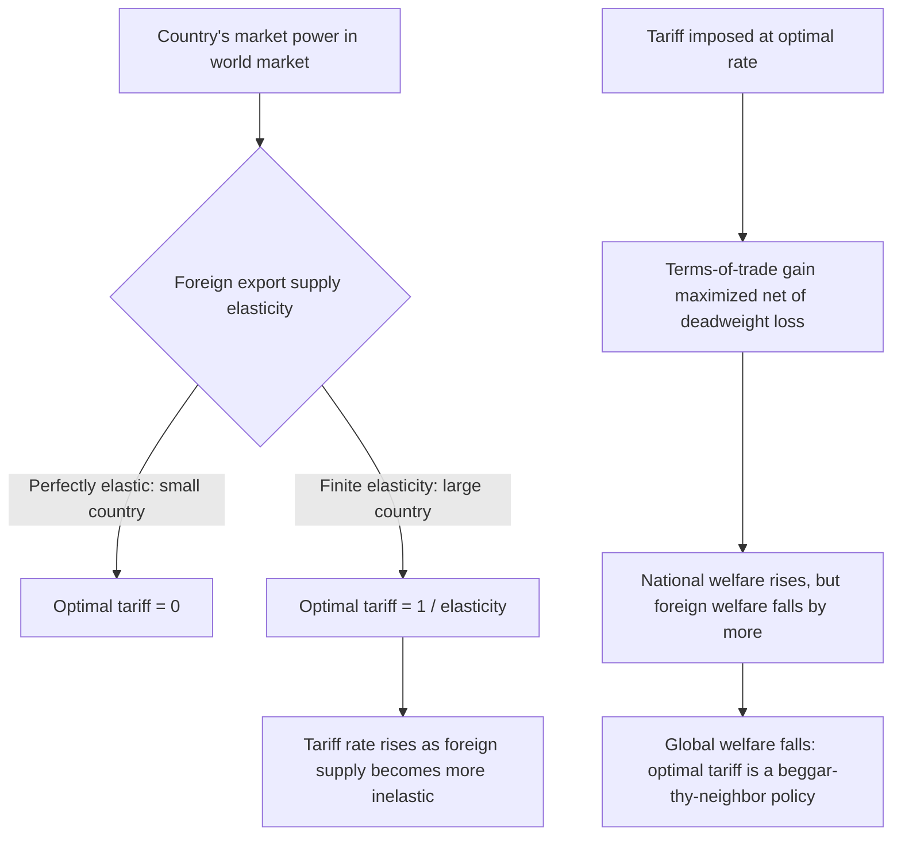

## Tariffs in Small versus Large Countries

### Overview

The distinction between small and large countries in tariff analysis hinges on whether a country's trade policy can influence the world price of the traded good. This distinction, building directly on the partial equilibrium framework covered previously, determines whether a tariff is unambiguously welfare-reducing or whether it can, under specific conditions, raise national welfare at the expense of trading partners — the central logic behind optimal tariff theory.

### Defining Small versus Large in Trade Policy Analysis

**Key Points**

- **Small country**: a country whose import or export volume is too small, relative to total world trade in the good, to influence the world price — it faces a **perfectly elastic** foreign supply (for imports) or foreign demand (for exports) curve at the prevailing world price
- **Large country**: a country whose trade volume is large enough relative to world markets that changes in its import demand or export supply measurably shift the world price — it faces an **upward-sloping** foreign export supply curve (as an importer) or a **downward-sloping** foreign import demand curve (as an exporter)
- "Small" and "large" here refer to market power in the specific traded good's world market, not necessarily to overall GDP or population — a country can be economically large but a "small" player in a specific narrowly defined commodity market with many alternative global suppliers, or a smaller economy that nonetheless dominates world supply of a specific good (e.g., a country with a very large share of a particular mineral or agricultural commodity)

### The Foreign Offer Curve / Export Supply Framework

**Key Points**

- The key analytical device distinguishing the two cases is the **foreign export supply curve** facing the importing country: the price at which foreign producers are willing to supply various quantities of the good to the domestic market
- Small country: foreign export supply is **perfectly elastic** (horizontal) at $p_w$ — foreign producers will supply any quantity demanded at the fixed world price, since the domestic country's purchases are negligible relative to total world supply
- Large country: foreign export supply is **upward sloping** — as the importing country demands more of the good, it must bid the world price up to draw additional supply from foreign producers (and conversely, reducing import demand via a tariff pulls the world price down)

### Small-Country Case: Summary of Effects

As established in the "Partial equilibrium effects of a tariff" item:

$$p_d = p_w(1+t), \quad p_w \text{ unchanged}$$

**Key Points**

- Tariff burden **fully passes through** to domestic consumers (100% pass-through to the domestic price)
- No terms-of-trade effect: the country pays the same world price per unit on its (reduced) import volume
- Net national welfare **unambiguously falls**, equal to the deadweight loss triangles (production distortion + consumption distortion)
- **Policy implication**: for a small country, there is no efficiency rationale for a tariff on pure terms-of-trade grounds — any tariff imposed must be justified on other grounds (revenue needs, infant industry protection, strategic/non-economic objectives, or as a second-best response to a distortion elsewhere in the economy)

### Large-Country Case: Terms-of-Trade Effects and the Optimal Tariff

**Key Points**

- A tariff reduces the large country's import demand, which — because the country has market power — **lowers the world price** $p_w$
- The domestic price still rises (though by less than the full tariff amount, since part of the tariff is "absorbed" by the falling world price): $p_d = p_w'(1+t)$ with $p_w' < p_w$
- This price decline constitutes a **terms-of-trade gain**: the country now imports its remaining volume at a lower per-unit cost, transferring surplus from foreign producers to the domestic economy (via lower prices paid, captured partly through tariff revenue calculated at the new lower world price)

#### The Optimal Tariff Formula

For a large country facing a foreign export supply elasticity $\varepsilon_x$ (the elasticity of the foreign supply curve with respect to price), the **welfare-maximizing (optimal) tariff rate** is:

$$t^* = \frac{1}{\varepsilon_x}$$

**Key Points**

- This formula shows the optimal tariff is **inversely related to the elasticity of foreign export supply**: the less elastic (more inelastic) foreign supply is — meaning the more the importing country's demand can move the world price — the **higher** the optimal tariff rate
- If $\varepsilon_x \to \infty$ (perfectly elastic foreign supply, i.e., the small-country case), $t^* \to 0$ — confirming that the optimal tariff for a true small country is zero, consistent with the unambiguous welfare loss result above
- If $\varepsilon_x$ is small (foreign supply is quite inelastic — e.g., the importing country accounts for a large share of a commodity with limited alternative global demand sources), $t^*$ can be substantial

### Diagram: Optimal Tariff Determination

### Welfare Comparison: National versus Global

**Key Points**

- Even at its nationally optimal rate, a large-country tariff represents a **beggar-thy-neighbor** policy: the importing country's welfare gain comes at the direct expense of foreign exporters (who receive a lower price for their goods), and the foreign country's welfare loss **exceeds** the domestic country's gain once the domestic deadweight loss is netted out
- From a **global (world) welfare perspective**, any positive tariff — including the "optimal" tariff from the large country's national standpoint — reduces total world welfare, since it introduces a genuine production and consumption distortion in addition to the pure (zero-sum, from a global view) terms-of-trade transfer
- This creates a structural tension: what is individually rational for a large country (imposing its optimal tariff) is **collectively destructive** if multiple large countries pursue optimal tariffs simultaneously or if trading partners retaliate — a classic **prisoner's dilemma** structure in international trade policy, providing a core theoretical rationale for multilateral trade institutions (GATT/WTO) that constrain unilateral optimal-tariff-seeking behavior through reciprocal tariff-binding commitments

### Retaliation and the Trade War Dynamic

**Key Points**

- If a large importing country imposes its optimal tariff, the foreign trading partner (if it is also large enough to have market power in its own right, e.g., as a supplier of other goods, or as an importer of goods from the first country) has an incentive to retaliate with its own optimal tariff on goods it imports from the first country
- This retaliatory dynamic can escalate into a **tariff war**, where each country's unilaterally optimal action leads to a mutually worse outcome than free trade — the standard non-cooperative game-theoretic prediction, formally analyzed using tariff-retaliation models (Johnson, 1953-54, is a foundational early treatment of tariff retaliation equilibria)
- The Nash equilibrium of a simultaneous optimal-tariff-setting game between two large countries generally results in **both countries worse off than under free trade**, even though each tariff was individually "optimal" taking the other's policy as given — illustrating why multilateral tariff-binding commitments (WTO) can be mutually beneficial even though each individual country might prefer to defect unilaterally absent such commitments

### Empirical Identification: Is a Country "Large"?

**Key Points**

- In practice, few countries are unambiguously "large" across all traded goods; market power varies substantially by product category based on the country's share of world trade in that specific good and the availability of alternative suppliers/buyers
- Countries or trade blocs with substantial market share in specific commodities (e.g., major agricultural exporters in certain crops, dominant suppliers of specific minerals, or large economic blocs like the EU or US in many manufactured goods categories) are more likely to exhibit meaningful terms-of-trade effects from trade policy in those specific markets
- Empirical estimation of foreign export supply elasticities (or equivalently, import demand elasticities from the trading partner's perspective) draws on the same econometric toolkit discussed in the "Estimating trade elasticities" item, applied specifically to isolate the terms-of-trade-relevant elasticity for optimal tariff calculations

### Synthesis Table

| Dimension | Small Country | Large Country |
| --- | --- | --- |
| Foreign export supply | Perfectly elastic | Upward sloping (finite elasticity) |
| World price response to tariff | No change | Falls |
| Tariff burden incidence | Fully on domestic consumers | Shared between domestic consumers and foreign exporters |
| Terms-of-trade effect | None | Positive for tariff-imposing country |
| Optimal (welfare-maximizing) tariff | Zero | Positive, $t^* = 1/\varepsilon_x$ |
| Global welfare effect of tariff | Unambiguously negative | Unambiguously negative (even if nationally positive) |
| Retaliation risk | Minimal (no terms-of-trade motive) | Significant (mutual optimal-tariff incentive) |

### Related Topics

- Partial equilibrium effects of a tariff (prior item cross-reference — foundational small-country welfare framework)
- Optimal tariff theory and the Johnson (1953-54) tariff retaliation model
- Effective rate of protection (prior item cross-reference)
- Estimating trade elasticities (related chapter item — empirical foundation for elasticity parameters used in optimal tariff calculations)
- GATT/WTO reciprocal tariff-binding as a solution to the large-country prisoner's dilemma
- Terms-of-trade theory and its role in strategic trade policy
- Trade war dynamics and recent tariff escalation episodes (US-China Section 301 tariffs) as applied large-country cases