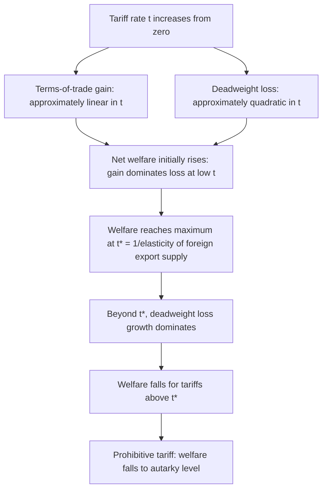

## The Optimum Tariff Argument

### Overview

The optimum tariff argument is the principal theoretical case in which a tariff can be shown to raise a country's own national welfare, grounded entirely in the exercise of national market power over the terms of trade. Building directly on the large-country analysis in the previous item, this item develops the argument in full formal detail, examines its welfare-maximizing derivation, and addresses the standard critiques that limit its practical policy relevance.

### The Core Logic

**Key Points**

- The optimum tariff argument rests on a single necessary condition: the tariff-imposing country must be **large** in the relevant world market — i.e., it must face an upward-sloping (finite-elasticity) foreign export supply curve, giving it monopsony power as a buyer of imports
- Under this condition, restricting import demand via a tariff **lowers the price the country pays foreign suppliers**, generating a terms-of-trade transfer from foreign producers to the domestic economy
- This terms-of-trade gain must be weighed against the standard deadweight loss (production and consumption distortions) that any tariff generates — the optimum tariff is the rate that **maximizes the difference** between these two effects, not the rate that maximizes the terms-of-trade gain alone

### Formal Derivation

#### National Welfare as a Function of the Tariff Rate

Define national welfare $W(t)$ as a function of the tariff rate $t$. As $t$ rises from zero:

- **Terms-of-trade gain** is approximately **linear** in $t$ for small tariffs (a first-order effect) — each unit increase in the tariff further depresses the world price the country pays, and this gain applies to the (still substantial) volume of imports still occurring
- **Deadweight loss** rises approximately with $t^2$ (a second-order effect) — the standard triangle-area logic, where the loss grows with the square of the price wedge

This asymmetry — linear gain versus quadratic loss for small $t$ — is what guarantees a **positive optimum tariff exists**: starting from $t=0$, a small tariff increase generates a first-order terms-of-trade gain while only incurring a second-order (initially negligible) deadweight loss, so $W'(0) > 0$, meaning welfare is rising at $t=0$.

#### The Optimum Tariff Formula

Formally maximizing $W(t)$ with respect to $t$ yields the condition:

$$t^* = \frac{1}{\varepsilon_x^*}$$

where $\varepsilon_x^*$ is the **elasticity of foreign export supply** facing the importing country (equivalently, this can be expressed via the foreign country's elasticity of import demand for the tariff-imposing country's exports, in the symmetric large-country-as-exporter derivation of an optimal export tax).

**Key Points**

- As foreign export supply becomes **more elastic**, $t^*$ falls toward zero — approaching the small-country result where no tariff can improve national welfare
- As foreign export supply becomes **less elastic** (more inelastic), $t^*$ rises — the country has more market power to exploit
- In the limiting case of a **perfectly inelastic** foreign export supply ($\varepsilon_x^* \to 0$), the formula suggests an arbitrarily high optimal tariff — reflecting a situation where the foreign supplier has no alternative but to accept whatever residual price the tariff leaves, though this extreme case has limited real-world applicability given that virtually all traded goods have *some* positive supply elasticity

### Diagram: Welfare as a Function of the Tariff Rate

### Illustrative SVG: National Welfare as a Function of the Tariff Rate

<svg xmlns="http://www.w3.org/2000/svg" viewBox="0 0 640 360">
<text x="320" y="24" text-anchor="middle" font-size="15" font-weight="bold" fill="#1a1a1a">National Welfare vs. Tariff Rate (svg_diagram)</text>
<line x1="80" y1="300" x2="580" y2="300" stroke="#333" stroke-width="2" />
<line x1="80" y1="300" x2="80" y2="50" stroke="#333" stroke-width="2" />
<text x="330" y="328" text-anchor="middle" font-size="13" fill="#333">Tariff Rate t</text>
<text x="45" y="175" text-anchor="middle" font-size="13" fill="#333" transform="rotate(-90 45 175)">National Welfare</text>
<path d="M 80 260 Q 200 130 300 105 Q 400 130 520 260 Q 560 300 580 300" fill="none" stroke="#4477aa" stroke-width="2.5" />
<line x1="80" y1="260" x2="580" y2="260" stroke="#888" stroke-width="1.5" stroke-dasharray="4,3" />
<text x="585" y="264" font-size="11" fill="#666">Free-trade welfare</text>
<line x1="300" y1="300" x2="300" y2="105" stroke="#cc3333" stroke-width="1.5" stroke-dasharray="5,4" />
<text x="300" y="318" text-anchor="middle" font-size="12" fill="#cc3333" font-weight="bold">t* (optimum tariff)</text>
<circle cx="300" cy="105" r="4" fill="#cc3333" />
<text x="310" y="95" font-size="11" fill="#cc3333">Peak welfare</text>

<text x="580" y="298" text-anchor="end" font-size="11" fill="#666">Prohibitive tariff</text>

</svg>

### Symmetric Case: Optimal Export Tax

**Key Points**

- The identical logic applies symmetrically to a large country's **export** side: if a country is a large enough supplier of an exported good to affect the world price faced by foreign buyers, it can impose an **optimal export tax** that restricts export supply, raises the world price received, and captures a terms-of-trade gain analogous to the import-tariff case
- Historical and contemporary examples often cited in this context include large commodity exporters with substantial world market share in specific goods (certain agricultural commodities, minerals), where export tax policy has at times been analyzed through this optimal-tax lens — though attributing any specific historical policy episode purely to optimal-tariff-theoretic motives versus other objectives (revenue, industrial policy) requires case-specific evidence beyond the pure theoretical framework
- The mathematically identical structure of the import-tariff and export-tax cases reflects the **Lerner symmetry theorem**, which shows that in a two-good model, an import tariff and an export tax are equivalent in their real economic effects

### Critiques and Limitations

#### Retaliation

**Key Points**

- As discussed in the prior item, the optimum tariff argument evaluates welfare **taking the foreign country's policy as fixed** — it is a Nash-equilibrium-style "best response" calculation, not a prediction about the outcome of a strategic interaction between two large countries
- If the foreign country retaliates (imposing its own optimal tariff or export tax in response), the resulting equilibrium is generally worse for **both** countries than free trade, as established in the tariff-retaliation game-theoretic literature (Johnson, 1953-54) — meaning the optimum tariff argument's validity as *practical policy advice* depends critically on an assumption of no retaliation, which is often unrealistic in real-world trade policy settings characterized by repeated interaction and reciprocity norms

#### Measurement Difficulty

**Key Points**

- Accurately estimating the relevant foreign export supply (or import demand) elasticity in real time is empirically demanding — the same estimation challenges discussed in the "Estimating trade elasticities" item apply directly, and mis-estimating the elasticity risks setting a tariff far from the true welfare-maximizing rate, potentially generating large deadweight losses if the tariff is set too high relative to the true optimum

#### Domestic Distributional Effects

**Key Points**

- Even when the optimum tariff genuinely raises **aggregate** national welfare, it does so alongside the same distributional pattern discussed in the partial equilibrium item — the tariff still redistributes surplus from domestic consumers to domestic producers and the government (via tariff revenue), and the aggregate welfare gain does not guarantee that any *specific* individual or group is better off, since gains and losses are pooled at the national level in the standard analysis
- The Kaldor-Hicks efficiency criterion underlying most tariff welfare analysis (aggregate gains could in principle compensate aggregate losses) does not require that such compensation actually occurs

#### Political Economy and Non-Economic Objections

**Key Points**

- Even setting aside retaliation risk, the optimum tariff argument is a classic example of a policy that is **nationally rational but globally destructive** — it is frequently invoked in international economics courses precisely as an illustration of how individually optimal national policies can produce collectively inferior global outcomes, reinforcing the theoretical case for multilateral trade institutions that constrain unilateral optimal-tariff-seeking behavior
- Some scholars and policymakers also raise objections grounded in international norms of reciprocity and fairness, arguing that deliberately exploiting monopsony power against trading partners — even where nationally welfare-improving in a narrow static sense — conflicts with the cooperative principles underlying the postwar multilateral trading system, though this is a normative rather than purely positive-economic consideration

### Summary Comparison: Small-Country Tariff vs. Optimum Tariff

| Aspect | Small-Country Tariff (any rate) | Large-Country Optimum Tariff |
| --- | --- | --- |
| Terms-of-trade effect | None | Positive (by construction) |
| Deadweight loss | Present, unmitigated | Present, but outweighed by TOT gain at $t^*$ |
| Net national welfare | Always falls | Rises, at least locally, relative to free trade |
| Global welfare | Falls | Falls (foreign loss exceeds domestic gain) |
| Retaliation risk | Minimal | Substantial |
| Practical policy relevance | Low (no efficiency rationale) | Theoretically significant but empirically and strategically fraught |

### Related Topics

- Tariffs in small versus large countries (prior item cross-reference — foreign export supply elasticity foundation)
- Partial equilibrium effects of a tariff (prior item cross-reference — deadweight loss mechanics)
- Johnson (1953-54) tariff retaliation and Nash equilibrium in trade policy
- Lerner symmetry theorem: equivalence of import tariffs and export taxes
- GATT/WTO reciprocal tariff-binding as an institutional response to the optimum-tariff prisoner's dilemma
- Estimating trade elasticities (related chapter item — empirical input for optimum tariff calculation)
- Strategic trade policy and its relationship to the optimum tariff logic in imperfectly competitive markets