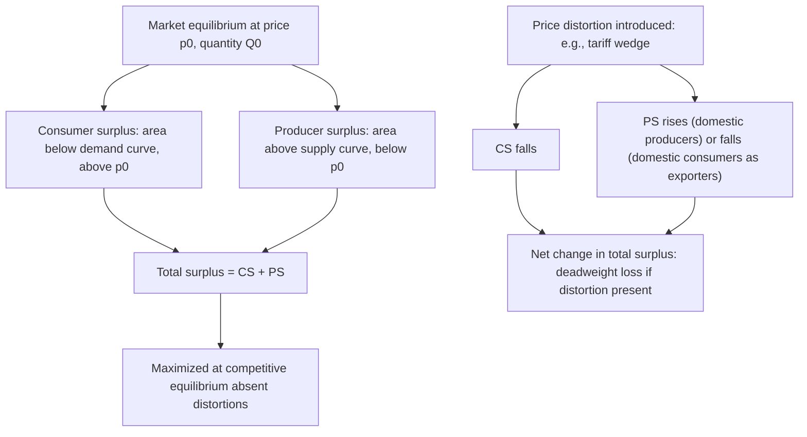

## Consumer Surplus, Producer Surplus, and Deadweight Loss

### Overview

Consumer surplus, producer surplus, and deadweight loss are the core welfare-measurement tools underlying essentially all partial equilibrium trade policy analysis in this chapter — the tariff welfare decomposition, the effective rate of protection, and the optimum tariff argument all rest on these concepts. This item develops them formally and systematically, providing the analytical foundation the preceding tariff-specific items applied.

### Consumer Surplus

#### Definition and Formal Derivation

**Key Points**

- Consumer surplus (CS) measures the aggregate difference between what consumers are **willing to pay** for each unit of a good (given by the height of the demand curve) and what they **actually pay** (the market price)
- For a demand curve $D(p)$ (or its inverse, $p(Q)$, giving the marginal willingness to pay for the $Q$-th unit), consumer surplus at market price $p_0$ with quantity $Q_0 = D(p_0)$ is:

$$CS = \int_0^{Q_0} p(Q)\,dQ - p_0 Q_0$$

equivalently expressed in price-space as:

$$CS = \int_{p_0}^{\infty} D(p)\,dp$$

- Geometrically, CS is the area **below the demand curve and above the market price line**, up to the quantity actually transacted

#### Change in Consumer Surplus from a Price Change

For a price increase from $p_0$ to $p_1$ (as occurs when a tariff raises the domestic price):

$$\Delta CS = -\int_{p_0}^{p_1} D(p)\,dp < 0$$

This is the standard **loss** in consumer surplus used throughout the tariff welfare decomposition — geometrically, the trapezoidal area between the old and new price lines, bounded by the demand curve.

### Producer Surplus

#### Definition and Formal Derivation

**Key Points**

- Producer surplus (PS) measures the aggregate difference between the price producers **actually receive** and the minimum price at which they would have been willing to supply each unit (given by the height of the supply curve, reflecting marginal cost)
- For a supply curve $S(p)$ at market price $p_0$ with quantity $Q_0 = S(p_0)$:

$$PS = p_0 Q_0 - \int_0^{Q_0} p(Q)\,dQ$$

equivalently:

$$PS = \int_{-\infty}^{p_0} S(p)\,dp$$

(interpreted over the relevant positive-price, positive-quantity range where $S(p) \geq 0$)

- Geometrically, PS is the area **above the supply curve and below the market price line**, up to the quantity actually supplied

#### Change in Producer Surplus from a Price Change

For a price increase from $p_0$ to $p_1$:

$$\Delta PS = \int_{p_0}^{p_1} S(p)\,dp > 0$$

This is the standard **gain** in producer surplus used in tariff analysis — domestic producers benefit from the higher price the tariff creates.

### Diagram: Consumer and Producer Surplus in a Single Market

### Total Surplus and the Welfare Theorem Baseline

**Key Points**

- **Total surplus** $= CS + PS$ is maximized at the free-market competitive equilibrium (where supply equals demand, absent externalities or other market failures) — this is the standard First Welfare Theorem intuition underlying why economists generally treat undistorted competitive equilibrium as an efficiency benchmark
- Any policy intervention that creates a wedge between the price consumers pay and the price producers receive (tariffs, quotas, taxes, price controls) moves the market away from this efficiency benchmark, generally reducing total surplus **unless** an offsetting benefit exists elsewhere (e.g., the terms-of-trade gain in the large-country tariff case, or correction of a pre-existing distortion in a second-best setting)

### Deadweight Loss: Formal Definition

**Key Points**

- Deadweight loss (DWL) is the portion of total surplus lost due to a market distortion that is **not transferred to any other party** — it is a pure efficiency loss, distinct from a transfer (like tariff revenue, which moves surplus from consumers to the government rather than destroying it)
- In the standard tariff diagram (small-country case), DWL consists of two components:

$$DWL = \underbrace{\int_{S_0}^{S_1}[MC(Q) - p_w]\,dQ}_{\text{production distortion}} + \underbrace{\int_{D_1}^{D_0}[p_w - MB(Q)]\,dQ}_{\text{consumption distortion, taken as positive}}$$

where $MC(Q)$ is the marginal cost of domestic production (the supply curve) and $MB(Q)$ is the marginal benefit to consumers (the demand curve)

- **Production distortion component**: reflects resources drawn into inefficient domestic production — units produced domestically at a cost above the world price $p_w$, which could have been obtained more cheaply via import
- **Consumption distortion component**: reflects consumption forgone by consumers who valued the good above $p_w$ but below the tariff-inflated domestic price $p_d$ — a pure loss of consumer welfare with no offsetting gain to anyone

### The Harberger Triangle

**Key Points**

- Each DWL component is geometrically represented by a **triangle** (assuming linear or approximately linear supply and demand curves near the relevant range) — commonly termed a **"Harberger triangle"** after Arnold Harberger's foundational work applying this welfare-triangle methodology to tax and tariff distortions
- The triangle's area is approximately:

$$DWL \approx \frac{1}{2} \times (\text{change in quantity}) \times (\text{price wedge})$$

- This gives DWL its characteristic **quadratic relationship to the tariff rate** (referenced in the optimum tariff item): since both the quantity change and the price wedge scale roughly proportionally with the tariff rate $t$ for small $t$, DWL scales approximately with $t^2$

$$DWL \approx \frac{1}{2}\,\varepsilon\, p_w Q_0\, t^2$$

where $\varepsilon$ is a composite elasticity term reflecting the responsiveness of supply and demand.

### Illustrative SVG: Deadweight Loss Triangles

<svg xmlns="http://www.w3.org/2000/svg" viewBox="0 0 640 380">
<text x="320" y="24" text-anchor="middle" font-size="15" font-weight="bold" fill="#1a1a1a">Deadweight Loss: Production and Consumption Triangles (svg_diagram)</text>
<line x1="80" y1="330" x2="580" y2="330" stroke="#333" stroke-width="2" />
<line x1="80" y1="330" x2="80" y2="50" stroke="#333" stroke-width="2" />
<text x="330" y="358" text-anchor="middle" font-size="12" fill="#333">Quantity</text>
<text x="45" y="200" text-anchor="middle" font-size="12" fill="#333" transform="rotate(-90 45 200)">Price</text>
<line x1="110" y1="310" x2="480" y2="70" stroke="#4477aa" stroke-width="2.5" />
<text x="490" y="68" font-size="12" fill="#4477aa" font-weight="bold">S (supply)</text>
<line x1="120" y1="60" x2="500" y2="310" stroke="#cc6633" stroke-width="2.5" />
<text x="505" y="315" font-size="12" fill="#cc6633" font-weight="bold">D (demand)</text>
<line x1="80" y1="240" x2="580" y2="240" stroke="#888" stroke-width="1.5" stroke-dasharray="4,3" />
<text x="60" y="244" font-size="11" fill="#666">p_w</text>
<line x1="80" y1="180" x2="580" y2="180" stroke="#888" stroke-width="1.5" stroke-dasharray="4,3" />
<text x="60" y="184" font-size="11" fill="#666">p_d</text>
<polygon points="230,240 230,180 275,180" fill="#eecc66" opacity="0.7" stroke="#cc9933" stroke-width="1" />
<text x="238" y="220" font-size="11" fill="#1a1a1a">Production DWL</text>
<polygon points="400,180 400,240 445,240" fill="#eecc66" opacity="0.7" stroke="#cc9933" stroke-width="1" />
<text x="390" y="255" font-size="11" fill="#1a1a1a">Consumption DWL</text>

<text x="330" y="45" text-anchor="middle" font-size="10" fill="#666">Both triangles: pure efficiency loss, no offsetting transfer</text>

</svg>

### Distinguishing Transfers from Losses

**Key Points**

- A common analytical error is treating **all** surplus lost by one party as a social loss — the correct decomposition separates **transfers** (surplus that moves from one party to another, with no net effect on total social welfare, such as consumer surplus lost to producer surplus gain, or consumer surplus lost to government tariff revenue) from **genuine deadweight loss** (surplus destroyed entirely, benefiting no one)
- This distinction is why, in the tariff diagram, regions $(a)$ (consumer loss to producer gain) and $(c)$ (consumer loss to government revenue) do **not** count as net welfare losses at the national level — only regions $(b)$ and $(d)$, the unclaimed triangles, represent true deadweight loss

### Application Across the Chapter's Policy Instruments

**Key Points**

- The same CS/PS/DWL framework applies directly, with appropriate modification, to every protection instrument covered in this chapter: specific/ad valorem/compound tariffs (differing only in how the price wedge is calculated), quotas (which redistribute the "tariff revenue" equivalent as quota rents rather than government revenue, a distinction relevant to instrument-choice analysis), and export taxes/subsidies (which apply the same logic from the exporting country's perspective)
- The framework also underlies the **effective rate of protection** concept: ERP evaluates protection to value added rather than final-good price, but the same CS/PS/DWL welfare machinery ultimately underlies the broader assessment of an industry's protection-driven resource allocation
- In the optimum tariff analysis, the DWL triangles are explicitly weighed against the terms-of-trade rectangle to derive the welfare-maximizing tariff rate — making this surplus framework the common mathematical thread connecting every tariff-related topic in the chapter

### Elasticity Determinants of Surplus Changes

**Key Points**

- The magnitude of both CS/PS transfers and DWL triangles depends critically on the **price elasticities of supply and demand** near the relevant price range
- More elastic demand → larger consumer quantity response to a price change → larger consumption-side DWL triangle for a given tariff
- More elastic supply → larger domestic production response → larger production-side DWL triangle for a given tariff
- This elasticity dependence is why goods with highly elastic domestic supply and demand curves generate disproportionately large deadweight losses from protection, all else equal — a consideration relevant to evaluating which sectors bear the highest efficiency cost from a given tariff structure

### Related Topics

- Partial equilibrium effects of a tariff (prior item cross-reference — full applied decomposition)
- Tariffs in small versus large countries (prior item cross-reference — terms-of-trade offset to DWL)
- The optimum tariff argument (prior item cross-reference — DWL vs. terms-of-trade trade-off)
- The effective rate of protection (prior item cross-reference — value-added extension of surplus analysis)
- Harberger (1964) triangle methodology and its broader application to tax/tariff distortion measurement
- Import quotas: rent distribution and comparison to tariff revenue
- Elasticity estimation methods (related chapter item cross-reference — empirical inputs to DWL magnitude)