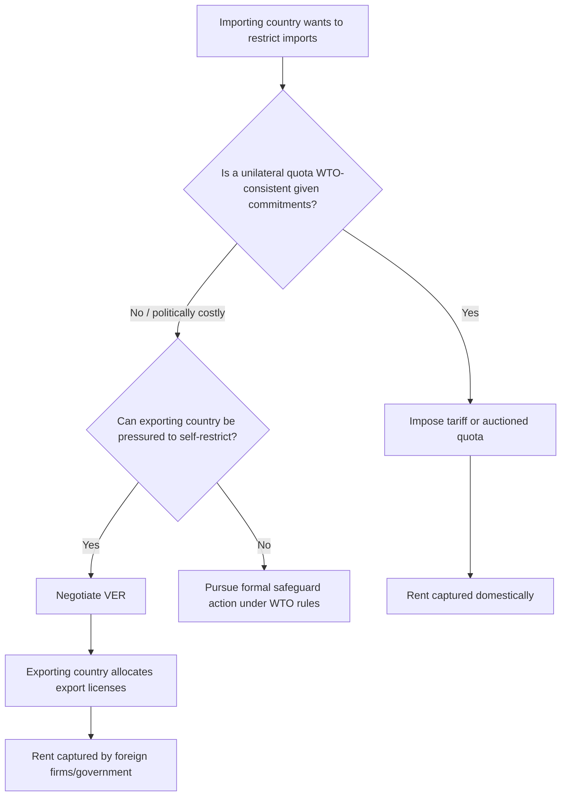

## Voluntary Export Restraints

### Definition

A voluntary export restraint (VER) — also called a voluntary restraint agreement (VRA) or export restraint arrangement (ERA) — is a bilateral or plurilateral arrangement in which an exporting country agrees to limit the quantity of a good it ships to an importing country, typically in response to political pressure or the explicit or implicit threat of a more restrictive unilateral trade barrier (a tariff, quota, or antidumping action) by the importing country.

Despite the word "voluntary," VERs are rarely voluntary in an economic sense: they are almost always negotiated under duress, with the exporting country agreeing to self-restrict in order to avoid a worse outcome imposed unilaterally.

### Institutional Mechanics

The restriction is administered by the **exporting country**, not the importing country. The exporting government (or an industry association within it) allocates export licenses to domestic firms, capping the total quantity shipped to the destination market.

**Key Points**

- The importing country gets the same quantity restriction as an import quota, but does *not* administer the license allocation.
- Because the exporting country controls license allocation, the scarcity rent generated by the restriction is captured by foreign exporters (or the foreign government), not by the importing country's government or firms.
- VERs are functionally a quota with the "wrong" party issuing the licenses, which is precisely what makes them different in welfare terms from an ordinary import quota.

### Diagrammatic Analysis

The domestic market diagram is identical in shape to an ordinary import quota: price rises from $P_w$ to $P_d$, domestic production expands, domestic consumption contracts, and a rent rectangle emerges between $P_w$ and $P_d$ over the restricted quantity. The entire distinction from a standard quota lies in **who receives the rent rectangle**.

(svg_diagram)

<svg xmlns="http://www.w3.org/2000/svg" viewBox="0 0 720 460" font-family="Helvetica, Arial, sans-serif">
<text x="360" y="24" text-anchor="middle" font-size="16" font-weight="bold">VER: Rent Capture Comparison (svg_diagram)</text>

<line x1="80" y1="400" x2="680" y2="400" stroke="#333" stroke-width="2" />
<line x1="80" y1="400" x2="80" y2="60" stroke="#333" stroke-width="2" />
<text x="690" y="405" font-size="13">Quantity</text>
<text x="55" y="65" font-size="13">Price</text>

<line x1="120" y1="380" x2="600" y2="100" stroke="#1f77b4" stroke-width="2.5" />
<text x="605" y="98" font-size="13" fill="#1f77b4">S (domestic)</text>

<line x1="120" y1="100" x2="600" y2="380" stroke="#d62728" stroke-width="2.5" />
<text x="605" y="385" font-size="13" fill="#d62728">D (domestic)</text>

<line x1="80" y1="310" x2="680" y2="310" stroke="#2ca02c" stroke-width="2" stroke-dasharray="6,4" />
<text x="85" y="305" font-size="12" fill="#2ca02c">P_world</text>

<line x1="80" y1="210" x2="680" y2="210" stroke="#9467bd" stroke-width="2" stroke-dasharray="6,4" />
<text x="85" y="205" font-size="12" fill="#9467bd">P_domestic (with VER)</text>

<line x1="230" y1="400" x2="230" y2="210" stroke="#555" stroke-width="1" stroke-dasharray="3,3" />
<text x="215" y="415" font-size="11">Qs2</text>
<line x1="440" y1="400" x2="440" y2="210" stroke="#555" stroke-width="1" stroke-dasharray="3,3" />
<text x="425" y="415" font-size="11">Qd2</text>

<rect x="230" y="210" width="210" height="100" fill="#ff7f0e" fill-opacity="0.4" stroke="#ff7f0e" stroke-width="1.5" />
<text x="245" y="255" font-size="13" font-weight="bold" fill="#7f3f00">Rent captured by</text>
<text x="245" y="272" font-size="13" font-weight="bold" fill="#7f3f00">FOREIGN exporters</text>
<text x="245" y="289" font-size="11" fill="#7f3f00">(leaves importing country entirely)</text>
<text x="120" y="435" font-size="11" font-style="italic">
Contrast: under an importer-administered quota, this same rectangle is captured domestically
</text>
<text x="120" y="450" font-size="11" font-style="italic">
(by government via auction, or by domestic license holders) — under a VER, it is not.
</text>
</svg>

### Welfare Comparison: VER vs. Tariff vs. Auctioned Quota

For an importing country, holding the restricted quantity constant across all three instruments, the ranking of national welfare outcomes is:

$$\text{Welfare(Auctioned Quota)} = \text{Welfare(Tariff)} > \text{Welfare(Administered Quota, domestic license holders)} \geq \text{Welfare(VER)}$$

- **Tariff / auctioned quota**: importing-country government captures the rent as revenue. National welfare loss = deadweight loss triangles only (production distortion + consumption distortion).
- **VER**: the entire rent rectangle is transferred abroad to foreign exporters, *in addition to* the same deadweight loss triangles borne domestically. The importing country's total national welfare loss equals the deadweight loss triangles **plus** the full value of the rent rectangle — a strictly larger loss than an equivalent tariff generating the identical domestic price.

$$\Delta W_{\text{importer, VER}} = -(\text{DWL}_{\text{production}} + \text{DWL}_{\text{consumption}}) - \text{Rent}_{\text{transferred abroad}}$$

This makes the VER the least favorable instrument, from the importing country's standpoint, among all policies that achieve the same domestic quantity restriction.

### Why Would an Importing Country Ever Prefer a VER?

Given this unfavorable welfare ranking, VERs might seem irrational for the importing country to pursue. Several political-economy explanations are offered in the literature:

1. **Avoiding GATT/WTO legal constraints.** Under the historical GATT framework, unilateral quotas were generally inconsistent with GATT Article XI (general elimination of quantitative restrictions), whereas a "voluntary" bilateral arrangement could be framed as outside the formal disciplines of the agreement, avoiding a legal challenge.
2. **Avoiding retaliation.** A formally negotiated agreement with the exporting country's cooperation is less likely to provoke WTO dispute settlement action or retaliatory tariffs than a unilateral trade barrier.
3. **Political cover.** Domestic protectionist pressure can be satisfied without the importing government appearing to have unilaterally raised barriers, and without visibly collecting revenue that could draw criticism as protectionist rent extraction.
4. **Placating the exporting country's industry.** Because exporters capture rents, the exporting industry may actually support (or at least not vigorously oppose) a VER, since the higher price per unit sold partially compensates for the lower export volume — a classic case of concentrated producer interests aligning with the policy despite lower total volume.

### Rent Capture Mechanics in the Exporting Country

Within the exporting country, the export license similarly creates scarcity value. Depending on the exporting country's own administrative choices:

- If the government auctions export licenses domestically, the exporting government captures the rent.
- If specific exporting firms are allocated quotas (commonly based on historical market share, a method called "grandfathering"), those firms capture the rent directly, often leading to **quality upgrading**: since firms can only sell a limited quantity, they have an incentive to shift toward higher-value, higher-margin variants of the product to maximize revenue per unit shipped under the cap.

**Example: Quality upgrading effect**

Under the 1981 US–Japan automobile VER, Japanese manufacturers restricted to a fixed unit quota responded by shipping a higher proportion of larger, more feature-laden, higher-margin vehicles rather than smaller economy cars, extracting more revenue per unit within the binding quantity constraint. [Unverified] Precise quantitative decompositions of how much of the price/quality shift is attributable to the VER versus other contemporaneous market factors vary across academic studies and should be treated as approximate.

### Historical Case Studies

| Case | Period | Importing Country | Exporting Country/Industry | Notes |
| --- | --- | --- | --- | --- |
| Automobile VER | 1981–1994 | United States | Japan | Most frequently cited textbook example; associated with quality upgrading and estimated multi-billion-dollar annual rent transfers to Japanese producers |
| Steel VERs | 1980s | United States | Multiple (EC, Japan, others) | Series of bilateral agreements limiting steel imports |
| Multi-Fiber Arrangement (MFA) | 1974–2004 | United States, EC, others | Developing country textile/apparel exporters | A large multilateral system of bilateral VER-like quotas; phased out under the WTO Agreement on Textiles and Clothing (ATC) by January 1, 2005 |
| Machine tools | 1986 | United States | Japan, Taiwan | Negotiated under Section 232 national security pressure |

### VERs Under WTO Rules

The WTO **Agreement on Safeguards** (1995) explicitly prohibits members from seeking, taking, or maintaining VERs, orderly marketing arrangements, or any other similar measures on the export or import side as a substitute for a formal safeguard action. Article 11.1(b) required existing VERs to be phased out or brought into conformity within a set transition period. This provision was a direct response to the proliferation of VERs during the 1970s–1980s as a way of circumventing GATT disciplines on quotas and safeguards.

**Key Points**

- Post-1995, VERs are formally prohibited as an instrument of trade policy under WTO law.
- Despite the formal prohibition, [Inference] similar informal "voluntary" arrangements or export restraint understandings can still arise outside the strict letter of the Safeguards Agreement, particularly in bilateral contexts not directly disciplined by WTO dispute settlement, though systematic documentation of such arrangements is limited.

### Comparative Summary Table

| Feature | Tariff | Import Quota (auctioned) | Import Quota (licensed to domestic firms) | Voluntary Export Restraint |
| --- | --- | --- | --- | --- |
| Administered by | Importing govt | Importing govt | Importing govt | Exporting govt/firms |
| Rent captured by | Importing govt (as tariff revenue) | Importing govt (as auction revenue) | Domestic license holders | Foreign exporters/govt |
| Legality under WTO | Generally permitted (bound rates) | Generally restricted (GATT Art. XI) | Generally restricted | Explicitly prohibited (Safeguards Agreement Art. 11.1(b)) |
| National welfare (importer) | Highest among restrictive measures | Equal to tariff | Weakly lower (rent-seeking costs) | Lowest |
| Transparency | High | Moderate | Low | Low |
| Effect on exporter incentives | None on quality mix | None on quality mix | None on quality mix | Encourages quality/value upgrading |

### Mermaid Diagram: Decision Flow for Choosing a Trade Restriction Instrument

### Related Topics

- Import quotas and the allocation of quota rents
- The Multi-Fiber Arrangement and the WTO Agreement on Textiles and Clothing
- WTO Agreement on Safeguards and Article XIX escape clause actions
- Rent-seeking and directly unproductive profit-seeking (DUP) activities
- Quality upgrading and product-mix effects under quantity restrictions
- Strategic trade policy and export subsidies
- Antidumping duties as an alternative protectionist instrument
- Tariff-rate quotas (TRQs)