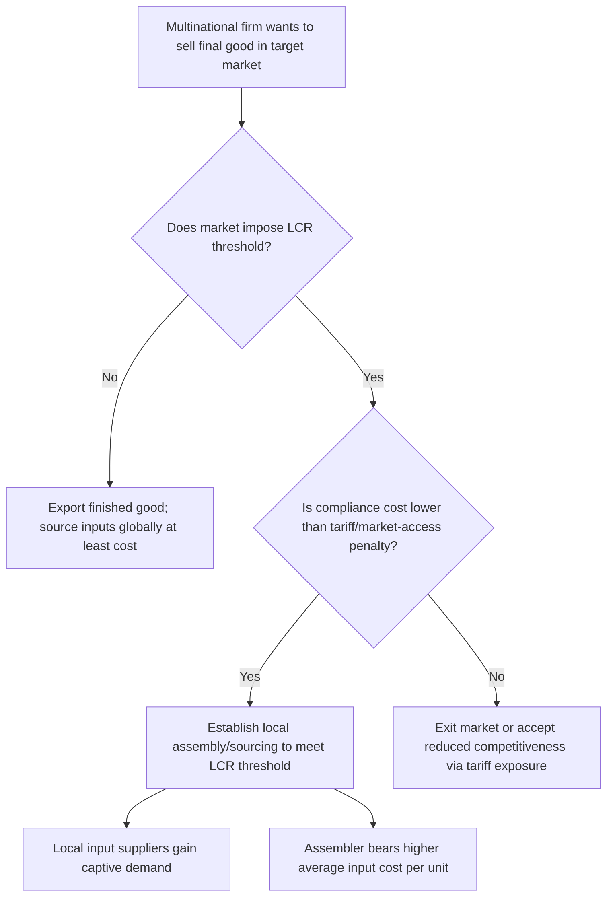

## Local Content Requirements

### Definition

A local content requirement (LCR) is a regulation mandating that a specified fraction of a final good — measured by value, physical unit count, or component share — must be sourced or produced domestically in order for the finished product to be sold, assembled, or receive preferential treatment (such as reduced tariffs, subsidies, or market access) within the regulating country. LCRs are classified as a **non-tariff barrier** and are commonly applied in automobile manufacturing, electronics assembly, renewable energy equipment, government procurement, and extractive industries.

LCRs differ fundamentally from tariffs and quotas in that they do not directly restrict import *volume*; instead, they alter the *input-sourcing decision* of domestic or foreign-invested producers, indirectly protecting upstream domestic input suppliers rather than final-good competitors.

### Forms of Local Content Requirements

**Key Points**

- **Value-based LCR**: a minimum percentage of the final good's value must originate domestically (e.g., "60% domestic value added").
- **Volume/unit-based LCR**: a minimum number or share of physical components must be domestically sourced, regardless of value.
- **Conditional market-access LCR**: foreign firms may sell in the domestic market only if they also manufacture or source a specified share locally (common in automotive and telecom equipment sectors).
- **Government procurement LCRs**: public contracts are conditioned on a minimum domestic content share, distinct from general market LCRs.
- **Renewable energy LCRs**: solar panel, wind turbine, or battery subsidies/feed-in-tariffs conditioned on domestic manufacturing content (e.g., various national renewable energy programs).

### Economic Mechanism

An LCR functions as an implicit input tariff combined with an implicit output subsidy conditional on compliance. Consider a firm assembling a final good using both an imported input (available at world price $P_w^m$) and a domestic input (available at domestic price $P_d^m$, where typically $P_d^m > P_w^m$ because the domestic input industry is less efficient or smaller-scale).

Absent the LCR, a cost-minimizing firm would use the imported input exclusively (or up to the point where marginal costs are equalized) whenever $P_d^m > P_w^m$. An LCR compels the firm to use at least the mandated domestic share, artificially raising the assembler's average input cost as a function of the compliance threshold $\lambda$ (the required domestic content share):

$$C(\lambda) = \lambda \cdot P_d^m + (1-\lambda) \cdot P_w^m$$

Since $P_d^m > P_w^m$, $C(\lambda)$ is increasing in $\lambda$: the higher the required domestic content share, the higher the firm's average input cost.

### Diagrammatic Representation

(svg_diagram)

<svg xmlns="http://www.w3.org/2000/svg" viewBox="0 0 700 440" font-family="Helvetica, Arial, sans-serif">
<text x="350" y="24" text-anchor="middle" font-size="16" font-weight="bold">Local Content Requirement: Input Cost Effect (svg_diagram)</text>
<line x1="80" y1="380" x2="650" y2="380" stroke="#333" stroke-width="2" />
<line x1="80" y1="380" x2="80" y2="60" stroke="#333" stroke-width="2" />
<text x="655" y="385" font-size="13">Required Domestic Content Share (λ)</text>
<text x="30" y="65" font-size="13">Average Input Cost</text>

<line x1="100" y1="330" x2="600" y2="110" stroke="#d62728" stroke-width="2.5" />
<text x="605" y="108" font-size="12" fill="#d62728">C(λ)</text>

<line x1="80" y1="330" x2="650" y2="330" stroke="#2ca02c" stroke-width="2" stroke-dasharray="6,4" />
<text x="90" y="325" font-size="12" fill="#2ca02c">P_w^m (world input price, λ=0)</text>

<line x1="80" y1="110" x2="650" y2="110" stroke="#9467bd" stroke-width="2" stroke-dasharray="6,4" />
<text x="90" y="105" font-size="12" fill="#9467bd">P_d^m (domestic input price, λ=1)</text>

<line x1="350" y1="380" x2="350" y2="220" stroke="#555" stroke-width="1" stroke-dasharray="3,3" />
<text x="335" y="395" font-size="11">λ* (mandated share)</text>
<circle cx="350" cy="220" r="4" fill="#000" />
<text x="360" y="215" font-size="11">Assembler's realized cost</text>
<text x="90" y="420" font-size="11" font-style="italic">
Cost rises monotonically in required domestic content share; assembler bears the cost wedge at λ*
</text>
</svg>

### Effects on Different Market Participants

| Participant | Effect |
| --- | --- |
| Domestic upstream input suppliers | Benefit — guaranteed captive demand at above-world prices |
| Final-good assemblers (domestic or foreign-invested) | Bear higher input costs; may pass costs to consumers or absorb margin compression |
| Domestic/foreign consumers of final good | Face higher final prices, reduced product variety, or delayed market entry of foreign models |
| Foreign input exporters | Lose market share in the intermediate goods market |
| Government | No direct tariff-revenue-equivalent gain; effect operates through hidden cost transfer rather than fiscal transfer |

Unlike a tariff or quota, an LCR generates **no revenue and no explicit rent rectangle** captured by any single party in the way tariffs generate revenue or quotas generate rents. Instead, the entire cost wedge $(P_d^m - P_w^m) \times \lambda \times Q$ is a pure transfer from the assembler (and ultimately consumers, depending on pass-through) to domestic input suppliers, with an associated efficiency loss from suboptimal input sourcing.

### Foreign Direct Investment (FDI) Interactions

LCRs are frequently used as a tool to compel **quid pro quo FDI** — encouraging or requiring multinational firms to establish local manufacturing or assembly operations rather than simply exporting finished goods into the market.

**Example**

A government imposes a rule that automobiles sold domestically must contain at least 40% domestic value added by the third year of market entry, or face a substantially higher tariff. A foreign automaker responds by constructing a local assembly plant and developing relationships with domestic parts suppliers to meet the threshold, rather than continuing to export fully built units, which would face the tariff penalty. This is a standard strategic response documented across automotive-sector LCR regimes historically applied in numerous developing and middle-income economies (e.g., historical import-substitution-era policies in Latin America and various ASEAN automotive programs).

[Inference] The degree to which LCRs successfully induce genuine technology transfer and durable local supplier-industry development, versus merely raising costs without building lasting domestic capability, is a long-running empirical and policy debate without a settled consensus; outcomes appear highly dependent on complementary industrial policy, market size, and enforcement design.

### Efficiency Costs

LCRs impose several distinct sources of inefficiency beyond a standard tariff:

1. **Input misallocation** — assemblers are forced away from the cost-minimizing input mix, raising production costs above what either free trade or an equivalent output tariff would generate for the same level of final-good protection.
2. **Reduced economies of scale** — domestic input suppliers protected by the LCR may never achieve minimum efficient scale, since their guaranteed market is limited to whatever the LCR compliance generates, perpetuating structurally high costs (an "infant industry trap").
3. **Compliance and verification costs** — firms and regulators must devote administrative resources to certifying and auditing domestic content shares, particularly in industries with complex, multi-tier supply chains (e.g., "rules of origin"-style content tracing).
4. **Retaliation and dispute risk** — LCRs frequently trigger WTO disputes when challenged by trading partners as inconsistent with national treatment obligations.

### Legal Status Under WTO Rules

LCRs are directly addressed and generally prohibited under the WTO **Agreement on Trade-Related Investment Measures (TRIMs)**, which identifies local content requirements as inconsistent with GATT Article III (National Treatment) because they discriminate in favor of domestic products over imported like products in the context of investment-related measures. The TRIMs Agreement's Illustrative List explicitly names local content requirements as a prohibited investment measure.

**Key Points**

- LCRs conditioning subsidy or incentive eligibility (e.g., renewable energy feed-in tariffs or tax credits conditioned on domestic manufacturing) have been challenged multiple times in WTO dispute settlement, most notably in *Canada – Renewable Energy / Feed-In Tariff Program* (WT/DS412, WT/DS426), where panels and the Appellate Body found Ontario's domestic content requirements for renewable energy generation inconsistent with TRIMs and GATT national treatment obligations.
- Despite the formal WTO prohibition, LCRs remain widely used, particularly in sectors such as renewable energy, government procurement (where GATT/WTO carve-outs for procurement exist under the plurilateral Agreement on Government Procurement, to which not all members are parties), and in countries with weaker enforcement exposure or where disputes have not yet been brought.

### Mermaid Diagram: LCR Compliance Decision Path for a Multinational Firm

### Related Topics

- Trade-Related Investment Measures (TRIMs) Agreement
- Import quotas and the allocation of quota rents
- Voluntary export restraints
- Rules of origin and preferential trade agreements
- Infant industry protection and import substitution industrialization
- Foreign direct investment and multinational sourcing strategy
- Government procurement policies and the WTO Agreement on Government Procurement
- Renewable energy subsidy design and green industrial policy disputes