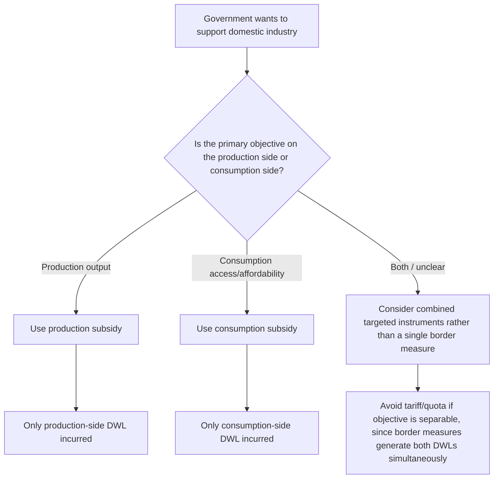

## Production and Consumption Subsidies

### Definition and Classification

A production subsidy is a payment made to domestic producers of a good, typically per unit produced, regardless of whether the good is sold domestically or exported. A consumption subsidy is a payment made to domestic consumers (or a discount applied at point of sale) conditional on domestic purchase of a good, regardless of where the good was produced. Both are non-tariff instruments used to alter domestic quantities without directly restricting trade volume through a quota or price wedge via a border tariff.

**Key Points**

- Production subsidies target the **supply side**, shifting the effective supply curve down/right, and apply to output regardless of destination market.
- Consumption subsidies target the **demand side**, shifting the effective demand curve up/right, and apply to domestic purchases regardless of the good's origin (domestic or imported).
- Both differ from export subsidies (previously covered) in that eligibility is *not* contingent on export or import status — this is precisely what makes them "domestic support" measures rather than trade-contingent subsidies under WTO classification.

### Production Subsidies: Mechanics

A production subsidy of $s$ per unit raises the effective price received by producers to $P_w + s$ while leaving the price paid by consumers unchanged at $P_w$ (assuming a small country facing a fixed world price and no other distortion). This is the central distinguishing feature relative to a tariff, which raises the price paid by *both* producers and consumers simultaneously.

$$P_{producer} = P_w + s, \qquad P_{consumer} = P_w$$

**Government fiscal outlay** $= s \times Q_s(P_w + s)$, where $Q_s(\cdot)$ is the domestic supply function evaluated at the subsidized producer price.

### Diagrammatic Analysis: Production Subsidy vs. Equivalent Tariff

(svg_diagram)

<svg xmlns="http://www.w3.org/2000/svg" viewBox="0 0 720 460" font-family="Helvetica, Arial, sans-serif">
<text x="360" y="24" text-anchor="middle" font-size="16" font-weight="bold">Production Subsidy vs. Tariff: Consumer Price Divergence (svg_diagram)</text>
<line x1="80" y1="400" x2="680" y2="400" stroke="#333" stroke-width="2" />
<line x1="80" y1="400" x2="80" y2="60" stroke="#333" stroke-width="2" />
<text x="690" y="405" font-size="13">Quantity</text>
<text x="55" y="65" font-size="13">Price</text>
<line x1="120" y1="380" x2="600" y2="100" stroke="#1f77b4" stroke-width="2.5" />
<text x="605" y="98" font-size="13" fill="#1f77b4">S (domestic)</text>
<line x1="120" y1="100" x2="600" y2="380" stroke="#d62728" stroke-width="2.5" />
<text x="605" y="385" font-size="13" fill="#d62728">D (domestic)</text>

<line x1="80" y1="280" x2="680" y2="280" stroke="#2ca02c" stroke-width="2" stroke-dasharray="6,4" />
<text x="85" y="275" font-size="12" fill="#2ca02c">P_world = P_consumer (unchanged under production subsidy)</text>

<line x1="80" y1="200" x2="680" y2="200" stroke="#9467bd" stroke-width="2" stroke-dasharray="6,4" />
<text x="85" y="195" font-size="12" fill="#9467bd">P_world + s (price received by producers)</text>

<line x1="340" y1="400" x2="340" y2="280" stroke="#555" stroke-width="1" stroke-dasharray="3,3" />
<text x="325" y="415" font-size="11">Qs1</text>
<line x1="420" y1="400" x2="420" y2="200" stroke="#555" stroke-width="1" stroke-dasharray="3,3" />
<text x="405" y="415" font-size="11">Qs2</text>

<polygon points="340,280 420,280 420,200" fill="#1f77b4" fill-opacity="0.3" stroke="#1f77b4" />
<text x="345" y="255" font-size="10">Production DWL only</text>

<rect x="80" y="200" width="340" height="80" fill="#ff7f0e" fill-opacity="0.25" stroke="#ff7f0e" stroke-width="1.5" />
<text x="90" y="225" font-size="12" font-weight="bold" fill="#7f3f00">Government outlay = s × Qs2</text>
<text x="120" y="435" font-size="11" font-style="italic">
Note: consumption (demand curve) is UNAFFECTED — no consumption-side distortion, unlike a tariff
</text>
</svg>

### Welfare Decomposition: Production Subsidy (Small Country)

$$\Delta PS = +(\text{producer surplus gain})$$

$$\Delta CS = 0 \quad \text{(consumer price unchanged)}$$

$$\Delta GR = -(\text{government outlay}) = -[s \times Q_{s2}]$$

$$\Delta W_{national} = \Delta PS + \Delta GR = -(\text{production-side deadweight loss only})$$

**Key Points**

- A production subsidy generates **only one** deadweight loss triangle — the production-side distortion from expanding output beyond the efficient (world-price) level — because consumption is entirely unaffected.
- This makes a production subsidy **strictly less distortionary than an equivalent tariff** that achieves the *same* increase in domestic output, since the tariff would also depress consumption and generate a second (consumption-side) deadweight loss triangle.
- This result is the classic basis for the **"policy ranking" or "specificity" principle** in trade theory: when the underlying objective is to support domestic producers, a targeted production subsidy dominates a tariff, because it achieves the same producer-support outcome with strictly lower aggregate deadweight loss.

### Consumption Subsidies: Mechanics

A consumption subsidy of $s$ per unit lowers the effective price paid by consumers to $P_w - s$, while producers still receive the full market price $P_w$ (in the small-country case, assuming the subsidy is administered as a rebate or voucher rather than through a production channel).

$$P_{consumer} = P_w - s, \qquad P_{producer} = P_w$$

This expands consumption above the free-trade level while leaving domestic production and imports from the supply side unaffected in *price* terms (though import volume adjusts because consumption rises).

**Government fiscal outlay** $= s \times Q_d(P_w - s)$.

### Welfare Decomposition: Consumption Subsidy (Small Country)

$$\Delta CS = +(\text{consumer surplus gain})$$

$$\Delta PS = 0 \quad \text{(producer price unchanged)}$$

$$\Delta GR = -(\text{government outlay})$$

$$\Delta W_{national} = \Delta CS + \Delta GR = -(\text{consumption-side deadweight loss only})$$

By symmetry with the production subsidy case, a consumption subsidy generates only a single deadweight loss triangle (from consumption exceeding the efficient level), avoiding any production-side distortion.

### Comparative Table: Instrument Ranking by Distortion

| Instrument | Producer Price Effect | Consumer Price Effect | Distortions Generated | Relative Efficiency (same output/consumption target) |
| --- | --- | --- | --- | --- |
| Import tariff | Raises to $P_w + t$ | Raises to $P_w + t$ | Production DWL + Consumption DWL | Least efficient of the four |
| Import quota | Raises to $P_d$ | Raises to $P_d$ | Production DWL + Consumption DWL + rent allocation issue | Comparable to tariff (plus rent-seeking risk) |
| Production subsidy | Raises to $P_w + s$ | Unchanged at $P_w$ | Production DWL only | More efficient — targets the actual objective (output) |
| Consumption subsidy | Unchanged at $P_w$ | Lowers to $P_w - s$ | Consumption DWL only | More efficient — targets the actual objective (consumption) |

This table illustrates the **theory of the second best / targeting principle**: a policy instrument should be aimed as directly as possible at the specific margin (production or consumption) that the government wishes to influence. Using a border instrument like a tariff to address what is fundamentally a production-support objective forces an *unnecessary* consumption distortion as a side effect, and vice versa.

### The Targeting Principle (Bhagwati-Johnson-Corden Framework)

**Key Points**

- If the underlying policy objective is to raise domestic output of a good (e.g., for national security, employment, or infant-industry reasons), a production subsidy achieves this objective at strictly lower welfare cost than a tariff or quota, because it avoids distorting consumption.
- If the underlying objective is to increase domestic consumption of a good (e.g., merit goods such as basic nutrition, education-related goods, or public-health-linked commodities), a consumption subsidy is superior to any border measure that would also affect the price producers receive.
- This is a specific application of the general "targeting principle" in trade and welfare theory: distortions should be corrected as close as possible to their source, using the instrument that intervenes only on the specific margin where the market failure or policy objective actually lies. Using a less-targeted instrument (a border tax/subsidy) to address a problem that lies purely on one side of the market (pure production or pure consumption) generates unnecessary additional deadweight loss on the untargeted side.

### Numerical Example: Production Subsidy vs. Tariff Achieving the Same Output

Suppose:

- Domestic demand: $Q_d = 600 - 10P$
- Domestic supply: $Q_s = 100 + 10P$
- World price: $P_w = 15$

**Free trade**: $Q_s = 100 + 150 = 250$; $Q_d = 600 - 150 = 450$; imports $= 200$.

**Policy goal: raise domestic output to 300 units.**

**Option A — Tariff.** Find $t$ such that $Q_s(P_w + t) = 300$:

$$100 + 10(15+t) = 300 \implies 10t = 50 \implies t = 5$$

At $P = 20$: $Q_d = 600 - 200 = 400$. Consumption falls from 450 to 400 — a consumption distortion of 50 units, in addition to the production distortion.

**Option B — Production subsidy.** Find $s$ such that $Q_s(P_w + s) = 300$:

$$100 + 10(15+s) = 300 \implies s = 5$$

Consumer price remains $P_w = 15$, so $Q_d = 600 - 150 = 450$ — **unchanged**. Only the production-side expansion (250 → 300) generates deadweight loss; the tariff's additional consumption-side loss (450 → 400) is entirely avoided.

**Government cost comparison:**

- Tariff: government collects revenue on remaining imports $= t \times (Q_d - Q_s) = 5 \times (400-300) = 500$ — this is *revenue*, not a cost, though society still bears the two DWL triangles.
- Production subsidy: government pays $s \times Q_{s2} = 5 \times 300 = 1{,}500$ — a fiscal outlay, but avoids the consumption DWL triangle entirely.

[Inference] Whether the production subsidy is preferable overall to the tariff in this example depends on comparing the *avoided* consumption deadweight loss against the *fiscal cost net of tariff revenue* — the targeting-principle result establishes that the subsidy is more efficient in minimizing real resource misallocation for a given production target, but the government's budgetary financing cost (and the deadweight loss of raising the tax revenue to fund the subsidy, sometimes called the "marginal cost of public funds") is a separate consideration not captured in the basic partial-equilibrium comparison.

### Practical Real-World Examples

| Subsidy Type | Example Sector | Notes |
| --- | --- | --- |
| Production subsidy | Agricultural price/output support programs (e.g., historical EU Common Agricultural Policy direct payments, various national farm support schemes) | Common target of WTO Agreement on Agriculture domestic support disciplines |
| Production subsidy | Renewable energy generation subsidies (feed-in tariffs, production tax credits) | Support domestic generation output; distinguished from LCR-conditioned variants discussed separately |
| Consumption subsidy | Fuel and energy consumer price subsidies in various economies | Frequently critiqued for fiscal burden and market-price distortion; subject to ongoing reform debates in many countries |
| Consumption subsidy | Food staple subsidies / ration-card systems | Common in food-security-oriented policy design |

### WTO Treatment of Domestic Support

Under the WTO **Agreement on Subsidies and Countervailing Measures (SCM Agreement)**, non-export-contingent production subsidies fall generally into the **"actionable"** category — not prohibited outright, but subject to challenge if they cause "adverse effects" (serious prejudice, injury to a domestic industry in another member, or nullification of negotiated benefits) to another WTO member. This is a materially more permissive legal status than export subsidies, which are prohibited per se.

Agricultural production and consumption subsidies are additionally governed by the WTO **Agreement on Agriculture**'s categorization into "boxes":

- **Amber box**: production/price-linked support considered trade-distorting, subject to reduction commitments.
- **Blue box**: production-limiting support programs, treated more leniently.
- **Green box**: support considered minimally trade-distorting (e.g., decoupled income support, general infrastructure), largely exempt from reduction commitments.

[Unverified] The precise current classification and dollar-value ceilings applicable to individual WTO members' domestic support commitments are subject to periodic notification and negotiation, and specific up-to-date figures should be verified against current WTO notification documents rather than treated as fixed.

### Mermaid Diagram: Targeting Principle Decision Logic

### Related Topics

- The targeting principle and theory of the second best
- Export subsidies and their welfare effects
- WTO Agreement on Agriculture: amber, blue, and green box classifications
- WTO Agreement on Subsidies and Countervailing Measures (SCM Agreement)
- Import tariffs: partial equilibrium welfare analysis
- Infant industry protection arguments
- Marginal cost of public funds and subsidy financing
- Import quotas and the allocation of quota rents