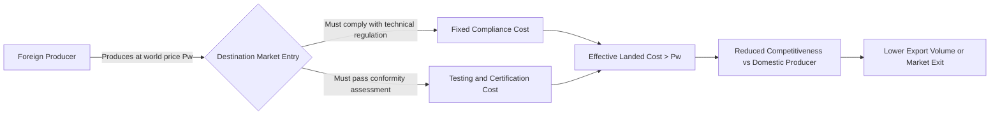

## Technical Barriers to Trade and Regulatory Measures

### Definition and Scope

Technical barriers to trade (TBT) are non-tariff measures that arise from technical regulations, standards, and conformity assessment procedures applied to traded goods. Unlike tariffs, which are transparent price instruments, TBTs operate through compliance costs, testing requirements, and product specifications that can restrict trade even when no protectionist intent exists.

The WTO Agreement on Technical Barriers to Trade (TBT Agreement) defines three categories:

- **Technical regulations**: Mandatory documents laying down product characteristics or their related processes and production methods, with compliance mandatory (e.g., electrical safety codes, automotive emissions standards).
- **Standards**: Documents approved by a recognized body providing guidelines or characteristics for products or processes, with compliance voluntary (e.g., ISO 9001 quality management).
- **Conformity assessment procedures**: Any procedure used to determine that relevant requirements are fulfilled (e.g., testing, inspection, certification, accreditation).

### Economic Rationale vs. Protectionist Use

**Key Points**

- Legitimate rationale: correcting market failures such as information asymmetry (consumers cannot verify safety/quality), externalities (pollution, health risks), and network effects (compatibility standards).
- Protectionist use: standards can be calibrated so that only domestic producers can economically comply, or so that foreign testing/certification becomes prohibitively costly or slow.
- The line between legitimate regulation and disguised protectionism is often ambiguous, which is precisely why TBTs are harder to discipline than tariffs.

[Inference] Empirically distinguishing a "necessary" regulation from a protectionist one usually requires case-by-case analysis of whether a less trade-restrictive alternative could achieve the same policy objective, since the same regulation can serve both a real domestic policy goal and act as barrier at the same time.

### Common Forms of Technical Barriers

| Type | Description | Example |
| --- | --- | --- |
| Product standards | Specifications on composition, performance, dimensions | EU REACH chemical restrictions |
| Labeling requirements | Mandatory disclosure of content, origin, warnings | Nutritional labeling, country-of-origin labeling |
| Testing and certification | Product must be tested/certified before market entry | CE marking in the EU, UL certification in the US |
| Packaging requirements | Rules on materials, recyclability, dimensions | EU packaging waste directives |
| Sanitary and phytosanitary (SPS) measures* | Food safety, animal/plant health rules | Import bans on products failing pesticide residue limits |

*SPS measures are technically governed by a separate WTO agreement (the SPS Agreement) rather than the TBT Agreement, but they function economically as a closely related category of regulatory non-tariff barrier and are commonly discussed alongside TBTs.

### Cost Structure and Trade Effects

TBTs impose two broad categories of cost on exporters:

1. **Fixed compliance costs**: One-time costs to redesign products, obtain certification, or adapt production processes to meet destination-market standards. These costs are largely invariant to shipment volume.
2. **Variable/marginal costs**: Ongoing costs such as repeated testing, batch inspection fees, or per-shipment documentation.

Because fixed costs do not scale with export volume, TBTs disproportionately burden small and medium-sized exporters, who cannot spread compliance costs over large sales volumes. This produces a market-structure effect: TBTs tend to concentrate export activity among large firms, an effect distinct from tariffs, which burden per-unit trade more uniformly.

**Example**

A mid-sized furniture exporter shipping to the EU must obtain formaldehyde emission testing (fixed cost, roughly $15,000–$25,000 per product line, figures illustrative) regardless of whether it exports 100 units or 100,000 units. A large competitor exporting 50 times the volume absorbs the same fixed cost at a fraction of the per-unit burden — effectively acting as a barrier that scales inversely with firm/shipment size.

### The "Standards as Barriers" vs. "Standards as Trade Facilitators" Debate

TBTs have an ambiguous theoretical effect on trade volumes:

- **Barrier effect**: Compliance costs act like a fixed cost of market entry, reducing the number of firms able to export (extensive margin) even if surviving exporters trade more (intensive margin) once compliant.
- **Information/trust effect**: Harmonized or internationally recognized standards can reduce information asymmetry for importers, potentially increasing trade by making foreign products more trustworthy — sometimes called the "standards as catalysts" hypothesis.

[Inference] Because these two effects run in opposite directions, the net trade effect of a given technical regulation is generally an empirical question rather than one resolved by theory alone, and results vary by study, sector, and country pair.

### Regulatory Divergence and Harmonization

**Key Points**

- **Regulatory divergence**: Different countries impose different technical requirements for functionally equivalent products, forcing multinational firms to produce multiple product variants ("market-specific SKUs").
- **Mutual Recognition Agreements (MRAs)**: Two or more countries agree to accept each other's conformity assessment results, reducing duplicate testing without requiring identical standards.
- **Harmonization**: Countries adopt common standards outright (e.g., through ISO/IEC international standards), eliminating divergence at the source.
- **Equivalence**: A weaker form than harmonization, where a country accepts that a trading partner's different regulation achieves an equivalent policy objective.

Economically, harmonization eliminates fixed redesign costs but can lock in a particular technology standard—raising switching costs and reducing regulatory experimentation ([Inference] a trade-off frequently raised in discussions of "race to the top" vs. "one-size-fits-all" harmonization).

### The WTO TBT Agreement: Key Disciplines

- **Non-discrimination**: Technical regulations must not treat imported products less favorably than "like" domestic products (national treatment) or discriminate among trading partners (most-favored-nation treatment).
- **Necessity test**: Regulations must not be more trade-restrictive than necessary to fulfill a legitimate objective (e.g., national security, environmental protection, consumer safety, prevention of deceptive practices).
- **Use of international standards**: Members are encouraged to base technical regulations on international standards where they exist, unless such standards would be ineffective or inappropriate for the member's circumstances.
- **Transparency obligations**: Members must notify the WTO of proposed technical regulations, allow comment periods, and publish measures before implementation.
- **Special and differential treatment**: Developing countries are afforded longer timeframes and technical assistance to comply.

[Unverified] The specific procedural notification periods (commonly cited as 60 days for comment) can vary by circumstance and by whether a measure is deemed urgent (e.g., for safety emergencies), so exact timelines should be confirmed against the current WTO TBT Agreement text for a specific case.

### Diagrammatic Representation: TBT as a Cost-Shifting Barrier

### Price-Theoretic Illustration

Consider a technical regulation that imposes a per-unit equivalent compliance cost $c$ on foreign exporters (even though the actual cost structure is often fixed rather than per-unit, it can be approximated as a per-unit cost for small exporters operating near their compliance threshold). The exporter's effective supply price becomes:

$$P_{effective} = P_{w} + c$$

where $P_{w}$ is the world price. This behaves analogously to a specific tariff of magnitude $c$ in its effect on the domestic price and quantity traded, shifting the foreign supply curve upward by $c$ and reducing the equilibrium quantity imported, though — unlike a tariff — the value $c$ generates no government revenue; it is absorbed as a real resource cost (testing labs, redesign, certification fees) rather than being redistributed to the importing country's treasury.

### Below is an SVG diagram illustrating this welfare distinction between tariffs and TBTs (svg_diagram):

<svg xmlns="http://www.w3.org/2000/svg" viewBox="0 0 760 460" font-family="Arial, sans-serif">
<text x="380" y="28" text-anchor="middle" font-size="18" font-weight="bold">Tariff vs. Technical Barrier: Welfare Effect (svg_diagram)</text>

<line x1="80" y1="400" x2="700" y2="400" stroke="black" stroke-width="2" />
<line x1="80" y1="400" x2="80" y2="60" stroke="black" stroke-width="2" />
<text x="700" y="420" font-size="14">Quantity</text>
<text x="50" y="60" font-size="14">Price</text>

<line x1="140" y1="380" x2="420" y2="90" stroke="#1f77b4" stroke-width="2" />
<text x="430" y="85" font-size="13" fill="#1f77b4">Domestic Supply (S)</text>

<line x1="140" y1="90" x2="640" y2="380" stroke="#d62728" stroke-width="2" />
<text x="600" y="395" font-size="13" fill="#d62728">Domestic Demand (D)</text>

<line x1="80" y1="330" x2="700" y2="330" stroke="#2ca02c" stroke-width="2" stroke-dasharray="6,3" />
<text x="90" y="325" font-size="13" fill="#2ca02c">World Price (Pw)</text>

<line x1="80" y1="270" x2="700" y2="270" stroke="#9467bd" stroke-width="2" stroke-dasharray="6,3" />
<text x="90" y="265" font-size="13" fill="#9467bd">Pw + Tariff / Pw + Compliance Cost (c)</text>

<rect x="330" y="270" width="90" height="60" fill="#ffbb78" fill-opacity="0.5" stroke="#ff7f0e" />
<text x="335" y="360" font-size="12" fill="#ff7f0e">Tariff Revenue</text>
<text x="335" y="374" font-size="12" fill="#ff7f0e">(captured by govt)</text>

<rect x="470" y="270" width="90" height="60" fill="#c7c7c7" fill-opacity="0.6" stroke="#7f7f7f" />
<text x="465" y="360" font-size="12" fill="#7f7f7f">TBT Compliance Cost</text>
<text x="465" y="374" font-size="12" fill="#7f7f7f">(real resource cost, no revenue)</text>

<text x="130" y="440" font-size="12" font-style="italic">Both raise effective price and reduce quantity traded; only the tariff generates transferable revenue.</text>

</svg>

### Firm-Level Response Strategies

**Key Points**

- **Product adaptation**: Redesign products to meet destination-market specifications (highest fixed cost, enables full market access).
- **Regulatory arbitrage**: Route exports through third countries with mutual recognition agreements with the destination market.
- **Compliance outsourcing**: Use third-party testing laboratories accredited in the destination market to avoid maintaining in-house compliance capacity.
- **Market exit or non-entry**: Smaller firms may simply forgo the market if fixed compliance costs exceed expected profits.
- **Lobbying for harmonization**: Industry associations may lobby for mutual recognition or international standard-setting participation (e.g., through ISO technical committees) to lower future compliance costs.

### TBTs in Empirical Trade Literature

[Inference] A recurring finding across empirical gravity-model studies is that TBT notifications are associated with reduced trade in the short run for smaller exporters, though effects on aggregate trade volumes are more mixed and sometimes positive once information/trust effects and standard harmonization are accounted for — the direction and magnitude depend heavily on sector, exporter development level, and whether the standard is unilaterally imposed or internationally coordinated. Specific coefficient estimates vary substantially across studies and should not be treated as universal constants.

### Illustrative Numerical Example

Suppose a footwear exporter faces:

- World price per unit: $P_w = \$20$
- Fixed compliance cost for destination-market safety certification: $50,000
- Expected shipment volume: 10,000 units per year

The per-unit-equivalent compliance cost is:

$$c = \frac{50000}{10000} = \$5 \text{ per unit}$$

This raises the effective per-unit landed cost to $25, a 25% cost increase — comparable in trade-restrictive effect to a 25% ad valorem tariff, despite being a "non-tariff" measure and generating zero revenue for the importing government. A larger competitor shipping 100,000 units would face a per-unit-equivalent cost of only $c = 50000/100000 = \$0.50$, illustrating the fixed-cost bias against smaller exporters discussed earlier.

### Distinguishing TBT from Related Non-Tariff Measures

| Measure | Governing WTO Instrument | Primary Objective |
| --- | --- | --- |
| Technical barriers to trade | TBT Agreement | Product characteristics, labeling, general safety/quality |
| Sanitary and phytosanitary measures | SPS Agreement | Food safety, animal and plant health |
| Import quotas | GATT Article XI (general prohibition, with exceptions) | Direct quantity restriction |
| Subsidies | Agreement on Subsidies and Countervailing Measures | Domestic production support |
| Anti-dumping duties | Anti-Dumping Agreement | Offsetting priced-below-cost imports |

### Conclusion

Technical barriers to trade occupy an economically ambiguous position: they can correct genuine market failures related to safety, health, and information asymmetry, or they can function as sophisticated, WTO-compliant substitutes for tariffs following successive rounds of tariff liberalization. Their defining economic feature — fixed compliance costs — means their trade-restrictive impact falls disproportionately on smaller exporters and developing-country producers, independent of whether the underlying regulatory intent is protectionist. Disciplining TBTs is inherently harder than disciplining tariffs because the "necessity" of a given regulation is a judgment call rather than an observable number, which is why the WTO TBT Agreement relies on procedural disciplines (transparency, non-discrimination, use of international standards) rather than a simple prohibition.

**Related Topics**

- Sanitary and phytosanitary (SPS) measures and the SPS Agreement
- Mutual Recognition Agreements (MRAs) and regulatory cooperation
- Gravity models of trade with non-tariff measure controls
- Rules of origin and their interaction with technical standards
- Trade facilitation and the WTO Trade Facilitation Agreement
- Regional harmonization efforts (e.g., EU CE marking, ASEAN Mutual Recognition Arrangements)
- Ad valorem equivalents (AVEs) of non-tariff measures