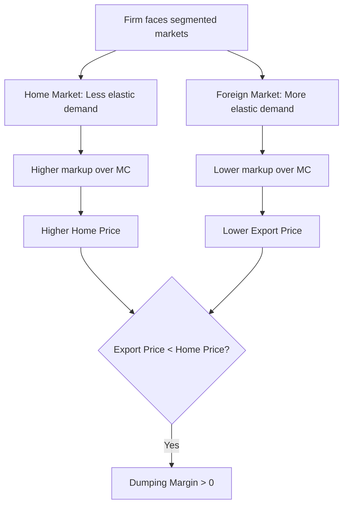

## International Price Discrimination and Dumping

### Definition

Dumping occurs when a firm sells a product in a foreign market at a price lower than the price it charges for the same or a like product in its home market, after adjusting for differences in terms of sale, taxation, and other conditions affecting price comparability. Under the WTO Anti-Dumping Agreement (Article VI of GATT 1994), dumping is not illegal per se — it is only actionable when it causes or threatens material injury to a domestic industry in the importing country.

The standard measure of dumping is the **dumping margin**:

$$\text{Dumping Margin} = \frac{NV - EP}{EP} \times 100\%$$

where $NV$ is the normal value (home-market price, or a constructed proxy) and $EP$ is the export price.

### Theoretical Foundation: International Price Discrimination

Dumping is, in economic terms, a special case of third-degree price discrimination applied across national borders. The classic Robinson-style price discrimination framework requires three conditions:

1. **Market segmentation**: The domestic and foreign markets must be separable, so that arbitrage (reselling from the low-price to the high-price market) is costly or infeasible — enforced in practice by transport costs, tariffs, and trade barriers.
2. **Market power**: The firm must face a downward-sloping demand curve in at least one market (i.e., it is not a price taker), giving it some control over price.
3. **Differing demand elasticities**: The price-cost markup a profit-maximizing firm charges in each market is inversely related to the price elasticity of demand in that market.

A profit-maximizing discriminating monopolist sets marginal revenue equal to marginal cost in each market separately:

$$MR_{home} = MR_{foreign} = MC$$

Using the standard elasticity form of marginal revenue, $MR = P\left(1 - \frac{1}{|\varepsilon|}\right)$, the price in each market is:

$$P_i = \frac{MC}{1 - \frac{1}{|\varepsilon_i|}}$$

where $\varepsilon_i$ is the price elasticity of demand in market $i$. If foreign demand is more elastic than home demand (common when the firm is a smaller, more contestable player abroad facing more substitutes/competition), the profit-maximizing foreign price will be lower than the home price — generating dumping as a natural equilibrium outcome of standard oligopoly/monopoly pricing, entirely independent of any predatory intent.

### Diagrammatic Representation of Price Discrimination

### Below is an SVG illustrating price discrimination across two markets (svg_diagram):

<svg xmlns="http://www.w3.org/2000/svg" viewBox="0 0 780 460" font-family="Arial, sans-serif">
<text x="390" y="28" text-anchor="middle" font-size="18" font-weight="bold">Third-Degree Price Discrimination and Dumping (svg_diagram)</text>

<line x1="60" y1="380" x2="60" y2="60" stroke="black" stroke-width="2" />
<line x1="60" y1="380" x2="340" y2="380" stroke="black" stroke-width="2" />
<text x="150" y="405" font-size="13">Home Market Quantity</text>
<text x="20" y="60" font-size="13">Price</text>
<line x1="70" y1="110" x2="330" y2="330" stroke="#d62728" stroke-width="2" />
<text x="250" y="130" font-size="12" fill="#d62728">D_home (inelastic)</text>
<line x1="60" y1="180" x2="340" y2="180" stroke="#9467bd" stroke-width="2" stroke-dasharray="5,3" />
<text x="345" y="184" font-size="12" fill="#9467bd">MC</text>
<line x1="60" y1="140" x2="340" y2="140" stroke="#1f77b4" stroke-width="2" />
<text x="345" y="144" font-size="12" fill="#1f77b4">P_home (higher)</text>

<line x1="440" y1="380" x2="440" y2="60" stroke="black" stroke-width="2" />
<line x1="440" y1="380" x2="720" y2="380" stroke="black" stroke-width="2" />
<text x="530" y="405" font-size="13">Foreign Market Quantity</text>
<line x1="450" y1="90" x2="710" y2="350" stroke="#2ca02c" stroke-width="2" />
<text x="620" y="110" font-size="12" fill="#2ca02c">D_foreign (elastic)</text>
<line x1="440" y1="180" x2="720" y2="180" stroke="#9467bd" stroke-width="2" stroke-dasharray="5,3" />
<text x="725" y="184" font-size="12" fill="#9467bd">MC</text>
<line x1="440" y1="240" x2="720" y2="240" stroke="#ff7f0e" stroke-width="2" />
<text x="725" y="244" font-size="12" fill="#ff7f0e">P_foreign = EP (lower)</text>

<text x="150" y="440" font-size="12" font-style="italic">Same MC in both markets; steeper (inelastic) home demand supports a higher home markup, producing P_home &gt; P_foreign.</text>

</svg>

### Taxonomy of Dumping Types

**Key Points**

- **Persistent dumping**: Ongoing price discrimination reflecting a stable, structural difference in demand elasticity or market power between home and foreign markets (the standard third-degree price discrimination case above).
- **Predatory dumping**: Temporary below-cost pricing intended to drive foreign competitors out of the market, followed by price increases once market power is established. [Inference] Predatory dumping is analytically distinct from persistent dumping in that it requires the firm to recoup losses later via monopoly pricing, which imposes a stricter economic precondition (high barriers to re-entry/re-competition) than persistent dumping requires — this is why some trade economists are skeptical predatory dumping is common in practice, though the WTO Anti-Dumping Agreement does not require proof of predatory intent to impose remedies.
- **Sporadic (or intermittent) dumping**: Occasional dumping of surplus/excess inventory in foreign markets to avoid depressing the home-market price, often associated with demand shocks or overproduction rather than a stable pricing strategy.
- **Reciprocal dumping**: A phenomenon (formalized in the Brander-Krugman model) where two countries' firms simultaneously dump into each other's home markets due to segmented-market oligopoly competition, even absent any comparative advantage difference — a result purely of strategic market segmentation.

### The Brander-Krugman Reciprocal Dumping Model

[Inference] This model shows that intra-industry trade can arise even between identical countries producing identical (homogeneous) goods, purely because segmented markets allow firms to price-discriminate, and each firm treats the "residual" foreign market as more elastic (since it must compete against the incumbent local firm there) — leading both firms to export into each other's markets at prices below their respective home prices. This generates two-way trade in the same good, which classical comparative-advantage models cannot explain, and it also implies dumping can occur without any cost or productivity asymmetry between countries.

### Determining Normal Value in Practice

Anti-dumping investigations must establish normal value (NV) using one of three approaches, ranked by regulatory preference:

1. **Home market price**: The price of the like product in the exporter's domestic market, used when there are sufficient (typically defined as a minimum volume threshold, commonly cited as at least 5% of export volume, though thresholds vary by jurisdiction) arm's-length sales in the ordinary course of trade.
2. **Third-country price**: If home-market sales are insufficient or unrepresentative, the price charged for exports to an appropriate third country may be used.
3. **Constructed value**: If neither is available or reliable, NV is constructed as the sum of cost of production, a reasonable amount for selling/general/administrative (SG&A) expenses, and a reasonable profit margin:

$$NV_{constructed} = COP + SG\&A + \text{Reasonable Profit}$$

[Unverified] Exact statutory thresholds and methodologies for "sufficient volume" and "reasonable profit" differ across jurisdictions (e.g., US Department of Commerce practice vs. EU Commission practice) and are subject to periodic regulatory revision, so specific numeric thresholds should be checked against the current implementing regulations of the investigating authority in question.

### Non-Market Economy (NME) Treatment

For countries deemed non-market economies (where domestic prices are not considered market-determined due to state intervention), investigating authorities often construct normal value using a **surrogate country methodology**: production factor inputs (labor, energy, raw materials) are valued using prices from a comparable market-economy country, rather than using the exporting country's own domestic prices. [Inference] This methodology tends to produce higher constructed normal values than a market-price approach would, and is a persistent source of trade friction, as exporting countries frequently contest their classification as non-market economies.

### Injury Determination

A dumping finding alone is insufficient to impose anti-dumping duties; the importing country's authority must separately establish:

- **Material injury** (or threat thereof) to the domestic industry producing the like product, evaluated through indicators such as declining output, sales, market share, profits, capacity utilization, and employment.
- **Causal link** between the dumped imports and the injury, requiring that injury not be primarily attributable to other factors (e.g., a general demand contraction, changes in technology, or import competition from non-dumped sources).
- **Cumulation**: Authorities may cumulatively assess the injurious effect of dumped imports from multiple countries if imports from each exceed a de minimis threshold (commonly cited as 3% of total imports, though this is jurisdiction-specific and [Unverified] should be confirmed against current statute).

### Remedies: Anti-Dumping Duties

Once dumping and injury are both established, the importing country may impose an anti-dumping duty, generally capped at the dumping margin (the "lesser duty rule" in some jurisdictions, notably the EU, caps the duty at whichever is lower between the dumping margin and the injury margin — the minimum duty needed to remove injury):

$$\text{AD Duty Rate} \leq \min(\text{Dumping Margin}, \text{Injury Margin})$$

[Unverified] Whether a jurisdiction applies the lesser-duty rule is a matter of domestic policy choice rather than a uniform WTO requirement — the US, for example, has historically not applied a mandatory lesser-duty rule, while the EU has; current practice should be verified against each jurisdiction's statute given periodic reform.

### Numerical Example

A steel exporter sells in its home market at $800/ton and exports to a foreign market at $650/ton, with no material differences in transportation, taxation, or sale conditions requiring adjustment.

$$\text{Dumping Margin} = \frac{800 - 650}{650} \times 100\% = 23.08\%$$

If the importing country's investigating authority separately determines the injury margin (the price undercutting needed to eliminate injury to the domestic industry) is 15%, and the jurisdiction applies a lesser-duty rule, the anti-dumping duty imposed would be capped at 15% rather than the full 23.08% dumping margin.

### Welfare Effects of Dumping on the Importing Country

**Key Points**

- **Consumers in the importing country** generally benefit from dumping in the short run through lower prices — from a pure static consumer-surplus perspective, dumping (excluding predatory cases) can be welfare-improving for the importing country as a whole, since consumer gains typically exceed producer losses.
- **Domestic producers** in the importing country are harmed through lost sales, reduced market share, and downward price pressure — this is the standard justification for import-competing industries lobbying for anti-dumping protection.
- **Predatory dumping** is the case where importing-country welfare analysis reverses: if the exporter later exploits acquired market power through higher prices, dynamic (long-run) welfare losses to the importing country can exceed the short-run consumer gains.
- [Inference] This tension — that anti-dumping law is often framed as protecting "national welfare" but frequently protects domestic producer interests at net cost to domestic consumers in the persistent-dumping case — is a long-standing critique of anti-dumping regimes among international trade economists, distinct from the political-economy observation that anti-dumping petitions are filed by import-competing industries.

### Anti-Dumping as a Protectionist Instrument: The "Trade Remedy Overuse" Critique

- Because dumping determinations rely on constructed values and administrative discretion (choice of methodology, surrogate country selection, adjustments for comparability), investigating authorities have latitude that can be — and empirically has been argued to be — used to produce findings favorable to petitioning domestic industries.
- Anti-dumping measures are the most frequently used WTO-sanctioned trade remedy instrument globally, and are sometimes described as a "second-best" protectionist tool available even to countries otherwise bound by low tariff ceilings under WTO commitments, since anti-dumping duties can be layered on top of bound tariff rates without violating tariff-binding commitments.
- **Zeroing**: A controversial calculation methodology (in which negative dumping margins on some transactions are set to zero rather than netted against positive margins when calculating the overall weighted-average margin) that inflates calculated dumping margins; zeroing has been repeatedly found inconsistent with WTO obligations in dispute settlement rulings, though its use in certain contexts has continued to generate litigation.

### Sunset Reviews

Anti-dumping duties are not permanent by default. Under WTO rules, duties are generally subject to a **sunset review** after five years, at which point the investigating authority must determine whether continued dumping and injury are likely if the duty were removed; if not, the duty must be terminated. [Inference] In practice, sunset reviews frequently result in duty continuation rather than termination, which critics argue reflects the same administrative-discretion dynamics affecting original determinations, though this varies by jurisdiction and case.

### Distinguishing Dumping from Related Concepts

| Concept | Core Mechanism | Governing Framework |
| --- | --- | --- |
| Dumping | Price discrimination across segmented national markets | WTO Anti-Dumping Agreement |
| Export subsidies | Government payment lowers effective export price | WTO Agreement on Subsidies and Countervailing Measures (SCM) |
| Predatory pricing (domestic antitrust) | Below-cost pricing to eliminate competitors, single market | National competition/antitrust law |
| Currency undervaluation | Exchange-rate-driven competitiveness, not firm-level pricing | IMF Articles of Agreement, WTO (contested overlap) |

### Conclusion

Dumping is best understood not as an inherently predatory or fraudulent practice but as the international-trade manifestation of standard third-degree price discrimination, arising naturally whenever markets are segmented and demand elasticities differ across borders. The WTO framework does not prohibit dumping outright; it permits importing countries to respond only when dumping is accompanied by demonstrable material injury to a domestic industry, reflecting an underlying policy compromise between free-trade principles and domestic-industry protection. Because normal-value construction and injury determination both involve substantial administrative discretion, anti-dumping law occupies contested ground between legitimate correction of unfair trade practices and a WTO-compliant channel for disguised protectionism — a tension at the center of ongoing debates about trade remedy reform.

**Related Topics**

- Countervailing duties and export subsidies
- Safeguard measures and Article XIX of GATT
- The Brander-Krugman model of intra-industry trade and reciprocal dumping
- WTO Dispute Settlement Understanding and anti-dumping case law
- Non-market economy status determinations in trade law
- Zeroing methodology disputes in WTO jurisprudence
- Strategic trade policy and oligopolistic competition models