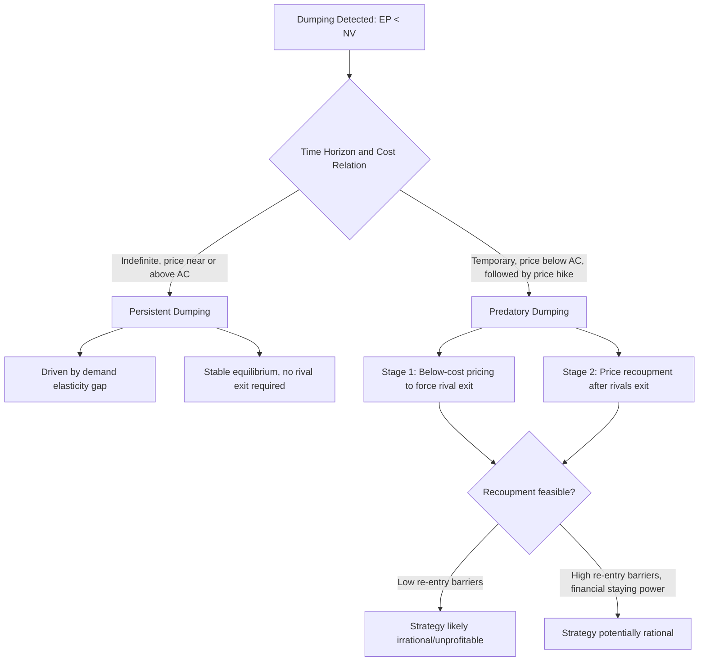

## Predatory Dumping Versus Persistent Dumping

### Definitions

Both are subcategories of international price discrimination in which export price is lower than home-market normal value, but they differ fundamentally in underlying motive, time horizon, and welfare consequences.

- **Persistent dumping**: A stable, ongoing pattern of charging a lower price abroad than at home, driven by a structural difference in demand elasticity or competitive intensity between the two markets. It reflects standard third-degree price discrimination and can continue indefinitely as a firm's steady-state pricing strategy.
- **Predatory dumping**: A deliberately temporary strategy of pricing below cost (or below normal value) in a foreign market with the specific intent of driving competitors out of that market, followed by a subsequent price increase once the firm has acquired sufficient market power to recoup its earlier losses.

### Core Distinguishing Criteria

| Dimension | Persistent Dumping | Predatory Dumping |
| --- | --- | --- |
| Time horizon | Indefinite / steady-state | Temporary, followed by price recoupment phase |
| Underlying cause | Differing demand elasticities across segmented markets | Deliberate strategy to eliminate competitors |
| Pricing relative to cost | Price may be above marginal cost, just below home price | Price often below average cost, sometimes below marginal cost |
| Intent requirement | None (a byproduct of profit-maximizing price discrimination) | Explicit exclusionary intent (though intent is hard to prove and not required by WTO anti-dumping law) |
| Post-strategy behavior | No behavioral change expected | Price increases sharply once rivals exit |
| Welfare effect on importing country | Ambiguous but often net-positive in the persistent, steady-state case (consumer gains vs. producer losses) | Negative in the long run once monopoly pricing phase begins |
| Economic plausibility of occurrence | High — consistent with standard oligopoly/monopoly pricing theory | Contested — requires strict preconditions to be profitable |

### Theoretical Framework: Persistent Dumping as Price Discrimination

Persistent dumping follows directly from the standard third-degree price discrimination result. A profit-maximizing firm sets marginal revenue equal to marginal cost separately in each segmented market:

$$MR_{home} = MR_{foreign} = MC$$

Using the elasticity form of marginal revenue:

$$P_i = \frac{MC}{1 - \dfrac{1}{|\varepsilon_i|}}$$

If foreign demand is more price-elastic than home demand ($|\varepsilon_{foreign}| > |\varepsilon_{home}|$, typically because the firm faces more competition or more substitutes abroad), the profit-maximizing foreign price is lower than the home price, and this gap can persist indefinitely as a stable equilibrium — no exit of rivals or subsequent price hike is required or expected.

### Theoretical Framework: The Predatory Dumping Two-Stage Model

Predatory dumping requires a two-stage strategic logic:

**Stage 1 (Predation phase)**: The firm prices at or below cost in the foreign market, accepting losses, to force competitors into exit or bankruptcy.

$$P_{predation} < AC \quad \text{(and potentially} < MC \text{ in extreme cases)}$$

**Stage 2 (Recoupment phase)**: After rivals exit and the market becomes concentrated (ideally monopolized or oligopolistic with reduced competition), the firm raises price above the competitive level to recover Stage 1 losses plus a normal or supernormal return.

$$P_{recoupment} > P_{competitive}$$

For predatory dumping to be a rational, profit-maximizing strategy, the discounted value of Stage 2 supernormal profits must exceed the discounted losses incurred during Stage 1:

$$\sum_{t=1}^{T_1} \frac{-\pi_{loss,t}}{(1+r)^t} < \sum_{t=T_1+1}^{\infty} \frac{\pi_{super,t}}{(1+r)^t}$$

where $T_1$ is the length of the predation phase and $r$ is the discount rate.

### The Preconditions Problem

[Inference] This recoupment requirement imposes economically demanding preconditions that are frequently cited by trade economists as reasons predatory dumping is likely much rarer in practice than persistent dumping:

1. **High barriers to re-entry**: If rivals (or new entrants) can simply re-enter once the predator raises price, Stage 2 supernormal profits are competed away, making the entire strategy irrational ex ante.
2. **Financial staying power**: The predator must be able to sustain Stage 1 losses longer than its rivals can, which usually requires access to superior capital markets, cross-subsidization from other markets, or a much larger balance sheet than the targeted competitors.
3. **Credible commitment**: Rivals must believe the predator will actually sustain below-cost pricing long enough to make exit preferable to weathering the price war — an information/credibility problem, since rivals have an incentive to disbelieve predatory threats and hold out.
4. **Demand growth or lock-in mechanisms**: In fast-growing or network-effect markets, "predatory" low pricing can sometimes be more plausibly explained by rational investment in market share for legitimate reasons (learning curve effects, network externalities) rather than predation per se, complicating empirical identification.

Because barrier 1 (low re-entry barriers) is common in many tradeable-goods sectors that are exactly the sectors typically subject to anti-dumping investigations, [Inference] a significant body of trade economics literature is skeptical that a large share of anti-dumping cases filed on predatory-dumping grounds actually meet the economic preconditions for a rational predation strategy, even though anti-dumping law does not require proof of these preconditions to impose remedies.

### Diagrammatic Comparison

### Below is an SVG comparing the price paths over time under each scenario (svg_diagram):

<svg xmlns="http://www.w3.org/2000/svg" viewBox="0 0 780 440" font-family="Arial, sans-serif">
<text x="390" y="26" text-anchor="middle" font-size="18" font-weight="bold">Export Price Paths: Persistent vs. Predatory Dumping (svg_diagram)</text>
<line x1="60" y1="380" x2="740" y2="380" stroke="black" stroke-width="2" />
<line x1="60" y1="380" x2="60" y2="60" stroke="black" stroke-width="2" />
<text x="700" y="405" font-size="13">Time</text>
<text x="20" y="60" font-size="13">Price</text>

<line x1="60" y1="120" x2="740" y2="120" stroke="#1f77b4" stroke-width="2" stroke-dasharray="5,3" />
<text x="745" y="124" font-size="12" fill="#1f77b4">Home Price (NV)</text>

<line x1="60" y1="260" x2="740" y2="260" stroke="#7f7f7f" stroke-width="2" stroke-dasharray="3,3" />
<text x="745" y="264" font-size="12" fill="#7f7f7f">Average Cost</text>

<line x1="80" y1="180" x2="740" y2="180" stroke="#2ca02c" stroke-width="3" />
<text x="90" y="170" font-size="13" fill="#2ca02c" font-weight="bold">Persistent Dumping: stable, above AC</text>

<polyline points="80,180 260,180 300,320 460,320 500,90 740,90" stroke="#d62728" stroke-width="3" fill="none" />
<text x="300" y="345" font-size="13" fill="#d62728" font-weight="bold">Predation phase (below AC)</text>
<text x="520" y="80" font-size="13" fill="#d62728" font-weight="bold">Recoupment phase (above NV)</text>

<text x="150" y="420" font-size="12" font-style="italic">Persistent dumping holds a stable gap below home price; predatory dumping dips below cost, then spikes above home price after rivals exit.</text>

</svg>

### Legal Treatment Under WTO Anti-Dumping Law

**Key Points**

- The WTO Anti-Dumping Agreement makes **no formal distinction** between persistent and predatory dumping — both are treated identically under the legal standard: if export price is below normal value (dumping) and this dumping causes or threatens material injury to the domestic industry, remedies are available.
- No requirement exists to prove exclusionary intent, below-cost pricing specifically, or a subsequent recoupment phase. This means anti-dumping duties can be — and routinely are — imposed on cases of persistent dumping that have no predatory character whatsoever.
- This is a frequently noted disconnect between the economic theory of predatory pricing (which underpins the political rhetoric often used to justify anti-dumping law, e.g., "protecting against unfair foreign competition") and the actual legal test applied (which captures ordinary price discrimination as well).
- By contrast, **domestic antitrust/competition law** in many jurisdictions (e.g., U.S. Sherman Act predatory pricing claims) explicitly requires proof of both below-cost pricing and a dangerous probability of recoupment — a substantially stricter standard than the WTO anti-dumping test.

[Unverified] The specific evidentiary standards for domestic predatory-pricing claims (e.g., the Brooke Group standard in U.S. antitrust law requiring proof of pricing below an appropriate measure of cost and a dangerous probability of recoupment) are matters of domestic case law that may be revised by subsequent rulings, and should be confirmed against current jurisprudence for any specific jurisdiction.

### Empirical Identification Challenges

Distinguishing predatory from persistent dumping empirically is difficult because:

1. **Cost data opacity**: Investigating authorities rarely have full visibility into a foreign firm's true marginal or average cost, making it hard to confirm whether export price is genuinely below cost (a marker of possible predation) or merely below home price (consistent with ordinary price discrimination).
2. **Ex-ante vs. ex-post identification**: Predatory intent is a forward-looking strategic claim; investigators typically only observe historical pricing and cannot directly verify a firm's future recoupment plan.
3. **Confounding explanations for low pricing**: Below-cost pricing can also result from cyclical overcapacity, inventory liquidation, learning-curve investment, or genuine financial distress — none of which constitute predation in the strategic sense, but which can be observationally similar in short-run pricing data.

[Inference] Because of these identification challenges, most real-world anti-dumping determinations do not attempt to establish whether dumping is predatory or persistent — they simply apply the dumping-margin-plus-injury test uniformly, which is part of why economists argue the "unfair trade practice" framing commonly used to justify anti-dumping law overstates how much of actual dumping activity resembles textbook predatory pricing.

### Welfare Implications Summary

**Key Points**

- **Persistent dumping**: Static welfare analysis for the importing country is typically ambiguous-to-positive — consumers gain from lower prices, domestic import-competing producers lose, and if consumer surplus gains exceed producer surplus losses (common when the dumped good has a large domestic consumer base), net national welfare in the importing country can rise, even though domestic industry-specific harm is real and politically salient.
- **Predatory dumping**: Welfare analysis is dynamic and, if recoupment succeeds, likely negative for the importing country in present-value terms — initial consumer gains during the predation phase are offset (potentially more than offset) by monopoly-price losses during the recoupment phase, alongside the permanent loss of domestic productive capacity/competition.
- This welfare asymmetry is the standard economic justification offered for why trade remedy law might reasonably want to distinguish the two cases — even though, as noted, the actual WTO legal test does not require this distinction.

### Illustrative Numerical Comparison

**Persistent dumping example**: A firm's marginal cost is $40/unit. Home demand elasticity is $|\varepsilon_{home}| = 2$, foreign demand elasticity is $|\varepsilon_{foreign}| = 4$.

$$P_{home} = \frac{40}{1 - 1/2} = \$80 \qquad P_{foreign} = \frac{40}{1 - 1/4} = \$53.33$$

Dumping margin: $(80 - 53.33)/53.33 \approx 50\%$, entirely explained by the elasticity gap, with $P_{foreign} = \$53.33$ still comfortably above marginal cost of $40 — this is a stable, sustainable equilibrium price, not predation.

**Predatory dumping example**: The same firm instead prices at $30/unit abroad (below its $40 marginal cost) for 3 years, accepting losses of $10/unit, specifically to force two competitors with weaker balance sheets to exit. In year 4, having achieved near-monopoly position, it raises price to $95/unit. The rationality of this strategy depends entirely on whether new entrants are deterred from returning once the higher price appears — if entry barriers are low, competitors (or new entrants) would be expected to return once price exceeds $40 (marginal cost) plus a normal return, undermining the recoupment phase and making the original predation unprofitable.

### Conclusion

Persistent and predatory dumping share the same superficial signature — an export price below home-market normal value — but rest on entirely different economic logic. Persistent dumping is a direct, unremarkable implication of profit-maximizing price discrimination under segmented markets and differing demand elasticities, requiring no exclusionary intent and capable of persisting indefinitely as a stable equilibrium. Predatory dumping requires a much more demanding two-stage strategic structure — below-cost pricing followed by monopolistic recoupment — that is theoretically coherent but empirically contested, since it depends on restrictive preconditions (high re-entry barriers, financial staying power, credible commitment) that many tradeable-goods markets do not satisfy. Critically, WTO anti-dumping law makes no legal distinction between the two: any case where export price falls below normal value and causes material injury is actionable, regardless of whether the underlying motive resembles textbook predation or ordinary international price discrimination — a persistent point of tension between the economic theory invoked to justify anti-dumping law and the legal standard actually applied.

**Related Topics**

- International price discrimination and the Brander-Krugman reciprocal dumping model
- Anti-dumping duty calculation and the lesser-duty rule
- Predatory pricing standards in domestic antitrust law (e.g., Brooke Group standard)
- Barriers to entry and contestable markets theory
- Injury determination and causal-link analysis in anti-dumping investigations
- Strategic trade policy and dynamic oligopoly models
- Sunset reviews and the duration of anti-dumping measures