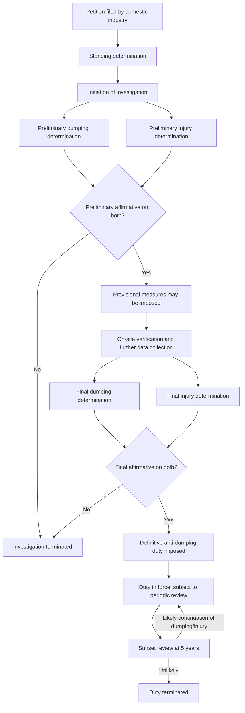

## Antidumping Duties and Investigation Procedures

### Legal Basis

Anti-dumping actions are governed by Article VI of GATT 1994 and elaborated in the WTO Agreement on Implementation of Article VI of GATT 1994 (commonly called the **Anti-Dumping Agreement**, or ADA). The ADA establishes the substantive tests (dumping, injury, causal link) and the procedural rules investigating authorities must follow domestically to impose WTO-consistent anti-dumping duties.

### Overview of the Investigation Sequence

### Stage 1: Petition and Standing

**Key Points**

- An anti-dumping investigation is normally initiated upon a written petition filed by or on behalf of the domestic industry producing the "like product."
- **Standing requirement**: The ADA requires that the petition be supported by domestic producers accounting for at least 25% of total domestic production of the like product, and that producers expressly supporting the petition account for more than 50% of the production of that portion of the industry expressing either support or opposition.
- The petition must contain evidence of dumping, injury, and a causal link — mere assertion is insufficient; the investigating authority must review the accuracy and adequacy of the evidence before initiating.
- In rare cases, an investigating authority may self-initiate without a petition if it has sufficient evidence, though this is uncommon in practice.

[Unverified] Specific percentage thresholds are as codified in the ADA text at the time of this material's preparation; readers should confirm against the current WTO Anti-Dumping Agreement text, as procedural rules are subject to periodic clarification through dispute settlement rulings.

### Stage 2: Initiation

Upon receiving a sufficient petition, the investigating authority (e.g., the U.S. Department of Commerce and International Trade Commission jointly, or the European Commission) must:

- Publicly notify the initiation of the investigation.
- Notify the government of the exporting country.
- Provide interested parties (foreign producers, exporters, importers, domestic producers) access to the non-confidential petition.
- Set the **period of investigation (POI)** — the specific time window (commonly the most recent 12 months for dumping, and up to 3 years for injury trend analysis) over which pricing and injury data will be examined.

### Stage 3: Preliminary Determination

Within a statutorily defined period after initiation (varying by jurisdiction, commonly cited around 140–160 days for a preliminary dumping determination under some regimes, though this figure is jurisdiction- and case-specific), the investigating authority issues preliminary findings on:

1. **Dumping margin**: Calculated by comparing normal value (NV) to export price (EP) for the responding exporters.
2. **Injury**: A preliminary assessment of whether the domestic industry is suffering material injury or threat thereof.

If both are preliminarily affirmative, **provisional measures** (cash deposits or bonds, generally capped at the calculated preliminary dumping margin) may be imposed, but only after at least 60 days from initiation, and their duration is limited (commonly four months, extendable to six months in certain circumstances, per ADA Article 7).

### Stage 4: Verification

Investigating authorities typically conduct **on-site verification visits** to responding exporters' facilities and accounting records to confirm the accuracy of submitted cost and pricing data. This stage is central to the credibility of the dumping margin calculation, since normal value and constructed value figures depend heavily on the exporter's own reported cost data.

### Stage 5: Final Determination

The final determination re-examines dumping margins and injury using the full record, including verification findings and rebuttal submissions from interested parties. Total investigation duration from initiation to final determination is capped under the ADA (commonly cited as 12 months, extendable to 18 months in special circumstances).

If both final dumping and final injury determinations are affirmative, a **definitive anti-dumping duty** is imposed, generally applied prospectively to future imports (though in some jurisdictions retroactive application is possible if imports surged during the provisional-measures period in a way that would undermine the remedial effect of the definitive duty).

### Dumping Margin Calculation Methodologies

Three principal comparison methodologies are used to establish the margin:

| Methodology | Comparison Basis | Typical Use Case |
| --- | --- | --- |
| Weighted-average-to-weighted-average (W-W) | Weighted average NV vs. weighted average EP over the POI | Standard default methodology |
| Transaction-to-transaction (T-T) | Individual NV transaction vs. individual EP transaction | Used for small numbers of highly heterogeneous transactions |
| Weighted-average-to-transaction (W-T) | Weighted average NV vs. individual EP transactions | Used when a "pattern of prices which differ significantly among different purchasers, regions, or time periods" is found (i.e., suspected "targeted dumping") |

The dumping margin is expressed as:

$$\text{Margin}_\% = \frac{NV_{adjusted} - EP_{adjusted}}{EP_{adjusted}} \times 100$$

Both $NV$ and $EP$ must be adjusted to a comparable basis (ex-factory level), accounting for differences in:

- Level of trade (e.g., wholesale vs. retail)
- Quantities sold
- Physical characteristics of the product
- Taxation differences between markets
- Freight, insurance, and other movement costs incurred to bring the product to the point of sale

### The Zeroing Controversy

**Key Points**

- **Zeroing** refers to a calculation practice where, in aggregating dumping margins across multiple transactions or models, any transaction where $EP > NV$ (a "negative" margin, i.e., no dumping on that transaction) is set to zero rather than allowed to offset positive-margin transactions.
- This practice inflates the overall weighted-average dumping margin relative to a methodology that allows full offsetting (netting negative margins against positive ones).
- The WTO Appellate Body has repeatedly found zeroing, in various applications (particularly in the W-W comparison methodology), to be inconsistent with Article 2.4.2 of the ADA in multiple disputes.
- [Unverified] The precise scope of permissible vs. impermissible zeroing (e.g., its continued use in the W-T methodology under "targeted dumping" provisions) has been the subject of extended, evolving WTO jurisprudence, and the current state of permitted practice should be verified against the most recent Appellate Body and panel rulings, given the WTO Appellate Body's own operational status has been affected by member disputes over Appellate Body member appointments.

### Injury Determination Methodology

Investigating authorities assess injury using a non-exhaustive list of economic factors specified in ADA Article 3, including:

- Actual and potential decline in output, sales, market share, profits, productivity, return on investments, and capacity utilization
- Factors affecting domestic prices (price undercutting, price suppression, price depression caused by dumped imports)
- Actual and potential negative effects on cash flow, inventories, employment, wages, growth, and ability to raise capital

**Price effects analysis** typically examines:

$$\text{Price Undercutting} = \frac{P_{domestic} - P_{dumped\ import}}{P_{domestic}} \times 100\%$$

Authorities must also establish a **causal link**, examining whether injury indicators are attributable to dumped imports specifically rather than to other known factors such as:

- Contraction in demand or changes in consumption patterns
- Technology changes
- Export performance and productivity of the domestic industry itself
- Competition from non-dumped imports

### Cumulative Assessment

When investigations cover imports from multiple countries simultaneously, the ADA (Article 3.3) permits **cumulation** — assessing the injurious effect of dumped imports from all countries together — provided:

1. The dumping margin from each country is not de minimis (commonly a threshold of at least 2% of export price, per ADA Article 5.8).
2. The volume of imports from each country is not negligible (commonly a threshold around 3% of total imports of the like product, though a country below 3% individually may still be cumulated if such countries collectively account for more than 7%; exact figures per ADA Article 5.8 should be verified against current text).
3. Cumulation is appropriate given the conditions of competition between the imports and between the imports and the like domestic product.

### De Minimis Thresholds

Investigations must be terminated without imposing duties if:

- The dumping margin is **de minimis** (less than 2% of the export price, per ADA Article 5.8), or
- The volume of dumped imports is negligible (commonly less than 3% of imports of the like product from a single country, per ADA Article 5.8), or
- The injury is deemed negligible.

### Below is an SVG summarizing the duty calculation and cap structure (svg_diagram):

<svg xmlns="http://www.w3.org/2000/svg" viewBox="0 0 760 380" font-family="Arial, sans-serif">
<text x="380" y="26" text-anchor="middle" font-size="18" font-weight="bold">Anti-Dumping Duty Rate Determination (svg_diagram)</text>
<rect x="60" y="80" width="280" height="70" fill="#ffbb78" fill-opacity="0.6" stroke="#ff7f0e" stroke-width="2" />
<text x="200" y="110" text-anchor="middle" font-size="14" font-weight="bold">Dumping Margin</text>
<text x="200" y="132" text-anchor="middle" font-size="13">(NV - EP) / EP</text>
<rect x="420" y="80" width="280" height="70" fill="#aec7e8" fill-opacity="0.6" stroke="#1f77b4" stroke-width="2" />
<text x="560" y="110" text-anchor="middle" font-size="14" font-weight="bold">Injury Margin</text>
<text x="560" y="132" text-anchor="middle" font-size="13">Price undercutting needed</text>
<text x="560" y="148" text-anchor="middle" font-size="13">to remove injury</text>
<line x1="200" y1="150" x2="380" y2="240" stroke="black" stroke-width="2" />
<line x1="560" y1="150" x2="380" y2="240" stroke="black" stroke-width="2" />
<rect x="230" y="240" width="300" height="70" fill="#c5e8b7" fill-opacity="0.7" stroke="#2ca02c" stroke-width="2" />
<text x="380" y="270" text-anchor="middle" font-size="14" font-weight="bold">Applied Duty Rate</text>
<text x="380" y="292" text-anchor="middle" font-size="13">= min(Dumping Margin, Injury Margin)</text>
<text x="380" y="308" text-anchor="middle" font-size="12" font-style="italic">(where lesser-duty rule applies)</text>

<text x="130" y="350" font-size="12" font-style="italic">In jurisdictions without a mandatory lesser-duty rule, the full dumping margin may be applied instead.</text>

</svg>

### Provisional Measures vs. Definitive Duties

| Feature | Provisional Measures | Definitive Duties |
| --- | --- | --- |
| Timing | After preliminary affirmative determination | After final affirmative determination |
| Form | Cash deposit, bond, or security | Actual duty collected on imports |
| Maximum duration | 4 months (extendable to 6 months under ADA Article 7.4) | Generally 5 years, subject to sunset review |
| Basis | Preliminary margin estimate | Final calculated margin (capped by injury margin where applicable) |
| Earliest imposition | Not before 60 days after initiation | After completion of full investigation |

### Price Undertakings

As an alternative to duties, ADA Article 8 permits exporters to offer **price undertakings** — a voluntary commitment to revise export prices upward (or cease dumped exports) to eliminate the injurious effect of dumping. If accepted by the investigating authority, the investigation may be suspended without imposing duties, though the authority retains discretion to reject undertakings it deems impractical to monitor or enforce.

### Sunset (Expiry) Reviews

Under ADA Article 11.3, anti-dumping duties must expire no later than **five years** from imposition unless a review determines that expiry would likely lead to continuation or recurrence of dumping and injury. Sunset reviews examine:

- Whether dumping is likely to continue or recur if the duty is removed
- Whether material injury is likely to continue or recur
- Changed circumstances since the original determination (e.g., changes in production capacity, third-country market conditions, or corporate structure)

[Inference] Because sunset reviews use a "likely to continue or recur" standard rather than requiring proof of current ongoing dumping, this lower evidentiary bar is one reason duties are continued in the majority of sunset reviews across investigating authorities, though the exact continuation rate varies by jurisdiction and time period and should not be treated as a fixed universal statistic.

### Judicial and WTO-Level Review

- **Domestic judicial review**: Most jurisdictions provide a domestic court or specialized tribunal review process for challenging investigating authority determinations (e.g., the U.S. Court of International Trade, or judicial review of European Commission decisions before the EU General Court).
- **WTO dispute settlement**: A WTO member government (not private parties directly) may challenge another member's anti-dumping measure through the WTO Dispute Settlement Understanding (DSU) if it believes the measure is inconsistent with ADA obligations. Panels and the Appellate Body assess procedural and substantive compliance, and rulings have shaped major aspects of anti-dumping methodology (e.g., zeroing, sufficiency of injury analysis, treatment of non-market economies).

### Interested Party Rights During Investigation

The ADA requires investigating authorities to afford interested parties (exporters, importers, foreign producers, domestic industry, and government representatives of the exporting country) certain due-process protections, including:

- Reasonable opportunity to present evidence in writing
- Access to non-confidential versions of the evidence submitted by other parties
- The right to request a hearing
- Timely notification of preliminary and final determinations, including the essential facts and calculation methodology underlying the margin

### Illustrative Numerical Walkthrough

A hypothetical solar panel investigation:

- Domestic industry standing: producers representing 60% of domestic production file the petition — exceeds the 25%/50% thresholds; investigation initiated.
- POI: most recent 12 months for dumping; 3-year trend for injury.
- Preliminary dumping margin (weighted-average-to-weighted-average): 34%.
- Preliminary injury: affirmative (declining domestic market share from 45% to 30% over the POI, price undercutting of 18%).
- Provisional measures: cash deposit of 34% imposed after day 60, for a maximum of 6 months.
- Verification: on-site review of exporter's cost accounting confirms reported production costs are broadly consistent with submitted data, with minor adjustments.
- Final dumping margin (post-verification adjustment): 29%.
- Final injury margin (price undercutting needed to restore non-injurious price): 20%.
- If a lesser-duty rule applies: definitive duty = min(29%, 20%) = **20%**.
- Duty subject to sunset review after 5 years.

### Conclusion

Anti-dumping duty imposition follows a highly procedural, multi-stage sequence designed to balance domestic industry protection against due-process and transparency obligations owed to foreign exporters under the WTO ADA. The process requires establishing standing, a preliminary and then final determination of both dumping (via one of several prescribed comparison methodologies) and material injury with a demonstrated causal link, subject to de minimis thresholds and — in many jurisdictions — a lesser-duty cap. The heavy reliance on administratively constructed values, discretionary methodology choices (such as zeroing, cumulation, and non-market-economy treatment), and periodic sunset reviews makes anti-dumping procedure a frequent site of both WTO dispute settlement activity and academic critique regarding the gap between the stated "unfair trade" rationale and its practical administration.

**Related Topics**

- International price discrimination and normal value construction
- Predatory dumping versus persistent dumping
- Countervailing duty investigations and subsidy determinations
- WTO Dispute Settlement Understanding procedures
- Non-market economy methodology and surrogate country selection
- Safeguard measures under GATT Article XIX
- Price undertakings and suspension agreements