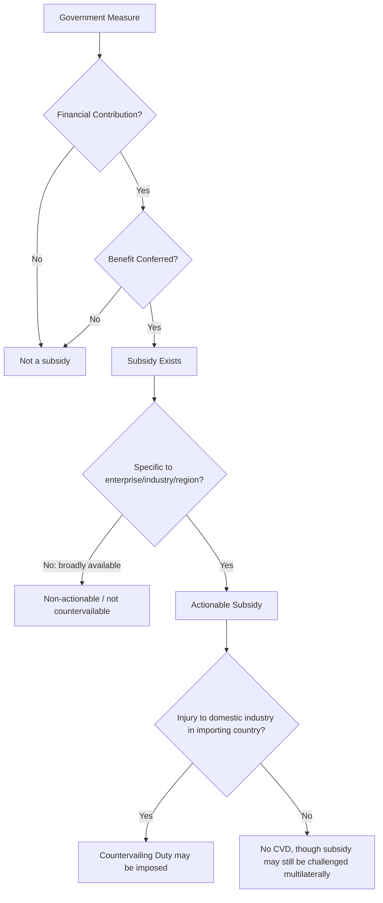

## Countervailing Duties and Subsidy Disputes

### Legal Basis

Countervailing duties (CVDs) are governed by Article VI and Article XVI of GATT 1994 and elaborated in the WTO **Agreement on Subsidies and Countervailing Measures (SCM Agreement)**. A CVD is a duty imposed by an importing country to offset a subsidy conferred by a foreign government on the production, manufacture, or export of a good, when that subsidized import causes or threatens material injury to a domestic industry.

Unlike anti-dumping duties, which respond to firm-level pricing behavior, CVDs respond to **government action** — the existence, magnitude, and nature of a subsidy benefiting the foreign producer.

### The Three-Part Legal Definition of a Subsidy

Under SCM Article 1, a subsidy exists only if two cumulative elements are present:

1. **Financial contribution** by a government or public body, taking one of four forms:
   - Direct transfer of funds (grants, loans, equity infusion) or potential direct transfers (loan guarantees)
   - Government revenue foregone that is otherwise due (e.g., tax credits, tax exemptions)
   - Government provision of goods or services (other than general infrastructure) or purchase of goods
   - Government payments to a funding mechanism, or entrustment/direction of a private body to carry out one of the above functions
2. **Benefit conferred** to the recipient — the financial contribution must place the recipient in a better position than it would have obtained in the market absent the government action (e.g., a loan on more favorable terms than commercially available).

A subsidy meeting both elements is only **actionable** (subject to CVD remedies) if it is also **specific** — i.e., not generally available to all industries in the economy, but limited to a particular enterprise, industry, group of industries, or region.

$$\text{Subsidy (actionable)} = \text{Financial Contribution} \; \cap \; \text{Benefit} \; \cap \; \text{Specificity}$$

### Diagrammatic Overview of the Subsidy Determination

### The Traffic-Light Subsidy Classification (Historical Framework)

The original SCM Agreement (1995) classified subsidies into three categories, informally called the "traffic light" system:

| Category | Description | Status |
| --- | --- | --- |
| **Red light (prohibited)** | Export subsidies and local-content (import-substitution) subsidies | Prohibited outright under SCM Article 3, regardless of injury |
| **Yellow light (actionable)** | Specific subsidies causing adverse effects (injury, serious prejudice, or nullification/impairment of benefits) | Subject to challenge only if adverse effects are demonstrated |
| **Green light (non-actionable)** | Certain non-specific subsidies, or specific subsidies for R&D, disadvantaged regions, or environmental compliance meeting defined criteria | Originally shielded from challenge |

[Unverified] The green-light category was time-limited under the original SCM Agreement (provisionally applicable for five years from WTO entry into force) and was not renewed by WTO members after its expiration; as a result, in current practice essentially all specific subsidies fall into either the prohibited or actionable category. This history is frequently cited when explaining why the "traffic light" framework is now effectively two-tiered rather than three-tiered, but the exact current status should be confirmed against the current SCM Agreement text given the possibility of subsequent negotiated changes.

### Export Subsidies: The Clearest CVD Target

Export subsidies are contingent, in law or in fact, on export performance — meaning the subsidy is available only if, or is more favorable when, the recipient exports rather than sells domestically. SCM Annex I provides an illustrative (non-exhaustive) list of prohibited export subsidy practices, including:

- Direct government provision of subsidies contingent on export performance
- Currency retention schemes involving a bonus on exports
- Internal transport/freight charges on export shipments more favorable than domestic shipments
- Export credit guarantees or insurance programs at premium rates inadequate to cover long-term operating costs and losses
- Full or partial exemption/remission of direct taxes specifically related to exports

Because export contingency is relatively straightforward to establish (the subsidy's design explicitly ties benefit to export volume or performance), export subsidies are the most litigated and most successfully challenged category under the SCM Agreement.

### Distinguishing CVD from Anti-Dumping

| Dimension | Countervailing Duties | Anti-Dumping Duties |
| --- | --- | --- |
| Target of remedy | Government subsidy | Firm-level pricing behavior |
| Core legal test | Financial contribution + benefit + specificity | Export price below normal value |
| Governing agreement | SCM Agreement | Anti-Dumping Agreement (ADA) |
| Investigation focus | Government programs, budgets, eligibility criteria | Firm's home-market vs. export pricing and costs |
| Non-market economy complication | Distinguishing state ownership from a "public body" providing financial contribution | Constructing normal value via surrogate country methodology |
| Simultaneous application | Both CVD and AD duties may be imposed on the same product if both dumping and subsidization are found, subject to a "double remedy" offset requirement to avoid double-counting the same overcapacity/cost effect |  |

### Benefit Calculation Methodology

The benefit conferred by a financial contribution is typically calculated by comparison to a market benchmark:

- **Loans**: Benefit is the difference between the interest rate actually paid and the rate the recipient would pay on a comparable commercial loan absent government support.

$$\text{Benefit}_{loan} = (r_{market} - r_{actual}) \times \text{Principal}$$

- **Equity infusions**: Benefit exists if the investment is inconsistent with usual private investor practice in the country concerned (i.e., no reasonable private investor would have made the same investment on the same terms).
- **Provision of goods/services**: Benefit is the difference between the price charged by the government and the prevailing market price for comparable goods/services in that country (or, if in-country prices are distorted by government dominance of the market, an external benchmark may be used).
- **Tax concessions**: Benefit is the amount of tax revenue otherwise due that is foregone.

The ad valorem subsidy rate used for CVD purposes is typically expressed as:

$$\text{Subsidy Rate}_\% = \frac{\text{Total Benefit Received}}{\text{Total Sales Value (or Export Sales Value)}} \times 100$$

### The Non-Market Economy / State-Owned Enterprise Complication

**Key Points**

- CVD investigations become analytically complex when the exporting country has extensive state ownership of enterprises, because it must be determined whether a state-owned enterprise (SOE) supplying inputs (e.g., steel, electricity, land-use rights) constitutes a "public body" whose below-market pricing is a government financial contribution, or merely an independent commercial actor.
- The WTO Appellate Body (notably in *US – Countervailing Duty Investigation on DRAMS* and *US – Anti-Dumping and Countervailing Duties (China)*) has addressed the "public body" standard, generally holding that mere government ownership or control alone is insufficient — the entity must possess, exercise, or be vested with governmental authority.
- [Inference] This standard has been a persistent source of friction in CVD cases involving economies with significant state-directed industrial policy, since investigating authorities and respondent governments frequently disagree over whether specific SOEs meet the "public body" threshold, and the practical application of the standard continues to be shaped by ongoing dispute settlement.
- A related complication is that when investigating authorities treat a country as a non-market economy for anti-dumping purposes (using surrogate-country normal value construction), applying CVD law simultaneously raises a "double remedy" concern: certain input-price distortions can be counted once via inflated anti-dumping margins (through the surrogate methodology) and again via a separate countervailable subsidy finding, unless an offset adjustment is made.

### Below is an SVG comparing the two remedy types side-by-side (svg_diagram):

<svg xmlns="http://www.w3.org/2000/svg" viewBox="0 0 780 400" font-family="Arial, sans-serif">
<text x="390" y="26" text-anchor="middle" font-size="18" font-weight="bold">Countervailing Duty vs. Anti-Dumping Duty Pathways (svg_diagram)</text>
<rect x="40" y="70" width="320" height="280" fill="#aec7e8" fill-opacity="0.3" stroke="#1f77b4" stroke-width="2" rx="8" />
<text x="200" y="95" text-anchor="middle" font-size="14" font-weight="bold" fill="#1f77b4">Countervailing Duty Path</text>
<text x="60" y="125" font-size="12">1. Government financial contribution</text>
<text x="60" y="150" font-size="12">2. Benefit to recipient vs. market benchmark</text>
<text x="60" y="175" font-size="12">3. Specificity to firm/industry/region</text>
<text x="60" y="200" font-size="12">4. Injury to importing-country industry</text>
<text x="60" y="225" font-size="12">5. Subsidy rate = Benefit / Sales</text>
<text x="60" y="255" font-size="12" font-style="italic">Targets: government programs,</text>
<text x="60" y="275" font-size="12" font-style="italic">grants, tax breaks, cheap loans,</text>
<text x="60" y="295" font-size="12" font-style="italic">input provision below market price</text>
<rect x="420" y="70" width="320" height="280" fill="#ffbb78" fill-opacity="0.3" stroke="#ff7f0e" stroke-width="2" rx="8" />
<text x="580" y="95" text-anchor="middle" font-size="14" font-weight="bold" fill="#ff7f0e">Anti-Dumping Duty Path</text>
<text x="440" y="125" font-size="12">1. Normal value (home price/constructed)</text>
<text x="440" y="150" font-size="12">2. Export price to importing market</text>
<text x="440" y="175" font-size="12">3. Dumping margin = (NV-EP)/EP</text>
<text x="440" y="200" font-size="12">4. Injury to importing-country industry</text>
<text x="440" y="225" font-size="12">5. Duty capped by lesser-duty rule (where applicable)</text>
<text x="440" y="255" font-size="12" font-style="italic">Targets: firm-level pricing</text>
<text x="440" y="275" font-size="12" font-style="italic">decisions and cost structure,</text>
<text x="440" y="295" font-size="12" font-style="italic">independent of government role</text>

<text x="120" y="380" font-size="12" font-style="italic">Both require a separate, converging injury determination before a duty can be imposed.</text>

</svg>

### CVD Investigation Procedure

The procedural sequence closely parallels anti-dumping investigations, with subsidy-specific adaptations:

1. **Petition and standing**: Same 25%/50% domestic industry support thresholds as anti-dumping (SCM Article 11).
2. **Initiation**: Requires sufficient evidence of a financial contribution, benefit, specificity, and injury.
3. **Government questionnaires**: Unlike anti-dumping (which questions exporting firms), CVD investigations require detailed questionnaires to the **foreign government** itself, covering program eligibility criteria, budgetary allocations, and administration — since the subsidy program itself is the object of investigation.
4. **Preliminary determination**: Provisional measures may be imposed, generally capped at the estimated subsidy rate, after at least 60 days from initiation.
5. **Verification**: On-site verification may extend to government agencies administering the subsidy program, not just the recipient firm.
6. **Final determination and duty imposition**: Definitive CVD imposed if subsidization and injury are both confirmed, generally subject to the same 5-year sunset review requirement as anti-dumping duties (SCM Article 21.3).

### De Minimis and Negligibility Thresholds

CVD investigations must terminate without duties if:

- The subsidy amount is **de minimis** — generally less than 1% ad valorem (a lower threshold than the 2% de minimis for anti-dumping margins, reflecting the different nature of the two remedies), though SCM Article 27.10 provides higher de minimis thresholds (commonly cited around 2–3%) for developing-country members.
- The volume of subsidized imports is negligible (generally under 4% of total imports of the like product from a single developing country, subject to aggregate exceptions, per SCM Article 27.10).

[Unverified] Exact de minimis percentages and their application to developing vs. developed countries should be verified against the current SCM Agreement text, as special and differential treatment provisions have been subject to negotiation and review.

### Serious Prejudice and Multilateral Subsidy Challenges

Separate from CVD investigations conducted unilaterally by an importing country, the SCM Agreement also permits a WTO member to challenge another member's subsidy multilaterally through WTO dispute settlement, alleging **adverse effects**, which include:

1. **Injury** to the domestic industry of another member (the CVD-relevant category)
2. **Serious prejudice** to the interests of another member — including displacement of exports in third-country markets, significant price undercutting, or increase in world market share by the subsidizing member in a primary product or commodity
3. **Nullification or impairment** of benefits accruing under GATT, typically tariff concessions undermined by subsidization

This multilateral track does not result in a duty on imports; instead, remedies flow through the WTO dispute settlement process (requiring the subsidizing member to withdraw the subsidy or remove its adverse effects, subject to authorized retaliation for non-compliance).

### Illustrative Numerical Example

A hypothetical CVD investigation into subsidized aluminum imports:

- Government program: preferential loans to aluminum producers at 2% interest, versus a commercial benchmark rate of 7%.
- Loan principal: $50 million per producer, average outstanding for the full year.

$$\text{Benefit} = (7\% - 2\%) \times \$50{,}000{,}000 = \$2{,}500{,}000$$

- Producer's total sales value: $100 million.

$$\text{Subsidy Rate} = \frac{2{,}500{,}000}{100{,}000{,}000} \times 100\% = 2.5\%$$

- This exceeds the 1% de minimis threshold for a developed-country investigating authority, so the investigation proceeds.
- If injury is also confirmed (e.g., domestic aluminum producers show declining capacity utilization and price suppression attributable to the subsidized imports), a definitive CVD of up to 2.5% (subject to any lesser-duty cap in jurisdictions applying one) may be imposed.

### Simultaneous AD/CVD Proceedings and the Double-Remedy Rule

When a product is subject to both anti-dumping and countervailing duty investigations simultaneously (common for products from economies with both state-directed subsidy programs and dumping allegations), SCM Article 19.3 (as clarified through subsequent amendments and dispute settlement, including in the context of non-market-economy methodologies) requires investigating authorities to avoid "double remedies" — i.e., avoid countervailing the same subsidization twice by both an inflated anti-dumping margin (calculated via surrogate-country methodology that does not reflect the actual subsidized input costs) and a separate CVD on the same input subsidy. [Inference] Implementing this offset in practice is technically demanding, since it requires disentangling how much of a dumping margin calculated under a non-market-economy methodology is attributable to subsidization already captured by the parallel CVD determination, and specific offset methodologies remain an area of continued regulatory and litigation activity.

### Conclusion

Countervailing duties address a fundamentally different economic problem than anti-dumping duties: rather than responding to a firm's independent pricing strategy, they respond to a government's financial intervention that confers an artificial competitive advantage on domestic producers relative to what market conditions would otherwise support. The SCM Agreement's three-part test — financial contribution, benefit, and specificity — combined with the outright prohibition of export and local-content subsidies, establishes a stricter multilateral discipline on subsidies than exists for ordinary dumping. In practice, CVD investigations are procedurally complex due to the need to examine government programs directly (rather than firm pricing alone), and are further complicated in cases involving state-owned enterprises, non-market economies, and the resulting risk of double remedies when AD and CVD proceedings run concurrently on the same product.

**Related Topics**

- Antidumping duties and investigation procedures
- The "public body" standard and state-owned enterprise subsidization
- WTO dispute settlement: serious prejudice and nullification/impairment claims
- Non-market economy methodology in trade remedy law
- Special and differential treatment for developing countries under the SCM Agreement
- Export credit guarantees and the OECD Arrangement on Officially Supported Export Credits
- Safeguard measures and their relationship to contingent protection instruments