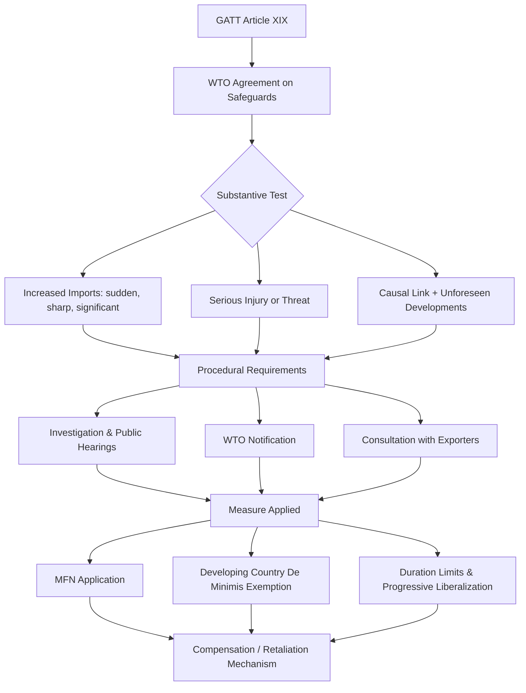

## Safeguard Measures and Emergency Protection

### Definition and Legal Basis

Safeguard measures are temporary trade restrictions (tariffs, quotas, or tariff-rate quotas) that a WTO member imposes on imports of a product when a surge in imports causes or threatens to cause **serious injury** to the domestic industry producing like or directly competitive products. Unlike anti-dumping or countervailing duties, safeguards do not require a finding of unfair trade practice (no dumping, no subsidization). They are triggered purely by the fact of a fair-trade **import surge** and its injurious effect — reflecting the underlying "escape clause" logic that a country should be able to temporarily suspend a trade concession when the consequences of liberalization exceed what was anticipated.

The legal basis under WTO law rests on two instruments:

- **Article XIX of GATT 1994** — the original "Emergency Action on Imports of Particular Products" provision.
- **WTO Agreement on Safeguards (SGA)** — negotiated in the Uruguay Round to clarify and discipline Article XIX, which had been criticized for ambiguity and for being circumvented via "grey area measures" (voluntary export restraints, orderly marketing arrangements).

### Rationale: The "Escape Clause" Logic

Safeguards exist as a **pressure-release valve** for trade liberalization. Governments negotiate tariff bindings and market-access commitments based on politically and economically tolerable levels of import competition. If actual import growth outpaces what was anticipated, the resulting injury to domestic producers can generate protectionist backlash strong enough to threaten the broader liberalization commitment itself.

By allowing a **temporary, transparent, and compensable** exception, the safeguard mechanism:

- Preserves the credibility of long-term trade agreements by providing a controlled outlet for adjustment pressure.
- Buys time for the domestic industry to restructure, downsize, or otherwise adjust to import competition.
- Avoids permanent renegotiation of tariff schedules every time competitive conditions shift.

[Inference] This is often framed in the trade-theory literature as a solution to a time-inconsistency problem: without an escape valve, governments might be unwilling to make deep tariff commitments in the first place, anticipating future adjustment costs they could not politically absorb.

### Substantive Conditions for Imposition

Article XIX and the SGA establish a cumulative three-part test. All conditions must be satisfied simultaneously.

#### 1. Increased Imports

Imports of the product must have increased — in absolute terms, or relative to domestic production — and the increase must be:

- **Sudden** (in terms of timing)
- **Sharp** (in terms of magnitude)
- **Significant** (in terms of quantity)
- **Recent** enough to bear a causal relationship to the injury

A gradual, long-term increase in import share does not, on its own, satisfy this element; WTO panels have required a genuine surge, not merely a rising trend line.

#### 2. Serious Injury or Threat Thereof

The SGA (Article 4.1(a)) defines **serious injury** as "a significant overall impairment in the position of a domestic industry" — a materially higher threshold than the "material injury" standard used in anti-dumping and countervailing duty cases. **Threat of serious injury** must be based on facts, not merely allegation, conjecture, or remote possibility, and must be clearly imminent.

Investigating authorities must evaluate all relevant factors affecting the industry's condition, including:

- Rate and amount of the increase in imports
- Market share taken by increased imports
- Changes in sales, production, productivity, capacity utilization
- Profits and losses
- Employment levels

#### 3. Causation ("Unforeseen Developments" and Causal Link)

- **Causal link**: the increased imports must cause or threaten to cause the serious injury to the domestic industry.
- **Non-attribution requirement**: authorities must separate and distinguish injury caused by other factors (e.g., technological change, changes in demand, competition from other domestic producers) from that caused by imports — injury from these other factors cannot be attributed to imports.
- **Unforeseen developments**: derived from GATT Article XIX itself, this requires demonstrating that the import surge resulted from developments that were unforeseen at the time the relevant tariff concession was negotiated. This has been a recurring point of contention in WTO dispute settlement (e.g., *US – Lamb*, *US – Wheat Gluten*, *Korea – Dairy*), with the Appellate Body insisting that this requirement, though not explicit in the SGA text, is a mandatory element carried over from Article XIX.

### Procedural Requirements

The SGA imposes strict procedural discipline, partly to prevent the abuse that characterized pre-Uruguay Round safeguard practice.

| Requirement | Description |
| --- | --- |
| **Investigation** | Must be conducted by a competent national authority following published procedures |
| **Public notice & hearings** | Interested parties (exporters, importers, foreign governments) must have opportunity to present evidence and views |
| **Published report** | Findings on all legal and factual issues must be published, with reasoned conclusions |
| **Notification to WTO** | Members must notify the Committee on Safeguards immediately upon initiating an investigation, making a finding of injury, and taking or extending a measure |
| **Consultations** | Prior consultation with affected exporting members before applying a measure |

### Application: Duration, Degression, and Compensation

**Duration**: A safeguard measure should be applied only for the period necessary to prevent or remedy serious injury and to facilitate adjustment.

- **Initial period**: up to **4 years**
- **Maximum extension**: total period, including extensions, generally **8 years** (10 years for developing-country members, per SGA Article 9.1)
- **Progressive liberalization**: measures lasting longer than 1 year must be progressively liberalized at regular intervals during the period of application if the measure continues to be applied for more than three years.

**Re-application restriction**: A safeguard measure generally cannot be reapplied to the same product until a period equal to the duration of the previous measure has elapsed (subject to minimum non-application periods), preventing a "revolving door" of successive protection.

**Compensation and rebalancing**: Because safeguards suspend a bound tariff concession that was fairly earned through negotiation (not a punishment for unfair trade), the imposing country is expected to maintain a "substantially equivalent level of concessions." If consultations do not produce agreement on adequate trade compensation, **affected exporting members may suspend substantially equivalent concessions** against the imposing country (retaliation) — though this right is typically not exercised during the first three years of a measure if it conforms with the Agreement and injury from a genuine import surge.

$$\text{Compensation Principle: } \sum \Delta \tau_{\text{safeguard}} \approx \sum \Delta \tau_{\text{offsetting concessions}}$$

This is distinct from anti-dumping/countervailing duty regimes, where no compensation is owed because the practice being remedied is itself considered "unfair."

### The Non-Discrimination Principle and Its Erosion

A defining structural feature of safeguards, distinguishing them from anti-dumping/CVD measures, is that they must in principle be applied on an **MFN (most-favored-nation) basis** — i.e., against imports from **all** sources, regardless of origin, rather than targeted at specific exporting countries. This reflects the idea that a safeguard responds to a general market disruption, not to any single country's unfair conduct.

However, the SGA permits a narrow **selective quota allocation exception** (Article 5.2(b)): when a quota is used and imports from certain members have increased disproportionately, allocation among supplying countries may deviate from historical shares under specified conditions, subject to consultation.

[Unverified] In practice, developing countries have frequently argued that ostensibly MFN-consistent safeguards are designed with product-scope definitions narrow enough to functionally target specific exporting countries' export baskets, even though this is not permitted in law.

### De Minimis Exemption for Developing Countries

SGA Article 9.1 provides that safeguard measures shall not be applied against a product originating in a developing country member as long as its share of imports of the product does not exceed:

- **3%** individually, **provided that** developing-country members with less than 3% import share **collectively account for no more than 9%** of total imports of the product.

This exemption is designed to prevent safeguards from disproportionately burdening small, low-volume developing-country exporters while still allowing action against larger sources of the import surge.

### Provisional Safeguard Measures

In "critical circumstances" where delay would cause damage difficult to repair, a member may apply a **provisional safeguard measure** based on a preliminary determination of clear evidence of serious injury.

- Must take the form of **tariff increases only** (not quotas).
- Maximum duration: **200 days**.
- Counted toward the overall maximum duration of the definitive measure.
- Must be refunded promptly if the subsequent investigation does not confirm injury.

### Safeguards vs. Anti-Dumping and Countervailing Duties

| Dimension | Safeguards | Anti-Dumping Duties | Countervailing Duties |
| --- | --- | --- | --- |
| **Trigger** | Fair-trade import surge | Dumping (price discrimination/below normal value) | Actionable subsidy |
| **Injury standard** | Serious injury (higher threshold) | Material injury | Material injury |
| **Target** | All countries (MFN) | Specific exporting firms/countries | Specific exporting countries/firms |
| **Unfair practice required** | No | Yes | Yes |
| **Compensation owed** | Yes (in principle) | No | No |
| **Legal basis** | GATT Art. XIX + SGA | GATT Art. VI + ADA | GATT Art. VI + SCM Agreement |
| **Typical duration** | Up to 8–10 years | 5 years (renewable via sunset review) | 5 years (renewable via sunset review) |

### Special Safeguard Mechanisms

Beyond the general SGA, WTO law contains sector-specific and transitional safeguard tools:

- **Special Safeguard (SSG) under the Agreement on Agriculture (Article 5)**: allows additional duties on designated agricultural products when import volumes exceed a trigger level or import prices fall below a trigger price, without needing to prove serious injury — a lower threshold than the general safeguard.
- **Textiles Transitional Safeguard**: previously available under the now-expired Agreement on Textiles and Clothing (ATC) during the phase-out of the Multi-Fiber Arrangement quota system.
- **China-Specific Transitional Product-Specific Safeguard (Section 16 of China's WTO Accession Protocol)**: allowed WTO members to impose safeguards against Chinese-origin products under an easier "market disruption" (rather than "serious injury") standard; this provision expired in December 2013.
- **Special Safeguard Mechanism (SSM) for developing countries in agriculture**: a proposed but never finalized mechanism debated extensively in the Doha Round, intended to let developing countries raise tariffs temporarily in response to import surges or price falls in agriculture.

### Illustrative Numerical Example

Consider a domestic steel industry facing a sudden import surge:

- Pre-surge annual imports: 2 million tons, 15% domestic market share
- Post-surge annual imports: 5 million tons, 35% domestic market share (over 18 months)
- Domestic industry capacity utilization: falls from 85% to 55%
- Domestic industry employment: falls by 20%
- Domestic industry profitability: shifts from positive margins to losses

**Analysis under the three-part test**:

1. **Increased imports**: 150% volume increase and more than doubling of market share within 18 months — satisfies "sudden, sharp, and significant."
2. **Serious injury**: Sharp declines in capacity utilization, employment, and profitability collectively indicate "significant overall impairment" — plausibly meets the serious injury threshold (subject to full factor-by-factor analysis).
3. **Causation**: Authorities would need to confirm the import surge (rather than, say, a demand-side recession or new domestic entrant capacity) is the operative cause, and that the surge stems from an unforeseen development relative to the relevant tariff concession.

If confirmed, the government could impose a **tariff-rate quota**: for example, imports up to 3 million tons at the bound MFN rate, with a supplementary duty of 20 percentage points on imports above that threshold, applied on an MFN basis, with a commitment to liberalize progressively after year one and to offer trade compensation to major affected exporters.

### Safeguard Investigation and Application Process (svg_diagram)

<svg xmlns="http://www.w3.org/2000/svg" viewBox="0 0 900 460" font-family="Arial, sans-serif">
<text x="450" y="24" font-size="16" font-weight="bold" text-anchor="middle">Safeguard Measure Lifecycle (svg_diagram)</text>
<rect x="20" y="50" width="180" height="60" rx="6" fill="#dbe9f7" stroke="#2b6cb0" />
<text x="110" y="75" font-size="12" text-anchor="middle" font-weight="bold">Import Surge</text>
<text x="110" y="92" font-size="11" text-anchor="middle">Domestic petition or</text>
<text x="110" y="105" font-size="11" text-anchor="middle">ex officio initiation</text>
<rect x="240" y="50" width="180" height="60" rx="6" fill="#dbe9f7" stroke="#2b6cb0" />
<text x="330" y="72" font-size="12" text-anchor="middle" font-weight="bold">Investigation</text>
<text x="330" y="89" font-size="11" text-anchor="middle">Public notice, hearings,</text>
<text x="330" y="102" font-size="11" text-anchor="middle">evidence gathering</text>
<rect x="460" y="50" width="200" height="60" rx="6" fill="#dbe9f7" stroke="#2b6cb0" />
<text x="560" y="72" font-size="12" text-anchor="middle" font-weight="bold">3-Part Test</text>
<text x="560" y="89" font-size="11" text-anchor="middle">Increased imports + serious</text>
<text x="560" y="102" font-size="11" text-anchor="middle">injury + causation</text>
<rect x="700" y="50" width="180" height="60" rx="6" fill="#fde2c8" stroke="#c05621" />
<text x="790" y="75" font-size="12" text-anchor="middle" font-weight="bold">Critical Circumstances?</text>
<text x="790" y="92" font-size="11" text-anchor="middle">Provisional measure</text>
<text x="790" y="105" font-size="11" text-anchor="middle">(tariff, ≤200 days)</text>
<line x1="200" y1="80" x2="235" y2="80" stroke="#333" stroke-width="1.5" marker-end="url(#arrow)" />
<line x1="420" y1="80" x2="455" y2="80" stroke="#333" stroke-width="1.5" marker-end="url(#arrow)" />
<line x1="660" y1="80" x2="695" y2="80" stroke="#333" stroke-width="1.5" marker-end="url(#arrow)" />
<line x1="560" y1="110" x2="560" y2="160" stroke="#333" stroke-width="1.5" marker-end="url(#arrow)" />
<rect x="380" y="160" width="360" height="55" rx="6" fill="#d9f2d9" stroke="#2f855a" />
<text x="560" y="182" font-size="12" text-anchor="middle" font-weight="bold">Notify WTO Committee on Safeguards</text>
<text x="560" y="200" font-size="11" text-anchor="middle">Consult with affected exporting members</text>
<line x1="560" y1="215" x2="560" y2="255" stroke="#333" stroke-width="1.5" marker-end="url(#arrow)" />
<rect x="330" y="255" width="460" height="60" rx="6" fill="#f7d7da" stroke="#c53030" />
<text x="560" y="277" font-size="12" text-anchor="middle" font-weight="bold">Apply Definitive Measure (MFN basis)</text>
<text x="560" y="294" font-size="11" text-anchor="middle">Tariff, quota, or tariff-rate quota; initial period ≤ 4 years</text>
<text x="560" y="308" font-size="11" text-anchor="middle">De minimis exemption for small developing-country suppliers</text>
<line x1="560" y1="315" x2="560" y2="355" stroke="#333" stroke-width="1.5" marker-end="url(#arrow)" />
<rect x="330" y="355" width="460" height="55" rx="6" fill="#e9d8fd" stroke="#6b46c1" />
<text x="560" y="377" font-size="12" text-anchor="middle" font-weight="bold">Progressive Liberalization / Review</text>
<text x="560" y="394" font-size="11" text-anchor="middle">Extension up to 8 yrs (10 yrs developing countries)</text>
<line x1="560" y1="410" x2="560" y2="440" stroke="#333" stroke-width="1.5" marker-end="url(#arrow)" />
<text x="560" y="455" font-size="11" text-anchor="middle" font-style="italic">Compensation owed, or exporters may suspend equivalent concessions</text>
</svg>

### Comparative Framework Structure

### Political Economy Considerations

- **Concentrated benefits, diffuse costs**: the domestic industry receiving protection is typically a concentrated, well-organized interest group, while the costs (higher consumer prices, higher input costs for downstream industries) are diffused across many consumers and firms — a classic collective-action asymmetry favoring protectionist lobbying.
- **Downstream industry costs**: safeguards on intermediate goods (e.g., steel, aluminum) raise costs for downstream manufacturing sectors that use these inputs, potentially creating net negative employment effects economy-wide even while protecting the upstream sector. [Inference] This tension is frequently cited in the empirical literature evaluating safeguard episodes such as the US steel safeguards of 2002.
- **Retaliation risk**: because compensation or retaliation is built into the SGA framework, safeguard measures carry a structurally higher risk of triggering trade friction or WTO disputes compared to purely domestic tariff policy.
- **Signaling and credibility**: overuse of safeguards, or their use as disguised protectionism, can erode confidence in a country's trade policy commitments and invite reciprocal restrictions.

### Notable WTO Dispute Cases

- **US – Steel Safeguards (2002)**: The US imposed tariffs of up to 30% on various steel products; the WTO Appellate Body found the US had failed to adequately demonstrate "unforeseen developments" and causation for several product categories, and the measures were ultimately withdrawn under threat of retaliation from the EU and others.
- **Korea – Dairy Safeguard**: Established the principle that "unforeseen developments" must be demonstrated as a matter of fact, not simply asserted.
- **Argentina – Footwear Safeguard**: Clarified the standard for demonstrating a genuine causal link distinct from correlation with rising import volumes.

**Related Topics**

- Anti-dumping duties: dumping margin calculation and normal value determination
- Countervailing duties and actionable/prohibited subsidies under the SCM Agreement
- WTO dispute settlement mechanism and the Appellate Body crisis
- Voluntary export restraints and "grey area" measures pre-Uruguay Round
- Special and differential treatment for developing countries in trade remedy law
- Agreement on Agriculture: tariffication and the Special Safeguard (SSG)
- Trade adjustment assistance as a domestic complement to safeguard protection
- Rules of origin and their interaction with safeguard scope definitions