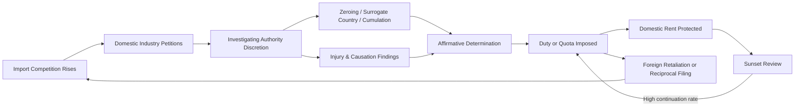

## Strategic and Political Use of Trade Remedy Law

### Conceptual Overview

Trade remedy law — anti-dumping (AD) duties, countervailing duties (CVD), and safeguard measures — is nominally designed to correct discrete market distortions: unfair pricing, unfair subsidization, or disruptive fair-trade import surges. In practice, an extensive political-economy and law-and-economics literature documents that these instruments are frequently deployed, structured, and timed for purposes that diverge from their stated corrective rationale. This body of analysis treats trade remedy law less as a narrow technical correction and more as a **legally sanctioned channel for protectionist policy** operating within the constraints of WTO-consistent procedure.

The central analytical tension: trade remedy statutes provide *administrable, quasi-judicial* processes with defined legal tests, but the underlying determinations (normal value construction, injury assessment, causation) retain enough methodological discretion that outcomes can be — and empirically often are — shaped by political and strategic considerations.

### Why Trade Remedies Are an Attractive Political Instrument

#### WTO-Legality as a Shield

Ordinary tariff increases above bound rates violate WTO obligations and invite retaliation or dispute settlement. Trade remedies, by contrast, are **explicitly permitted derogations** from those same obligations, provided procedural and substantive conditions are met. This makes them the primary legally available channel through which a WTO member can raise protection above bound levels in response to import competition.

- **[Inference]** This legal availability creates an incentive structure in which domestic industries facing import competition rationally petition for trade remedy relief rather than lobby for renegotiation of tariff bindings, since the latter is far more diplomatically costly and slower.

#### Administered Protection vs. Legislated Protection

The distinction (drawn extensively in the trade policy literature, e.g., Finger, Destler) is between:

- **Legislated protection**: tariffs set directly by the legislature — highly visible, politically costly, subject to reciprocal international bargaining.
- **Administered protection**: protection resulting from technical/administrative determinations made by specialized agencies (e.g., a Commerce Ministry, an International Trade Commission) applying statutory tests to firm-specific petitions.

Administered protection is politically attractive because it:

1. **Diffuses accountability** — a finding of "dumping" or "injury" is presented as a neutral, rules-based, quasi-judicial outcome rather than a discretionary political choice by elected officials.
2. **Individualizes the remedy** — targets specific foreign firms/countries rather than requiring blanket tariff action, reducing the diplomatic and systemic cost of protection.
3. **Provides plausible deniability** — governments can point to "the law" and "the evidence" rather than admit to protectionist intent.

### Mechanisms of Strategic Use

#### 1. Petition Timing and Strategic Filing

Domestic industries can time AD/CVD petitions to:

- Coincide with **cyclical downturns**, when injury indicators (falling profits, capacity utilization, employment) are more likely to appear "serious" or "material" regardless of the true competitive cause — a phenomenon sometimes described as the industry using import competition as a scapegoat for demand-side or macroeconomic weakness.
- Precede **election cycles** or periods of heightened legislative attention to trade policy, maximizing political salience and the probability of a favorable administrative outcome.
- Follow **exchange rate appreciation** episodes, when a stronger domestic currency mechanically increases import volumes and reduces the relative cost competitiveness of domestic producers — again generating injury indicators that may substitute for a genuine trade-remedy trigger.

#### 2. Methodological Discretion in Dumping Margin Calculations

Investigating authorities retain significant discretion in constructing "normal value," which can be exploited to generate or inflate a finding of dumping:

- **Zeroing**: a controversial methodology (repeatedly found WTO-inconsistent in disputes such as *US – Zeroing*) in which negative dumping margins (export price above normal value on some transactions) are set to zero rather than netted against positive margins, mechanically inflating the aggregate dumping margin.
- **Non-market economy (NME) treatment**: when the exporting country is designated a non-market economy, authorities may construct normal value using a **surrogate country's** costs of production rather than the exporter's actual costs — a methodology that gives the investigating authority wide latitude in surrogate selection and tends to produce systematically higher dumping margins.
- **Constructed value methodology**: when home-market sales are deemed insufficient or below cost, normal value can be "constructed" from cost-of-production estimates plus an assumed profit margin, again involving discretionary assumptions.

$$\text{Dumping Margin} = \frac{NV - EP}{EP} \times 100\%$$

where $NV$ is normal value and $EP$ is export price; the discretion embedded in estimating $NV$ (rather than in $EP$, which is typically observable) is the primary lever for strategic manipulation.

#### 3. Injury and Causation Determinations as Political Levers

- **Cumulation**: investigating authorities may cumulate the volume and price effects of imports from multiple countries under investigation simultaneously, even when no single country's imports would independently satisfy the injury threshold — mechanically increasing the probability of an affirmative injury finding.
- **Like product definition**: how narrowly or broadly the "domestic like product" is defined shapes which domestic producers' data enters the injury analysis, and a narrow definition can be chosen to include only the petitioning firms' most vulnerable product lines.
- **Non-attribution manipulation**: [Inference] because separating import-caused injury from injury due to other factors (technology, demand shifts, domestic overcapacity) requires judgment calls, authorities under domestic political pressure may under-weight non-import causes.

#### 4. Sunset Reviews and Duration Extension

AD/CVD orders nominally expire after five years unless a **sunset review** determines that revocation would likely lead to continuation or recurrence of dumping/subsidization and injury. In practice:

- Sunset reviews have historically had very high affirmative continuation rates in several jurisdictions, [Unverified] which critics argue reflects an institutional and evidentiary bias toward maintaining existing protection once industries have organized around it.
- This generates **de facto permanent protection** for import-competing industries that petition successfully once, converting what is legally a "temporary" remedy into a durable market-access barrier.

#### 5. Safeguards as a Broader Political Tool

Because safeguards apply on an MFN basis and require compensation, they are politically costlier to invoke than AD/CVD (which target specific firms/countries without compensation obligation). Consequently:

- Safeguards tend to be reserved for **large-scale, politically salient industries** (steel, solar panels, washing machines, tires) where the scale of import competition or worker displacement generates significant legislative and electoral pressure.
- [Inference] Governments may prefer AD/CVD over safeguards specifically because AD/CVD allows them to target the "problem" country's exports without paying compensation or triggering broader retaliation — making AD/CVD the lower-cost strategic instrument even when the underlying economic story (a broad import surge) more closely resembles the safeguard trigger.

### Strategic Trade Policy Theory and Trade Remedies

Strategic trade policy models (Brander–Spencer framework) suggest that government intervention can shift oligopolistic rents toward domestic firms in imperfectly competitive international markets. While these models are typically framed around export subsidies, the same logic extends to import protection:

- An AD duty that raises a foreign rival's effective price in the domestic market can shift market share and profits toward the domestic firm in a Cournot- or Bertrand-style duopoly setting.
- [Speculation] Some scholars have modeled AD petitions themselves as a strategic signal or "harassment" tool — even a petition that is ultimately rejected can impose real costs on the foreign respondent (legal fees, uncertainty, price suppression during investigation), potentially discouraging aggressive pricing or market entry regardless of the final legal outcome.

This "harassment effect" is a documented empirical phenomenon: foreign exporters' stock prices and export volumes to the petitioning market often decline upon petition filing, independent of the ultimate determination.

### Retaliatory and Reciprocal Dynamics

Trade remedy law is also used **diplomatically and reciprocally**:

- **Tit-for-tat filings**: when country A imposes AD duties on country B's exports, country B's domestic industries may be politically incentivized (or implicitly encouraged by their government) to file parallel AD petitions against country A's exports, creating an escalatory but WTO-legal cycle of contingent protection.
- **Bargaining chip in broader negotiations**: the initiation, suspension, or settlement of a trade remedy investigation can be used as leverage in unrelated bilateral trade or diplomatic negotiations — investigations have historically been paused or settled via **suspension agreements** (quantitative or price undertakings) that function as negotiated managed-trade outcomes rather than strict legal remedies.
- **Signaling domestic resolve**: filing or maintaining a trade remedy measure can serve a government's need to visibly demonstrate that it is "standing up" for a politically important industry, even where the economic magnitude of protection is modest.

### Empirical Patterns and Industry Concentration

Empirical literature (e.g., studies of the US ITC and EU trade defense instruments) documents that AD/CVD petitions cluster heavily in a small number of sectors:

- **Steel and metals** (globally the single largest user category of AD/CVD measures)
- **Chemicals**
- **Textiles and apparel** (historically, prior to Multi-Fiber Arrangement phase-out)
- **Consumer electronics and solar components** (more recent growth area)

[Inference] This concentration is consistent with the political-economy prediction that trade remedy usage correlates with industry characteristics favorable to collective action: geographic concentration (enabling coordinated lobbying and legislative influence), a relatively small number of large firms (reducing free-rider problems in petition filing), and high fixed-cost, capital-intensive production (generating strong incentives to resist demand or price declines via protection rather than exit).

### Structural Diagram: Political Economy Feedback Loop (svg_diagram)

<svg xmlns="http://www.w3.org/2000/svg" viewBox="0 0 900 380" font-family="Arial, sans-serif">
<text x="450" y="24" font-size="16" font-weight="bold" text-anchor="middle">Political Economy of Trade Remedy Use (svg_diagram)</text>
<rect x="30" y="55" width="200" height="60" rx="6" fill="#dbe9f7" stroke="#2b6cb0" />
<text x="130" y="78" font-size="12" text-anchor="middle" font-weight="bold">Concentrated Industry</text>
<text x="130" y="95" font-size="11" text-anchor="middle">Low collective-action cost</text>
<rect x="330" y="55" width="220" height="60" rx="6" fill="#dbe9f7" stroke="#2b6cb0" />
<text x="440" y="78" font-size="12" text-anchor="middle" font-weight="bold">Petition Filed</text>
<text x="440" y="95" font-size="11" text-anchor="middle">Timed to cycle / FX / election</text>
<rect x="650" y="55" width="220" height="60" rx="6" fill="#fde2c8" stroke="#c05621" />
<text x="760" y="78" font-size="12" text-anchor="middle" font-weight="bold">Discretionary Methodology</text>
<text x="760" y="95" font-size="11" text-anchor="middle">Zeroing, NME surrogate, cumulation</text>
<line x1="230" y1="85" x2="325" y2="85" stroke="#333" stroke-width="1.5" marker-end="url(#arrow2)" />
<line x1="550" y1="85" x2="645" y2="85" stroke="#333" stroke-width="1.5" marker-end="url(#arrow2)" />
<rect x="330" y="160" width="220" height="60" rx="6" fill="#f7d7da" stroke="#c53030" />
<text x="440" y="183" font-size="12" text-anchor="middle" font-weight="bold">Affirmative Determination</text>
<text x="440" y="200" font-size="11" text-anchor="middle">Duty imposed / harassment effect</text>
<line x1="760" y1="115" x2="760" y2="145" stroke="#333" stroke-width="1.5" />
<line x1="760" y1="145" x2="440" y2="145" stroke="#333" stroke-width="1.5" />
<line x1="440" y1="145" x2="440" y2="155" stroke="#333" stroke-width="1.5" marker-end="url(#arrow2)" />
<rect x="330" y="255" width="220" height="55" rx="6" fill="#d9f2d9" stroke="#2f855a" />
<text x="440" y="277" font-size="12" text-anchor="middle" font-weight="bold">Domestic Rent / Protection</text>
<text x="440" y="294" font-size="11" text-anchor="middle">Reduced foreign competition</text>
<line x1="440" y1="220" x2="440" y2="250" stroke="#333" stroke-width="1.5" marker-end="url(#arrow2)" />
<rect x="30" y="255" width="220" height="55" rx="6" fill="#e9d8fd" stroke="#6b46c1" />
<text x="140" y="277" font-size="12" text-anchor="middle" font-weight="bold">Sunset Review Bias</text>
<text x="140" y="294" font-size="11" text-anchor="middle">High continuation rate</text>
<line x1="330" y1="282" x2="255" y2="282" stroke="#333" stroke-width="1.5" marker-end="url(#arrow2)" />
<line x1="140" y1="255" x2="140" y2="115" stroke="#333" stroke-width="1.5" stroke-dasharray="4,3" />
<line x1="140" y1="115" x2="130" y2="115" stroke="#333" stroke-width="1.5" stroke-dasharray="4,3" marker-end="url(#arrow2)" />

<text x="450" y="345" font-size="11" text-anchor="middle" font-style="italic">Dashed line: durable protection reinforces future petitioning capacity of the same industry</text>

</svg>

### Feedback and Institutional Persistence

### Distinguishing Legitimate Correction from Strategic Capture

| Indicator | Suggests Legitimate Correction | Suggests Strategic/Political Use |
| --- | --- | --- |
| **Timing** | Coincides with documented pricing/subsidy evidence | Coincides with election cycle, FX shock, or cyclical downturn |
| **Methodology** | Standard, symmetric margin calculation | Zeroing, aggressive surrogate selection, broad cumulation |
| **Product scope** | Reflects genuine competitive substitutes | Narrowly defined to capture only petitioners' vulnerable lines |
| **Duration** | Terminates when injury/dumping ends | Repeated sunset renewal without updated evidence |
| **Compensation behavior (safeguards)** | Compensation offered in good faith | Compensation minimized or delayed |

[Inference] No single indicator is conclusive in isolation; the political-economy critique rests on the **pattern and frequency** of these features across large samples of cases rather than proof of intent in any single investigation.

### Reform Debates and Institutional Responses

- **WTO dispute settlement as a check**: the Appellate Body's rulings against practices like zeroing (*US – Zeroing (Japan)*, *US – Zeroing (EC)*) represent judicial efforts to discipline strategic use of methodological discretion — though enforcement depends on continued functioning of the dispute settlement system, which has faced institutional paralysis at the Appellate Body level since 2019.
- **Sunset review reform proposals**: some trade scholars and negotiators have proposed stricter evidentiary standards or automatic termination absent updated injury evidence, to reduce the "protection inertia" effect.
- **Transparency and notification requirements**: enhanced WTO notification obligations aim to increase the visibility of trade remedy usage patterns, making politically motivated clustering more observable to trading partners and researchers.
- **Plurilateral and bilateral FTA disciplines**: some preferential trade agreements include AD/CVD disciplines stricter than baseline WTO rules (e.g., mandatory lesser-duty rules, prohibition of zeroing) precisely to constrain strategic administration between the parties.

**Related Topics**

- Anti-dumping duties: dumping margin calculation and normal value determination
- Safeguard measures and emergency protection (Article XIX / SGA framework)
- Countervailing duties and actionable/prohibited subsidies under the SCM Agreement
- The Appellate Body crisis and WTO dispute settlement reform
- Non-market economy status and surrogate country methodology in AD investigations
- Suspension agreements and negotiated managed-trade outcomes
- Political economy of protection: the Grossman–Helpman "Protection for Sale" model
- Strategic trade policy and the Brander–Spencer framework