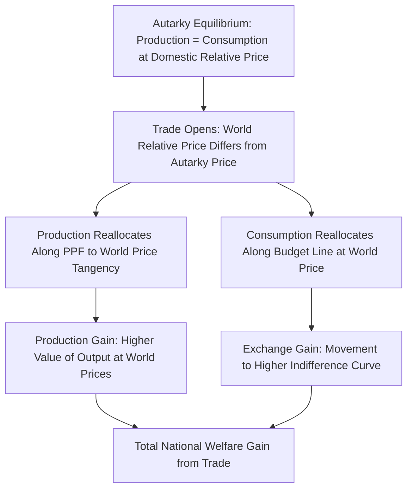

## The National Welfare Case for Free Trade

### Conceptual Overview

The national welfare case for free trade is the body of economic theory holding that, under a defined set of conditions, a country maximizes its aggregate economic welfare by allowing goods, services, and factors to be traded internationally without tariffs, quotas, or other policy-imposed distortions. This is distinct from — and analytically prior to — arguments about free trade's effects on income *distribution* within a country, or its effects on *other* countries. The national welfare case asks specifically: holding all else equal, does removing trade barriers raise or lower a single country's own aggregate economic surplus?

The case rests on two independent theoretical pillars:

1. **Gains from exchange** (comparative advantage): free trade allows countries to specialize according to relative efficiency and consume beyond their own production possibility frontier.
2. **Gains from competition and variety**: free trade disciplines domestic monopoly power, expands product variety, and permits exploitation of scale economies.

Both pillars converge on the same conclusion — free trade (in the absence of specific market failures or terms-of-trade power) weakly dominates protection from the standpoint of aggregate national welfare — though they derive this conclusion from different underlying mechanisms.

### The Ricardian Foundation: Comparative Advantage

David Ricardo's (1817) model establishes the foundational proposition that mutually beneficial trade can exist even when one country is absolutely more efficient at producing *every* good, as long as **relative** (opportunity-cost) efficiencies differ across countries.

**Setup**: Two countries, two goods, one factor of production (labor), with constant labor productivity per unit of output.

$$a_{LC} = \text{labor required per unit of cloth}, \quad a_{LW} = \text{labor required per unit of wine}$$

A country has a comparative advantage in cloth if its opportunity cost of cloth in terms of wine forgone is lower than the foreign country's:

$$\frac{a_{LC}}{a_{LW}} < \frac{a_{LC}^*}{a_{LW}^*}$$

**Key result**: Each country specializes in the good in which its relative (not absolute) labor productivity is highest, and world output of both goods rises relative to autarky. Both countries can consume outside their pre-trade production possibility frontier, generating a strict Pareto improvement in aggregate terms.

[Inference] The Ricardian model's power as a pedagogical and rhetorical tool lies precisely in this counterintuitive result: it shows that trade advantage does not require a country to be "good at" something in any absolute sense, only good at it *relative to its other options* — directly undermining the mercantilist intuition that a country must be competitive in a good to benefit from trading it.

### The Heckscher-Ohlin Extension: Factor Endowments

The Heckscher-Ohlin (H-O) model extends the comparative advantage logic by deriving the *source* of comparative advantage from differences in relative factor endowments (capital, labor, land) rather than assuming exogenous technology differences.

**Core proposition**: A country will export the good that uses its relatively abundant factor intensively, and import the good that uses its relatively scarce factor intensively.

This generates two related theorems central to the national welfare case:

- **Factor Price Equalization Theorem**: under free trade (and specific assumptions — identical technology, no factor-intensity reversals, incomplete specialization), trade in goods tends to equalize factor prices across countries even without factor mobility, since trade is effectively an indirect form of factor exchange embodied in goods.
- **Stolper-Samuelson Theorem**: trade liberalization raises the real return to a country's abundant factor and lowers the real return to its scarce factor — establishing that while *aggregate* national welfare rises with trade, the distributional effects within the country are not uniform (this distinction between aggregate and distributional effects is central to why the "national welfare case" must be kept analytically separate from distributional and political-economy arguments).

### Gains from Trade: Formal Decomposition

The standard general-equilibrium demonstration of gains from trade decomposes the total welfare gain into two components:

#### 1. Consumption Gains (Exchange Gains)

Even at fixed production, the ability to trade at world relative prices different from autarky relative prices allows the country to reach a higher indifference curve — this is the pure gains-from-exchange effect, analogous to two individuals trading endowments to reach a mutually preferred allocation.

#### 2. Production Gains (Specialization Gains)

Facing world prices rather than autarky prices, producers reallocate resources toward the comparative-advantage good, shifting production along the PPF to the point that maximizes the value of output at world prices — a further welfare gain layered on top of the pure exchange gain.

**Diagrammatic summary** (standard offer-curve/PPF treatment):

### Formal Welfare Measure: Consumer and Producer Surplus

In partial-equilibrium terms, applied to a small importing country facing a fixed world price $P_w$ below its autarky price $P_a$:

$$\Delta W = \Delta CS + \Delta PS$$

Where opening to trade at world price $P_w$:

- **Consumer surplus** rises by the area under the demand curve between $P_a$ and $P_w$, out to the new (larger) quantity consumed.
- **Producer surplus** falls, since domestic producers now receive only $P_w$ and produce less, but the loss to producers is smaller than the gain to consumers.
- The **net welfare gain** is represented by two triangular areas: a "consumption gain" triangle (increased consumer surplus from lower price on additional units consumed) and a "production efficiency gain" triangle (resources released from inefficient domestic production of the import good are redeployed to higher-value uses).

$$\Delta W = \underbrace{\tfrac{1}{2}(P_a - P_w)(Q_d^{trade} - Q_d^{autarky})}_{\text{consumption gain}} + \underbrace{\tfrac{1}{2}(P_a - P_w)(Q_s^{autarky} - Q_s^{trade})}_{\text{production gain}}$$

This is the mirror image of the standard **deadweight loss from a tariff** analysis — a tariff removes exactly these two triangles from national welfare (for a small country with no terms-of-trade power), which is why the small-country case for free trade is unambiguous: a small country imposing a tariff strictly reduces its own welfare, with no offsetting terms-of-trade benefit.

### Illustrative Numerical Example

Consider a small importing country for wheat:

- Autarky domestic price: $P_a = \$8$/bushel
- World price: $P_w = \$5$/bushel
- Domestic demand at $P_w$: 100 million bushels; domestic demand at $P_a$: 70 million bushels
- Domestic supply at $P_w$: 40 million bushels; domestic supply at $P_a$: 70 million bushels

**Consumption gain triangle**:

$$\tfrac{1}{2} \times (\$8 - \$5) \times (100 - 70) = \tfrac{1}{2} \times 3 \times 30 = \$45\text{ million}$$

**Production gain triangle**:

$$\tfrac{1}{2} \times (\$8 - \$5) \times (70 - 40) = \tfrac{1}{2} \times 3 \times 30 = \$45\text{ million}$$

**Total national welfare gain from opening to trade**: $\$90$ million, even though domestic wheat producers lose surplus and 30 million bushels of domestic production is displaced by imports. The net national gain is strictly positive because consumer gains exceed producer losses.

### The Small-Country vs. Large-Country Distinction

This is the pivotal qualifier in the "national welfare case" — it is unambiguous only for a **price-taking (small) country**.

| Country Type | Effect of Tariff on National Welfare |
| --- | --- |
| **Small country** (no influence on world price) | Tariff strictly reduces national welfare — pure deadweight loss, no offsetting benefit |
| **Large country** (import demand affects world price) | An **optimal tariff** can improve national welfare by improving the terms of trade, at the *expense* of trading partners |

For a large country, the **optimal tariff argument** shows that a tariff can extract terms-of-trade gains from foreign exporters by lowering the price they receive, transferring surplus from foreigners to the domestic economy. This gain must be weighed against the domestic deadweight loss from the tariff.

$$t^* = \frac{1}{e^*}$$

where $t^*$ is the optimal tariff rate and $e^*$ is the (absolute value of the) foreign export supply elasticity. As $e^* \to \infty$ (perfectly elastic foreign supply, i.e., the small-country case), $t^* \to 0$ — confirming that the optimal tariff argument vanishes exactly in the small-country limit, consistent with the unambiguous free-trade result above.

**Important qualification**: the optimal tariff argument is a case *for* a tariff on purely *national* welfare grounds for a large country — but it is not a general endorsement of protection, because (a) it necessarily reduces *global* welfare and the trading partner's welfare, (b) it invites retaliation, which can eliminate or reverse the terms-of-trade gain in a tariff-war equilibrium, and (c) most real-world protection is not calibrated to the optimal-tariff formula but instead reflects the political-economy pressures addressed separately in the "political economy of trade policy" literature.

### Gains from Trade Beyond Comparative Advantage: New Trade Theory

Paul Krugman's monopolistic competition models (1979, 1980) established that gains from trade can arise even between **identical** countries with no comparative advantage differences at all, through:

1. **Increasing returns to scale**: trade allows firms to serve a larger combined market, spreading fixed costs over greater output and lowering average costs.
2. **Product variety (love-of-variety preferences)**: consumers value access to a wider range of differentiated varieties; trade increases the number of varieties available in each country beyond what domestic production alone could support.
3. **Pro-competitive effects**: trade exposes domestic firms with market power to additional competitors, compressing markups toward marginal cost and reducing the deadweight loss associated with imperfect competition.

[Inference] This "new trade theory" channel is important to the national welfare case because it demonstrates that the argument for free trade does not depend on the Ricardian or Heckscher-Ohlin assumption of *ex ante* country differences — it survives even in a stylized world of identical countries, broadening the theoretical robustness of the free-trade conclusion.

### Dynamic and Growth-Related Welfare Channels

Beyond the static, one-period welfare gains captured in standard trade-triangle analysis, several dynamic channels are commonly cited (with varying degrees of empirical support):

- **Technology transfer and diffusion**: trade and associated FDI can transmit production techniques, managerial practices, and innovation spillovers from more advanced trading partners.
- **Learning-by-exporting**: firms that enter export markets may realize productivity gains from exposure to foreign competition, larger-scale production, and buyer feedback.
- **Allocative efficiency / firm selection (Melitz-type effects)**: trade liberalization reallocates market share and resources toward more productive firms within an industry, as the least productive firms exit under import competition while the most productive expand into export markets — raising industry-average productivity even without any single firm's productivity improving.
- **Capital accumulation effects**: [Speculation] some endogenous growth models suggest openness raises the long-run growth *rate* rather than merely the *level* of output, though this remains one of the more empirically contested claims in the trade-and-growth literature, with cross-country regression evidence sensitive to specification and instrument choice.

### Conditions Under Which the National Welfare Case Weakens or Reverses

The unqualified national welfare case for free trade depends on a set of assumptions that, when violated, can justify departures from free trade even on pure national-welfare (not merely political) grounds. These form the traditional list of "exceptions":

| Condition Violated | Resulting Argument for Intervention |
| --- | --- |
| Perfect competition (large country, market power) | Optimal tariff / terms-of-trade argument |
| No externalities | Externality-correcting trade policy (e.g., environmental, learning spillovers) |
| No domestic market failures | Domestic distortion arguments (e.g., factor market rigidities) — though the **theory of the second best** and specificity principle generally favor a *domestic* policy instrument over a trade instrument to correct a purely domestic distortion |
| No infant-industry dynamics | Temporary protection to allow dynamic scale/learning economies (infant industry argument) — subject to extensive debate on identifying genuine cases versus permanent rent-seeking |
| Full employment / no adjustment frictions | Short-run terms-of-trade or adjustment-cost arguments during transition |

**Bhagwati-Ramaswami specificity principle**: even where a genuine domestic market failure exists, the first-best policy response is typically a *domestic* tax/subsidy targeted directly at the source of the distortion, not a trade barrier — because a trade barrier addresses the distortion only indirectly and imposes an additional, unnecessary consumption distortion. This principle is a cornerstone of the modern national welfare case: it does not deny that market failures can justify intervention, but it argues that trade policy is almost always a *second-best* instrument relative to a more targeted domestic policy.

### National Welfare Case vs. Political Economy of Trade Policy

This distinction is the organizing logic of the chapter framing:

- The **national welfare case** (this topic) is a **normative, efficiency-based** argument: under stated assumptions, free trade maximizes aggregate national income/welfare as conventionally measured (sum of consumer and producer surplus, plus government revenue).
- The **political economy of trade policy** (the broader chapter) is a **positive, explanatory** framework: it asks why real-world trade policy frequently departs from the free-trade prescription despite the aggregate welfare case, focusing on distributional conflict, lobbying, collective-action asymmetries (concentrated protectionist interests vs. diffuse consumer costs), and electoral/institutional incentives.

[Inference] The tension between these two literatures is itself a standard teaching point: the national welfare case explains why economists overwhelmingly favor free trade as a policy benchmark, while the political economy literature explains why actual trade policy so persistently diverges from that benchmark — the "gap" between the efficient policy and the observed policy is precisely what political economy models are built to explain.

### Diagram: Welfare Effects of Trade Liberalization (svg_diagram)

<svg xmlns="http://www.w3.org/2000/svg" viewBox="0 0 820 480" font-family="Arial, sans-serif">
<text x="410" y="24" font-size="16" font-weight="bold" text-anchor="middle">Welfare Effects of Opening to Trade — Small Importing Country (svg_diagram)</text>
<line x1="80" y1="420" x2="750" y2="420" stroke="#333" stroke-width="1.5" />
<line x1="80" y1="420" x2="80" y2="60" stroke="#333" stroke-width="1.5" />
<text x="760" y="425" font-size="12">Quantity</text>
<text x="55" y="60" font-size="12">Price</text>
<line x1="80" y1="90" x2="700" y2="380" stroke="#2b6cb0" stroke-width="2" />
<text x="705" y="382" font-size="12" fill="#2b6cb0">Demand</text>
<line x1="80" y1="380" x2="700" y2="90" stroke="#c53030" stroke-width="2" />
<text x="705" y="90" font-size="12" fill="#c53030">Supply</text>
<line x1="80" y1="180" x2="750" y2="180" stroke="#333" stroke-width="1" stroke-dasharray="4,3" />
<text x="60" y="184" font-size="11">Pa</text>
<line x1="80" y1="280" x2="750" y2="280" stroke="#2f855a" stroke-width="1" stroke-dasharray="4,3" />
<text x="60" y="284" font-size="11">Pw</text>
<line x1="330" y1="420" x2="330" y2="180" stroke="#666" stroke-width="1" stroke-dasharray="2,2" />
<text x="320" y="435" font-size="11">Qa</text>
<line x1="250" y1="420" x2="250" y2="280" stroke="#666" stroke-width="1" stroke-dasharray="2,2" />
<text x="240" y="435" font-size="11">Qs(trade)</text>
<line x1="480" y1="420" x2="480" y2="280" stroke="#666" stroke-width="1" stroke-dasharray="2,2" />
<text x="465" y="435" font-size="11">Qd(trade)</text>
<polygon points="330,180 480,180 330,280" fill="#dbe9f7" stroke="#2b6cb0" stroke-width="1" />
<text x="350" y="220" font-size="11" fill="#1a365d">Consumption Gain</text>
<polygon points="330,180 250,280 330,280" fill="#fde2c8" stroke="#c05621" stroke-width="1" />
<text x="245" y="230" font-size="11" fill="#7c2d12">Production Gain</text>

<text x="410" y="460" font-size="12" text-anchor="middle" font-style="italic">Both triangles are pure national welfare gains: consumer surplus increase exceeds producer surplus loss</text>

</svg>

### Summary Table: Sources of National Welfare Gains from Trade

| Source | Mechanism | Model/Framework |
| --- | --- | --- |
| Comparative advantage exchange | Specialization by relative opportunity cost | Ricardian model |
| Factor endowment specialization | Export goods intensive in abundant factor | Heckscher-Ohlin model |
| Consumption reallocation | Trade at world prices vs. autarky prices | Standard offer-curve/PPF analysis |
| Scale economies | Larger combined market spreads fixed costs | Krugman monopolistic competition |
| Product variety | Access to foreign varieties | Love-of-variety / Armington/Krugman models |
| Pro-competitive effect | Reduced markups from added competition | Imperfect competition trade models |
| Firm selection / reallocation | Resources shift to most productive firms | Melitz heterogeneous-firms model |
| Technology diffusion | Spillovers from trade and FDI linkages | Dynamic/endogenous growth extensions |

**Related Topics**

- The Ricardian model of comparative advantage: formal derivation and terms of trade
- Heckscher-Ohlin theorem, factor price equalization, and Stolper-Samuelson theorem
- Optimal tariff theory and terms-of-trade manipulation by large countries
- The theory of the second best and the specificity rule (Bhagwati-Ramaswami)
- Infant industry protection: theoretical justification and empirical critiques
- New trade theory: Krugman monopolistic competition and intra-industry trade
- Melitz model of heterogeneous firms and trade-induced reallocation
- Political economy of trade policy: the Grossman-Helpman "Protection for Sale" model
- Distributional effects of trade: Stolper-Samuelson and factor-specific models