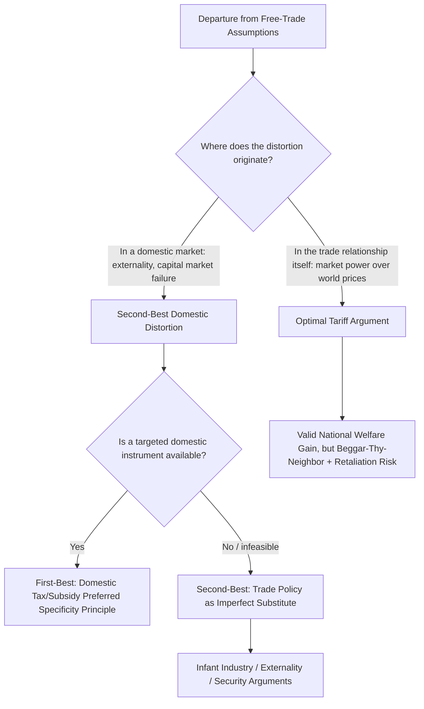

## National Welfare Arguments for Protection

### Conceptual Overview

National welfare arguments for protection are the class of theoretical justifications for trade barriers that rest on **pure efficiency grounds** — that is, they claim a tariff, quota, or subsidy can raise a country's *own* aggregate economic welfare, independent of any distributional, political, or special-interest consideration. This category is deliberately distinguished from the far larger set of *political-economy* explanations for protection (lobbying, rent-seeking, electoral incentives), which explain why protection exists empirically but do not claim it is efficient.

The defining feature of this category: each argument identifies a specific departure from the idealized assumptions underlying the free-trade welfare theorem (perfect competition, no externalities, no market failures, full employment) and shows that, *given that departure*, a trade instrument can in principle improve national welfare relative to unilateral free trade. Each argument is paired, in the modern trade-theory literature, with a **counter-critique** — most commonly the observation that a domestic policy instrument would achieve the same efficiency gain at lower cost (the **specificity principle**).

### 1. The Optimal Tariff Argument (Terms-of-Trade Argument)

**Core claim**: A country large enough to influence world prices through its own trade volume can use a tariff to improve its terms of trade, capturing surplus from foreign trading partners.

**Mechanism**: When a large importing country imposes a tariff, domestic demand for the imported good falls. If the country's import demand is large relative to world markets, this demand reduction lowers the world price the country pays, shifting part of the tariff's burden onto foreign exporters rather than domestic consumers.

$$t^* = \frac{1}{e^*}$$

where $t^*$ is the welfare-maximizing ("optimal") tariff rate and $e^*$ is the elasticity of the foreign export supply curve. A lower (less elastic) foreign supply response allows a higher optimal tariff, because foreign producers absorb more of the price effect.

**Welfare decomposition**: The optimal tariff generates a **terms-of-trade gain** (a transfer from foreign producers to the domestic treasury/economy) that must be weighed against the **deadweight loss** from the tariff's distortion of domestic consumption and production decisions. The optimal tariff is the rate that maximizes the net of these two effects — strictly positive for any large country with less than perfectly elastic foreign supply.

**Standard critiques**:

- **Retaliation**: the argument is a **beggar-thy-neighbor** policy — it raises national welfare only by *reducing* the trading partner's welfare and *global* welfare. If the partner retaliates with its own optimal tariff, both countries can end up worse off than under free trade, a standard **tariff-war/Nash equilibrium** outcome analyzed via reaction functions in trade policy games.
- **Empirical elasticity requirements**: implementing the optimal tariff formula in practice requires accurate real-time estimates of foreign export supply elasticity — a demanding informational requirement rarely met by actual tariff-setting processes.
- **Global welfare loss**: even where the argument is valid for the *tariff-imposing* country, it is never a justification for protection on grounds of global efficiency, since it is a zero-sum (or negative-sum, once distortion costs are included) transfer.

### 2. The Infant Industry Argument

**Core claim**: A country may possess latent (currently non-existent or nascent) comparative advantage in an industry that cannot become internationally competitive without a temporary period of protection from established foreign competitors, during which the domestic industry can achieve the scale, experience, or technological maturity needed to compete unprotected.

**Underlying market failure candidates** (the argument requires identifying *why* private capital markets would not finance this maturation process without protection):

- **Learning-by-doing externalities**: productivity gains from cumulative experience may not be fully appropriable by the pioneering firm if knowledge spills over to competitors, so private investment in the "learning" period is below the socially optimal level.
- **Capital market imperfections**: if firms cannot borrow against expected future profits (e.g., due to information asymmetries or absent development banking), profitable long-run investments requiring short-run losses may not be financed privately.
- **Coordination externalities**: development of an industry may require complementary investments (suppliers, skilled labor pools, infrastructure) that no single firm has the incentive to undertake alone.

**The Mill-Bastable test**: for the infant industry argument to be valid even in principle, two conditions must jointly hold:

1. The industry must eventually become competitive without protection (the "infant" must "grow up").
2. The discounted value of future gains (once mature and unprotected) must exceed the discounted value of protection-period losses (the learning/maturation costs must be a worthwhile investment in present-value terms).

**Standard critiques**:

- **Specificity principle**: even where a genuine learning or capital-market externality exists, a *domestic* production subsidy targeted directly at the source of the externality is a more efficient instrument than a tariff, because a subsidy avoids the additional consumption distortion a tariff imposes (higher price to domestic consumers) while still incentivizing the desired production/investment response.
- **Political capture and permanence**: [Inference] empirically, industries that receive infant-industry protection often successfully lobby to extend it well beyond any plausible maturation period, converting a theoretically temporary instrument into permanent rent-seeking protection — this is among the most frequently cited practical objections to the argument's real-world application.
- **Identification problem**: government authorities face a severe informational challenge in correctly identifying *which* industries possess genuine latent comparative advantage versus which are simply unable to compete and never will be, absent a reliable market-based signal (since the whole premise is that the market is *not* generating the correct signal here).

### 3. Externality-Correction Arguments

**Core claim**: When production or consumption of a traded good generates an externality (environmental, strategic, health-related) not reflected in market prices, a trade instrument can, in principle, correct the resulting divergence between private and social costs/benefits.

**Examples**:

- A tariff on a good whose domestic production generates negative environmental externalities (pollution) could, in a highly stylized setting, reduce the externality by reducing domestic output — though this is a blunt tool relative to a direct Pigouvian tax on the pollution itself.
- Protection of an industry deemed to generate positive knowledge spillovers to the rest of the economy (a variant closely related to the infant industry argument).

**Standard critique** (again via the specificity principle): a trade instrument targets the *externality* only indirectly, through its effect on the volume of the associated good's production or consumption. A directly targeted domestic instrument (a pollution tax, a research subsidy) corrects the externality at its source without distorting the pattern of trade itself, and is therefore first-best whenever available. Trade policy is a second-best response used only when the first-best domestic instrument is, for some reason, unavailable or infeasible to implement.

### 4. National Security / Strategic Industry Argument

**Core claim**: Certain industries (defense-related manufacturing, critical technology inputs, energy, food production) may warrant protection to preserve domestic production capacity against the risk of supply disruption during conflict, embargo, or geopolitical crisis — a risk not priced into ordinary commercial calculations.

**Analytical structure**: this can be modeled as an insurance/option-value argument — the country is willing to pay a certain "premium" (the deadweight loss of protecting an otherwise inefficient domestic producer) in exchange for guaranteed access to a strategically critical good during a low-probability, high-cost disruption event, when import supply might be unavailable at any price.

**Standard critiques**:

- **Scope creep**: national security justifications are notoriously susceptible to being invoked for industries with only tenuous strategic relevance, as this rationale sits outside ordinary economic injury tests and is difficult for trading partners or international bodies to challenge (this concern was highlighted, for instance, in disputes surrounding Section 232 national security tariff actions).
- **Stockpiling as an alternative instrument**: strategic reserves (e.g., petroleum reserves) or diversified international sourcing agreements can address genuine supply-disruption risk without the ongoing deadweight cost of permanent protection.
- [Unverified] Empirically distinguishing genuine strategic necessity from protection-seeking industries adopting national-security framing as a legal or rhetorical strategy is widely regarded as difficult in practice.

### 5. Terms-of-Trade / Export Tax Symmetry (Lerner Symmetry)

Related to the optimal tariff argument, the **Lerner Symmetry Theorem** establishes that, in a general equilibrium setting, a uniform import tariff and a uniform export tax have equivalent effects on relative prices and trade volumes — because both instruments equally discourage trade by driving a wedge between domestic and world relative prices.

[Inference] This symmetry result is a useful theoretical clarification within the national welfare framework because it demonstrates that the "optimal tariff" logic applies equally to a large *exporting* country restricting its exports (e.g., a dominant commodity exporter) to improve its terms of trade — the mechanism (extracting monopoly/monopsony rents from trade partners) is identical whether implemented via import-side or export-side policy.

### 6. Revenue Argument (Tariffs as a Fiscal Instrument)

**Core claim**: in economies where administrative capacity for domestic taxation (income tax, VAT) is limited — historically relevant for many developing countries — a tariff can serve as a relatively low-administrative-cost source of government revenue, since customs collection at a limited number of border points is easier to enforce than broad-based domestic taxation.

**Standard critique**: this is fundamentally a **second-best public finance argument**, not a trade-theoretic welfare argument — the tariff is not being defended as efficient trade policy but as the least-costly *available* revenue-raising instrument given administrative constraints. [Inference] As administrative capacity for domestic taxation improves (a common feature of economic development), the relative efficiency case for tariff revenue over broader-based domestic taxes weakens correspondingly, which is broadly consistent with the empirical pattern of declining average tariff reliance as an economy's fiscal administration matures.

### The Common Thread: Specificity and the Theory of the Second Best

Nearly every national welfare argument for protection, when subjected to rigorous scrutiny, collapses into one of two categories:

1. **Genuinely first-best cases** — where trade *is* the direct source of the distortion (this describes only the optimal tariff/large-country case, since the terms-of-trade effect operates directly through the volume of trade itself).
2. **Second-best cases** — where the underlying market failure originates in a *domestic* market (production externality, capital market imperfection, security/strategic risk) and trade policy is merely an indirect, imperfect proxy for a more efficient domestic instrument that is unavailable, infeasible, or has not been implemented.

This is the essence of the **Bhagwati-Ramaswami specificity principle**, generalized from earlier "theory of domestic distortions" work (Bhagwati, Johnson, Corden): the optimal policy response should be targeted as close as possible to the *source* of the distortion. A trade policy correcting a domestic distortion necessarily introduces an *additional*, unnecessary consumption-side (or production-side) distortion beyond the one it is meant to fix, making it strictly dominated by a correctly targeted domestic instrument whenever the latter is administratively available.

### Comparative Summary Table

| Argument | Source of Market Failure | First-Best Instrument | Trade Policy Efficiency Rank | Key Risk |
| --- | --- | --- | --- | --- |
| Optimal tariff | Market power over world price (large country) | Tariff itself (this is the first-best instrument here) | First-best (for the tariff-imposing country only) | Retaliation, global welfare loss |
| Infant industry | Learning/capital market externality | Production subsidy | Second-best | Permanent capture, misidentification |
| Externality correction | Environmental/knowledge externality | Pigouvian tax/subsidy | Second-best | Blunt targeting, low precision |
| National security | Unpriced supply-disruption risk | Strategic reserves, diversified sourcing | Second-best (often third-best in practice) | Scope creep, rhetorical abuse |
| Revenue argument | Weak domestic tax administration | Broad-based domestic tax (VAT, income tax) | Second-best (transitional) | Distorts trade unnecessarily as capacity improves |

### Diagram: Optimal Tariff Welfare Trade-off (svg_diagram)

<svg xmlns="http://www.w3.org/2000/svg" viewBox="0 0 820 420" font-family="Arial, sans-serif">
<text x="410" y="24" font-size="16" font-weight="bold" text-anchor="middle">Optimal Tariff: Terms-of-Trade Gain vs. Deadweight Loss (svg_diagram)</text>
<line x1="80" y1="370" x2="750" y2="370" stroke="#333" stroke-width="1.5" />
<text x="400" y="400" font-size="12" text-anchor="middle">Tariff Rate (t)</text>
<line x1="80" y1="370" x2="80" y2="60" stroke="#333" stroke-width="1.5" />
<text x="40" y="200" font-size="12" text-anchor="middle" transform="rotate(-90 40 200)">National Welfare</text>
<path d="M 80,300 Q 300,60 480,150 Q 600,220 700,320" fill="none" stroke="#2b6cb0" stroke-width="2.5" />
<text x="500" y="120" font-size="12" fill="#2b6cb0">National Welfare Curve</text>
<line x1="420" y1="370" x2="420" y2="115" stroke="#c53030" stroke-width="1.5" stroke-dasharray="4,3" />
<circle cx="420" cy="115" r="4" fill="#c53030" />
<text x="428" y="110" font-size="12" fill="#c53030" font-weight="bold">t* (optimal tariff)</text>
<text x="428" y="128" font-size="11" fill="#c53030">= 1/e* (foreign supply elasticity)</text>
<line x1="700" y1="370" x2="700" y2="320" stroke="#666" stroke-width="1" stroke-dasharray="2,2" />
<text x="705" y="345" font-size="11">Prohibitive tariff:</text>
<text x="705" y="358" font-size="11">welfare falls to autarky level</text>

<text x="130" y="290" font-size="11" fill="`#2f855a`">t = 0: Free trade baseline</text>

<circle cx="80" cy="300" r="4" fill="`#2f855a`" />

<text x="400" y="415" font-size="11" text-anchor="middle" font-style="italic">Beyond t*, deadweight loss dominates further terms-of-trade gains</text>

</svg>

### Relationship to the Chapter's Political Economy Focus

The chapter framing — situating this topic within "The Political Economy of Trade Policy" — signals an important interpretive point: even the most rigorous *national welfare* arguments for protection are frequently invoked **rhetorically** by protection-seeking industries to legitimize policies that are, in substance, driven by distributional/political motives rather than genuine efficiency calculations.

[Inference] Political economy models (e.g., Grossman-Helpman's "Protection for Sale") treat the *existence* of a plausible-sounding national welfare argument as itself a strategic resource — an infant industry claim or national security claim can serve as a persuasive public-interest cover story for what a collective-action analysis would predict is fundamentally a private rent-seeking outcome. Understanding the rigorous version of each welfare argument (including its second-best qualifications) is therefore a prerequisite for critically evaluating real-world invocations of these arguments in policy debates.

**Related Topics**

- The national welfare case for free trade: comparative advantage and gains from exchange
- Theory of the second best and the Bhagwati-Ramaswami specificity principle
- Grossman-Helpman "Protection for Sale" model and endogenous tariff formation
- Strategic trade policy and the Brander-Spencer framework
- Section 232 national security tariffs: case studies and WTO consistency
- Safeguard measures and emergency protection (Article XIX / SGA framework)
- Tariff-war games and Nash equilibrium in trade policy retaliation
- Lerner symmetry theorem: import tariffs vs. export taxes