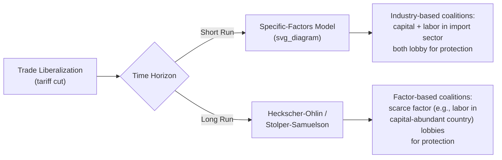
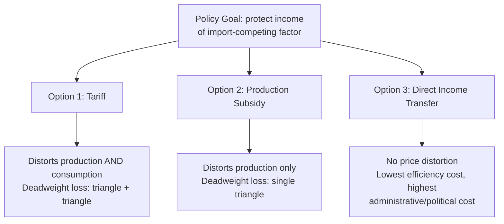

## Income Distribution Arguments for Protection

### Overview

Income distribution arguments for protection rest on the observation that trade policy is not merely a matter of aggregate national welfare but also of who wins and who loses within the economy. Even when free trade raises total income, it typically redistributes income among factors of production, sectors, and social groups. Protectionist policy can therefore be understood as a response to distributional conflict, either as a genuine attempt to protect vulnerable groups or as the outcome of political pressure from groups who stand to lose from trade liberalization.

### The Stolper-Samuelson Foundation

The theoretical starting point is the **Stolper-Samuelson theorem**, derived from the Heckscher-Ohlin model. It states that trade liberalization raises the real return to the factor used intensively in the export sector (the abundant factor) and lowers the real return to the factor used intensively in the import-competing sector (the scarce factor).

$$\hat{w} > \hat{P}_X > \hat{P}_Y > \hat{r}$$

Where $\hat{w}$ is the percentage change in the wage rate, $\hat{r}$ is the percentage change in the return to capital (or the other factor), and $\hat{P}_X$, $\hat{P}_Y$ are percentage changes in the prices of the export good and import-competing good respectively. This "magnification effect" implies that trade does not merely reshuffle income at the margin — it produces absolute losers, not just relatively slower gainers.

**Key Points**

- Trade liberalization is not Pareto-improving in a one-period, no-redistribution setting; it creates identifiable winners and losers by factor of production.
- The scarce factor loses in real terms, not just relative terms, providing a rational economic basis (not merely a political one) for that factor to lobby for protection.
- This is a general equilibrium result — it applies to broad factors (labor vs. capital, skilled vs. unskilled labor) rather than to individual firms or industries per se.

### Specific-Factors Model and Sector-Based Distribution

In the short-to-medium run, the **specific-factors (Ricardo-Viner) model** is often more empirically relevant than Heckscher-Ohlin, since capital and specialized labor cannot instantly relocate across sectors. Here:

- Factors specific to the import-competing sector (e.g., specialized capital, sector-specific skills) lose unambiguously from tariff reduction.
- Factors specific to the export sector gain unambiguously.
- The mobile factor (typically labor that can move between sectors) has an ambiguous real income change, depending on its consumption basket.

This model explains why protectionist lobbying is often organized by **industry** (steel, textiles, agriculture) rather than strictly by **factor class** (labor vs. capital) — because in the short run, capital and labor within an import-competing industry share a common interest in protection, even though in the long-run Stolper-Samuelson logic they would be on opposite sides.

### Political Economy Mechanisms

Income distribution effects translate into actual protectionist policy through several channels:

**1. Median Voter / Factor Ownership Models**

If voters differ in their factor ownership (e.g., relative endowments of labor vs. capital), and policy is set by majority vote, the model predicts protection levels tied to the distribution of factor ownership relative to the national average. A country with a median voter who owns relatively more of the scarce factor will tend toward protectionist equilibrium.

**2. Collective Action and Lobbying (Olson Logic)**

Mancur Olson's logic of collective action explains an asymmetry: import-competing industries are often concentrated (few firms, geographically clustered, high per-firm stakes) and can organize effectively, while consumers who bear the cost of protection are diffuse and individually have little incentive to organize. This generates a systematic bias toward protection even when aggregate welfare losses to consumers exceed gains to producers.

**3. The Grossman-Helpman "Protection for Sale" Model**

This formalizes lobbying as a menu auction: organized special-interest groups offer political contributions to a government that cares about both aggregate welfare and contributions. The equilibrium tariff structure is:

$$\frac{t_i}{1+t_i} = \frac{z_i}{a + z_i} \cdot \frac{1}{e_i} \cdot \frac{X_i}{M_i}$$

Where $t_i$ is the tariff on good $i$, $z_i$ is an indicator (1 if the sector is organized/lobbies, 0 otherwise), $a$ is the weight the government places on aggregate welfare relative to contributions, $e_i$ is the import demand elasticity, and $X_i/M_i$ is the ratio of domestic output to imports. Sectors that are organized, politically influential, and have inelastic import demand receive higher protection.

**Example**

Suppose an import-competing sector's domestic output is 5 times its import volume ($X_i/M_i = 5$), import demand elasticity is $e_i = 2$, the sector is organized ($z_i = 1$), and the government's welfare weight is $a = 10$. Then:

$$\frac{t_i}{1+t_i} = \frac{1}{11} \times \frac{1}{2} \times 5 = 0.227$$

Solving: $t_i \approx 0.294$, or roughly a 29% tariff — illustrating how organization, low elasticity, and a small import base relative to domestic output combine to generate substantial protection.

### Distinguishing Distributional Arguments from Efficiency Arguments

It is important to separate this class of argument from the national-efficiency arguments for protection (infant industry, terms-of-trade/optimal tariff, market failure/externality corrections). Income distribution arguments do **not** claim that protection raises aggregate national welfare — they typically concede it lowers aggregate welfare but argue that:

1. The **losers deserve compensation or protection** on equity/fairness grounds (e.g., workers who made sector-specific investments in good faith before liberalization was anticipated).
2. **Redistribution through the tariff is politically preferred** to lump-sum compensation, even though economic theory shows the latter is more efficient (a tariff-cum-compensation scheme, or "efficient redistribution," would use a production subsidy and let free trade proceed, since production subsidies avoid consumption distortions that tariffs create).
3. Protection functions as **social insurance** against the income risk introduced by an open trading regime — this is a related, empirically supported line of literature (Rodrik's work on trade openness and demand for social insurance/government spending).

### Why a Tariff Is a Second-Best Redistribution Tool

A standard result in trade theory is that if the underlying policy goal is genuinely distributional (helping a specific group), a tariff is an **inefficient instrument** compared to a targeted production subsidy or direct income transfer, because:

- A tariff distorts **both** production and consumption decisions (raises price to both producers and consumers).
- A production subsidy achieves the same producer-support effect while leaving the consumption price undistorted, avoiding the deadweight loss on the consumption side.
- Direct transfers (e.g., trade adjustment assistance) avoid both distortions entirely but face higher information/administrative costs and weaker political salience — subsidies and tariffs are more "visible" and credible as commitments to a lobbying constituency.

### Empirical and Historical Illustrations

- **U.S. Steel Tariffs (2002, 2018 Section 232):** Justified partly on grounds of preserving employment and wages in a geographically concentrated, politically organized industry, despite estimated net welfare losses (downstream steel-using industries employ far more workers than steel production itself).
- **Common Agricultural Policy (EU):** Historically defended on income-support grounds for farmers, an organized and politically significant group relative to diffuse consumers.
- **Multi-Fibre Arrangement / textile quotas:** Protected labor-intensive, import-competing textile industries in developed countries, disproportionately benefiting lower-skilled workers who would otherwise face the sharpest Stolper-Samuelson losses from liberalization with developing countries.

### Critiques and Limitations

[Inference] The magnitude of distributional effects relative to aggregate efficiency gains from trade is a matter of ongoing empirical debate; the standard theoretical prediction (Stolper-Samuelson) can be significant in magnitude for low-skilled labor in advanced economies but the size of real-world effects depends on parameters (elasticities, factor mobility) that vary by study and are not settled with precision.

- Critics argue protection is a poorly targeted and costly means of redistribution, benefiting capital owners and management in protected industries disproportionately relative to workers.
- Protection can entrench inefficient industries, delaying the very structural adjustment that would resolve distributional pressure over the long run.
- Retaliation risk: unilateral protection invites counter-tariffs, potentially harming export-sector workers and reversing any net distributional benefit.

### Related Topics

- Stolper-Samuelson theorem (formal derivation)
- Specific-factors (Ricardo-Viner) model
- Trade Adjustment Assistance (TAA) programs
- Grossman-Helpman "Protection for Sale" model
- Median voter theorem applied to trade policy
- Optimal tariff / terms-of-trade argument for protection
- Infant industry argument for protection
- Rodrik's social insurance hypothesis on trade openness
- Effective rate of protection and tariff escalation