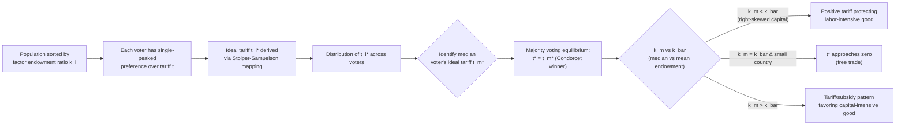

## Median Voter Models of Trade Policy

### Overview

Median voter models apply the median voter theorem to trade policy determination, treating tariff and trade policy outcomes as the result of majority-rule voting or electoral competition rather than purely technocratic welfare maximization. The core proposition is that in a direct democracy (or a two-party system with policy convergence), the trade policy enacted will match the preferred policy of the voter whose position on the trade-policy spectrum is the median — the voter with as many people preferring more protection on one side as prefer less protection on the other.

This framework is one of several political-economy approaches to trade policy (alongside collective-action/lobbying models like Grossman-Helpman's "Protection for Sale" and the Ricardo-Viner specific-factors framework), and it is distinguished by its focus on **electoral aggregation of individual preferences** rather than **organized interest-group influence**.

### Theoretical Foundations

**The Median Voter Theorem (Black, 1948; Downs, 1957)**

The underlying theorem states that if:

1. Preferences over a policy variable are **single-peaked** (each voter has one ideal point and utility declines monotonically as policy moves away from it in either direction), and
2. Policy is unidimensional (can be ordered along a single line, e.g., a tariff rate $t$ from 0 to some maximum),

then majority voting over pairwise alternatives selects the ideal point of the median voter, and this outcome is a Condorcet winner (it beats every other alternative in pairwise majority voting).

**Mapping to Trade Policy**

Individual $i$'s preferred tariff rate $t_i^*$ depends on their factor ownership and sector of employment. Applying the Stolper-Samuelson theorem or a specific-factors logic:

- Owners of the **abundant factor** (or those employed in **import-competing sectors**) prefer higher protection.
- Owners of the **scarce factor** (or those employed in **export sectors**) prefer lower protection (or even export subsidies/free trade).

The distribution of factor ownership across the population determines the distribution of $t_i^*$, and the median of that distribution becomes the equilibrium tariff under majority rule.

**Key Points**

- The theorem requires single-peakedness; if preferences are multi-peaked (e.g., some voters strictly prefer either full autarky or full free trade but dislike intermediate tariffs), majority voting may cycle and no stable equilibrium exists (Condorcet paradox / Arrow's impossibility considerations).
- The model assumes policy is effectively unidimensional. In reality, trade policy involves many instruments (tariffs by product line, quotas, subsidies, NTBs), which complicates direct application, though the median voter logic is often used tariff-line-by-tariff-line or applied to an aggregate protection index.

### The Mayer (1984) Model

Wolfgang Mayer's 1984 paper "Endogenous Tariff Formation" (*American Economic Review*) is the canonical formalization of median voter trade policy determination, built on a Heckscher-Ohlin-Stolper-Samuelson framework.

**Setup**

- Two goods, two factors (capital $K$ and labor $L$), standard HO assumptions.
- Individuals differ only in their **factor endowment ratio** ($k_i = K_i/L_i$), i.e., how capital-abundant their personal portfolio is relative to the economy-wide average endowment ratio $\bar{k}$.
- By Stolper-Samuelson, a change in the relative price of the capital-intensive good (via a tariff) raises the real return to capital and lowers the real return to labor (or vice versa), so individuals' *ideal tariffs* are monotonic in $k_i$.
- Preferences over the tariff are single-peaked: individuals with $k_i$ far from $\bar{k}$ (either very capital-abundant or very labor-abundant relative to the national average) want extreme protection favoring their factor; individuals with $k_i$ close to $\bar{k}$ prefer policies close to free trade, since they gain little from redistribution and only bear the deadweight loss.

**Key Result**

The equilibrium tariff under majority voting equals the tariff preferred by the voter with the **median capital-labor endowment ratio**, $k_m$. Whether the equilibrium tariff is positive or negative (an export subsidy) depends on whether $k_m$ is above or below the mean/economy-wide ratio $\bar{k}$:

$$t^* = t(k_m)$$

- If the distribution of factor ownership is **right-skewed** (as most wealth/capital-ownership distributions empirically are — a small number of individuals hold disproportionate capital), then $k_m < \bar{k}$: the median voter owns **less capital relative to labor** than the economy-wide average.
- In an economy where capital is the abundant factor (so free trade would raise the capital rental rate per Stolper-Samuelson), a median voter with below-average capital ownership will prefer a tariff that protects labor, i.e., a **positive tariff on the labor-intensive import good**, even though the country overall could gain from free trade.

**[Inference]** This generates a standard prediction: skewed ownership of the abundant factor produces a political-economy bias toward protection, because the median voter is poorer in the abundant factor than the mean, even though the "average" citizen might favor free trade.

### Why the Median Voter Rarely Wants Free Trade

A distinguishing insight of the Mayer framework (extending Mayer 1984) is that **the median voter's optimal tariff is generally not zero**, for two distinct reasons:

1. **Distributional motive**: If $k_m \ne \bar{k}$, the median voter has an incentive to use trade policy redistributively — shifting relative prices to favor their own factor — even ignoring efficiency costs.
2. **Terms-of-trade motive** (in a large country): Even a voter whose factor ownership matches the national average may prefer a small positive "optimal tariff" purely for terms-of-trade reasons (the standard large-country optimal tariff argument), independent of any distributional consideration.

Only in the special case where the median voter's endowment ratio equals the mean **and** the country is small (price-taker, no terms-of-trade motive) does the median-voter-determined tariff converge to zero (free trade).

### Extension: Trade Policy and the Skew of the Income/Wealth Distribution

Because $k_m$ vs. $\bar{k}$ is what drives the sign and magnitude of protection, the model generates comparative statics linking the **shape of the wealth distribution** to trade policy:

- Greater **right-skewness** in capital ownership (more concentrated capital wealth among a few) pushes $k_m$ further below $\bar{k}$, predicting *more* protection for labor-intensive goods, all else equal.
- This provides a political-economy explanation for cross-country correlations between inequality/wealth concentration and protectionist policy, distinct from pure lobbying-based explanations.

**[Inference]** Empirical testing of this specific channel (skewness of factor ownership vs. protection levels) is less common in the literature than tests of lobbying-based models, partly because factor-ownership-distribution data (especially capital ownership by individual) is harder to observe than campaign contributions or lobbying expenditures.

### Median Voter Models with Sector-Specific Factors (Ricardo-Viner variant)

An alternative specification replaces the HO/Stolper-Samuelson mechanism with the specific-factors model:

- Labor is mobile across sectors; capital/land is sector-specific.
- A tariff protecting sector $X$ raises the real return to the specific factor in $X$ and lowers it in the export sector $Y$; the effect on mobile labor's real wage is ambiguous (depends on consumption basket).
- Voters are indexed by which specific factor they own (or which sector they work in), rather than by a continuous $k_i$.
- If sector-of-employment is the relevant dimension, and if the import-competing sector employs a plurality/majority of the specific factor owners, the median voter may be a specific-factor owner in the import-competing sector, generating a protectionist outcome directly tied to sectoral employment shares rather than aggregate capital-labor endowment skew.

This variant is often used to connect median voter logic to empirically observed patterns of protection concentrated in **import-competing sectors with large employment**, since the sheer number of workers (and hence voters) attached to a specific factor matters directly for where the median sits.

### Formal Illustration: Single-Peaked Preferences and Tariff Choice

Consider individual $i$ with indirect utility as a function of tariff $t$:

$$V_i(t) = V_i(p(t), I_i(t))$$

where $p(t)$ is the domestic relative price of the import good (increasing in $t$) and $I_i(t)$ is $i$'s income, which depends on $t$ through factor returns. The individual's most-preferred tariff $t_i^*$ solves:

$$\frac{\partial V_i}{\partial t}\bigg|_{t = t_i^*} = 0$$

Single-peakedness requires $\frac{\partial^2 V_i}{\partial t^2} < 0$ in a neighborhood of $t_i^*$ (concavity), which holds under standard assumptions (diminishing returns, convex production possibilities, well-behaved preferences).

Ranking all $t_i^*$ across the population and identifying $t_m^*$ (the median) gives the majority-rule winner:

$$t^{MV} = t_m^* = \arg\max_i \; \{t_i^* : \, |\{j : t_j^* \le t_i^*\}| = |\{j : t_j^* \ge t_i^*\}|\}$$

**Diagram: Distribution of Ideal Tariffs and the Median Voter Outcome**

### Illustrative Numerical Example

**Setup**: A small HO economy with two factors, capital and labor. Suppose the population's capital-labor endowment ratios $k_i$ are distributed as follows (simplified, five representative voters):

| Voter | $k_i$ (capital units per labor unit) | Preferred tariff $t_i^*$ |
| --- | --- | --- |
| A | 0.5 | +25% (protect labor-intensive good) |
| B | 0.8 | +12% |
| C | 1.0 (= median) | +5% |
| D | 2.0 | −8% (favors freer trade/export subsidy on capital-intensive good) |
| E | 6.0 | −20% |

Suppose the economy-wide mean endowment ratio $\bar{k} = 2.1$ (pulled up by voter E's large capital holding). The **median** voter is C, with $k_C = 1.0 < \bar{k} = 2.1$.

**Result**: Because $k_m < \bar{k}$, majority voting selects $t^* = +5\%$ — a positive tariff protecting the labor-intensive good — even though the *mean* endowment ratio would imply the "average" citizen benefits from freer trade in that good. This is despite only two of five voters (D and E) preferring negative or near-zero tariffs; the median, not the mean, governs the outcome.

**[Inference]** This stylized numeric example is illustrative of the model's logic, not an empirical estimate; actual endowment distributions and elasticities would need to be estimated from real data to generate quantitative tariff predictions.

### Comparison with Lobbying/Interest-Group Models

| Dimension | Median Voter Model | Protection for Sale (Grossman-Helpman) |
| --- | --- | --- |
| Policy determination mechanism | Majority voting / electoral competition | Government "sells" protection to lobbies for contributions |
| Key driver | Distribution (especially median vs. mean) of factor ownership | Organized lobbies' campaign contributions and government's weight on welfare vs. contributions |
| Who influences policy | All voters equally (one person, one vote) | Only organized/lobbying sectors have disproportionate influence; unorganized sectors get no special treatment |
| Typical prediction | Protection tied to skewness of factor-ownership distribution | Protection tied to import-penetration ratios and import/export elasticities, concentrated in organized sectors |
| Empirical fit | Weaker direct empirical support; hard to observe factor-ownership distributions | Stronger empirical support (Goldberg-Maggi, Gawande-Bandyopadhyay estimate the GH model with reasonable fit) |

**Key Points**

- The two frameworks are not mutually exclusive; some models nest median-voter logic within a broader political economy that also includes lobbying (e.g., candidates set policy to win elections but are also influenced by campaign contributions that fund persuasive advertising to shift voter perceptions).
- Median voter models perform better as a description of policy in direct-democracy-like settings (referenda, some U.S. state-level ballot initiatives) than as an explanation for the fine-grained, sector-by-sector structure of tariff schedules, which lobbying models tend to fit better.

### Limitations and Critiques

1. **Multidimensionality of trade policy**: Real trade policy is not one number; it is thousands of tariff lines, quotas, and NTBs. The median voter theorem's clean unidimensional result does not directly generalize to multidimensional policy spaces (Plott's symmetry conditions for a multidimensional median voter equilibrium are demanding and rarely satisfied), so applications typically restrict attention to a single scalar "protection level" or to one good at a time.
2. **Assumes direct democracy or perfect policy convergence**: In representative democracies with two-party competition, the median voter theorem (Downsian convergence) requires strong assumptions (both parties are purely office-motivated, full information, no entry by third parties, single-peaked preferences) to guarantee convergence to the median.
3. **Ignores turnout and participation asymmetries**: Standard median voter models assume equal voting participation; if participation correlates with intensity of preference (a feature more naturally modeled in lobbying/collective-action frameworks), a "silent majority" may not be pivotal in practice.
4. **Ignores information and salience**: Trade policy is often low-salience for typical voters, and models such as Grossman-Helpman's Protection for Sale were partly motivated by the observation that on many issues, organized minorities influence policy more than the diffuse majority — the opposite of the median voter model's core mechanism.
5. **Empirical tariff patterns are often better explained by sector characteristics** (import penetration, industry concentration, elasticity of import demand) than by aggregate wealth-distribution skewness, which is the main testable implication unique to the Mayer-style median voter model.

**[Speculation]** Some political economists have suggested median voter logic may better explain broad shifts in a country's *overall* trade stance (e.g., a national referendum on a trade agreement) than the detailed cross-sectional structure of protection across industries, though this distinction is not always made explicit in the literature.

### Relation to Broader Trade Policy Literature

- **Complementary to Ricardo-Viner (specific factors) and Heckscher-Ohlin frameworks**: median voter models borrow their factor-return predictions directly from these trade models; they add the *political aggregation mechanism* on top.
- **Precursor/contrast to endogenous protection theory** more broadly: Mayer's paper is frequently cited alongside Findlay-Wellisz (1982) tariff-lobbying models and later Grossman-Helpman (1994) as one of the three canonical strands of "endogenous tariff formation" literature from the 1980s–1990s.
- **Connects to public choice theory**: median voter models of trade policy are a direct application of Black/Downs public choice theory to the trade domain, sharing the same theoretical DNA as median voter models of taxation, public goods provision, and regulation.

### Related Topics / Next Steps

- Stolper-Samuelson theorem and factor-price determination
- Ricardo-Viner (specific factors) model of trade and income distribution
- Grossman-Helpman "Protection for Sale" model
- Findlay-Wellisz tariff-formation-through-lobbying model
- Condorcet paradox and Arrow's impossibility theorem (limits of majority voting)
- Downsian two-party electoral competition and policy convergence
- Political economy of trade agreements and referenda (e.g., Brexit, NAFTA/USMCA ratification votes)
- Empirical political economy of trade: Goldberg-Maggi and Gawande-Bandyopadhyay estimations of endogenous protection models
- Income/wealth inequality and trade policy preferences (cross-country empirical literature)