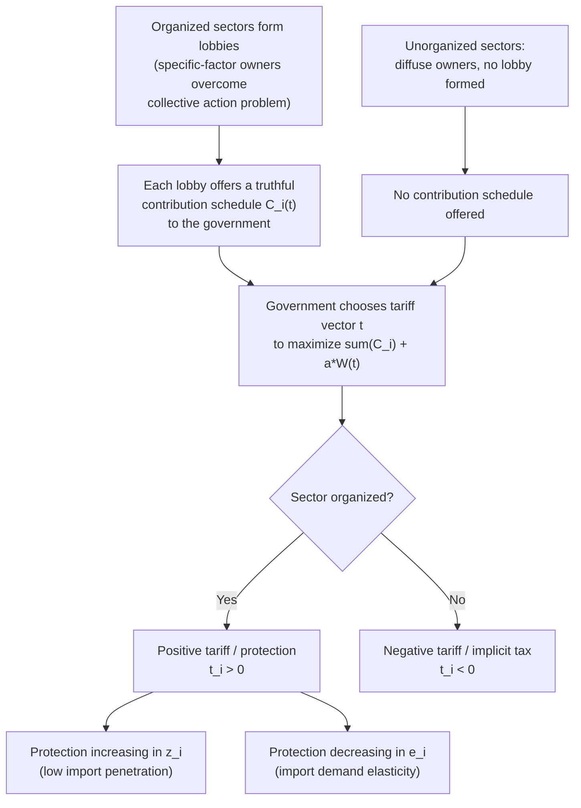

## The Protection for Sale Model

### Overview

The Protection for Sale (PFS) model, developed by Gene Grossman and Elhanan Helpman (1994, *American Economic Review*, "Protection for Sale"), is the canonical formal model of endogenous trade policy determination through political lobbying. It reframes trade policy not as a welfare-maximizing choice by a benevolent government, nor purely as a median-voter outcome, but as the result of a **menu auction** in which organized special-interest groups "buy" protection from an incumbent government that cares about both aggregate social welfare and campaign contributions.

The model is built on the common agency framework of Bernheim and Whinston (1986) and has become the workhorse model for empirical political economy of trade, tested extensively (Goldberg-Maggi 1999; Gawande-Bandyopadhyay 2000, among others).

### Building Blocks

**Economic Environment**

- Small open economy, $n+1$ goods: one numeraire good (good 0) and $n$ other goods.
- Good 0 is produced with labor only, under constant returns, and is freely traded — this pins down the wage rate and serves as numeraire.
- Each other good $i$ is produced with labor and a sector-specific factor (capital), consistent with a Ricardo-Viner/specific-factors structure.
- Consumers have quasilinear preferences over the numeraire and the other goods, ensuring no income effects on demand for goods $1, \dots, n$ (a standard simplifying device to keep the model tractable).

**Political Environment**

- A subset of sectors ("organized" sectors) are represented by **lobbies**, which are politically organized to overcome the collective-action problem (per Olson 1965) — typically because the specific factor in that sector is owned by a small, concentrated group.
- The remaining sectors are **unorganized**: factor owners are diffuse and cannot solve the free-rider problem, so no lobby forms.
- Each lobby's membership consists of the owners of the specific factor in that sector.

### The Government's Objective Function

The incumbent government sets the vector of trade policy instruments (tariffs/subsidies) $\vec{t} = (t_1, \dots, t_n)$ to maximize a **weighted sum of aggregate social welfare and total political contributions**:

$$G(\vec{t}) = \sum_{i \in L} C_i(\vec{t}) + a \cdot W(\vec{t})$$

where:

- $C_i(\vec{t})$ is the contribution schedule offered by lobby $i$ (a member of the set $L$ of organized lobbies),
- $W(\vec{t})$ is aggregate social welfare (sum of consumer surplus, specific-factor owners' surplus/rents, tariff revenue, minus deadweight loss),
- $a > 0$ is a parameter representing the government's relative weight on social welfare versus contributions (equivalently, $a$ can be interpreted as reflecting how much a dollar of contributions is "worth" to the government relative to a dollar of aggregate welfare, e.g. via its use for campaign advertising that swings uninformed voters).

### The Lobbies' Problem

Each lobby $i \in L$ chooses a contribution schedule $C_i(\vec{t})$ — a function specifying how much it will pay the government for each possible policy vector — to maximize the **net welfare of its members**:

$$\max_{C_i(\cdot)} \; \Pi_i(\vec{t}) - C_i(\vec{t})$$

subject to the government's best response, where $\Pi_i(\vec{t})$ is the gross return to the specific factor in sector $i$ (which depends on the domestic price, hence on $t_i$).

This is a **truthful Nash equilibrium** in the Bernheim-Whinston sense: in equilibrium, each lobby's contribution schedule is "truthful" — it reflects the lobby's actual marginal valuation of policy changes around the equilibrium point, i.e., $C_i(\vec{t})$ locally mirrors $\Pi_i(\vec{t})$ up to a constant. Truthful strategies are used because they form a subgame-perfect equilibrium of the common agency game and, among equilibria, select the (constrained) jointly efficient outcome for the principals (lobbies) and the agent (government).

**Key Points**

- Truthful contribution schedules mean lobbies are willing to pay for the government's marginal welfare cost of granting them protection — this is what makes the equilibrium tractable and gives it clean comparative statics.
- The equilibrium is Pareto efficient from the standpoint of the government and the lobbies jointly (though not from the standpoint of society overall, since unorganized sectors have no seat at the table).

### The Equilibrium Tariff Formula

The central analytical result of the model is a closed-form expression for the equilibrium ad valorem tariff (or subsidy) on each good $i$:

$$\frac{t_i}{1 + t_i} = \frac{I_i - \alpha_L}{\alpha_L + a} \cdot \frac{z_i}{e_i}$$

where:

- $t_i$ = the ad valorem tariff rate on good $i$ (positive = import tariff, negative = export subsidy or import subsidy depending on trade direction),
- $I_i$ = an indicator variable equal to 1 if sector $i$ is organized (has a lobby) and 0 otherwise,
- $\alpha_L$ = the fraction of the population that belongs to *any* lobby (aggregate political organization rate),
- $a$ = the government's weight on aggregate welfare relative to contributions,
- $z_i = X_i / (p_i \, m_i)$, the ratio of domestic output $X_i$ to imports $m_i$ times the domestic price $p_i$ — essentially the **inverse import-penetration ratio** (output relative to trade volume in that sector),
- $e_i$ = the absolute value of the elasticity of import demand for good $i$.

**Interpretation of the Formula**

1. **Organized sectors get protection; unorganized sectors get taxed (or at best free trade).** If $I_i = 1$ (organized), the numerator $I_i - \alpha_L = 1 - \alpha_L > 0$ (assuming not all voters are organized), so $t_i > 0$: the sector receives a positive tariff (protection). If $I_i = 0$ (unorganized), the numerator is $-\alpha_L < 0$, so $t_i < 0$: the sector is *taxed* (a negative "protection," i.e., an implicit subsidy to importers/consumers, or an export tax if it's an export good) — because the government still wants to raise revenue/welfare-transfer from somewhere, and unorganized sectors have no lobby to bid against that.
2. **Protection is decreasing in import demand elasticity $e_i$.** Sectors with more elastic import demand receive less protection for a given lobbying effort, because a given tariff creates more deadweight loss (and hence is more costly to the government in welfare terms) when demand is elastic. This mirrors the inverse-elasticity rule familiar from optimal-tariff and optimal-taxation theory.
3. **Protection is increasing in the inverse import-penetration ratio $z_i$.** Sectors with low import penetration (imports small relative to domestic output) get *more* protection per unit of lobbying, because a given tariff redistributes a large amount of rents to domestic specific-factor owners relative to the deadweight loss/consumer cost it generates — a small tariff on a sector with few imports transfers a lot to producers cheaply.
4. **Protection is decreasing in $\alpha_L$ (aggregate share of population organized) and increasing in $a$ is more subtle**: a higher $a$ (government cares relatively more about welfare) *dampens the magnitude* of the political distortion — as $a \to \infty$, $t_i \to 0$ for all sectors (free trade, since welfare-maximization dominates); as $a \to 0$, protection is set purely to maximize contributions net of lobbies' own surplus loss.

### Formal Derivation Sketch

**Step 1 — Lobby's contribution schedule.** Given truthful contributions, lobby $i$'s schedule can be written (up to a constant) as $C_i(\vec{t}) = \max\{0, \Pi_i(\vec{t}) - B_i\}$ for some constant $B_i$, so that at the margin, $\nabla C_i(\vec{t}) = \nabla \Pi_i(\vec{t})$.

**Step 2 — Government's first-order condition.** The government maximizes $\sum_{i \in L} C_i(\vec{t}) + aW(\vec{t})$. Taking the derivative with respect to $t_i$ and using the truthfulness property:

$$\sum_{j \in L} \frac{\partial C_j}{\partial t_i} + a \frac{\partial W}{\partial t_i} = 0$$

Because $\Pi_j$ (and hence $C_j$) depends on $t_i$ only through the sector's own domestic price (own-price effects dominate the specific-factor return; cross-price effects are typically assumed away or are second order in this class of models), this reduces to:

$$I_i \frac{\partial \Pi_i}{\partial t_i} + a \frac{\partial W}{\partial t_i} = 0$$

**Step 3 — Decompose welfare.** Aggregate welfare $W(\vec{t})$ can be decomposed into consumer surplus, specific-factor rents (summed across *all* sectors, organized or not), and tariff revenue, minus/plus the terms captured by $I_i \Pi_i$ already counted in the lobby term. Using the small-country trade-volume identity and solving the resulting first-order condition for $t_i/(1+t_i)$ yields the formula above. **[Unverified]** The full algebraic decomposition involves substituting the derivative of consumer surplus (via Roy's identity) and specific-factor rents (via the envelope theorem/Hotelling's lemma) — the compact reduced form is standard in the literature but the intermediate steps are omitted here for brevity; see Grossman and Helpman (1994) for the complete derivation.

### Numerical Illustration

Suppose:

- $\alpha_L = 0.30$ (30% of the population belongs to some lobby),
- $a = 1$ (government places equal weight on a dollar of welfare and a dollar of contributions — commonly used benchmark value),
- Sector A (organized, $I_A = 1$): $z_A = 4$ (output four times import value), $e_A = 2$.
- Sector B (unorganized, $I_B = 0$): $z_B = 4$, $e_B = 2$ (identical trade characteristics, differing only in organization).

For Sector A:

$$\frac{t_A}{1+t_A} = \frac{1 - 0.30}{0.30 + 1} \cdot \frac{4}{2} = \frac{0.70}{1.30} \cdot 2 \approx 1.077 \;\Rightarrow\; t_A \approx \frac{1.077}{1 - 1.077}$$

**[Inference]** This particular parameter combination pushes $t_A/(1+t_A)$ above 1, which is outside the economically sensible range for an ad valorem tariff formula of this type (it would imply an implausibly large tariff); this is a reminder that the formula is typically calibrated with much smaller values of $z_i/e_i$ or interpreted only for small perturbations around free trade, or that realistic elasticities and import-penetration ratios in empirical applications (e.g., Goldberg-Maggi's estimates) are far more moderate than this illustrative example. Using a more realistic $z_A = 0.3$ instead:

$$\frac{t_A}{1+t_A} = \frac{0.70}{1.30} \cdot \frac{0.3}{2} \approx 0.0808 \;\Rightarrow\; t_A \approx 8.8\%$$

For Sector B (unorganized), holding the same $z, e$:

$$\frac{t_B}{1+t_B} = \frac{0 - 0.30}{1.30} \cdot \frac{0.3}{2} \approx -0.0346 \;\Rightarrow\; t_B \approx -3.6\%$$

Sector A (organized) receives roughly a +8.8% tariff; Sector B (otherwise identical but unorganized) receives roughly a −3.6% tariff (an implicit subsidy to imports/tax on the sector). The pure effect of lobbying organization is the entire ~12.4 percentage-point gap between the two sectors.

### Diagram: Structure of the Protection for Sale Game

### Empirical Testing

**Goldberg and Maggi (1999, AER)**

Tested the PFS formula on U.S. industry-level trade protection data (using non-tariff barrier coverage ratios as the protection measure, since applied U.S. tariffs were low and NTBs captured more variation). Estimated $a$ (government's welfare weight) to be very high — the estimated ratio $a/(1-\alpha_L)$ implied the government places roughly 50–100 times more weight on aggregate welfare than on contributions at the margin, suggesting that while the qualitative predictions of the model held (organized sectors get more protection, protection falls with import demand elasticity), contributions play a modest role in explaining the *level* of protection relative to welfare considerations.

**Gawande and Bandyopadhyay (2000, Review of Economics and Statistics)**

Re-estimated the model correcting for measurement and specification issues in Goldberg-Maggi (notably endogeneity of the elasticity term and better proxies for import penetration), generally confirming the qualitative signs predicted by the theory (protection positively related to organization status and inverse import penetration, negatively related to elasticity), while producing different quantitative estimates of $a$.

**Key Points**

- Empirical implementation typically proxies "organized" sectors using whether the industry has an active Political Action Committee (PAC) making contributions, from datasets such as the U.S. Federal Election Commission records.
- The elasticity term $e_i$ is often the hardest to measure well and is a common source of estimation sensitivity across studies.
- **[Unverified]** Exact parameter estimates vary meaningfully across studies depending on data vintage, country, and elasticity source; specific numerical estimates should be checked against the original papers rather than treated as universal constants.

### Extensions of the Baseline Model

1. **Endogenous lobby formation** (Mitra, 1999): Endogenizes which sectors organize into lobbies in the first place, based on the costs and benefits of overcoming the collective action problem, rather than taking the set $L$ as exogenously given.
2. **Multiple governments / trade agreements** (Grossman and Helpman, 1995, "Trade Wars and Trade Talks"): Extends PFS logic to two-country settings to analyze how lobbying on both sides interacts with international trade negotiations and the political sustainability of trade agreements.
3. **Regionalism and PFS** (Grossman and Helpman, various): Analyzes how lobbies' incentives shape the formation of free trade areas versus multilateral liberalization.
4. **General-equilibrium extensions with capital mobility**: Relaxes the assumption that specific factors are entirely immobile, examining how factor mobility across sectors affects lobbying incentives and the resulting protection structure.

### Comparison with Other Political Economy Models

| Dimension | Protection for Sale | Median Voter Model | Ricardo-Viner (non-political) |
| --- | --- | --- | --- |
| Policy-setting mechanism | Menu auction / lobbying contributions | Majority voting | N/A (positive trade model only) |
| Who has influence | Only organized sectors | All voters equally | N/A |
| Predicted cross-sector pattern | Protection concentrated in organized, low-import-penetration, low-elasticity sectors | Protection tied to skew of factor-ownership distribution | Determines who *gains/loses* from a given policy, not the policy itself |
| Empirical tractability | High — clean closed-form estimating equation | Lower — hard to observe factor-ownership distributions | N/A |
| Typical use | Explaining cross-industry variation in protection | Explaining aggregate/national trade policy stance | Foundation for computing welfare effects used inside PFS |

### Limitations and Critiques

1. **Assumes lobbies can perfectly solve their own internal free-rider problem** and commit to a fully specified (truthful) contribution schedule — a strong assumption relative to real-world campaign finance and lobbying institutions.
2. **Static, one-shot framework**: does not capture dynamic considerations such as reputation, repeated interaction between lobbies and government, or the buildup/erosion of protection over time.
3. **Quasilinear preferences** eliminate income effects, simplifying welfare aggregation but limiting the model's ability to speak to distributional/inequality questions across the income distribution (as opposed to across specific-factor-owning versus non-owning groups).
4. **The "for sale" framing is normatively stark**: contributions in the model are essentially bribes for policy, which, while analytically convenient and useful for generating testable predictions, is a simplification of the many channels (information provision, electoral mobilization, agenda-setting) through which real-world lobbying operates.
5. **Estimates of $a$ vary substantially across studies**, and identifying the elasticity and import-penetration terms with the precision the model demands is empirically challenging, so quantitative conclusions about the "price" of protection should be treated cautiously.

### Related Topics / Next Steps

- Bernheim-Whinston common agency and menu auctions
- Median voter models of trade policy (contrasting political mechanism)
- Ricardo-Viner / specific-factors model of income distribution
- Grossman-Helpman "Trade Wars and Trade Talks" (bilateral extension)
- Goldberg-Maggi and Gawande-Bandyopadhyay empirical estimation strategies
- Olson's theory of collective action and interest-group formation
- Political economy of regionalism and preferential trade agreements
- Optimal tariff theory and the inverse elasticity rule
- Non-tariff barriers as protection measures in empirical trade policy studies